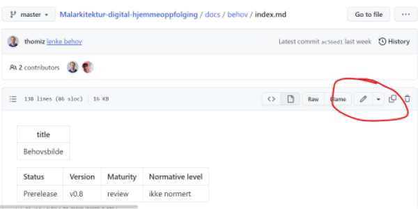

# Testprosjekt Målarkitektur for datadeling innen digital hjemmeoppfølging

Testprosjekt for å se hvordan arkitekturdokumentasjon kan publiseres og vedlikeholdes på Github i regi Direktoratet for e-helse. Dokumentasjonen som produseres her er planlagt som et normerende produkt fra Direktoratet for e-helse, men måten å produsere det på ved hjelp av Github er et testprosjekt.

### Oversikt over versjoner

* [Siste arbeidsversjon av målarkitekturen](https://direktoratet-for-e-helse.github.io/Malarkitektur-digital-hjemmeoppfolging/currentbuild)
  * Denne versjonen bygges ved endringer, bygges akkurat nå fra [master branchen](https://github.com/Direktoratet-for-e-helse/Malarkitektur-digital-hjemmeoppfolging/tree/master)
  * [PDF versjon av currentbuild](https://direktoratet-for-e-helse.github.io/Malarkitektur-digital-hjemmeoppfolging/currentbuild/pdf/malarkitektur.pdf)
* [DEPRECATED: Innspillsversjon 0.8 av målarkitekturen](https://direktoratet-for-e-helse.github.io/Malarkitektur-digital-hjemmeoppfolging/version-0.8)
  * Publisert 27. februar 2023
    * Bugfix 0.8.1 (skrivefeil) publisert 17.mars 2023
  * Frist for innspill til denne versjonen var 8. mars 2023
  * [PDF versjon av 0.8.1](https://direktoratet-for-e-helse.github.io/Malarkitektur-digital-hjemmeoppfolging/version-0.8/pdf/malarkitektur.pdf)
* [DEPRECATED: Innspillsversjon v0.5](https://direktoratet-for-e-helse.github.io/Malarkitektur-digital-hjemmeoppfolging/version-0.5) denne versjonen ligger kun ute for å vise historikk

## Bidrag og innspill til målarkitekturen

Arbeidet med målarkitekturen er en smidig prosess og vi ønsker løpende innspill på innholdet. I utviklingsfasen bygger vi ny arbeidsversjon hver dag, og noen dager flere ganger om dagen. Siste arbeidsversjon ligger på [gihub.io](https://direktoratet-for-e-helse.github.io/Malarkitektur-digital-hjemmeoppfolging/currentbuild). "Kildekoden" for dokumentasjonen ligger i [katalogen docs](https://github.com/Direktoratet-for-e-helse/Malarkitektur-digital-hjemmeoppfolging/tree/master/docs). Forskjellige releaser av målarkitekturen finnes under [relases](https://github.com/Direktoratet-for-e-helse/Malarkitektur-digital-hjemmeoppfolging/releases). Innspillsversjoner til arbeidsgruppen blir en egen release med navn "innspillsversjon".

### Målarkitekturen som PDF

Målarkitekturen kan også leses som et [PDF dokument](https://direktoratet-for-e-helse.github.io/Malarkitektur-digital-hjemmeoppfolging/currentbuild/pdf/malarkitektur.pdf). Innspill og kommentarer kan legges inn i pdf'en og sendes til oss på mail.

### Innspill til målarkitekturen

Hvis du ønsker å komme med innspill eller endringsforslag anbefaler vi å opprette saker, kalt [issues](https://github.com/Direktoratet-for-e-helse/Malarkitektur-digital-hjemmeoppfolging/issues), direkte i GitHub. Det er også mulig å gjøre endringer i dokumentasjonen, når du lagrer endringen opprettes det en [pull request](https://github.com/Direktoratet-for-e-helse/Malarkitektur-digital-hjemmeoppfolging/pulls) som blir behandlet av redaktøren for målarkitekturen.  

### Direkte oppdateringer

Det er også mulig å be om tilgang til å oppdatere dokumentasjonen direkte, hvis du ønsker å bidra i arbeidet direkte. Du kan da be om skrivetiltang til repoet ved å kontakte [thomiz](https://github.com/thomiz)  

## Verktøy

Skal du bidra til innholdet i målarkitekturen kan du benytte enkle verktøy for å håndtere redigreingsprosessen. Målarkitekturen skrives ved hjelp av et enkelt dokumentasjonsspråk som kalles markdown.

### Markdown

Ukjent med [Github markdown syntax](https://docs.github.com/en/get-started/writing-on-github/getting-started-with-writing-and-formatting-on-github/basic-writing-and-formatting-syntax)? Da anbefaler vi [Markdown Editor til Visual Studio](https://marketplace.visualstudio.com/items?itemName=zaaack.markdown-editor).

### Editere direkte i webleseren

Det er mulig å dokumentasjonen ved å ta opp en fil i repoet og gjøre endringer direkte i webleseren ved å trykke på "redigere" øverst til høyre i vinduet:  

### Git klient og lokal editor (for eksempel VSCode

Alternativt kan man klone repository og gjøre endringer i koden lokalt med verktøy for dette som er installert på PC'en og deretter laste endringene opp til repoet. Det er vanligvis slik man ønsker å arbeidet hvis man deltar aktivt i prosjektet. Dette krever at Git er installert på PC'en din (kan installeres som en del av VSCode editor).

### Komme igang med lokal VSCode

Kom igang med VSCode og repo fra Github:

For å komme i gang må du installere VSCode og klone repositoriet vårt fra Github til din lokale harddisk. Kloningen trenger du bare å gjøre en gang. Neste gang åpner du kopien fra lokal disk og trykker **Pull changes** for å hente de siste endringene fra serveren/repoet.

> Før du kan klone repoet lokalt må du ha Git installert på PC, det skal bli installert sammen med "Git Extensions" programmet i Firmaportalen.

1. Hente opp Command palette
> View -> Command palette

2. Skriv inn kommandoen: 
> Git: Clone <kbd>Enter</kbd>
3. Lim inn adressen til GitHub repoet:
~~~
https://github.com/Direktoratet-for-e-helse/Malarkitektur-digital-hjemmeoppfolging
~~~
4. Velg en katalog på harddisken du ønsker å klone til (jeg bruker vanligvis C:\Github). <kbd>Select Repository Location</kpd>
5. Trykk <kbd>Open</kbd> i dialogvinduet

Du skal nå få opp katalogstrukturen til repositoriet i fil explorer på venstre side i VSCode.
Husk at endringer du gjør i VSCode skrives til kopien av repoet på lokal disk. Du må commite og pushes endrede filer til repoet (remote) for at dine endringer skal bli synlige for andre.

#### OPTIONAL: Enable Git in VSCode

Kanskje må man gjøre dette også før man kan bruke Git i VSCode.

1. Go to File > Preferences
1. Go to Settings
1. Type Git: Enabled in the search bar
1. Make sure that the box is ticked
