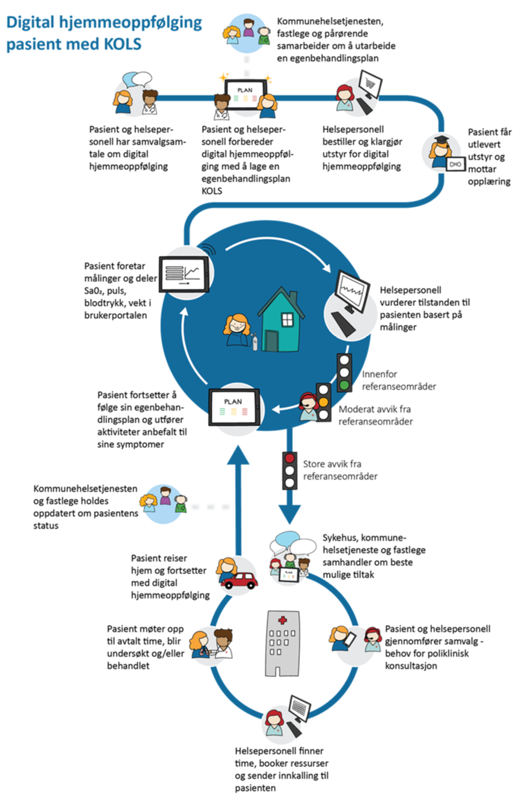

| Status | Version | Maturity | Normative level |
|:-------------|:------------------|:------|:-------|
| Work in progress | v0.5 | draft | ikke normert |

## Behovskartlegging basert på pågående utprøvingsprosjekter

Arbeidet med målarikteturen baserer seg i stor grad på innhenting av erfaringer fra pågående intitativer. Behovskartleggingen har tatt utgangspunkt i i tidligere dokumenterte behov ![https://www.ehelse.no/aktuelt/ny-rapport-om-helhetlig-samhandling-for-digital-hjemmeoppfolging] og erfaringer fra utprøvingsprosjekter som benytter velferdsteknologisk knutepunkt (VKP) og hvor det har blitt identifisert et stort behov for datadeling mellom aktører. Vi har videre studert behov som er viktige for utprøvingsprosjektet mellom Larvik kommune inkludert fastlegetjenesten og Sykehuset i Vestfold. Vi har i tillegg fulgt behovskartleggingen i Oslo kommune der de skal etablere datadeling med Lovisenberg sykehus og fastleger.  

Vi har ikke tatt inn detaljerte beskrivelser fra utprøvings og spredningsprosjektene, siden målarkitektøren skal være et generisk verktøy. For nye prosjekter som er i oppstart kan det være interessant å se til andre intitativer for å blant annet få erfaringer om organisatoriske utfordringer og få ideer til mulige løsninger.  

Her er oversikt over de pågående spredningsprosjektene som er del av [Nasjonalt Velferdsteknologiprogram](https://www.helsedirektoratet.no/nyheter/oppstart-av-spredning-av-digital-hjemmeoppfolging).

## Prosessbeskrivelser og tjenesteforløp

En fellesnevner ved behovsarbeidet vi har fått tilgang til er at alle utprøvings og spredningsprosjektene tar utgangspunkt i detaljerte beskrivelser av tjenesteforløp eller prosessbeskrivelser for å beskrive nå-situasjonen og for å avdekke behov knyttet til tjenesteforløpene som analyseres. Beskrivelsene av tjenesteforløpene er til dels svært detaljerte og beskriver ønsket eller eksisterende tjenesteforløp for en eller noen få pasientgrupper hvor DHO benyttes. Illustrasjonen under er lånt fra Helse Sør-Øst og illustrerer godtbåde tjenesteforløpene med utgangspunkt i Sykehuset Vestfold og Larvik kommune.
{ width="500" }