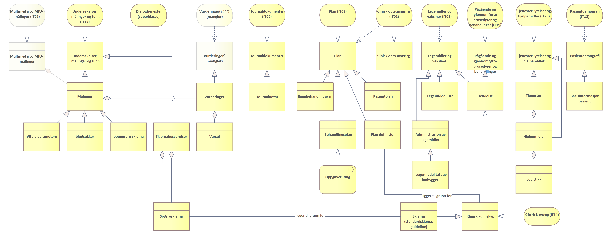

QA version
{: .label .label-yellow }

| Status | Version | Maturity | Normative level |
|:-------------|:------------------|:------|:-------|
| QA version | v0.5 | review  | veileder |

## Behovene skal konkretiseres i utprøvingene

Erfaring skal føre til mer spesifikk behovskartlegging knyttet til erfaring med utveksling av informasjon mellom virksomheter og behandlingsnivå.

## Behovene knyttet til DHO

__Digital hjemmeoppfølging innebærer at hele eller deler av et behandlingstilbud foregår uten fysisk kontakt, der dialog og deling av data mellom pasient/bruker og behandler(e) skjer digitalt.__

>Digital hjemmeoppfølging (tidligere kalt medisinsk avstandsoppfølging) er nye helsetjenester hvor deler av helse- og omsorgstjenesten kan flyttes hjem til pasienten ved hjelp av teknologi. Pasientene er aktive deltakere og bidragsytere i helsehjelpen de mottar og kan følges opp i hjemmet ved at pasientens egenmålinger, pasientrapporterte opplysninger om egen helsetilstand eller automatiske målinger, sendes digitalt til helsetjenesten, som vurderer og ved behov følger opp pasienten primært via digitale verktøy (Helse- og omsorgsdepartementet, 2019).

Den nasjonale samhandlingstjenesten for DHO skal tilrettelegge for følgende funksjonelle behov:

* *Jeg som helsepersonell får tilgang til oppdatert informasjon om pasienten som er nødvendig for å yte en god og effektiv tjeneste*
* *Jeg som helsepersonell kan søke etter og få tilgjengeliggjort relevant informasjon for tjenesteforløp der Digital hjemmeoppfølging benyttes*
* *Jeg som ansatt i helse- og omsorgstjenesten slipper å registrere informasjon knyttet til Digital hjemmeoppfølging flere ganger i ulike systemer*
* *Jeg som helsepersonell kan samarbeide med pasienter og helsepersonell om utarbeidelse og oppfølging av pasientplaner*
* *Jeg som pasient får tilgang til oppdatert og relevant informasjon for å ivareta egen helse*

### Hypoteser knyttet til behov

Hypotesene beskriver forutsetninger som ligger til grunn for behovskartleggingen knyttet til DHO. Det ligger i hypotesenes behov at de bør testes før målarkitekturen ferdigstilles, det er et åpent spørsmål hvordan disse hypotesene testes og om de kan testes som en del av utprøvingsprosjektene innen DHO.

* Samhandlingsbehovet knyttet til DHO er størst regionalt, i DHO fokuserer vi på å tilrettelegge for samhandling på regionalt nivå
* Tradisjonell trygghets og mestringsteknologi er ikke en del av omfanget for målarkitekturen for DHO
* Det er fokus på primærbruk av data, sekundærbruk er ikke dekket her

### Kortsiktige funksjonelle behov

Det er behov for å etablere en katalog over funksjonelle behov som ligger til grunn for arbeidet.  

* Søk etter informasjon fra andre virksomheter og behandlingsnivåer
* Riktig nivå av metadata og enighet om detaljnivå
* Enighet om  felles struktur og innhold
* Flere pasientgrupper
* Samarbeid om behandlingsplan og pasientplan
* Sammenheng mellom egenbehandlingsplan og DHO utstyr/verktøy
* Single Sign On - Det skal ikke være nødvendig å logge inn flere ganger for å utføre arbeidsoppgavene knyttet til DHO

### Langsiktige behov

* Tilgang til sanntidsinformasjon der det er relevant (målinger for eksempel)
* Dette er ikke påpekt av tjenesten men er en del av HSØ sitt målbilde for målinger
* Utstyrslogistikk, samarbeid om utstyr/måleutstyr knyttet til DHO
* Behov for å ivareta at utstyret følger pasienten uavhengig hvem som er behandlingsansvarlig

## Roller i DHO

Overordnet oversikt over roller involvert i DHO baserte tjenesteforløp. Rolleoversikten er basert på dialog med kommune, fastlege og spesialisthelsetjenesten.

<table class="wrapped relative-table confluenceTable" style="width: 100.0%;"><colgroup><col style="width: 12.3303%;"><col style="width: 87.6671%;"></colgroup><tbody><tr><th class="confluenceTh">Rolle</th><th class="confluenceTh">Definisjon</th></tr><tr><td class="confluenceTd">Innbygger</td><td class="confluenceTd">Samlebetegnelse på alle roller en person kan ha som tjenestemotaker i helsesektoren enten som pasient, bruker eller pårørende</td></tr><tr><td class="confluenceTd">Pasient</td><td class="confluenceTd">Begrepet pasient brukes om personer som gis eller tilbys hjelp fra helsetjenesten eller som henvender seg til helsetjenesten med anmodning om helsehjelp (<a href="https://www.helsedirektoratet.no/rundskriv/pasient-og-brukerrettighetsloven-med-kommentarer/alminnelige-bestemmelser/definisjoner#:~:text=pasient%3A%20en%20person%20som%20henvender,som%20p%C3%A5r%C3%B8rende%20og%20n%C3%A6rmeste%20p%C3%A5r%C3%B8rende." class="external-link" rel="nofollow">kilde Hdir</a>)</td></tr><tr><td class="confluenceTd">Pårørende</td><td class="confluenceTd"> </td></tr><tr><td colspan="1" class="confluenceTd">Nærmeste pårørende</td><td colspan="1" class="confluenceTd">Det er nærmeste pårørende som i enkelte tilfeller har en selvstendig rett til å motta informasjon, klage på vedtak mv. Det er altså ikke pårørende generelt, men den som oppgis som nærmeste pårørende, som har rettigheter og oppgaver etter helselovgivningen, og som helsepersonell har rettslige plikter overfor. (<a style="text-align: left;" rel="nofollow" href="https://www.helsedirektoratet.no/rundskriv/pasient-og-brukerrettighetsloven-med-kommentarer/alminnelige-bestemmelser/definisjoner#:~:text=pasient%3A%20en%20person%20som%20henvender,som%20p%C3%A5r%C3%B8rende%20og%20n%C3%A6rmeste%20p%C3%A5r%C3%B8rende." class="external-link">kilde Hdir</a>)</td></tr><tr><td colspan="1" class="confluenceTd">Helsepersonell</td><td colspan="1" class="confluenceTd">
En person som er nevnt i helsepersonelloven § 3 defineres som helsepersonell. For det første omfattes de som har autorisasjon eller lisens etter&nbsp;<a style="text-decoration: none;" href="http://www.lovdata.no/all/hl-19990702-064.html#48" class="external-link" rel="nofollow">helsepersonelloven §§ 48</a><a style="text-decoration: none;" href="http://www.lovdata.no/all/hl-19990702-064.html#48" class="external-link" rel="nofollow">&nbsp;</a>og&nbsp;<a style="text-decoration: none;" href="http://www.lovdata.no/all/tl-19990702-064-009.html#49" class="external-link" rel="nofollow">49</a><a style="text-decoration: none;" href="http://www.lovdata.no/all/tl-19990702-064-009.html#49" class="external-link" rel="nofollow">.</a>&nbsp;Dernest omfattes personell i helse- og omsorgstjenesten eller i apotek som yter helsehjelp, og studenter og elever som yter helsehjelp i forbindelse med helsefaglig opplæring.

Medhjelpere til helsepersonell er helsepersonell når de får tildelt oppgaver fra helsepersonell. (<a href="https://www.helsedirektoratet.no/rundskriv/pasient-og-brukerrettighetsloven-med-kommentarer/alminnelige-bestemmelser/definisjoner#:~:text=pasient%3A%20en%20person%20som%20henvender,som%20p%C3%A5r%C3%B8rende%20og%20n%C3%A6rmeste%20p%C3%A5r%C3%B8rende." class="external-link" rel="nofollow">kilde Hdir</a>)
</td></tr><tr><td colspan="1" class="confluenceTd">Helsepersonell fastlege</td><td colspan="1" class="confluenceTd">Samlebetegnelse for helsepersonell tilknyttet fastlegetjenesten.</td></tr><tr><td colspan="1" class="confluenceTd">Fastlege</td><td colspan="1" class="confluenceTd"> </td></tr><tr><td colspan="1" class="confluenceTd">Helsesekretær</td><td colspan="1" class="confluenceTd"> </td></tr><tr><td colspan="1" class="confluenceTd">Helsestasjon for eldre</td><td colspan="1" class="confluenceTd"> </td></tr><tr><td colspan="1" class="confluenceTd">Helsepersonell kommune</td><td colspan="1" class="confluenceTd">Samlebetegnelse for helsepersonell tilknyttet kommunehelsetjenesten.</td></tr><tr><td colspan="1" class="confluenceTd">Fysioterapeut</td><td colspan="1" class="confluenceTd"> </td></tr><tr><td colspan="1" class="confluenceTd">Hjemmetjeneste</td><td colspan="1" class="confluenceTd"> </td></tr><tr><td colspan="1" class="confluenceTd">Farmasøyt</td><td colspan="1" class="confluenceTd"> </td></tr><tr><td colspan="1" class="confluenceTd">Oppfølgingsansvarlig</td><td colspan="1" class="confluenceTd"> </td></tr><tr><td colspan="1" class="confluenceTd">Ambulante team</td><td colspan="1" class="confluenceTd"> </td></tr><tr><td colspan="1" class="confluenceTd">Helsepersonell HF</td><td colspan="1" class="confluenceTd">Samlebetegnelse for helsepersonell tilknyttet spesialisthelsetjenesten.</td></tr><tr><td colspan="1" class="confluenceTd">Spesialist</td><td colspan="1" class="confluenceTd"> </td></tr><tr><td colspan="1" class="confluenceTd">Helsesekretær</td><td colspan="1" class="confluenceTd"> </td></tr><tr><td colspan="1" class="confluenceTd">Eldrehelsekoordinator</td><td colspan="1" class="confluenceTd"> </td></tr></tbody></table>

Referanser: [sentrale begreper definert i Program Digital Samhandling](https://sh.ehelse.no/akson/Dokumentbibliotek%20Forprosjekt%20Steg%202/20%20Leveranser/09.%20Sentralt%20styringsdokument/05%20Vedlegg%20SSD/Vedlegg%20A%20Sentrale%20begreper.docx?d=w5a50e9a879ab4c1a800b8a88cca9040c), Digdir, [Helsedirektoratet](https://www.helsedirektoratet.no/rundskriv/pasient-og-brukerrettighetsloven-med-kommentarer/alminnelige-bestemmelser/definisjoner#:~:text=pasient%3A%20en%20person%20som%20henvender,som%20p%C3%A5r%C3%B8rende%20og%20n%C3%A6rmeste%20p%C3%A5r%C3%B8rende.)

## Informasjonskomponenter

Modellen viser overordnede informasjonskomponenter som målarkitekturen for DHO dekker. Mapping mot informasjonstjenester definert i [Akson](https://www.ehelse.no/publikasjoner/sentralt-styringsdokument-akson-helhetlig-samhandling-og-felles-kommunal-journallosning).

I tillegg er det identifisert behov for dialogtjenester for kommunikasjon mellom helsepersonell og mellom helsepersonell og innbygger:

## Informasjonsbehov og informasjonstjenester

Oversikt over informasjonsbehov og tjenester. Tabellen oppsummerer:

* Hva betyr behovet
* Hvorfor er det behov for informasjonen
* Hvor kommer informasjonen fra (kilde)
* Hvordan blir informasjonen til
* Hvordan kan man samhandle om informasjonen for å dekke informasjonsbehovet
* Når er det behov for informasjonen og hvor lenge vil informasjon være relevant
* Er det sammenhenger/avhengigheter med andre informasjonstjenester

<table class="wrapped confluenceTable"><colgroup><col style="width: 154.0px;"><col style="width: 141.0px;"><col style="width: 189.0px;"><col style="width: 204.0px;"><col style="width: 263.0px;"><col style="width: 176.0px;"><col style="width: 146.0px;"><col><col></colgroup><tbody><tr><th class="confluenceTh">Informasjonsbehov</th><th colspan="1" class="confluenceTh">Informasjons-tjeneste</th><th class="confluenceTh">Hva</th><th class="confluenceTh">
Hvorfor
</th><th class="confluenceTh">Hvor (kilde)</th><th colspan="1" class="confluenceTh">Hvordan</th><th colspan="1" class="confluenceTh">Samhandlingsform</th><th colspan="1" class="confluenceTh">Når og hvor lenge</th><th colspan="1" class="confluenceTh">Sammenheng med andre informasjonstjenester</th></tr><tr><td class="confluenceTd">Målinger</td><td colspan="1" class="confluenceTd">Undersøkelser, målinger og funn (IT17) (Multimedia og MTU-målinger (IT07))</td><td class="confluenceTd">
Inneholder resultater fra målinger og registreringer av informasjon som beskriver pasientens tilstand.

blodsukker, Pulsox, temperatur, vekt, blodtrykk og kroppsvekt.
</td><td class="confluenceTd">
Målinger av pasientens tilstand i øyeblikket, trender
</td><td class="confluenceTd">
pasienten, måleutstyr (Medisinsk Utstyr/DHO-system)

DHO-system vil være hovedprodusent

 
</td><td colspan="1" class="confluenceTd">Automatiske og manuelle registreringer</td><td colspan="1" class="confluenceTd">
Slå opp og tilgjengeliggjøre

Sende og motta (internt i virksomheten)
</td><td colspan="1" class="confluenceTd">
Ved innleggelse og kontinuerlig oppfølging.

Det kan være relevant ved behandlingsbeslutninger å ha tilgang til gamle målinger (flere år gamle) (Tilbakemelding fra lege spesialisthelsetjenesten)
</td><td colspan="1" class="confluenceTd">
IT08 Plan

IT23 Tjeneste, ytelser og hjelpemidler

IT09 Journaldokumenter

IT?? Vurderinger
</td></tr><tr><td class="confluenceTd">Skjemabesvarelser</td><td class="confluenceTd">Undersøkelser, målinger og funn (IT17)</td><td class="confluenceTd">
Innrapporterte data, eventuelt med poengsum,&nbsp; som beskriver pasientens tilstand.

For eksempel skjemabesvarelser fra KOLS pasienter
</td><td class="confluenceTd">Observasjon av pasientens tilstand i øyeblikket, trender</td><td class="confluenceTd">pasienten, Medisinsk Utstyr/DHO-system</td><td class="confluenceTd">Manuelle observasjoner</td><td class="confluenceTd">Slå opp og tilgjengeliggjøre</td><td colspan="1" class="confluenceTd"> </td><td colspan="1" class="confluenceTd"> </td></tr><tr><td colspan="1" class="confluenceTd">Journalnotat</td><td colspan="1" class="confluenceTd">Journaldokumenter (IT09)</td><td colspan="1" class="confluenceTd">
Oppfølgingsnotater og sammenstillinger fra oppfølgingsansvarlig basert på innrapporterte data (målinger, varsel, skjemabesvarelser).

Tidligere epikriser og sykepleiesammenfatninger, journalnotater, vurderinger, utredninger
</td><td colspan="1" class="confluenceTd">
Dokumentere hva som har skjedd, sammenstille informasjon for journalføring

Innhente tilleggsinformasjon&nbsp; fra kommune/spesialist/fastlege?
</td><td colspan="1" class="confluenceTd">Journalsystem/ DHO system som brukes i oppfølgingen/dokumentasjonsarbeidet</td><td colspan="1" class="confluenceTd">Manuelle føringer</td><td colspan="1" class="confluenceTd">Slå opp og tilgjengeliggjøre</td><td colspan="1" class="confluenceTd"> </td><td colspan="1" class="confluenceTd"> </td></tr><tr><td class="confluenceTd">Varsel</td><td colspan="1" class="confluenceTd">Undersøkelser, målinger og funn (IT17)</td><td class="confluenceTd">
Basert på analyser/vurderinger av målinger eller skjemabesvarelser

Grønne, gule, røde målinger – alvorlighetsgrad med referanseområde for normalverdi, Poengsum fra skjemabesvarelser, Ikke utførte oppgaver, inaktiv pasient
</td><td class="confluenceTd">
Varsle om målinger/poengsum utenfor referanseverdi eller manglende data, for å beslutte tiltak, eller som en del av journalnotatet.

Eksisterer det samhandlingsbehov mellom virksomheter/internt i virksomheten rundt selve varslene til andre aktører?

Det uttrykkes som et behov at dette kan deles til andre aktører (røde til spesialist etc). Men det er ikke konkretisert og løst p.t. kanskje et mer sentralt behov på sikt.
</td><td class="confluenceTd">DHO-system, Medisinsk utstyr, analyseplattform</td><td class="confluenceTd">Manuelle eller automatiske vurderinger/analyser?</td><td colspan="1" class="confluenceTd">Ikke identifisert samhandlingsbehov utenfor virksomheten</td><td colspan="1" class="confluenceTd"> </td><td colspan="1" class="confluenceTd"> </td></tr><tr><td colspan="1" class="confluenceTd">Hendelse</td><td colspan="1" class="confluenceTd">Pågående og gjennomførte prosedyrer og behandlinger (IT19),<em> </em>Legemidler og vaksiner (IT03)</td><td colspan="1" class="confluenceTd">
Noe som skjer med pasienten

Påbegynt medisinkur, sykehusinnleggelse, undersøkelse

Vi har problemer med å definere "Hendelse" entydig, spesielt å skille det fra "Varsel".
</td><td colspan="1" class="confluenceTd">
Oversikt over behandlingsforløpet og status

Er det behov for å opprette nye hendelser og varsle andre aktører om dette?
</td><td colspan="1" class="confluenceTd">Journalsystem/ DHO system både fastlege, spesialist og kommunehelsetjeneste.</td><td colspan="1" class="confluenceTd">Hovedsaklig manuell opprettelse av hendelser</td><td colspan="1" class="confluenceTd">Slå opp og tilgjengeliggjøre, hendelsesstrøm? endre og dele?</td><td colspan="1" class="confluenceTd"> </td><td colspan="1" class="confluenceTd"> </td></tr><tr><td colspan="1" class="confluenceTd">Legemiddelliste</td><td colspan="1" class="confluenceTd">Legemidler og vaksiner (IT03)</td><td colspan="1" class="confluenceTd">Oversikt over legemidler pasienten bruker</td><td colspan="1" class="confluenceTd"> </td><td colspan="1" class="confluenceTd"> </td><td colspan="1" class="confluenceTd"> </td><td colspan="1" class="confluenceTd"> </td><td colspan="1" class="confluenceTd"> </td><td colspan="1" class="confluenceTd"> </td></tr><tr><td colspan="1" class="confluenceTd">Pasientdemografi</td><td colspan="1" class="confluenceTd">Pasientdemografi (IT12)</td><td colspan="1" class="confluenceTd">
Demografisk informasjon om pasient

Kontaktinformasjon, familierelasjoner, pårørendeinformasjon, vergeinformasjon eksisterer i FREG.

Digitale kontaktpunkter, samtykkekompetanse, hjemmesituasjon, kontaktpersoner som ikke er familie eller verge (eksisterer ikke i folkeregisteret), (Kliniske bakgrunnsopplysninger (IT16))
</td><td colspan="1" class="confluenceTd">
Oppslag i folkeregisterinformasjon

Endre og dele utfyllende informasjon om pasienten demografiske opplysninger som ellers ikke finnes i personregisteret (hjemmesituasjon, utfyllende kontaktinformasjon etc.)

 
</td><td colspan="1" class="confluenceTd">Journalsystem/ DHO system både fastlege, spesialist og kommunehelsetjeneste.</td><td colspan="1" class="confluenceTd">
Automatiske oppslag og oppdateringer mot folkeregisteret.

Manuelle tilleggsinformasjon og endring av disse.
</td><td colspan="1" class="confluenceTd">Slå opp og tilgjengeliggjøre, hendelsesstrøm? endre og dele?</td><td colspan="1" class="confluenceTd"> </td><td colspan="1" class="confluenceTd"> </td></tr><tr><td colspan="1" class="confluenceTd">Tjenester, ytelser og hjelpemidler</td><td colspan="1" class="confluenceTd">Tjenester, ytelser og hjelpemidler (IT23)</td><td colspan="1" class="confluenceTd">
Nåværende og tidligere kommunale og statlige tjenester og ytelser og hjelpemidler i bruk hos/av innbygger.

Trygghetsalarm, medisindispenser, rullestol, hjemmehjelp, MTU-utstyr
</td><td colspan="1" class="confluenceTd">
Kjenne til tjenester, ytelser og hjelpemidler og hvilke aktører som har tildelt disse.

Kjenne til om relevant utstyr er tildelt fra andre aktører. Unngå dobbelt sett av utstyr med overlappende funksjonalitet.
</td><td colspan="1" class="confluenceTd">Journalsystem/ DHO system både fastlege, spesialist og kommunehelsetjeneste.</td><td colspan="1" class="confluenceTd">?</td><td colspan="1" class="confluenceTd">
Slå opp og tilgjengeliggjøre

Hendelsesstrøm for "egne" pasienter?
</td><td colspan="1" class="confluenceTd"> </td><td colspan="1" class="confluenceTd"> </td></tr><tr><td colspan="1" class="confluenceTd">Skjemadefinisjon</td><td colspan="1" class="confluenceTd">
Klinisk kunnskap (IT14)

(Denne er markert som irrelevant i forhold til Velferdsteknologi)
</td><td colspan="1" class="confluenceTd">
Skjema (mal) for å registrere informasjon fra pasient?

Forslag til betingede tiltaksplaner eller strukturerte regler til bruk i prosess- og beslutningsstøtte
</td><td colspan="1" class="confluenceTd">Benyttes som grunnlag for pasientens egne registreringer, kunnskapsbaserte standardiserte spørsmål og målemetoder.</td><td colspan="1" class="confluenceTd">Standardiserte prosedyrer for behandling</td><td colspan="1" class="confluenceTd">?</td><td colspan="1" class="confluenceTd">Slå opp og tilgjengeliggjøre</td><td colspan="1" class="confluenceTd"> </td><td colspan="1" class="confluenceTd"> </td></tr><tr><td colspan="1" class="confluenceTd">Plan definisjon</td><td colspan="1" class="confluenceTd"> </td><td colspan="1" class="confluenceTd">Retningslinje for behandling av en tilstand/diagnose/problem</td><td colspan="1" class="confluenceTd">Benyttes for å beskrive best-practice/guideline for behandling</td><td colspan="1" class="confluenceTd"> </td><td colspan="1" class="confluenceTd"> </td><td colspan="1" class="confluenceTd"> </td><td colspan="1" class="confluenceTd"> </td><td colspan="1" class="confluenceTd"> </td></tr><tr><td colspan="1" class="confluenceTd">Pasientplan</td><td colspan="1" class="confluenceTd">Plan (IT08)</td><td colspan="1" class="confluenceTd">Sykepleieplan og veiledende plan</td><td colspan="1" class="confluenceTd"> </td><td colspan="1" class="confluenceTd"> </td><td colspan="1" class="confluenceTd"> </td><td colspan="1" class="confluenceTd"> </td><td colspan="1" class="confluenceTd"> </td><td colspan="1" class="confluenceTd"> </td></tr><tr><td colspan="1" class="confluenceTd">
Behandlingsplan (DBEP)
</td><td colspan="1" class="confluenceTd">Plan (IT08)</td><td colspan="1" class="confluenceTd">
Beskrivelser av forventet eller planlagt helsehjelp og andre tjenester for innbygger

Behandlingsplaner / tiltaksplaner inneholder blant annet planer og mål for utredning og behandling i regi av helsetjenesten, men også innbyggers bruk av egne ressurser
</td><td colspan="1" class="confluenceTd">
En behandlingsplan beskriver behandling for én eller flere problemstillinger. Dersom pasienten har flere&nbsp; problemstillinger/diagnoser, kan pasienten ha flere behandlingsplaner, eller det kan samordnes i en&nbsp; felles behandlingsplan.
</td><td colspan="1" class="confluenceTd">Journalsystem/ DHO system både fastlege, spesialist og kommunehelsetjeneste.</td><td colspan="1" class="confluenceTd">En behandlingsplan kan opprettes i et pasientjournalsystem av den som til enhver tid er ansvarlig for en&nbsp; pasients behandling, eller annet helsepersonell som har et behandlende/terapeutisk forhold til&nbsp; pasienten&nbsp;</td><td colspan="1" class="confluenceTd">Endre og dele</td><td colspan="1" class="confluenceTd"> </td><td colspan="1" class="confluenceTd"> </td></tr><tr><td colspan="1" class="confluenceTd">Egenbehandlingsplan</td><td colspan="1" class="confluenceTd">Plan (IT08)</td><td colspan="1" class="confluenceTd">
En plan med beskrivelse av tiltak som pasienten selv har&nbsp; ansvaret for å gjennomføre

Egenmestringsplan – ta med rehabiliteringsplan, øvelser, tiltaksplan – alt pasienten skal gjøre selv samlet
</td><td colspan="1" class="confluenceTd">Formålet med egenbehandlingsplanen er å oppdage forverringer&nbsp; tidlig, forebygge og å redusere utvikling av en forverring, hindre sykehusinnleggelse og gi økt&nbsp; trygghet og mestringsopplevelse. Egenbehandlingsplanen er en del av behandlingsplanen, og skal&nbsp; lagres i et pasientjournalsystem</td><td colspan="1" class="confluenceTd">Pasientens DHO system, Journalsystem/ DHO system både fastlege, spesialist og kommunehelsetjeneste.</td><td colspan="1" class="confluenceTd">En egnebehandlingsplan kan opprettes som en selvstendig egenbehandlingsplan eller i tilknytning til en&nbsp; eller flere behandlingsplaner. En pasient har kun én egenbehandlingsplan.</td><td colspan="1" class="confluenceTd">
Endre og dele
</td><td colspan="1" class="confluenceTd"> </td><td colspan="1" class="confluenceTd"> </td></tr><tr><td colspan="1" class="confluenceTd">Oppgaveruting</td><td colspan="1" class="confluenceTd"> </td><td colspan="1" class="confluenceTd">Hvem har ansvar for pasienten</td><td colspan="1" class="confluenceTd">Avklare hvem som tar ansvar for oppgaver</td><td colspan="1" class="confluenceTd"> </td><td colspan="1" class="confluenceTd">Henger sammen med hendelser og planer</td><td colspan="1" class="confluenceTd"> </td><td colspan="1" class="confluenceTd"> </td><td colspan="1" class="confluenceTd"> </td></tr><tr><td colspan="1" class="confluenceTd"> </td><td colspan="1" class="confluenceTd">Klinisk oppsummering (IT01)</td><td colspan="1" class="confluenceTd"><em>Klinisk oppsummering</em> er en informasjonstjeneste som vil tilby oppsummert og utvalgt informasjon som beskriver innbyggers behov for helsehjelp her og nå, og hvilken helsehjelp som mottas</td><td colspan="1" class="confluenceTd"> </td><td colspan="1" class="confluenceTd"> </td><td colspan="1" class="confluenceTd"> </td><td colspan="1" class="confluenceTd">Slå opp og tilgjengeliggjøre</td><td colspan="1" class="confluenceTd"> </td><td colspan="1" class="confluenceTd"> </td></tr><tr><td colspan="1" class="confluenceTd">Dialog</td><td colspan="1" class="confluenceTd"> </td><td colspan="1" class="confluenceTd"> </td><td colspan="1" class="confluenceTd">Raske avklaringer mellom behandlingsnivåene</td><td colspan="1" class="confluenceTd"> </td><td colspan="1" class="confluenceTd"> </td><td colspan="1" class="confluenceTd"> </td><td colspan="1" class="confluenceTd"> </td><td colspan="1" class="confluenceTd"> </td></tr><tr><td colspan="1" class="confluenceTd">Vurderinger</td><td colspan="1" class="confluenceTd"> </td><td colspan="1" class="confluenceTd">Henger sammen med varsel og målinger, undersøkelser og funn</td><td colspan="1" class="confluenceTd"> </td><td colspan="1" class="confluenceTd"> </td><td colspan="1" class="confluenceTd"> </td><td colspan="1" class="confluenceTd"> </td><td colspan="1" class="confluenceTd"> </td><td colspan="1" class="confluenceTd"> </td></tr></tbody></table>

## Informasjonstjenester som beskrives i DHO arbeidet
Vi skiller mellom informasjonskomponenter og informasjonstjenester som arbeidet med DHO skal beskrive både behov for samhandling og informasjonstjenester som kan sikre at samhandlingen om informasjonen kan  understøtte helsetjenesten på en hensiktsmessig måte. I den grad det er nødvendig vil arbeidet også beskrive andre initiativer som etablerer informasjonstjenester det er behov for i forbindelse med DHO og hvordan disse tjenestene bør tilgjengeliggjøres for å svare ut behov som er identifisert i forbindelse med DHO. Digital hjemmeoppfølging har hovedfokus på hvordan pasientrapporterte data kan brukes i helsetjenesten på en hensiktsmessig måte og hvordan samhandlingen om denne informasjonen bør innrettes.

### Pasientrapporterte data

_Pasientene er aktive deltakere og bidragsytere i helsehjelpen de mottar og kan_   
_følges opp i hjemmet ved at pasientens egenmålinger, pasientrapporterte opplysninger om_   
_egen helsetilstand eller automatiske målinger, sendes digitalt til helsetjenesten,_

## Pasientrapporterte data og informasjonstjenester
Hovedmålet for målarkitekturen DHO er å vise hvordan samhandlingen knyttet til pasientrapporterte data skal gjennomføres, samtidig som den må vise hvilke andre informasjonstjenester som må være tilsteder for å understøtte en sammenhengende DHO tjeneste. Informasjonstjenestene som omfattes av begrepet pasientrapporterte data er i denne sammenhengen:

*   Undersøkelser, målinger og funn
*   Skjemabesvarelser og NEWS scoringer
*   Vurderinger og varsel basert på målinger

## Informasjonstjenester i andre kategorier
Flere andre informasjonstjenester som ikke er å regne som pasientrapporterte data er viktig for å få til en sammenhengende DHO tjeneste. Vi har identifisert spesielle behov knyttet til disse tjenestene:

*   Plan
*   Hendelser
*   Tjenester, inkludert hjelpemidler og logistikk
*   Legemiddelliste
*   Journalnotat
*   Klinisk oppsummering
*   Basisinformasjon pasient
*   Dialogtjenester

## Prioritering av informasjonstjenester
De informasjonstjenestene som er mest etterspurt av tjenesteeiere som tilbyr DHO tjenester er i prioritert rekkefølge:
1.  Egenbehandlingsplan og behandlingsplan
2.  Legemiddelliste
3.  Målinger, vurderinger og varsel
4.  Dialogtjenester

I tillegg er det en rekke andre informasjonstjenester som er høyt prioritert av tjenesten, disse vises i figuren:

Siden samhandlingsløsninger knyttet til både Behandlingsplaner/Egenbehandlingsplaner og legemiddelliste utvikles av andre prosjekter er det besluttet at de viktigste tjenestene å utvikle bedre samhandlingsløsninger for i tilknytning til DHO handler om Målinger, vurderinger og Varsel. Dette er informasjonstjenester som etterspørres fra mange virksomheter og alle omsorgsnivå i flere geografiske regioner.

## Detaljer om målinger
Målinger består av flere typer måleparametere som beskriver pasientens tilstand. Modellen viser omfanget for steg 1 i VKP på dette området:

Målinger kan lagres og vises direkte eller fungere som grunnlag for andre arbeidsprosesser, for eksempel journalføring:

*   Målinger kan legges til i journaldokumenter og journalføres (strukturert eller ustrukturert)
*   Målinger kan styres gjennom egenbehandlingsplanen for pasienten
*   Målinger kan inneholde varsel om at målingen ligger utenfor referanseverdien

## Detaljer om egenbehandlingsplan/behandlingsplan
 
## Roller og samhandlingsmønstre
