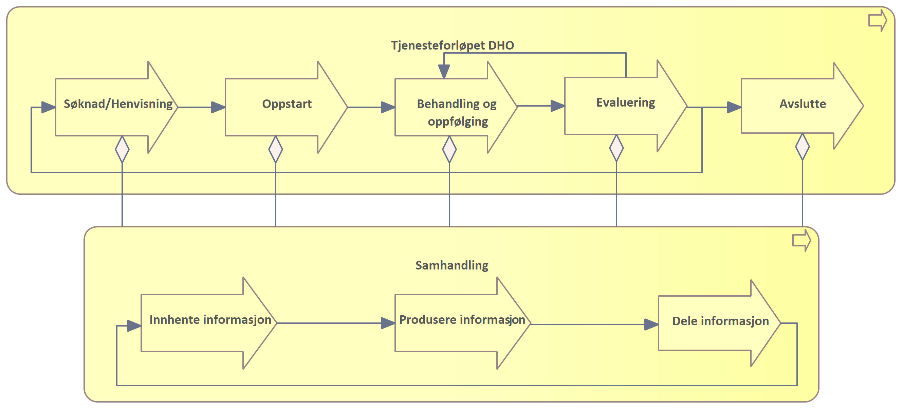

| Status | Version | Maturity | Normative level |
|:-------------|:------------------|:------|:-------|
|Work in progress | v0.8 | review  | ikke normert |

Dette kapittelet gir en oversikt over de prioriterte behovene knyttet til tjenesteforløp der DHO benyttes. Det er ikke gjort et forsøk på å gi et komplett bilde av de funksjonelle behovene som må ivaretas for helsepersonell og pasient, det er istedet fokusert på behovet for informasjon, med formål å avdekke informasjonsbehov som må understøttes med samhandling mellom helsepersonell i ulike virksomheter. For en bredere og mer detaljert oversikt over behovene, se vedlegget [Detaljert behovsbilde](..\docs\Detaljert-behovsbilde.md)

## Overordnet om samhandlingsbehov

Helse- og omsorgssektoren har behov for mer effektiv samhandling for å øke tilgjengeligheten til relevante helseopplysninger. Digital samhandling handler om å kunne utveksle informasjon digitalt, kommunisere, dokumentere, gjenbruke og dele data på tvers. Målbildet for helhetlig samhandling er å tilby informasjonstjenester på en samhandlingsinfrastruktur som representerer et sett av informasjonsbehov som ikke er tilstrekkelig dekket i dagens nasjonale e-helseløsninger for samhandling. Hver informasjonstjeneste gir mulighet for å utveksle eller dele helseinformasjon mellom ulike aktører. Særskilte behov løses nasjonalt når det gir vesentlig gevinst/ nytte. Høy semantisk samhandlingsevne (hva dataene betyr og hvordan de er definert) er nødvendig for å lykkes med dette. Arbeidet med behov for informasjonsdeling i behandlingsforløp der digital hjemmeoppfølging tilbys sees i sammenheng med målbildet for helhetlig samhandling. Kartlegging av behov for deling av informasjon, fra innbygger til helsepersonells løsninger, er utført med ulike perspektiv.  

I dagens helse- og omsorgstjeneste mangler helsepersonell ofte helhetsbilde. Rask tilgang til informasjon når helsepersonell trenger det vil gi stor verdi i arbeidshverdagen. Behovene i helsetjenesten ligger til grunn for etablering av samhandlingsløsningene i sektoren og legger premissene for hvilke samhandlingsløsninger som skal etableres og videreutvikles. Behovene knyttet til tjenesteforløp der helsehjelp ytes til pasienter som mottar digital hjemmeoppfølging (DHO) er i stor grad overlappende med andre tjenesteforløp. Vi kan derfor lære mye om nødvendige samhandlingsløsninger i sektoren ved å se spesielt på sammensatte tjenesteforløp innen DHO. Behovene hentes fra utprøvingsprosjekter og tjenesteeiere i helse- og omsorgssektoren. Erfaring fra utprøvingsprosjektene skal over tid føre til mer spesifikk behovskartlegging knyttet til erfaring med utveksling av informasjon mellom virksomheter og behandlingsnivå (primær- og spesialisthelsetjenesten) knyttet til DHO. Vi skiller i det videre arbeidet mellom informasjonsbehov og funksjonelle krav.

**Merk:** Målarkitekturen tar høyde for å gi et overordnet behovsbilde for hele DHO-området beskrevet over.  

## Overordnede roller og brukerhistorier

**Med fokus på informasjonsbehov**

Målbilde for samhandling begrenser seg til å understøtte ytelse av helse- og omsorgshjelp. Dette inkluderer å sikre kontinuitet i direkte helsehjelp, for eksempel når pasienter skrives ut fra sykehus og beveger seg mellom omsorgsnivå og det er behov for oppfølging i kommunen der tjenesten digital hjemmeoppfølging kan benyttes. Samhandling bidrar til økt pasientsikkerhet og kvalitet gjennom å legge til rette for deling av korrekt informasjon for helsepersonell med tjenstlig behov. Det er beskrevet noen overordnede brukerhistorier for funksjonelle behov. En kortfattet beskrivelse av hvem som har behov, hva slags funksjonalitet det er behov for og hvorfor funksjonaliteten gir verdi.

Samhandlingstjenester i behandlingsforløp der digital hjemmeoppfølging benyttes skal tilrettelegge for følgende funksjonelle behov:

1. Som helsepersonell har jeg behov for tilgang til oppdatert informasjon som er nødvendig for å yte helsehjelp til pasient på en effektiv måte
2. Som helsepersonell har jeg behov for å samarbeide med pasient og annet helsepersonell om dokumentasjon av felles sannhet for informasjon som behandlingsplaner og legemiddellister, der mange bidrar med en delmengde av informasjonen og kompetanse
3. Som pasient har jeg behov for tilgang til oppdatert og relevant informasjon for å mestre og ivareta egen helse
4. Som pasient har jeg behov for at helsepersonell med tjenstlig behov har tilgang til relevant informasjon uavhengig av hvem som har registrert informasjonen, slik at jeg slipper å gjenfortelle historien min

## Tjenesteforløp og samhandling

Som en ramme for behovskartlegging beskrives generelle prosesstrinn som de fleste tjenesteforløp gjennomgår. Et tjenesteforløp beskriver organisering og oppgaver knyttet til å yte helsetjenester til pasienter som følges med digital hjemmeoppfølging. Prosesstrinnene er angitt på overordnet nivå og har som formål å knytte samhandlingsbehovene til et <!--Er det her ment å knytte til et behandlingsforløp eller tjenesteforløp? Hele denne innledende teksten må endres når vi er enige om begrepsbruk og innholdet-->generelt tjenesteforløp/pasientforløp. De overordnede prosesstrinnene kan spesifiseres ved behov for å synliggjøre hvordan samhandlingen understøtter mer spesifikke tjenesteforløp. Ved analyse av samhandlingsbehovene konsentrerer vi oss om hvordan tjenesteforløpet kan understøttes med nye eller endrede samhandlingsløsninger og det meste av arbeidet vil derfor handle om prosessene for **samhandling**. Vi tar utgangspunkt i en generell prosess for tjenesteforløpet i helsetjenesten (for eksempel knyttet til DHO) i figuren under.

I tillegg til behovskartlegging knyttet til [utprøvings- og sprednings-prosjekter](Bakgrunn-behov.md) er den generelle beskrivelsen av  tjenesteforløpet basert på Helsedirektoratets anbefalinger knyttet til [Utvikling av helhetlige tjenesteforløp](https://www.helsedirektoratet.no/rapporter/digital-hjemmeoppfolging-sluttrapport-fra-nasjonal-utproving-2018-2021/utvikling-av-helhetlige-tjenesteforlop).

* **Søknad/Henvisning** er prosesser knyttet til å motta søknad eller henvisning fra andre deler av helsetjenesten  eller innbygger/pårørende. Eksempler kan være at en pasient er tildelt en tjeneste basert på søknad som omfatter hjemmetjenester kombinert med utplassering av DHO-utstyr/ medisinsk utstyr i pasientens hjem
* **Oppstart** er oppstart av ny helsehjelp basert på søknad/henvisning med bakgrunn i behov og/eller diagnose, pasientens symptomer med utredning av pasientens tilstand. Oppstart inkluderer planlegging av behandling/oppfølging og tiltak som skal gjennomføres, og opplæring av involvert helsepersonell og pasienter/pårørende, for eksempel knyttet til bruk av medisindispenser eller annet DHO utstyr/ medisinsk utstyr og utarbeidelse av plan.
* **Behandling og oppfølging** av pasient er det mest sentrale prosessteget i tjenesteforløpet og vil omfatte alle former for vurdering, rapportering, oppfølging og behandling som gjennomføres. Det kan være oppfølging ved hjelp av teknologi, hjemmebesøk, konsultasjon eller behandling som krever besøk/innleggelse på helseinstitusjon
* **Evaluering** innebærer å gjennomgå hvordan oppfølgingen fungerer, vurdere nye tiltak og eventuelt justere eksisterende tiltak.
* **Avslutte** tjeneste innebærer at tjenesteforløpet avsluttes etter evaluering.

Prosessen for **Samhandling** er brutt ned til generelle steg som kjennetegner en samhandlingsprosess. Prosessen for samhandling kan som figuren viser understøtte alle deler av et tjenesteforløp der informasjon innhentes, produseres eller deles. Delprosessene for samhandling kan også detaljeres videre og vil vanligvis understøttes på på ulike måter av automatiserte eller manuelle prosesser og funksjoner.

* **Innhente informasjon** er enhver prossess hvor en aktør leser, finner eller henter informasjon fra andre interne eller eksterne kilder.
* **Produsere informasjon** er enhver prosess knyttet til å dokumentere tiltakene som er gjennomført og vurderingene som ligger til grunn for tiltakene.
* **Dele informasjon** er enhver prosess knyttet til å dele eller tilgjengeliggjøre produsert informasjon, slik at andre aktører kan konsumere og nyttiggjøre seg av informasjonen.

## Informasjonsbehov og informasjonstjenester

Ulike tjenesteforløp vil ha forskjellige behov for informasjon. Disse behovene beskriver vi i form av ulike typer informasjonsressurser og informasjonstjenester. Modellen viser hvilke overordnede informasjonsressurser og informasjonstjenester (gruppering av informasjonsbehov) det er avdekket behov for i forbindelse med DHO. Det er gjennomført en mapping av informasjonsressursene og hvordan informasjonsressursen henger sammen med informasjonstjenester definert i [Sentralt styringsdokument Akson - Helhetlig samhandling (bilag G2)](https://www.ehelse.no/publikasjoner/sentralt-styringsdokument-akson-helhetlig-samhandling-og-felles-kommunal-journallosning).

I tillegg er det identifisert behov for dialogtjenester for kommunikasjon mellom helsepersonell og mellom helsepersonell og innbygger:

### Informasjonstjenester som beskrives i DHO arbeidet

Målarkitekturen skal beskrive behov for samhandling og informasjonstjenester som kan sikre at samhandlingen understøtter helsetjenesten på en hensiktsmessig måte. I arbeidet med å kartlegge informasjonsbehov skiller vi mellom informasjonsressurser og informasjonstjenester som må etableres for å understøtte informasjonsbehovet. I den grad det er nødvendig vil arbeidet også beskrive andre initiativer som etablerer informasjonstjenester () det er behov for i forbindelse med DHO og hvordan disse tjenestene bør tilgjengeliggjøres for å svare ut behov som er identifisert i forbindelse med DHO.  

!!! note "Samhandling på tvers"

    Gjennom dette arbeidet er det hovedfokus på hvordan data fra pasient (pasientregistrerte eller fra sensorer og utstyr) kan brukes på tvers av omsorgsnivå i helsetjenesten på en hensiktsmessig måte, og hvordan samhandlingen om denne informasjonen bør innrettes.

### Data fra pasient og informasjonstjenester

Hovedmålet for målarkitekturen DHO er å vise hvordan samhandlingen knyttet til data fra pasient skal gjennomføres, samtidig som den må vise hvilke andre informasjonstjenester som må være tilstede for å understøtte <!--tjenesteforløp - kun bruke dette hvis vi blir eninge om begrepsbruk--> en sammenhengende DHO tjeneste. Informasjonstjenestene som omfattes er i denne sammenhengen:

* Undersøkelser, målinger og funn (IT17 og IT07)
* Skjemabesvarelser og NEWS scoringer (IT17)
* Vurderinger og varsel basert på målinger (IT17)

!!! note "Pasientrapporterte data"
    Pasientene er aktive deltakere og bidragsytere i helsehjelpen de mottar og kan følges opp i hjemmet ved at pasientens egenmålinger, pasientrapporterte opplysninger om egen helsetilstand eller automatiske målinger, sendes digitalt til helsetjenesten.

### Informasjonstjenester i andre kategorier

Det er identifisert behov for samhandling om ytterligere informasjon og informasjonstjenester for å understøtte et  sammenhengende tjenesteforløp som inkluderer DHO. Dette inkluderer følgende behov:

* Plan (IT08)
* Hendelser (IT03 og IT19)
* Tjenester, inkludert hjelpemidler og logistikk (IT23)
* Legemiddelliste (IT03)
* Journalnotat (IT09)
* Klinisk oppsummering (IT01)
<!--Denner ikke med i tabell over behov og kobling mot informasjonstjenester i Akson. Vi får vurdere om det faktisk er IOT01 vi skal beskrive eller om det som er kommet frem dekkes av IT09 -->
<!-- SVAR: Denne er med i tabellen over og sammenhengene er vist i figuren https://user-images.githubusercontent.com/6229665/201674228-84a1171d-0006-4720-a462-aaba5947dca8.png-->
* Basisinformasjon pasient (IT12)
* Dialogtjenester (IT10 og IT11)
<!--Kunne denne vært koblet mot Kommunikasjon ved saksbehandling og Tekstlig dialog? Børd da beskrives i tabell-->
<!--SVAR vi behandler ikke dialog i detalj, men vi kan nevne IT10/IT11 og Tror ikke IT24 er relevant her-->

### Prioritering av informasjonstjenester

Her vises i prioritert rekkefølge de informasjonstjenestene som er mest etterspurt av helsepersonell:

1. Egenbehandlingsplan (IT08)
2. Legemiddelliste (IT03)
3. Målinger, vurderinger og varsel (IT17 og IT07)
4. Dialogtjenester (IT10 og IT11)

I tillegg er det en rekke andre informasjonstjenester som er høyt prioritert av tjenesten, disse vises i figuren: <!--Skulle vi vurdert å bruke figuren fra målbilde med alle informasjonstjenestene i arbeidet for å vise sammenhengene?-->
<!--SVAR: Nei, denne figuren har vist seg å fungere greit for å vise de høyest prioriterte informasjonsbehovene innen DHO-->

Det utvikles samhandlingsløsninger knyttet til behov for [digitale behandlings- og egenbehandlingsplaner](https://www.helsedirektoratet.no/om-oss/forsoksordninger-og-prosjekter/digital-behandlings-og-egenbehandlingsplan) og [legemiddelliste](https://www.ehelse.no/prosjekt/program-pasientens-legemiddelliste) gjennom egne initiativ. <!--Kan vi ha den sistet setningen uthevet i en boks slik det er gjort i avsnittet over for å tydeliggjøre hva vi jobber med nå som et første steg-->Det er derfor besluttet at de viktigste tjenestene å utvikle samhandlingsløsninger for i DHO arbeidet nå som et første steg handler om Målinger, vurderinger og Varsel. Dette er informasjonstjenester som etterspørres fra mange virksomheter og alle omsorgsnivå i flere geografiske regioner.
