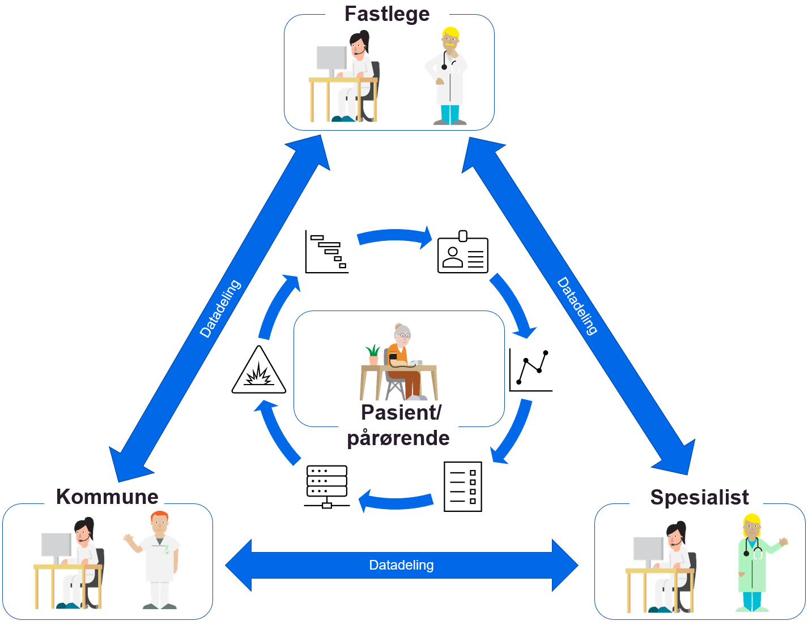
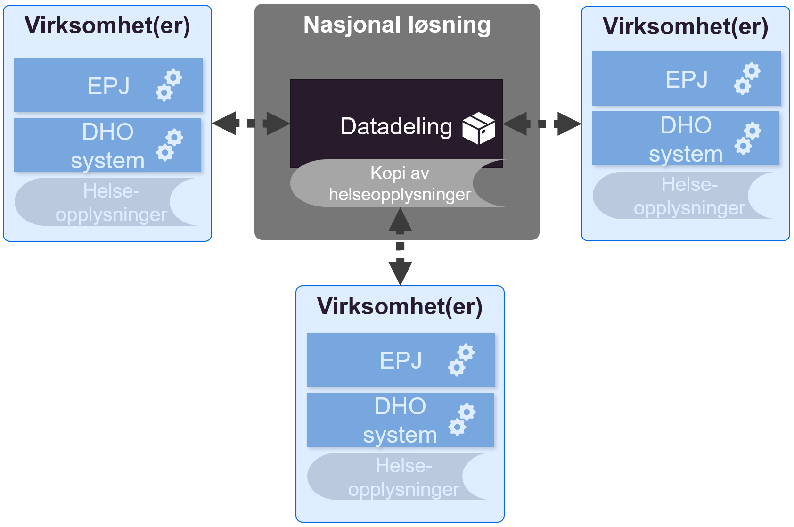
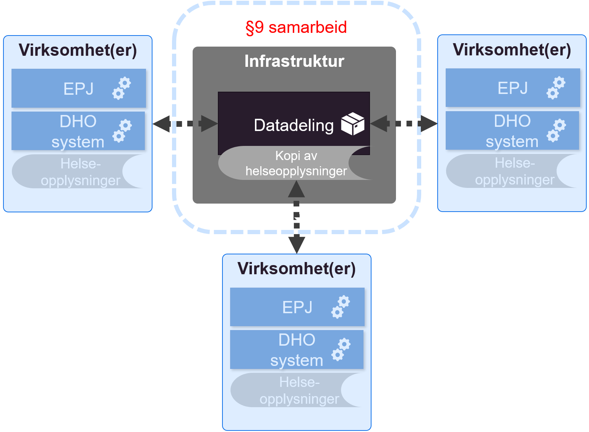
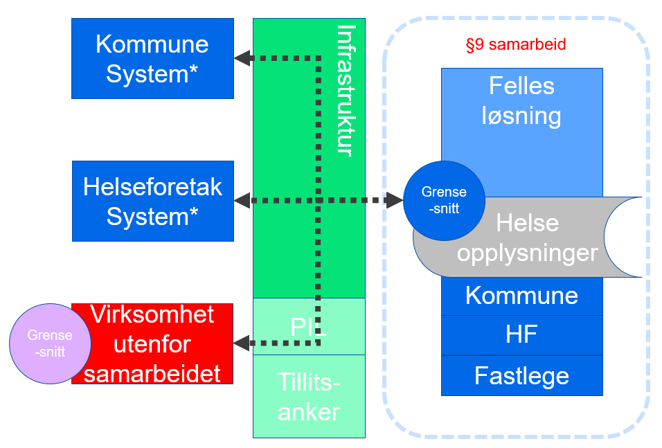
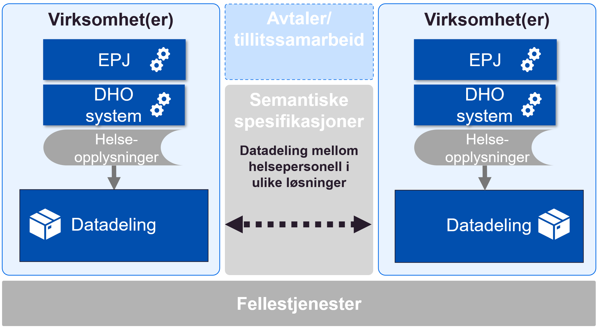
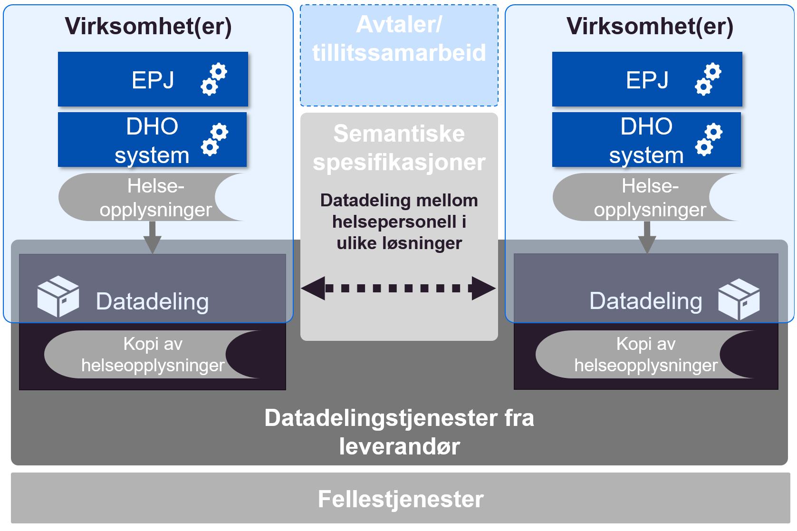
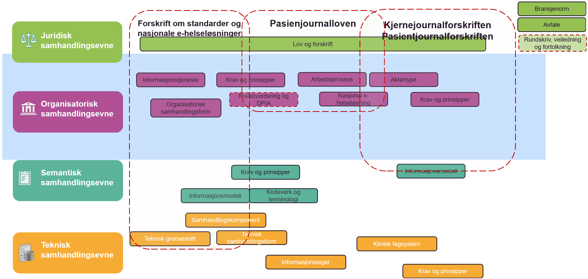

| Status | Version | Maturity | Normative level |
|:-------------|:------------------|:------|:-------|
| Work in progress | v0.3 | draft  | ikke normert |

## Sammendrag

Digital hjemmeoppfølging er underlagt det samme rettslige rammeverket som øvrig helsehjelp. Krav til behandling av helse- og personopplysninger som stilles i helselovgivningen og personvernregelverket må følges når en benytter digital hjemmeoppfølging som en integrert del av et behandlingsforløp. Ved bruk av digital hjemmeoppfølging må det dermed gjøres konkrete vurderinger i de enkelte tilfellene slik at det sikres at bestemmelsene om f.eks. dokumentasjonsplikt, tilgjengeliggjøring av opplysninger, taushetsplikt, ansvarsforhold, behandlingsgrunnlag, informasjonssikkerhet mv. oppfylles på vanlig måte.

Slik digital hjemmeoppfølging benyttes internt i en virksomhet i dag er det ikke nødvendig med regelverksutvikling. Det er først og fremst når virksomhetene har behov for å utveksle helseopplysninger på tvers av behandlingsnivåer (mellom primær- og spesialisthelsetjenesten), at det juridiske handlingsrommet blir utfordret. I dag benyttes hovedsaklig meldingsutveksling for å understøtte samhandling på tvers av virksomheter og omsorgsnivå, men i mange tjenesteforløp hvor DHO benyttes er det behov for samhandling som meldingsutvekslingen ikke kan løse. I disse tilfellene løses samhandlingsbehovet mellom virksomheter i en del tilfeller ved at å gi tilgang til det interne systemet i andre virksomheter ved å opprette en bruker hvor ansattforhold er satt til 0%. Dette gir tilgang til systemene, men er ikke en bærekraftig (eller lovlig) løsning. Det er derfor planlagt å prøve ut datadeling på tvers av virksomhetene for å oppnå en bedre informasjonsflyt og mer effektiv arbeidshverdag med utveksling av data til den andre virksomhetens systemer. Dette forutsetter at det i gjennomføringen av tiltaket særlig gjøres konkrete vurderinger knyttet til sikker tilgangsstyring.

Velferdsteknologisk knutepunkt (VKP) som driftes av Norsk helsenett (NHN), har i dagens VKP ingen lagring av data i løsningen. De innsamlede data ligger i ulike DHO-systemer/medisinsk utstyr og i lokal journalløsning. Det kan i utprøvingen og videre bli aktuelt å delvis lagre data fra digital hjemmeoppfølging hos dataansvarlig som en datadelingstjeneste eller sammenstilt sentralt på tvers av aktører. Det er foreløpig uavklart om et internt lager for datadelingstjeneste hos dataansvarlig er innenfor dagens regelverk. En nasjonal lagring av sammenstilte data (hvor en nasjonal aktør har dataansvar) vil etter vår vurdering kreve et annet juridisk grunnlag enn det som finnes i dag, og forutsetter derfor regelverksutvikling/forskriftsendring. Hvorvidt data skal lagres sentralt eller distribuert er foreløpig ikke avklart og må vurderes nærmere som del av utprøvingene som gjennomføres.

## Datadeling og DHO

Behovskartlegging har avdekket at det er behov for større bruk av datadeling (tjenester med funksjonalitet for oppslag) for å støtte informasjonsbehovene innen DHO. Dagens samhandlingsløsninger baserer seg i hovedsak på melding og dokumentutveksling, mens bruk av datadelingstjenester (basert på oppslag) mellom virksomheter er lite utbredt i helsesektoren. De datadelingstjenestene som eksisterer i helse er i stor grad sentraliserte tjenester knyttet til resept, kjernejounal og grunndata. De sentraliserte tjenestene som inneholder personlig helseinformasjon er særregulert i pasientjournalloven og har egne forskrifter som definerer omfanget og formålet med tjenesten.

## Problemstillinger som er vurdert

Siden datadeling mellom virksomheter er lite brukt i helse- og omsorgssektoren er også det juridiske handlingsrommet i stor grad uavklart for denne typen samhandling og samhandlingstjenestene som skal understøtte samhandlingen. I mars 2021 publiserte Direktoratet for e-helse en målarkitektur for datadeling i helse- og omsorgssektoren. Målarkitekturen for datadeling omhandler i hovedsak hvordan datadelingstjenester kan etableres med tilstrekkelig grad av sikkerhet og personvern som er pålagt de dataansvarlige. Vi har derfor ikke vurdert det nødvendig å vurdere dette igjen i forbindelse med DHO. Målarkitekturen for datadeling slår fast hvordan dataansvaret er fordelt mellom virksomheter som benytter datadeling for samhandling. Ved overføring av informasjon ved hjelp av datadeling fungerer dataansvaret som ved andre samhandlingsformer, det vil si at mottakeren har dataansvar for sin behandling av mottatt informasjon.

Vi har avdekket tre uavklarte spørsmål som må vurderes før man etablerer datadeling og som påvirker hvilke konsepter og løsningsvalg som kan vurderes:

1.  Hvilke rammer setter regelverket for å etablere datadelingsløsninger sentralisert (i sentral infrastruktur), regionalt eller distribuert (i virksomhetenes egen infrastruktur)?
2.  Hvilket handlingsrom har dataansvarlig i forhold til å etablere teknisk infrastruktur for datadeling.
    1.  Avklarer hvorvidt datadelingsløsninger kan etableres for en dataansvarlig av en tredjepart, der behandling av helseopplysninger er regulert av en databehandleravtale, eller om virksomheten er bundet til å håndtere alle funksjoner knyttet til datadeling innenfor egen infrastruktur og med en teknisk komponent for å lagre helseopplysningene.
3.  Målarkitekturen for datadeling forutsetter at det opprettes en sentral komponent for å lokalisere data om en pasient kalt Pasientinformasjonslokalisator (PIL) for at datadeling mellom mange datadelingsløsninger skal fungere. Målarkitekturen påpeker at det er uavklart om det trengs behandlingsgrunnlag i form av en egen forskrift for etablering av PIL. Det er i dag ikke rettslig grunnlag for å etablere en PIL-komponent med sentral sammenstilling av informasjon, dette krever forskriftsendring.

## Rammer for etablering av datadelingsløsninger, sentralisert, regionalt eller distribuert

Det ble tidlig vurdert å etablere datadelingsløsninger for DHO i sentral infrastruktur, tilbudt og driftet av Norsk helsenett. Grunnen er at det ble ansett  som en  fordel for spredning og drift av datadelingstjenester ble ansett som enklere og billigere enn om hver enkelt virksomhet utvikler og etablerer datadelingsløsninger i egen infrastruktur.  Den sentraliserte tjenesten baserte seg i  hovedkonseptet på felles sentralisert lagring, enten regionalt eller nasjonalt.

### Nasjonal sentral datadelingsløsning

Ved etablering av en nasjonal sentral datadelingsløsning baserer vi oss på at informasjonen som skal tilgjengeliggjøres mellom virksomhetene lagres i sentral infrastruktur hos NHN, samtidig som den eksisterer i relevante fagsystemer hos den enkelte virksomheten som samler den inn fra pasienten. Virksomhetene kan da gjennomføre søk mot en felles nasjonal tjeneste som tilbys og driftes av NHN. Informasjonen som skal lagres i registeret er ikke sammenfallende med eksisterende nasjonale løsninger som kjernejournal eller e-resept. Det er derfor ikke mulig å benytte noen av disse hjemlene som rettslig grunnlag for et nasjonalt register for datadeling innen DHO. Det er heller ikke snakk om å erstatte lokale løsninger med sentrale, men å etablere nasjonale løsninger som kommer i tillegg til de lokale med hovedfokus på å etablere bedre samhandlingsløsninger mellom virksomhetene.

### Konklusjon  
> Det er med dagens lovverk ikke hjemmel for å opprette et eget nasjonalt behandlingsrettet helseregister uten å hjemle dette i pasientjournalloven §10 og opprette egen forskrift for dette, eller etablere selvstendig hjemmelsbestemmelse for et nytt register i pasientjournalloven.  

En slik løsning kan vurderes på sikt, men siden behovet for samhandling knyttet til DHO i all hovedsak er regionalt og ikke nasjonalt, gjennomfører vi ikke noe tiltak for å etablere en sentral nasjonal datadelingsløsning for DHO på nåværende tidspunkt.

### Regionale datadelingsløsninger (Avklart)

Ved etablering av sentral regional datadelingsløsning baserer vi oss på at informasjonen som skal tilgjengeliggjøres mellom virksomhetene lagres i sentral infrastruktur hos NHN samtidig som den eksisterer i relevante fagsystem hos den enkelte virksomheten. Virksomhetene som deltar i det regionale samarbeidet kan søke i den felles regionale tjenesten som tilbys og driftes av NHN.

Med dagens lovverk er det ikke hjemmel for å opprette et eget regionalt behandlingsrettet helseregister uten å hjemle dette i pasientjournalloven §9 og opprette en samarbeidsavtale om et felles behandlingsrettet helseregister som kan brukes av avtalepartene innenfor et definert samarbeidsområde. Det forutsettes imidlertid i forarbeidene til pasientjournalloven § 9 at slike samarbeidsregistre skal komme i stedet for, ikke i tillegg til, virksomhetens  interne registre. Slike fellesregistre skal erstatte den virksomhetsinterne journalen. Det er også et krav at registeret etableres for å gjennomføre dokumentasjonsplikten til klinikerne og ikke hovedsakelig etableres for å understøtte tilgjengeliggjøring av informasjon til andre virksomheter.

### Foreløpig konklusjon  
> Slik vi vurderer det kan derfor ikke et §9 samarbeid benyttes for å hjemle felles sentralisert register med hovedformål å tilgjengeliggjøre informasjon mellom  virksomhetene i det regionale samarbeidet.

### Regionale fellesløsninger

Ved etablering av sentral regional løsninger, for eksempel for DHO, baserer vi oss på at informasjonen som skal tilgjengeliggjøres mellom virksomhetene lagres i sentral infrastruktur i fellesløsningen. Fellesløsningen kommer istedenfor andre systemer i virksomheten. Andre systemer som er knyttet til andre deler av virksomhetene kan søke i den felles regionale løsningen etter informasjon de trenger ved oppfølging av pasienten. Det samme gjelder andre aktører som har behov for å samarbeide med virksomhetene som er omfattet av felles løsningen.

Der felles løsning kommer istedenfor eksisterende løsninger, eller løser helt nye behov virksomheten ikke har løsninger for kan §9 samarbeid mellom virksomheter benyttes til å etablere felles løsning som også inkluderer samhandlingsløsninger for datadeling.

### Konklusjon  
> Slik vi vurderer det kan §9 samarbeid benyttes for å hjemle felles sentralisert register med hovedformål tilby behandlingsrettet helseregister for virksomhetene i samarbeidet. Registeret opprettes for å gjøre virksomhetene i stand til _behandling av helseopplysninger som er nødvendig for å yte, administrere eller kvalitetssikre helsehjelp til enkeltpersoner_.

## Distribuerte datadelingsløsninger

Ved etablering av distribuerte datadelingsløsninger har vi to alternativer for å etablere disse. Enten etablerer alle virksomhetene egne datadelingsløsninger basert på en felles semantisk/teknisk spesifikasjon, eller så kan man benytte en felles leverandør for å tilby mest mulig enhetlig tjenester for hver enkelt dataansvarlig virksomhet.

### Distribuerte datadelingsløsninger (i virksomhetenes infrastruktur)

Ved etablering av distribuerte datadelingsløsninger i virksomhetenes egne infrastruktur etablerer man løsninger for distribuerte søk på tvers av virksomhetene. Det er viktig at alle løsningene tar utgangspunkt i den samme semantiske spesifikasjonen slik at det blir enkelt å søke i informasjon fra forskjellige virksomheter, løsninger og levert av mange leverandører. Ved en slik tilnærming trenger man i tillegg til PIL også en solid sentralisert tillitsmodell, ellers må man etablere bilaterale avtaler mellom alle aktørene som ønsker å samhandle med hverandre. Det er usikkert hvordan PIL skal etableres innenfor gjeldende rett, men §10 i pasientjournalloven åpner for å gi forskrift om sentraliserte infrastrukturkomponenter for å støtte samhandlingen. Bestemmelsen i seg selv er ikke tilstrekkelig.

### Konklusjon  
> Slik vi vurderer det er det rettslig grunnlag for at virksomheten etablerer datadelingsløsninger for tilgjengeliggjøring av pasientinformasjon til klinikere i andre virksomheter som har tjenstlig behov for informasjonen. Forutsetningen er at krav til sikkerhet og personvern ivaretas av datadelingsløsningene. Det er et usikkerhetsmoment knyttet til etableringen av PIL-komponent i sentral infrastruktur.

### Distribuerte datadelingsløsninger (i sentral infrastruktur) (uavklart)

Datadelingsløsninger i regional infrastruktur gjør det mulig å etablere datadelingsløsningene fra flere virksomheter i den samme tekniske infrastrukturen og basere seg på den samme kildekoden som basis for datadelingsløsningene. Informasjonen fra hver enkelt dataansvarlig virksomhet lagres imidlertid logisk adskilt og reguleres av en databehandleravtale mellom virksomheten og tilbyderen av tjenesten. Fordelen med en slik tilnærming er at man kan gjenbruke kode og infrastruktur for å etablere flere datadelingstjenester med like grensesnitt, noe som kan gjøre  drift og vedlikehold av  tjenestene enklere, raskere og billigere. Hvis denne tilnærmingen skal fungere for mange aktører kreves det at man benytter en PIL komponent i sentral infrastruktur (pasientinformasjons lokalisator) siden man i praksis må etablere støtte for distribuerte søk. Det er usikkert hvordan PIL skal etableres innenfor gjeldende rett, men §10 i pasientjournalloven åpner for å gi forskrift om sentraliserte infrastrukturkomponenter for å støtte samhandlingen. Bestemmelsen i seg selv er ikke tilstrekkelig.

### Konklusjon  
> Slik vi vurderer det er det rettslig grunnlag for å sette ut deler av driften/etableringen av sine datadelingsløsninger til tredjepart under regulering av en databehandleravtale. Det er imidlertid ikke hjemmel for å etablere ett felles datalager for alle aktørene som bruker felles infrastruktur (Det må istedenfor etableres logisk adskilte datadelingsløsninger og datalager for hver virksomhet). Det er et usikkerhetsmoment knyttet til etableringen av PIL-komponent i sentral infrastruktur.

## Hvilke lag regulerer loven (uavklart)

Vi henviser til EIF (European Interoperability Framework), som vanligvis fremstilles med fire lag når vi snakker om interoperabilitet. EIF definerer fire lag for samhandling: Juridisk, organisatorisk, semantisk og teknisk. Dette er også vanlig å dele virksomhetsarkitektur i ulike lag. Innen virksomhetsarkitektur defineres ofte flere  lag som strategisk, organisatorisk, applikasjon og tekniske lag. En lagdelt modell baserer seg på at de øverste lagene i størst grad påvirker/blir påvirket av lagene direkte over/under, men at man ikke får til samhandling uten å etablere mekanismer for samhandling på alle lagene i rammeverket. Det er også slik at en løsning beskrevet på et nivå vanligvis kan ha mange mulige løsninger på de underliggende lagene. Det betyr at lov og forskrift påvirker alle aspekter ved den juridiske samhandlingsevnen, men også i stor grad vil påvirke direkte og indirekte den "organisatorisk samhandlingsevnen".

> Fra forarbeidet til pasientjournalloven  
>"Loven setter ikke krav til hvordan de ulike systemene skal bygges opp, så lenge systemet som helhet sikrer at oppdaterte og korrekte opplysninger er tilgjengelige for helsepersonellet"

Juridiske rammebetingelser vil derfor ha sterke direkte føringer på hvordan den organisatoriske samhandlingsevnen kan etableres. Men siden pasientjournalloven er av funksjonell og prinsipiell karakter, vil den i liten eller ingen grad påvirke direkte hvordan den semantiske og tekniske samhandlingsevnen kan innrettes. Det vil si at man står relativt fritt til å innrette seg i forhold til bruk av semantiske standarder, kodeverk og teknologi, siden dette ikke er regulert i loven. Det er også en rekke tekniske løsninger som kan oppfylle lovens krav til hvordan et behandlingsrettet helseregister skal etableres og driftes.

### Konklusjon  
> Pasientjournalloven oppstiller funksjonelle krav og legger ikke tekniske føringer for hvordan virksomheter innretter og forvalter sine behandlingsrettede helseregistre. Dette åpner også for å duplisere opplysninger for å best mulig kunne oppfylle de krav loven oppstiller.
