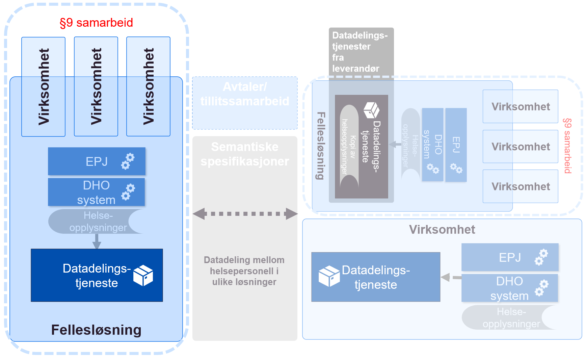

| Status           | Version | Maturity | Normative level |
| :--------------- | :------ | :------- | :-------------- |
| Work in progress | v0.4 | draft | ikke normert |

## Innledning

Digital hjemmeoppfølging er underlagt det samme rettslige rammeverket som øvrig helsehjelp. Krav til behandling av helse- og personopplysninger som stilles i helselovgivningen og personvernregelverket må følges når en benytter digital hjemmeoppfølging som en integrert del av et behandlingsforløp. Ved bruk av digital hjemmeoppfølging må det dermed gjøres konkrete vurderinger i de enkelte tilfellene slik at det sikres at bestemmelsene om f.eks. dokumentasjonsplikt, tilgjengeliggjøring av opplysninger, taushetsplikt, ansvarsforhold, behandlingsgrunnlag, informasjonssikkerhet mv. oppfylles på vanlig måte.

### Datadeling og DHO

Slik digital hjemmeoppfølging benyttes internt i en virksomhet i dag er det ikke nødvendig med regelverksutvikling. Det er først og fremst når virksomhetene har behov for å utveksle helseopplysninger på tvers av behandlingsnivåer (mellom primær- og spesialisthelsetjenesten), at det juridiske handlingsrommet blir utfordret.  

*Behov for datadeling knyttet til DHO tjenesteforløp*

Behovskartlegging har avdekket at det er behov for økt bruk av datadeling (tjenester med funksjonalitet for [*slå opp* og *avgi data*](Organisatorisk-sla-opp.md)) for å støtte samhandlingsbehovene innen DHO. Dagens samhandlingsløsninger baserer seg i hovedsak på melding og dokumentutveksling, mens bruk av datadelingstjenester mellom virksomheter er lite utbredt i helsesektoren. De datadelingstjenestene som eksisterer i helse er i stor grad sentraliserte tjenester knyttet til resept, kjernejounal og grunndata. De sentraliserte tjenestene som inneholder personlig helseinformasjon er særregulert i pasientjournalloven og har egne forskrifter som definerer omfanget og formålet med tjenesten.

### Velferdsteknologisk knutepunkt

Velferdsteknologisk knutepunkt (VKP) som eies av Norsk helsenett (NHN), har per idag ingen lagring av data i løsningen. De innsamlede data ligger i ulike DHO-systemer og i lokal journalløsning. Det kan i utprøvingen og videre bli aktuelt å delvis lagre data fra digital hjemmeoppfølging hos dataansvarlig som en datadelingstjeneste eller sammenstilt på tvers av aktører. Det er foreløpig uavklart om en separat lagringsløsning for å understøtte en datadelingstjeneste hos dataansvarlig er innenfor dagens regelverk.  

Nasjonal lagring av sammenstilte data (hvor en nasjonal aktør har dataansvar) vil etter vår vurdering kreve et annet juridisk grunnlag enn det som finnes i dag, og forutsetter derfor regelverksutvikling/forskriftsendring.  

## Problemstillinger som er vurdert

Ettersom datadeling mellom virksomheter er lite brukt i helse- og omsorgssektoren, er også det juridiske handlingsrommet i noen grad uavklart for denne typen samhandling og samhandlingstjenestene som skal understøtte dette. I mars 2021 publiserte Direktoratet for e-helse en målarkitektur for datadeling i helse- og omsorgssektoren. Målarkitekturen for datadeling omhandler i hovedsak hvordan datadelingstjenester kan etableres med tilstrekkelig grad av sikkerhet og personvern som er pålagt de dataansvarlige. Vi har derfor ikke sett det som nødvendig å vurdere dette igjen i forbindelse med DHO. Målarkitekturen for datadeling beskriver hvordan dataansvaret er fordelt mellom virksomheter som benytter datadeling for samhandling. Ved overføring av informasjon ved hjelp av datadeling fungerer dataansvaret som ved andre samhandlingsformer, det vil si at mottakeren har dataansvar for sin behandling av mottatt informasjon.

Vi har særlig vurdert følgende spørsmål som påvirker hvilke konsepter og løsningsvalg som kan vurderes:

1. Hvilke rammer setter regelverket for å etablere datadelingsløsninger sentralisert (i sentral infrastruktur), regionalt eller distribuert (i virksomhetenes egen infrastruktur)?
2. Hvilket handlingsrom har dataansvarlig i forhold til å etablere teknisk infrastruktur for datadeling.
   * Avklarer hvorvidt datadelingsløsninger kan etableres for en dataansvarlig av en tredjepart, der behandling av helseopplysninger er regulert av en databehandleravtale, eller om virksomheten er bundet til å håndtere alle funksjoner knyttet til datadeling innenfor egen infrastruktur og med en teknisk komponent for å lagre helseopplysningene.
3. Målarkitekturen for datadeling forutsetter at det opprettes en sentral komponent for å lokalisere data om en pasient kalt Pasientinformasjonslokalisator (PIL) for at datadeling mellom mange datadelingsløsninger skal fungere. Det er i dag ikke rettslig grunnlag for å etablere en PIL-komponent med sentral sammenstilling av informasjon, dette krever forskriftsendring. Regional PIL-komponenent kan etableres innenfor gjeldende rett (?).

### Beskrivelse av konseptene

Konseptene som blir vurdert juridisk i dette kapittelet er nærmere beskrevet i [konsepter for realisering](Konsepter-realisering.md). I den delen er også vurderingen av fordeler og ulemper med hvert konsept gjennomgått.

## Distribuerte datadelingsløsninger (i virksomhetenes infrastruktur)

Distribuerte datadelingsløsninger i virksomhetenes infrastruktur baserer seg på at hver enkelt virksomhet etablerer sin egen løsning for å avgi informasjon fra sine systemer.

*Distribuerte datadelingsløsninger etablert i virksomhetenes infrastruktur*

### Juridisk

Virksomhetene kan selv etablere datadelingsløsninger for tilgjengeliggjøring av pasientinformasjon fra egne interne systemer til klinikere  i andre virksomheter som har tjenstlig behov for informasjonen. Forutsetningen er at dette kan skje innenfor rammen av pasientjournalloven § 19, slik at hensynet til taushetsplikt, personvern og informasjonssikkerhet ivaretas.  
Det er usikkert hvordan PIL kan/skal etableres. Pasientjournalloven § 10 åpner for å gi forskrift om sentraliserte  infrastrukturkomponenter for å støtte samhandlingen. Bestemmelsen i seg selv er ikke tilstrekkelig.

## Distribuerte datadelingsløsninger (i sentral infrastruktur) (uavklart)

Konseptet baserer seg (som ren distribuert modell) på at hver enkelt virksomhet etablerer sin egen løsning for å avgi informasjon fra sine systemer, men istedenfor å etablere dette i egen infrastruktur etableres selve grensesnittet og datalager for datadeling i en felles infrastruktur.

*Distribuerte datadelingsløsninger etablert i sentral infrastruktur*

### Juridisk

Virksomhetene kan velge å benytte en tredjepart  (databehandler) som tilbyr datadelingsløsning i stedet for å etablere dette selv. Forutsetningen er som over at dette kan skje innenfor rammen av pasientjournalloven § 19, slik at hensynet til taushetsplikt, personvern og informasjonssikkerhet ivaretas.  
Videre er det er en juridisk forutsetning at informasjonen fra hver virksomhet ikke sammenstilles med informasjon fra andre virksomheter i den sentrale infrastrukturen (hos databehandler), men at løsningene for lagring og grensesnittene etableres som logisk adskilte løsninger for hver virksomhet. Behandlingen av helseopplysninger i sentral infrastruktur må reguleres av en databehandleravtale mellom den enkelte virksomheten og leverandøren av infrastrukturen.
Som for en ren distribuert modell er det tilsvarende usikkerhet knyttet til hvordan PIL kan/skal etableres.

## Regionale fellesløsninger

Ved etablering av regionale fellesløsninger, for eksempel for DHO, blir informasjonen som skal deles med andre virksomheter lagret i den regionale fellesløsningen. Grensesnitt for å avgi informasjon ved hjelp av datadeling etableres også som en del av den regionale fellesløsningen.

*Datadeling etableres som en del av en regional fellesløsning*

### Juridisk

Et § 9-samarbeid kan benyttes for å etablere et felles behandlingsrettet helseregister for virksomhetene i samarbeidet . Registeret må komme til erstatning for de lokale §8-registrene. Intern tilgang/tilgjengeliggjøring etter pasientjournalloven § 19 må vurderes på vanlig måte. Her innebærer det ordinær tilgangsstyring til «egen» journal, ikke datadeling på tvers av nivåer/aktører.
* Hvordan blir det mht kommunikasjon utover fellesløsningen?
  * Blir det som Distribuerte datadelingsløsninger (i virksomhetens infrastruktur), men slik at fellesløsningen her er 1 aktør?
* Hva med PIL?

## Regionale datadelingsløsninger med lagring

Ved etablering av sentral regional datadelingsløsning blir informasjonen som skal tilgjengeliggjøres mellom virksomhetene lagret i sentral infrastruktur hos NHN (eller annen leverandør) samtidig som den eksisterer i relevante fagsystem hos den enkelte virksomheten for å ivareta dokumentasjonsplikten. Grensesnitt for å avgi data fra felles datadelingsløsning etableres også i sentral infrastruktur.

*Regional datadelingsløsning etablert med kopilagring i sentral infrastruktur*

### Juridisk

Ettersom dette konseptet forutsetter at også de lokale registrene videreføres, kan ikke et §9-samarbeid benyttes for å hjemle et felles sentralisert register  med hovedformål å tilgjengeliggjøre informasjon mellom virksomhetene i det regionale samarbeidet.

## Nasjonal sentral datadelingsløsning med lagring

Ved etablering av sentral nasjonal datadelingsløsning baserer vi oss på at informasjonen som skal tilgjengeliggjøres mellom virksomhetene lagres i sentral infrastruktur hos NHN (eller annen leverandør) samtidig som den eksisterer i relevante fagsystem hos den enkelte virksomheten for å ivareta dokumentasjonsplikten. Grensesnitt for å avgi data i form av datadeling etableres også som en nasjonal løsning.

*Nasjonal sentral kopilagring og datadelingsløsning*

### Juridisk

Med dagens regelverk kan det ikke opprettes et eget nasjonalt behandlingsrettet helseregister uten at det gis egen forskrift for dette hjemlet i pasientjournalloven §10, eller at det etableres selvstendig hjemmelsbestemmelse for et nytt register i pasientjournalloven.
Informasjonen som eventuelt skulle lagres i det nasjonale registeret er heller ikke sammenfallende med innholdet i eksisterende nasjonale løsninger, som f.eks kjernejournal eller e-resept. Det er derfor ikke mulig å benytte noen av disse reglene for disse løsningene som grunnlag for et nasjonalt register for datadeling innen DHO.  
