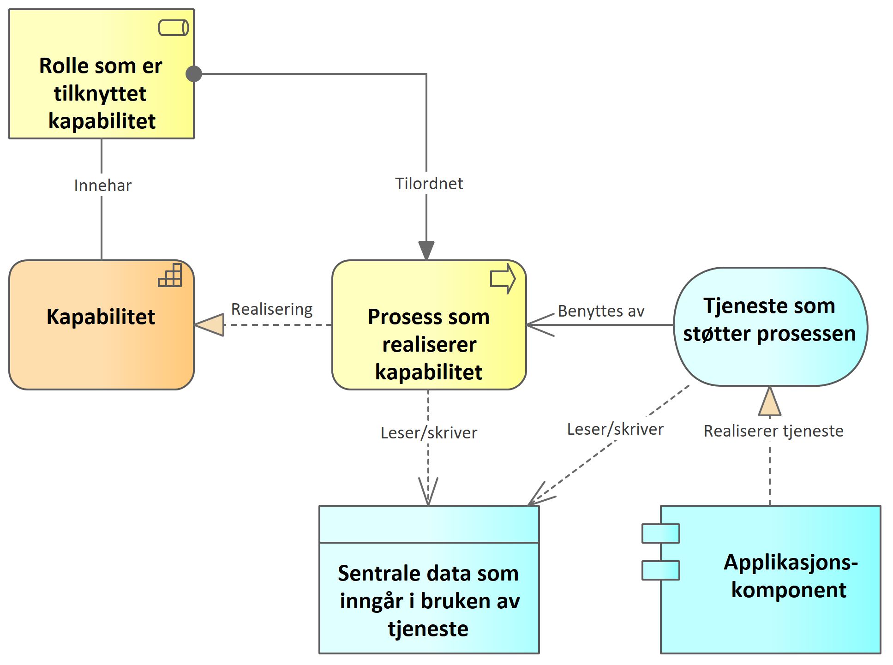

| Status | Version | Maturity | Normative level |
|:-------------|:------------------|:------|:-------|
| Work in progress | v0.5 | draft  | ikke normert |

**En kapabilitet er en evne som en organisasjon, person, rolle, tjeneste eller et system kan inneha. En rolle, organisasjon eller person kan også være tilordnet en prosess som realiserer evnen.**

Basert på [Målarkitektur for datadeling i helse og omsorgssektoren](https://www.ehelse.no/standardisering/standarder/malarkitektur-for-datadeling-i-helse-og-omsorgssektoren)

## Kapabilitetsmodell

Når vi benytter kapabiliteter (eller evner) i arbeidet med å utarbeide en virksomhetsarkitektur, tar vi utgangspunkt i hvilke kapabiliteter det er behov for og undersøker hvordan disse realiseres i virksomheten(e). For hver kapabilitet er det vanlig å vise prosesser som må gjennomføres for å realisere kapabiliteten. Hvilke roller som innehar kapabiliteten og hvilke roller som er tilordnet prosessene.

Når vi benytter denne metoden for å synliggjøre bruk av samhandling og datadeling er det viktig å se på hvordan prosessen(e) som realiserer kapabiliteten(e) bruker data og tjenester og planlegge hvordan informasjonsflyten skal fungere og hvilke tjenester som må etableres for å understøtte effektive prosesser i virksomheten. Dette innebærer også at arkitekturen må vise hvordan prosessenes informasjonsbehov understøttes, enten med interne data eller samhandling og bruk av data fra andre virksomheter og fellestjenester.
