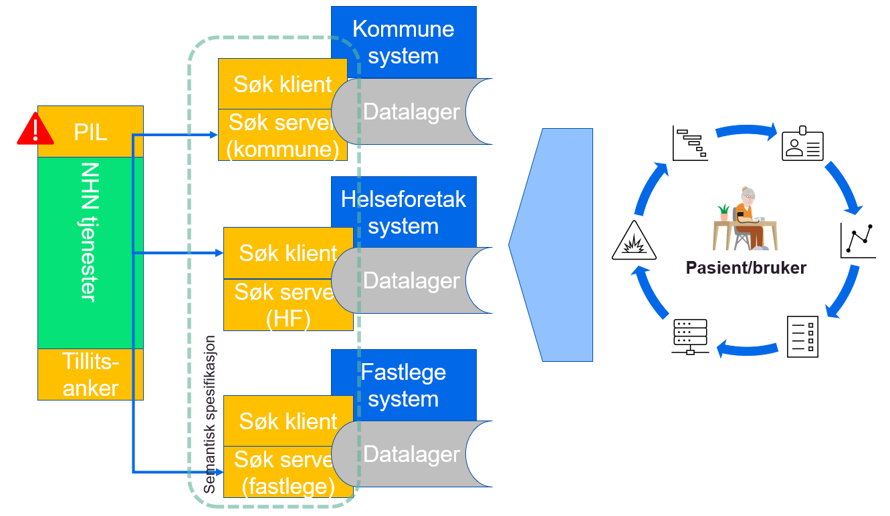
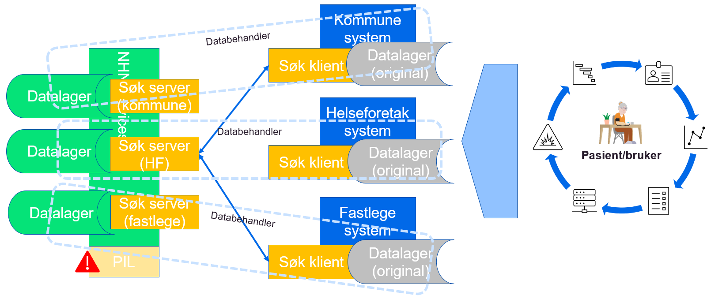
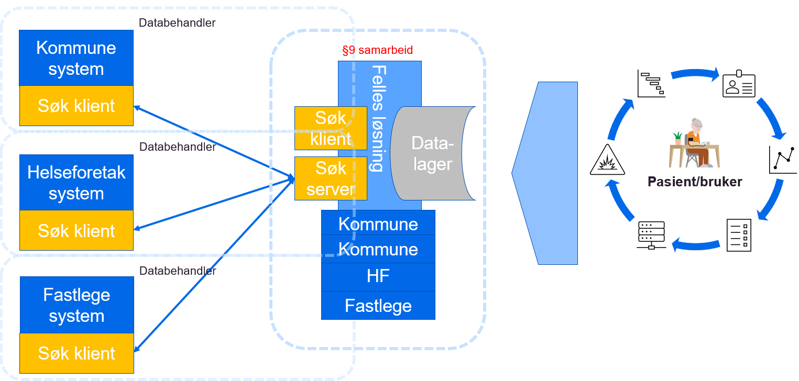
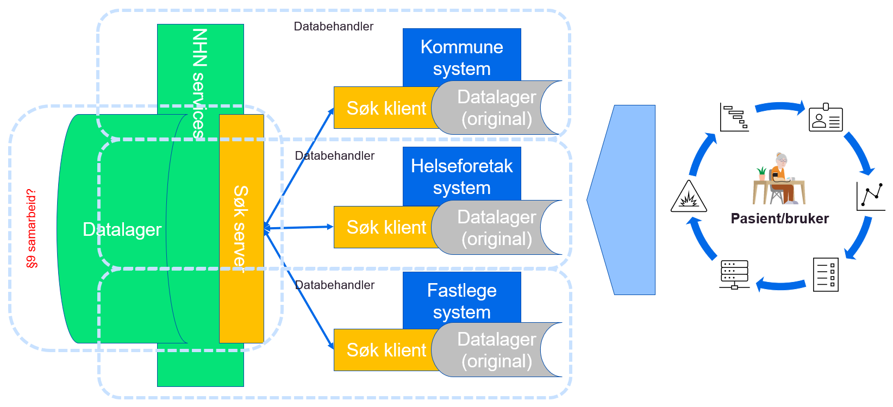
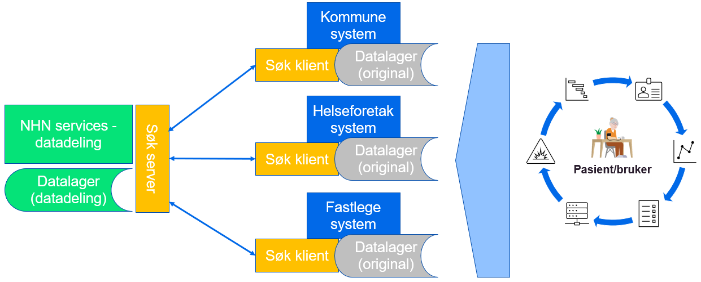
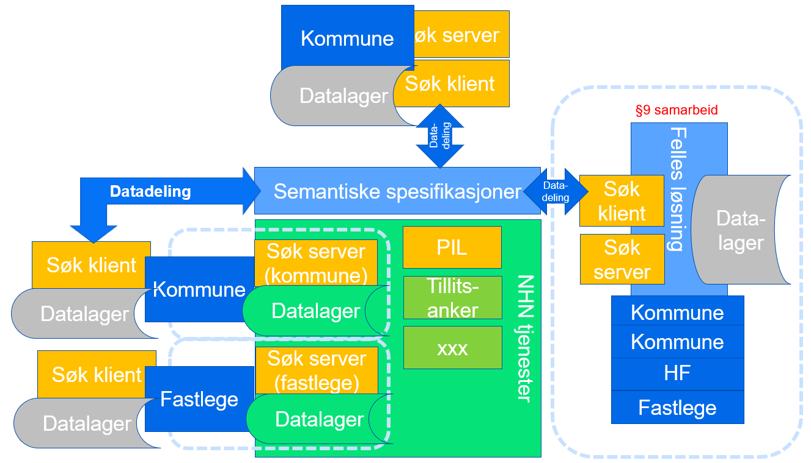

Work in progress 
{: .label .label-yellow }

| Status | Version | Maturity | Normative level |
|:-------------|:------------------|:------|:-------|
| Work in progress | v0.5 | review  | ikke normert |

Formålet med denne delen av målarkitekturen er å vise hvordan målarkitekturen kan benyttes for å beskrive løsningskonsepter for realisering av datadeling innen DHO. Det er da fokus på å dokumentere samhandlingsmønstre og nødvendige tjenester og komponenter som må etableres i virksomhetene for å svare ut konkrete behov knyttet til DHO.

## Vurderingskriterier

Konseptene vurderes i det videre etter en rekke kriterier:

*   Behovsoppnåelse, her skiller vi på identifiserte kortsiktige behov og langsiktige behov for samhandling
*   Skalerbarhet, her skiller vi på skalering for utprøvingen og skalering nasjonalt
    *   Muligheter for gjenbruk av eksisterende felleskomponenter eller koder/spesifikasjoner på tvers av virksomheter
*   Fleksibilitet og innovasjonskraft, løsninger med stor fleksibilitet i forhold til å dekke lokale behov vil ofte understøtte innovasjon på en bedre måte
*   Juridisk kompleksitet, kan hele eller deler av konseptet realiseres basert på gjeldende rett eller krever det lov/forskriftsarbeid for å realisere eller skalere
*   Kompleksitet i etablering og vedlikehold av løsningen
    *   Etableres det løse eller sterke koblinger mellom aktører og løsningskomponenter for å realisere løsningen
    *   Etableres det mange spesialløsninger for å oppnå samhandling pådrar sektoren seg også stor teknisk gjeld

## Overordnede løsningskonsepter

### **Distribuerte datadelingsløsninger (i virksomhetenes infrastruktur)**

Ved etablering av distribuerte datadelingsløsninger i virksomhetenes egne infrastruktur etablerer man løsninger for distribuerte søk på tvers av virksomhetene. Det er viktig at alle løsningene tar utgangspunkt i den samme semantiske spesifikasjonen slik at det blir enkelt å søke i informasjon fra forskjellige virksomheter, løsninger og levert av mange leverandører. Ved en slik tilnærming trenger man i tillegg til PIL også en solid sentralisert tillitsmodell, ellers må man etablere bilaterale avtaler mellom alle aktørene som ønsker å samhandle med hverandre.

#### Forutsetninger

*   For at konseptet skal skalere nasjonalt/regionalt må det etableres Pasientinformasjonslokalisator (PIL) i nasjonal eller regional infrastruktur
*   Konseptet forutsetter etablering av tillitsanker funksjonalitet i felles infrastruktur
*   Alle produsenter av informasjon må etablere funksjonalitet for tilgjengeliggjøring i egen infrastruktur
*   Alle konsumenter av informasjon må etablere søkefunksjonalitet i egen infrastruktur
*   Konseptet forutsetter at det etableres felles semantiske spesifikasjoner for søk og oppslag av informasjonen som skal utveksles

#### Fordeler

*   Distribuert datadeling kan gjennomføres innenfor gjeldende rett (unntatt PIL)
*   Fleksibilitet i forhold til hvilken funksjonalitet virksomhetene realiserer (virksomhetene realiserer funksjonalitet som gir mest nytte)
    *   Kan gjøre det enklere å få til lokal tjenesteinnovasjon
*   Felles semantiske spesifikasjoner som alle forholder seg til
*   Selve samhandlingsmodellen er avklart juridisk, men det kreves avtaler mellom aktørene og/eller felles tillitsmodell for å realisere samhandlingen

#### Ulemper

*   Det er komplisert å etablere infrastruktur for tilgjengeliggjøring hos alle virksomheter som skal tilby søk
    *   Konseptet blir derfor utfordrende å skalere fort
*   Oppslag mot mange kilder kan gi dårlig brukeropplevelse
*   Det er ikke hjemmel for etablering av PIL i dagens regelverk
*   Det kan være utfordrende å utarbeide felles semantiske spesifikasjoner som gir god nok nytte for virksomhetene
*   Etablering av tillitsanker og felles krav knyttet til dette kan være komplisert

### Distribuerte datadelingsløsninger (i sentral infrastruktur)

Datadelingsløsninger i regional infrastruktur gjør det mulig å etablere datadelingsløsningene fra flere virksomheter i den samme tekniske infrastrukturen og basere seg på den samme kildekoden som basis for datadelingsløsningene. Informasjonen fra hver enkelt dataansvarlig virksomhet lagres imidlertid logisk adskilt og reguleres av en databehandleravtale mellom virksomheten og tilbyderen av tjenesten. Fordelen med en slik tilnærming er at man kan gjenbruke kode og infrastruktur, på tvers av virksomheter, for å etablere mange datadelingstjenester med like grensesnitt. Gjenbruk av kode og kompetanse vil gjøre det raskere å skalere samt at man får stordriftsfordeler knyttet til drift og vedlikehold av tjenestene. Hvis denne tilnærmingen skal fungere for mange aktører kreves det at man benytter en PIL komponent i sentral infrastruktur (pasientinformasjons lokalisator) siden man i praksis må etablere støtte for distribuerte søk på tvers av virksomheter.

#### Forutsetninger

*   Datalagrene som etableres i felles infrastruktur må være logisk adskilte
*   For at konseptet skal skalere nasjonalt/regionalt må det etableres Pasientinformasjonslokalisator (PIL) i nasjonal eller regional infrastruktur
*   Konseptet forutsetter etablering av tillitsanker funksjonalitet i felles infrastruktur (kan implementeres som en del av databehandleravtalene)
*   Funksjonalitet for tilgjengeliggjøring etableres i felles infrastruktur
*   Alle konsumenter av informasjon må etablere søkefunksjonalitet i egen infrastruktur
*   Konseptet forutsetter at det etableres felles semantiske spesifikasjoner for søk og oppslag av informasjonen som skal utveksles

#### Fordeler

* Fordeler som med distribuerte datadelingsløsninger (i virksomhetenes infrastruktur)
* I tillegg gir modellen mulighet for å gjenbruke funksjonalitet på tvers av virksomheter
* Det er større potensiale for gjenbruk av kode på tvers av virksomhetene og derfor enklere å skalere raskt
* Kan gjøre det enklere å realisere PIL
* Det kan være enklere å implementere felles tillitsmodell som en del av databehandleravtalene

#### Ulemper

* Ulemper som for distribuerte datadelingsløsninger (i virksomhetenes infrastruktur)
* Alle virksomhetene må implementere synkronisering av egne data mot datalager i sentral infrastruktur
* Med en sentral leverandør av søkefunksjonalitet er det en risiko for at den sentrale leverandøren kan bli en flaskehals og dermed gi dårligere rammer for lokal innovasjon
* Det er uavklart juridisk om 3.parts leverandør kan håndtere søkefunksjonalitet (med lagring) for virksomhetene

### Regionale fellesløsninger

Ved etablering av sentral regional løsninger, for eksempel for DHO, baserer vi oss på at informasjonen som skal tilgjengeliggjøres mellom virksomhetene lagres i sentral infrastruktur i fellesløsningen. Fellesløsningen kommer istedenfor andre systemer i virksomheten og informasjonen lagres i utgangspunktet bare i fellesløsningen. Andre systemer som er knyttet til andre deler av virksomhetene kan søke i den felles regionale løsningen etter informasjon de trenger ved oppfølging av pasienten. Det samme gjelder andre aktører som har behov for å samarbeide med virksomhetene som er omfattet av fellesløsningen.

#### Forutsetninger

*   Funksjonalitet for tilgjengeliggjøring etableres i fellesløsningen
*   Funksjonalitet og datalager i fellesløsningen kommer istedenfor eksisterende datalager og funksjonalitet i virksomhetenes egne systemer
    *   Fellesløsningen etableres for å oppfylle dokumentasjonsplikten
*   For at konseptet skal skalere nasjonalt/regionalt må det etableres Pasientinformasjonslokalisator (PIL) i nasjonal eller regional infrastruktur
*   Konseptet forutsetter etablering av tillitsanker funksjonalitet i felles infrastruktur
    *   Gjelder bare ved kommunikasjon mot virksomheter som ikke er en del av samarbeidet
*   Alle konsumenter av informasjon må etablere søkefunksjonalitet i egen infrastruktur
*   Konseptet forutsetter at det etableres felles semantiske spesifikasjoner for søk og oppslag av informasjonen som skal utveksles
    *   De semantiske spesifikasjonene kan være regionale eller bygge på nasjonale spesifikasjoner

#### Fordeler

*   Stort potensiale for gjenbruk av funksjonalitet på tvers av virksomheter
    *   Enklere å skalere siden tilgjengeliggjøring gjennomføres regionalt
*   Stort potensiale for regional innovasjon og tjenesteutvikling
*   Middels fleksibilitet knyttet til lokal innovasjon og tjenesteutvikling
*   Innenfor regionen er det liten risiko for dårlig brukeropplevelse knyttet til søk, siden tilgjengeliggjøringen er sentralisert i regionen
*   Denne bruken av §9 er avklart og fellesløsningen blir å regne som èn aktør knyttet til samhandling med eventuelle eksterne aktører utenfor samarbeidet

#### Ulemper

*   Den sentrale leverandøren av fellesløsningen kan bli en flaskehals
*   Virksomheter utenfor regionen vil ha større risiko for lav ytelse ved oppslag mot mange virksomheter/regionale systemer

### Regionale datadelingsløsninger med lagring

Ved etablering av sentral regional datadelingsløsning baserer vi oss på at informasjonen som skal tilgjengeliggjøres mellom virksomhetene lagres i sentral infrastruktur hos NHN (eller annen leverandør) samtidig som den eksisterer i relevante fagsystem hos den enkelte virksomheten. Virksomhetene som deltar i det regionale samarbeidet kan søke i den felles regionale tjenesten som tilbys og driftes av NHN. Det kan også opprettes søk mot den regionale løsningen for virksomheter som ikke er en del av det regionale samarbeidet.

#### Forutsetninger

*   Funksjonalitet for tilgjengeliggjøring (inkludert lagring) etableres i fellesløsningen (likt som regional fellesløsning)
*   Funksjonalitet og datalager i fellesløsningen kommer i tillegg til eksisterende datalager og funksjonalitet i virksomhetenes egne systemer
    *   Fellesløsningen etableres ikke for å oppfylle dokumentasjonsplikten, men for å tilgjengeliggjøre informasjon på tvers
    *   Dette skiller konseptet fra regional fellesløsning
*   For at konseptet skal skalere nasjonalt må det etableres Pasientinformasjonslokalisator (PIL) i nasjonal infrastruktur
    *   Den regionale samhandlingen forutsettes løst i regionen
*   Alle konsumenter av informasjon må etablere søkefunksjonalitet i egen infrastruktur
*   Konseptet forutsetter at det etableres felles semantiske spesifikasjoner for søk og oppslag av informasjonen som skal utveksles
    *   De semantiske spesifikasjonene kan være regionale eller bygge på nasjonale spesifikasjoner

#### Fordeler

*   Konseptet understøtter behovet for regional datadeling på en god måte
*   Det er stort potensiale for gjenbruk av kode og løsninger på tvers av virksomhetene i regionen
*   Stort potensiale for regional innovasjon og tjenesteutvikling
*   Middels fleksibilitet knyttet til lokal innovasjon og tjenesteutvikling
*   Innenfor regionen er det liten risiko for dårlig brukeropplevelse knyttet til søk, siden tilgjengeliggjøringen er sentralisert i regionen

#### Ulemper

* Foreløpige juridiske vurderinger tyder på at §9 ikke kan benyttes til å etablere felles regionale løsninger hvor hovedformålet er datadeling
* Alle virksomhetene må implementere synkronisering av egne data mot datalager i sentral infrastruktur

### Nasjonal sentral datadelingsløsning med lagring

Ved etablering av en nasjonal sentral datadelingsløsning baserer vi oss på at informasjonen som skal tilgjengeliggjøres mellom virksomhetene lagres i sentral infrastruktur hos NHN, samtidig som den eksisterer i relevante fagsystemer hos den enkelte virksomheten som samler den inn fra pasienten. Virksomhetene kan da gjennomføre søk mot en felles nasjonal tjeneste som tilbys og driftes av NHN.

#### Forutsetninger

*   Funksjonalitet for tilgjengeliggjøring (inkludert lagring) etableres i nasjonal datadelingsløsning
*   Funksjonalitet og datalager i sentral datadelingsløsning kommer i tillegg til eksisterende datalager og funksjonalitet i virksomhetenes egne systemer
    *   Sentral datadelingsløsning etableres ikke for å oppfylle dokumentasjonsplikten, men for å tilgjengeliggjøre informasjon på tvers
    *   Dette skiller konseptet fra regional fellesløsning og regional datadelingsløsning
*   Alle konsumenter av informasjon må etablere søkefunksjonalitet i egen infrastruktur
*   felles semantiske spesifikasjoner for søk og oppslag av informasjonen etableres gjennom den nasjonale datadelings løsningen

#### Fordeler

*   Konseptet understøtter behovet for nasjonal datadeling på en god måte
*   Det er stort potensiale for gjenbruk av kode og løsninger på tvers av virksomhetene
*   Kan gi best ytelse siden det er bare en tjeneste som skal optimalsieres

#### Ulemper

* Det er ikke mulig å hjemle opprettelsen av nasjonal datadelingsløsning i gjeldende lover og regler
* Det er vanskelig å argumentere for regelverksutvikling for en slik løsning siden hoveddelen av samhandlingen antakelig vil foregå regionalt 
   * Informasjonen som skal lagres i registeret er ikke sammenfallende med eksisterende nasjonale løsninger som kjernejournal eller e-resept. Det er derfor ikke mulig å benytte noen av disse forordningene som rettslig grunnlag for et nasjonalt register for datadeling innen DHO. Det er heller ikke snakk om å erstatte lokale løsninger med sentrale, men å etablere nasjonale løsninger som kommer i tillegg til de lokale med hovedfokus på å etablere bedre samhandlingsløsninger mellom virksomhetene.
* Kan gi mindre fleksibilitet og mulighet for tjenesteinnovasjon siden den nasjonale datadelingen håndtere av en løsning og en leverandør
* Alle virksomhetene må implementere synkronisering av egne data mot sentalt datalager

### Alternativ full fleks

Kombinasjon av §9 og distribuert implementasjon av datadeling mellom virksomhetene. Konseptet tilrettelegger for samhandling mellom flere plattformer (regionale) i form av distribuerte søk mellom plattformene. Stor fleksibilitet for virksomhetene som skal etablere løsninger i forhold til hvordan samhandlingen etableres, men konseptet stiller større krav til løsninger i felles infrastruktur som skal understøtte samhandlingen mellom virksomhetene.

#### Fordeler  
*   Fleksibel løsning
*   I tråd med målarkitektur for datadeling
*   Kan realiseres innenfor gjeldende rett

#### Ulemper  
*   Mangler retning
*   Tillitsanker finnes ikke
*   PIL finnes ikke

#### Muligheter  
*   Kan gjennomføres med begrensede investeringer (for et lite antall virksomheter)

#### Trusler  
*   Skalering krever utvikling av felleskomponenter
*   Usikkert om PIL kan realiseres innen gjeldende rett
*   Det eksisterer ikke avklart finansieringsmodell for nye felleskomponenter i felles infrastruktur