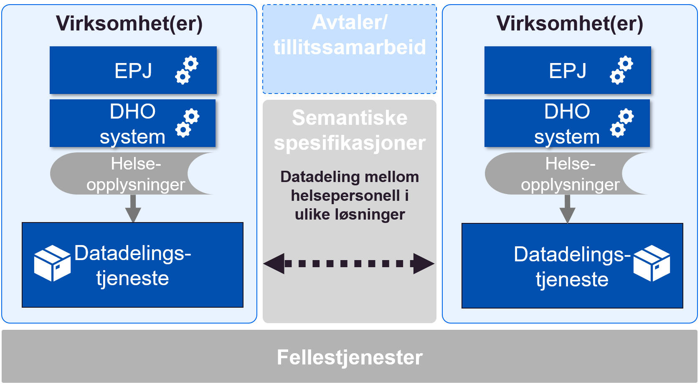
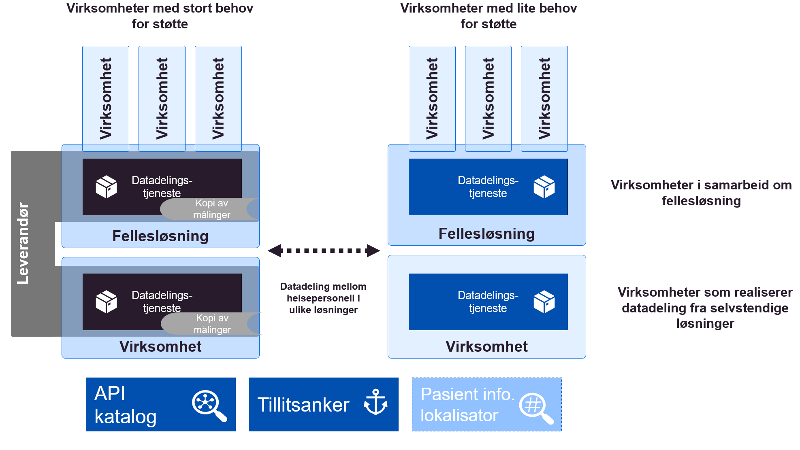

| Status | Version | Maturity | Normative level |
|:-------------|:------------------|:------|:-------|
| Work in progress | v0.8 | review  | ikke normert |

Formålet med denne delen av målarkitekturen er å vise ulike mønster/ konsepter for hvordan datadeling mellom virksomheter kan realiseres, og vurdere disse konseptene opp mot hverandre. Det er hovedfokus på etableringen av funksjonalitet for å avgi og tilgjengeliggjøre informasjon siden denne delen av datadelingsløsningen regnes som mest kompleks å etablere og vedlikeholde.  

!!! note

    Ved etablering av løsninger for datadeling skilles det mellom funksjonalitet for å avgi data (datatilbyder) og funksjonalitet for å slå opp i data (datakonsument). Funksjonaliteten for å avgi data regnes som mer komplisert å etablere og vedlikeholde enn oppslagsfunksjonaliteten siden det er høye krav til ytelse og tilgjengelighet knyttet til å avgi data ved datadeling. Datadelingsløsninger omtales som synkrone og det forventes at svaret på ett oppslag skjer umiddelbart (iløpet av noen millsekunder). Etableringen av funksjonalitet for oppslag er ikke like komplisert, selv om integrasjon mot eksisterende tekniske løsninger i egen virksomhet kan være utfordrende.  

    Mer om samhandlingsformen [slå opp](organisatorisk-sla-opp.md)

## Vurderingskriterier

Konseptene for etablering av funksjonalitet for datatilbyder (avgi og tilgjengeliggjøre) vurderes etter følgende kriterier:

* Behovsoppnåelse, her skiller vi på identifiserte kortsiktige behov og langsiktige behov for samhandling innen DHO
* Skalerbarhet, her skiller vi på skalering for utprøvingen og skalering nasjonalt
  * Muligheter for gjenbruk av eksisterende felleskomponenter eller kode/spesifikasjoner på tvers av virksomheter
* Fleksibilitet og innovasjonskraft, løsninger med stor fleksibilitet i forhold til å dekke lokale behov kan understøtte lokal innovasjon
* Juridisk risiko, kan hele eller deler av konseptet realiseres innenfor gjeldende rett eller krever det lov/forskriftsarbeid for å realisere eller skalere
* Kompleksitet i etablering og vedlikehold av løsningen
  * Etableres det løse eller sterke koblinger mellom aktører og løsningskomponenter for å realisere løsningen
  * Etableres det mange kompliserte spesialløsninger for å oppnå samhandling pådrar sektoren seg stor teknisk gjeld
* Bruk av standarder og hyllevare, er det mulig å basere seg på standardiserte grensesnitt og tilgjengelig hyllevare i stor eller liten grad

## Overordnede løsningskonsepter

### Distribuerte datadelingsløsninger (i virksomhetenes infrastruktur)

Distribuerte datadelingsløsninger i virksomhetenes infrastruktur baserer seg på at hver enkelt virksomhet etablerer sin egen løsning for å avgi informasjon fra sine systemer. Grensesnitt og datalager for datadeling etableres i virksomhetens egen infrastruktur. Datadelingen mellom virksomhetene gjennomføres ved at hver virksomhet gjør distribuerte oppslag mot grensesnittene for å avgi data som er etablert av andre virksomhetene.

#### Vurdering

Alle løsninger for å avgi informasjon må ta utgangspunkt i felles semantiske spesifikasjoner tilpasset ulike bruksområder, slik at det blir enkelt å søke i informasjon på tvers av mange ulike virksomheter og løsninger som er levert av flere ulike leverandører. Med en distribuert modell må virksomhetene også vite hvor de skal søke etter informasjon om en bestemt pasient gjennom en pasientinformasjonslokalisator (PIL) siden det er lite effektivt å gjøre oppslag mot alle virksomheter uavhengig av om disse har informasjon om pasienten eller ikke. Det må etableres en sentralisert tillitsmodell for å støtte dette konseptet, ellers må man etablere bilaterale avtaler mellom alle aktørene som ønsker å samhandle med hverandre. Hovedfordelen med konseptet distribuerte datadelingsløsninger er stor fleksibilitet knyttet til hvem som etablerer hvilken funksjonalitet der det gir stor opplevd nytte <!-- er det hver enkelt virksomhets valg av funksjonalitet basert på den nytten de anser som størst?-->. Den største ulempen er knyttet til stor kompleksitet ved  etableringen og vedlikehold av funksjonaliteten <!--er dette rettet mot tillitsmodellen?--> for å avgi og tilgjengeliggjøre informasjon fra en rekke virksomheter, dette gjør en slik løsning komplisert å bredde og vedlikeholde.

#### Forutsetninger

* Alle produsenter <!--hvem er produsent? virksomhet? utstyr? system?--> av informasjon må etablere funksjonalitet for å avgi informasjon, funksjonaliteten må etableres i egne systemer i virksomhetens infrastruktur
* Alle konsumenter av informasjon må etablere funksjonalitet for å gjøre oppslag, og funksjonaliteten må etableres i egne systemer i virksomhetens infrastruktur
* For at konseptet skal skalere nasjonalt/regionalt må det etableres Pasientinformasjonslokalisator (PIL) i nasjonal eller regional infrastruktur
* Konseptet forutsetter etablering av tillitsanker funksjonalitet i nasjonal eller regional infrastruktur
* Konseptet forutsetter at det etableres felles semantiske spesifikasjoner for informasjonen som skal utveksles
<!--Kunne vurdering og forutsetninger beskrivelsene slås sammen og bygge på den punktvises tilnærminmgen. Vurderingene kommer vel med beskrivelse av fordeler og ulemper?-->

#### Fordeler

* Distribuert datadeling kan etableres innenfor gjeldende rett (med forbehold om realisering av PIL)
* Det er stor fleksibilitet i forhold til hvilken funksjonalitet virksomhetene realiserer
  * Virksomhetene realiserer funksjonalitet som gir mest nytte lokalt/regionalt
  * Kan gjøre det enklere å få til lokal tjenesteinnovasjon
* Det etableres felles <!--nasjonale?--> semantiske spesifikasjoner som alle virksomheter forholder seg til

#### Ulemper

* Det er komplisert <!--og lite effektivt? --> å etablere og vedlikeholde infrastruktur og løsninger for å avgi data i alle virksomheter i helsesektoren
  * Konseptet blir derfor utfordrende å skalere fort
* Det etableres mange sterke koblinger mellom virksomhetenes løsninger
  * Oppslag mot mange kilder kan gi dårlig brukeropplevelse
* Det er ikke hjemmel for å etablere en sentralisert modell for PIL innenfor dagens regelverk
* Det kan være utfordrende å utarbeide felles semantiske spesifikasjoner som gir nytte for virksomhetene
  * Virksomheter som ikke opplever nytte kan velge å ikke tilgjengeliggjøre informasjon fra egne løsninger
* Etablering av tillitsanker og felles krav knyttet til dette kan være komplisert

### Distribuerte datadelingsløsninger (i sentral infrastruktur)

Konseptet baserer seg (som ren distribuert modell) på at hver enkelt virksomhet etablerer sin egen løsning for å avgi informasjon fra sine systemer, men istedenfor å etablere dette i egen infrastruktur etableres selve grensesnittet og datalager for datadeling i en felles infrastruktur. Det betyr at grensesnittet driftes og vedlikeholdes av en eller noen få leverandør(er). Datadelingen mellom virksomhetene gjennomføres ved at hver virksomhet gjør distribuerte oppslag mot grensesnittene for å avgi data, som er etablert av de andre virksomhetene. Det er en forutsetning <!--for konseptet? juridisk?--> at informasjonen fra hver virksomhet ikke sammenstilles med informasjon fra andre virksomheter i den sentrale infrastrukturen, men at løsningene for lagring og grensesnittene etableres som logisk adskilte løsninger for hver virksomhet. Behandlingen av helseopplysninger i sentral infrastruktur må reguleres av en databehandleravtale mellom den enkelte virksomheten og leverandøren av infrastrukturen.

#### Vurdering

Alle løsninger for å avgi informasjon må ta utgangspunkt i felles semantiske spesifikasjoner tilpasset ulike bruksområder, slik at det blir enkelt å søke i informasjon på tvers av mange ulike virksomheter og løsninger, dette kan bli noe enklere siden løsningene etableres av en leverandør. Med en distribuert modell må man også vite hvor man skal søke etter informasjon om en bestemt pasient gjennom en pasientinformasjonslokalisator (PIL) siden det er lite effektivt å gjøre oppslag mot alle virksomheter uavhengig av om disse har informasjon om pasienten eller ikke. Det må etableres en sentralisert tillitsmodell, ellers må man etablere bilaterale avtaler mellom alle aktørene som ønsker å samhandle med hverandre. Hovedfordelen med distribuerte datadelingsløsninger er stor fleksibilitet knyttet til hvem som etablerer hvilken funksjonalitet der det gir stor opplevd nytte. Når løsningene etableres i felles infrastruktur ved hjelp av en felles leverandør vil denne fordelen forsvinne helt eller delvis. Den største ulempen knyttet til høy kompleksitet ved etableringen og vedlikehold av funksjonaliteten for å avgi og tilgjengeliggjøre informasjon fra en rekke virksomheter blir imidlertid helt eller delvis borte siden utvikling og drift sentraliseres.

#### Forutsetninger

* Datalagrene som etableres i felles infrastruktur må være logisk adskilte
* Datatilbydere må etablere funksjonalitet for å avgi data, funksjonaliteten etableres i felles infrastruktur
* Det må etableres databehandleravtale mellom virksomhetene som benytter sentral infrastruktur for å etablere grensesnitt og lagring av helseopplysninger
* For at konseptet skal skalere nasjonalt/regionalt må det etableres Pasientinformasjonslokalisator (PIL) i nasjonal eller regional infrastruktur
* Konseptet forutsetter etablering av tillitsanker funksjonalitet i felles infrastruktur (kan implementeres som en del av databehandleravtalene)
* Alle konsumenter av informasjon må etablere søkefunksjonalitet i egen infrastruktur
* Konseptet forutsetter at det etableres felles semantiske spesifikasjoner for oppslag i informasjonen som skal utveksles

#### Fordeler

* Fordeler som med distribuerte datadelingsløsninger (i virksomhetenes infrastruktur)
  * **Unntatt** Fleksibiliteten knyttet til hvilken funksjonalitet som etableres i hvilke virksomheter når forsvinner helt eller delvis siden det er en leverandør som tilbyr grensesnitt for å avgi data
* Konseptet gir mulighet for å gjenbruke funksjonalitet på tvers av virksomheter
  * Det er stort potensiale for gjenbruk av kode på tvers av virksomhetene og derfor enklere å skalere raskt
* Det vil være enklere å realisere PIL
* Det vil være enklere å implementere felles tillitsmodell som en del av databehandleravtalene

#### Ulemper

* Ulemper som for distribuerte datadelingsløsninger (i virksomhetenes infrastruktur)
  * **Unntatt** Det blir ikke like komplisert å etablere og vedlikeholde grensesnittene for å avgi data siden disse etableres i felles infrastruktur av en leverandør
* Alle datatilbydere må implementere synkronisering av egne data mot datalager i sentral infrastruktur
* Med en sentral leverandør av søkefunksjonalitet er det en risiko for at den sentrale leverandøren kan bli en flaskehals og dermed gi dårligere rammer for lokal innovasjon
* Det er foreløpig uavklart om 3.parts leverandør kan håndtere søkefunksjonalitet (med lagring) for virksomhetene innenfor gjeldende rett

### Regionale fellesløsninger

Ved etablering av regionale fellesløsninger, for eksempel for DHO, baserer vi oss på at informasjonen som skal deles med andre virksomhetene lagres i den regionale fellesløsningen og at løsningen for å avgi informasjon etableres i den regionale fellesløsningen. Bruk av en fellesløsning vil gi samarbeidende virksomhetene mulighet til å se informasjonen om pasienten på tvers av virksomhetene som er med på samarbeidet, samarbeid mellom virksomhetene innenfor samarbeidsområdet vil derfor løses direkte i fellesløsningen.

Grensesnittet for datadeling som etableres i fellesløsningen benyttes hovedsaklig for samhandlingen med virksomheter som står utenfor samarbeidet og eventuelt andre systemer (*) i de samarbeidende virksomhetene (som ivaretar dokumentasjonsbehov som ikke er dekket av fellesløsningen). En viktig forutsetning for å etablere samarbeidsløsning er at funksjonalitet som etableres i fellesløsningen kommer istedenfor funksjoner i andre systemer i virksomheten og at informasjonen bare lagres i fellesløsningen.

#### Vurdering

Virksomhetene som samarbeider om en fellesløsning vil ha mindre behov for bruk av datadeling innenfor sitt samarbeidsområde, siden klinikerne kan vise relevant informasjon direkte i fellesløsningen. Løsning for å avgi data vil derfor i hovedsak benyttes for å ivareta datadeling med virksomheter som står utenfor samarbeidet regionalt eller være knyttet til nasjonal samhandling om pasienten. I tillegg gir et samarbeid om en fellesløsning mulighet for å gjenbruke løsning for å avgi data på tvers av flere virksomheter samtidig som man oppnår fleksibilitet knyttet til regional innovasjon innenfor fellesløsningen.

<!--fortsett-->

#### Forutsetninger

* Funksjonalitet for å avgi informasjon etableres i fellesløsningen
* Funksjonalitet og datalager i fellesløsningen kommer istedenfor eksisterende datalager og funksjonalitet i virksomhetenes egne systemer
  * Fellesløsningen etableres for å oppfylle dokumentasjonsplikten
* For at konseptet skal skalere nasjonalt/regionalt må det etableres Pasientinformasjonslokalisator (PIL) i nasjonal eller regional infrastruktur
* Konseptet forutsetter etablering av tillitsanker funksjonalitet i felles infrastruktur
  * Gjelder bare ved kommunikasjon mot virksomheter som ikke er en del av samarbeidet
* Alle konsumenter av informasjon, utenfor samarbeidet, må etablere søkefunksjonalitet i egen infrastruktur
* Konseptet forutsetter at det etableres felles semantiske spesifikasjoner for oppslag i informasjonen som skal utveksles 
  * Med virksomheter utenfor samarbeidet om fellesløsningen
  * Med andre løsninger i virksomhetene som ikke er omfattet av samarbeidet om fellesløsning

#### Fordeler

* Etableringen av en fellesløsningen kan i seg selv løse mange behov for digital samhandling mellom virksomhetene innenfor samarbeidet
  * Stort potensiale for regional innovasjon og tjenesteutvikling
* Konseptet gir mulighet for å gjenbruke funksjonalitet for å avgi data på tvers av virksomhetene som benytter fellesløsningen
* Middels fleksibilitet knyttet til lokal innovasjon og tjenesteutvikling siden fellesløsningen må ta hensyn til behovene til alle virksomhetene i samarbeidet
* Denne bruken av §9 er avklart og fellesløsningen blir å regne som èn aktør knyttet til samhandling med eventuelle eksterne aktører utenfor samarbeidet

#### Ulemper

* Den sentrale leverandøren av fellesløsningen kan bli en flaskehals
* Det er komplisert å etablere en fellesløsning som gir stor verdi for alle virksomhetene i samarbeidet
  * Det er komplisert å etablere gode fellesløsninger for mange virksomheter
  * Utfordringer knyttet til etablering av avtaler, felles prosesser og felles infrastruktur

<!--fortsett-->

### Regionale datadelingsløsninger med lagring

Ved etablering av sentral regional datadelingsløsning baserer vi oss på at informasjonen som skal tilgjengeliggjøres mellom virksomhetene lagres i sentral infrastruktur hos NHN (eller annen leverandør) samtidig som den eksisterer i relevante fagsystem hos den enkelte virksomheten. Virksomhetene som deltar i det regionale samarbeidet kan søke i den felles regionale tjenesten som tilbys og driftes av NHN. Det kan også opprettes søk mot den regionale løsningen for virksomheter som ikke er en del av det regionale samarbeidet.

#### Forutsetninger

* Funksjonalitet for tilgjengeliggjøring (inkludert lagring) etableres i fellesløsningen (likt som regional fellesløsning)
* Funksjonalitet og datalager i fellesløsningen kommer i tillegg til eksisterende datalager og funksjonalitet i virksomhetenes egne systemer
  * Fellesløsningen etableres ikke for å oppfylle dokumentasjonsplikten, men for å tilgjengeliggjøre informasjon på tvers
  * Dette skiller konseptet fra regional fellesløsning
* For at konseptet skal skalere nasjonalt må det etableres Pasientinformasjonslokalisator (PIL) i nasjonal infrastruktur
  * Den regionale samhandlingen forutsettes løst i regionen
* Alle konsumenter av informasjon må etablere søkefunksjonalitet i egen infrastruktur
* Konseptet forutsetter at det etableres felles semantiske spesifikasjoner for søk og oppslag av informasjonen som skal utveksles
  * De semantiske spesifikasjonene kan være regionale eller bygge på nasjonale spesifikasjoner

#### Fordeler

* Konseptet understøtter behovet for regional datadeling på en god måte
* Det er stort potensiale for gjenbruk av kode og løsninger på tvers av virksomhetene i regionen
* Stort potensiale for regional innovasjon og tjenesteutvikling
* Middels fleksibilitet knyttet til lokal innovasjon og tjenesteutvikling
* Innenfor regionen er det liten risiko for dårlig brukeropplevelse knyttet til søk, siden tilgjengeliggjøringen er sentralisert i regionen

#### Ulemper

* Foreløpige juridiske vurderinger tyder på at §9 ikke kan benyttes til å etablere felles regionale løsninger hvor hovedformålet er datadeling
* Alle virksomhetene må implementere synkronisering av egne data mot datalager i sentral infrastruktur

### Nasjonal sentral datadelingsløsning med lagring

Ved etablering av en nasjonal sentral datadelingsløsning baserer vi oss på at informasjonen som skal tilgjengeliggjøres mellom virksomhetene lagres i sentral infrastruktur hos NHN, samtidig som den eksisterer i relevante fagsystemer hos den enkelte virksomheten som samler den inn fra pasienten. Virksomhetene kan da gjennomføre søk mot en felles nasjonal tjeneste som tilbys og driftes av NHN.

#### Forutsetninger

* Funksjonalitet for tilgjengeliggjøring (inkludert lagring) etableres i nasjonal datadelingsløsning
* Funksjonalitet og datalager i sentral datadelingsløsning kommer i tillegg til eksisterende datalager og funksjonalitet i virksomhetenes egne systemer
    * Sentral datadelingsløsning etableres ikke for å oppfylle dokumentasjonsplikten, men for å tilgjengeliggjøre informasjon på tvers
    * Dette skiller konseptet fra regional fellesløsning og regional datadelingsløsning
* Alle konsumenter av informasjon må etablere søkefunksjonalitet i egen infrastruktur
* felles semantiske spesifikasjoner for søk og oppslag av informasjonen etableres gjennom den nasjonale datadelings løsningen

#### Fordeler

* Konseptet understøtter behovet for nasjonal datadeling på en god måte
* Det er stort potensiale for gjenbruk av kode og løsninger på tvers av virksomhetene
* Kan gi best ytelse siden det er bare en tjeneste som skal optimalsieres

#### Ulemper

* Det er ikke mulig å hjemle opprettelsen av nasjonal datadelingsløsning i gjeldende lover og regler
* Det er vanskelig å argumentere for regelverksutvikling for en slik løsning siden hoveddelen av samhandlingen antakelig vil foregå regionalt 
   * Informasjonen som skal lagres i registeret er ikke sammenfallende med eksisterende nasjonale løsninger som kjernejournal eller e-resept. Det er derfor ikke mulig å benytte noen av disse forordningene som rettslig grunnlag for et nasjonalt register for datadeling innen DHO. Det er heller ikke snakk om å erstatte lokale løsninger med sentrale, men å etablere nasjonale løsninger som kommer i tillegg til de lokale med hovedfokus på å etablere bedre samhandlingsløsninger mellom virksomhetene.
* Kan gi mindre fleksibilitet og mulighet for tjenesteinnovasjon siden den nasjonale datadelingen håndtere av en løsning og en leverandør
* Alle virksomhetene må implementere synkronisering av egne data mot sentalt datalager

### Alternativ full fleks

Kombinasjon av §9 og distribuert implementasjon av datadeling mellom virksomhetene. Konseptet tilrettelegger for samhandling mellom flere plattformer (regionale) i form av distribuerte søk mellom plattformene. Stor fleksibilitet for virksomhetene som skal etablere løsninger i forhold til hvordan samhandlingen etableres, men konseptet stiller større krav til løsninger i felles infrastruktur som skal understøtte samhandlingen mellom virksomhetene.

#### Fordeler  
* Fleksibel løsning
* I tråd med målarkitektur for datadeling
* Kan realiseres innenfor gjeldende rett

#### Ulemper  
* Mangler retning
* Tillitsanker finnes ikke
* PIL finnes ikke

#### Muligheter  
* Kan gjennomføres med begrensede investeringer (for et lite antall virksomheter)

#### Trusler  
* Skalering krever utvikling av felleskomponenter
* Usikkert om PIL kan realiseres innen gjeldende rett
* Det eksisterer ikke avklart finansieringsmodell for nye felleskomponenter i felles infrastruktur