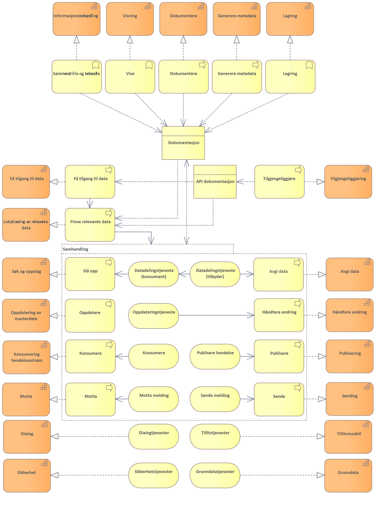
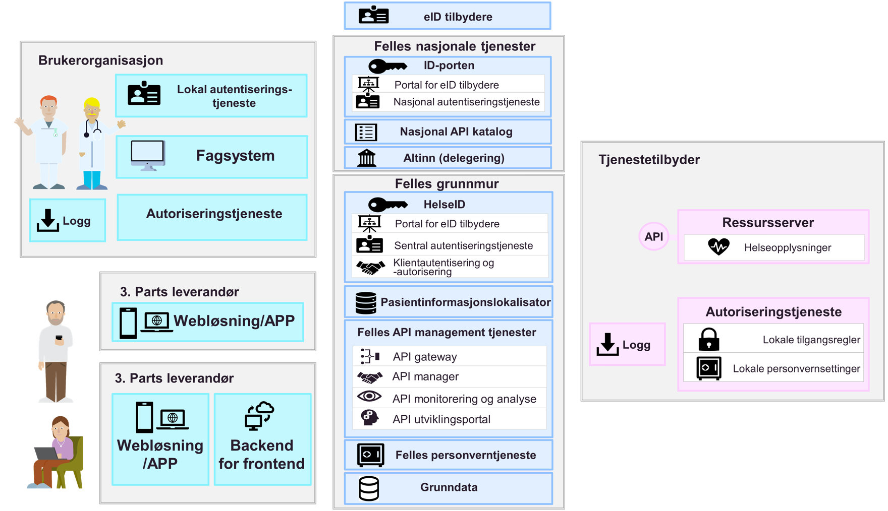
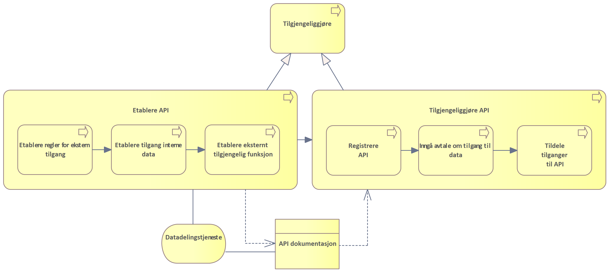
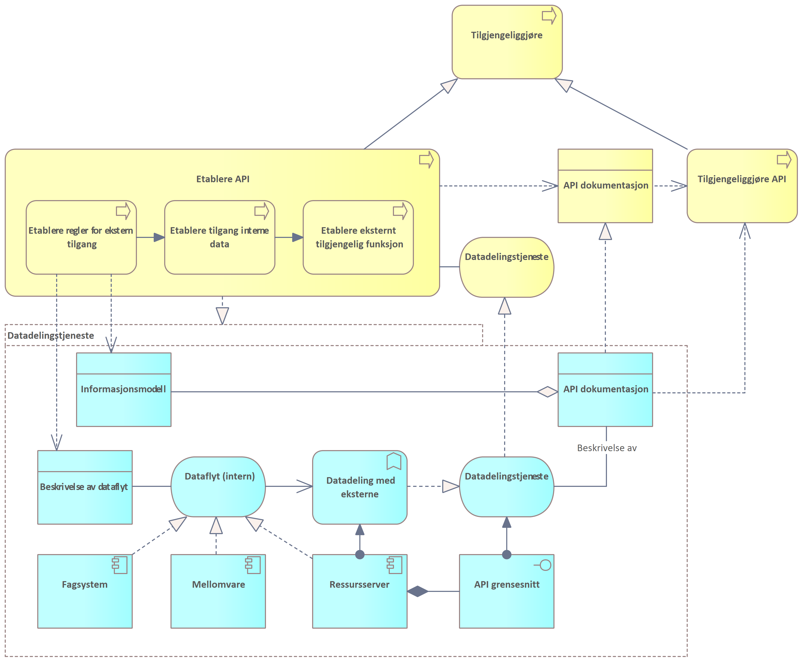
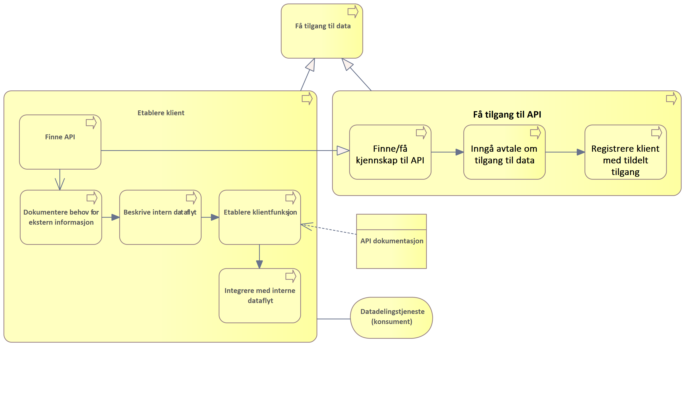
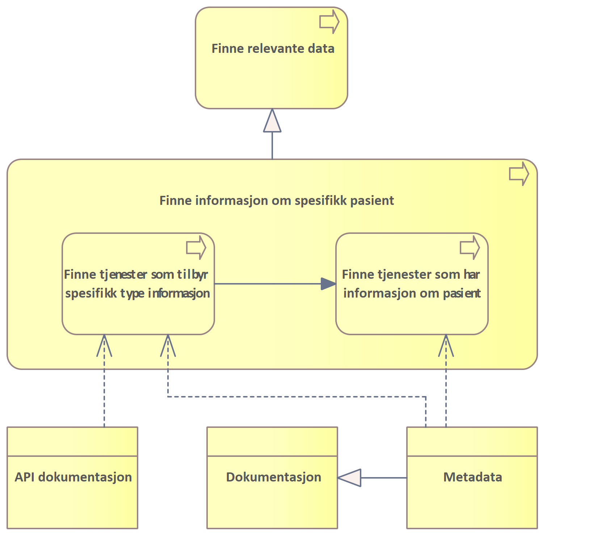
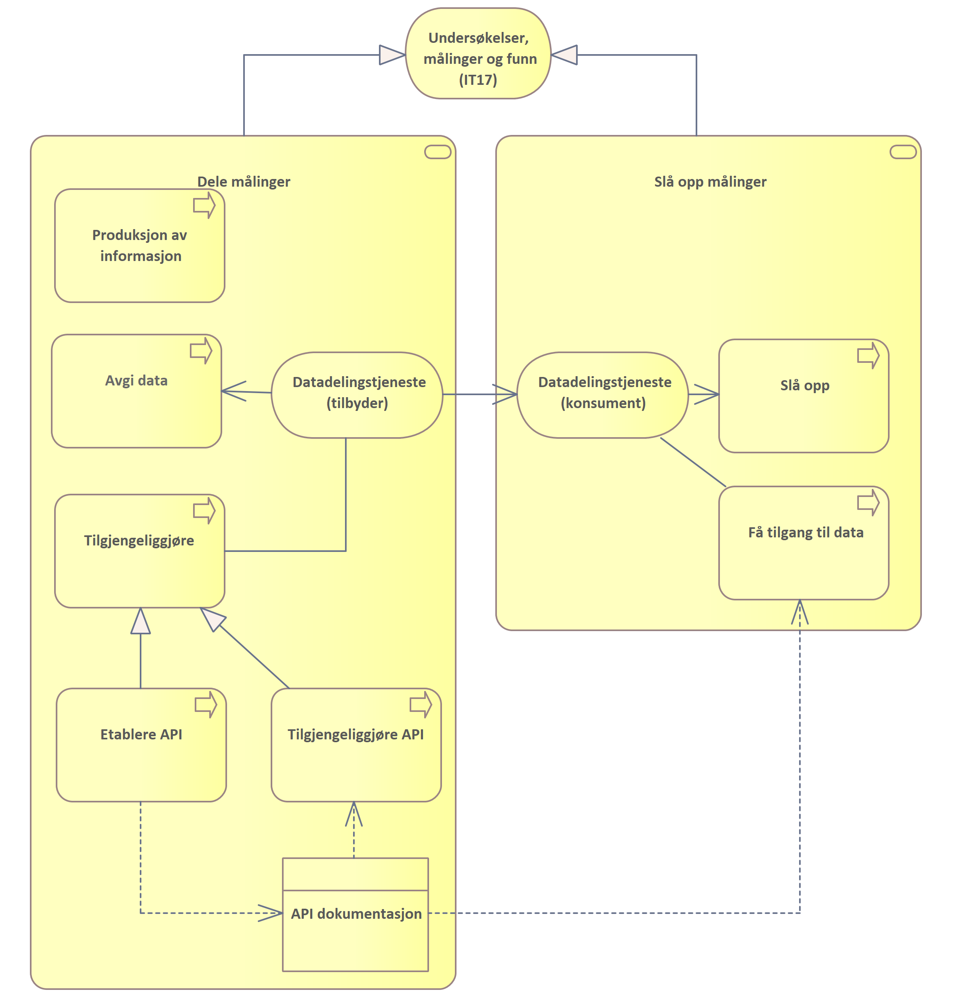

| Status | Version | Maturity | Normative level |
|:-------------|:------------------|:------|:-------|
| Work in progress | v0.8 | review  | ikke normert |

## Samhandling mellom helsepersonell på tvers av virksomheter

Direktoratet for e-helse publiserte i mars 2021 [Målarkitektur for datadeling](https://www.ehelse.no/standardisering/standarder/malarkitektur-for-datadeling-i-helse-og-omsorgssektoren/_/attachment/inline/a5a908cd-5054-4d21-8eaf-8b795dcb25ea:761793d5dd6b6a1f2b9dd334a44e3a754d5b88e6/M%C3%A5larkitektur%20for%20datadeling%20i%20helse-%20og%20omsorgssektoren%20(HITR%201231_2021).pdf) som tar frem fire ulike bruksområder for datadeling der "samhandling mellom helsepersonell på tvers av virksomheter" var et brukstilfelle. Dette brukstilfellet ble ikke behandlet i første versjon av målarkitekturen for datadeling, siden modenheten den gang var for lav og erfaringsgrunnlaget med denne bruken av datadelingsløsninger var begrenset.

Målarkitektur samhandling DHO har fokusert på brukstilfellet (samhandling mellom helsepersonell på tvers av virksomheter), og dette vil bli en del av den overordnede målarkitekturen for datadeling for helse- og omsorgssektoren. Brukstilfellet for deling på tvers av virksomheter uttrykkes slik i målarkitektur for datadeling:

!!! quote "Samhandling mellom helsepersonell på tvers av virksomheter"

    Dette brukstilfellet dekker brukstilfeller som i hovedsak dekker behovet for at helsepersonell i ulike virksomheter må samhandle for å yte best mulig helsehjelp.

    Virksomheter som yter helsehjelp har en plikt til å samarbeide om behandling og forebygging av sykdom hos innbyggere. Det ligger som en forutsetning for godt samarbeid at aktørene må samarbeide om behandlingsplaner og andre helseopplysninger. Samarbeidet kan inkludere deling av dokumentasjon ved hjelp av datadeling fra den ene virksomheten til den andre, og kan også inkludere digitalisert samarbeid om pasientforløp på tvers av virksomheter. For mer avanserte samarbeidsformer rundt en pasient vil ikke meldings- og dokumentutveksling være tilstrekkelig for å kunne lage fleksible og gode samarbeidsløsninger. Her vil samarbeidsprosesser og arenaer kreve datadeling der aktørene kan samarbeide om både strukturerte dokumenter og mindre informasjonselementer.

    Dette bruksområdet <!--peker bruksområde tilbake på målarkitetkuren) Spør fordi bruksområde og brukstilfelle ikke er begrep jeg vansligvis benytter-->må sees i sammenheng med de nasjonale tiltakene som for eksempel dokumentdeling via Kjernejournal, Akson journal og Helseplattformen som skal løse hoveddelen av behovet for samhandling ved å ha en felles journal. Disse tiltakene vil redusere antall løsninger som det må lages samhandlingsfunksjoner som benytter datadeling på tvers.
  
    Det er ulik tidshorisont på når disse løsningene er realisert og tatt i bruk. Det vil derfor være behov for å ta i bruk datadeling også frem til disse løsningene er realisert og tatt i bruk.  
    Behovsanalysen til konseptvalgutredningen for nasjonal journalløsning for kommunal helse og omsorgstjeneste beskriver [behovene for samhandling i detalj \[7\]](https://ehelse.no/strategi/akson/_/attachment/download/991f83c3-be61-4556-9df6-44e8430ecf8c:c10adb76b95e679fb5857fec60e5c57650ead80b/Vedlegg%20A%20Behovsanalyse%20Nasjonal%20l%C3%B8sning%20for%20kommunal%20helse-%20og%20omsorgstjeneste.pdf).
  
    Dette bruksområdet dekker samhandling gjennom datadeling mellom aktører i ulike helseregioner og mellom aktører i helseregioner og den kommunale helse- og omsorgstjenesten inkludert fastleger. Målarkitekturen for dette bruksområdet trenger mer arbeid og vi har valgt å ikke beskrive arkitekturen nærmere i denne versjonen av dokumentet." 

!!! info

    Innholdet i denne delen bygger direkte på eksisterende rammeverk beskrevet i [Målarkitektur for datadeling i helse og omsorgssektoren](https://www.ehelse.no/standardisering/standarder/malarkitektur-for-datadeling-i-helse-og-omsorgssektoren) og [Referansearkitektur for datadeling](https://www.ehelse.no/standardisering/standarder/referansearkitektur-for-datadeling). Kapitelet forutsetter kjennskap til de tekniske delene av disse arbeidene. Kapitelet egner seg hovedsaklig for arkitekter og tekniske personer som ønsker å forstå bakgrunnen for arkitekturvalgene som gjøres i målarkitekturen.

## Kapabilitetskart Konsumere (hendelser), Slå opp og Oppdatere

Modellen viser overordnet kapabilitetskart for prosessene Konsumere informasjon, Vurdere og gjennomføre tiltak, Produsere informasjon og Dele informasjon. Dette er prosesser som er knyttet til Konsumenter (og produsenter) som integrerer mot andre aktører sine tjenester for tilgang til informasjon eller som ønsker å oppdatere informasjon de har produsert i informasjonstjenester som tilbys av andre aktører. Vi har identifisert at det mest relevante samhandlingsmønsteret for informasjonsbehovene knyttet til DHO er "Slå opp", men gode alternativer kan være å konsumere hendelsesstrømmer. For å oppdatere felles informasjonstjenester (for eksempel felles behandlingsplan) vil "Oppdatere" best dekke behovet. For prosesser hvor det er behov for bestilling og henvisning til tjenester som tilbys av andre aktører vil imidlertid sende/motta være foretrukket samhandlingsform.

Det er identifisert noen grunnleggende kapabiliteter som må gå på tvers av de overbyggende, dette er dialog, sikkerhet og tillitsmodell.

Kjernekapabilitetene må være tett knyttet til og integrert med den kliniske prosessen som handler om å identifisere og gjennomføre tiltak som en del av pasientbehandlingen, men omfatter også produksjon av informasjon. Dette innebærer både selve dokumentasjonen av hva som gjennomføres, målinger og resultater. Det er også tatt med nødvendige kapabiliteter som handler om å generere metadata og lagring av dokumentasjonen i en egnet form for viderebehandling og deling.

### Kapabiliteter knyttet til tiltak og dokumentasjon

Evnene i denne tabellen er tett knyttet opp mot å understøtte vurdering og gjennomføring av tiltak og dokumentasjon av tiltak som utføres som en del av behandlingen av pasient.

| Kapabilitet | Definisjon |
|---|---|
| Informasjonsbehandling | Sammenstille og tolke informasjon fra interne og eksterne systemer |
| Dokumentere | Dokumentere gjennomførte tiltak og begrunnelsen for tiltaket |
| Lagring | Lagre informasjon (dokumentasjon og metadata) |

### Tverrgående kapabiliteter

Evnene i denne tabellen er ikke knyttet opp mot noen spesielle deler av prosessen, siden alle deler av prosessen har behov for disse.

| Kapabilitet | Definisjon |
|---|---|
| Dialog | Understøtte løpende dialog mellom helsepersonell |
| Delegere rettigheter | Evnen til å delegere rettigheter til databehandler som utfører oppgaver på vegne av dataansvarlig. |
| Klargjøre for sende og motta | Klargjøre for utveksling av informasjon ved hjelp av meldinger (sende og motta fra/til spesifikk mottaker) |

### Kapabiliteter knyttet til samhandling

Evnene er knyttet til bruk av organisatoriske samhandlingsformer for å utveksle informasjon mellom aktører.

| Kapabilitet | Definisjon |
|---|---|
| Visning | Vise informasjonen på en måte som er nyttig for kliniker |
| Konsumere hendelsesstrøm | Konsumere hendelser fra en hendelsesstrøm |
| Publisere (hendelser) | Publisere hendelser til en hendelsesstrøm |
| Innhente data | Søke og slå opp informasjon gjennom en datadelingstjeneste |
| Tilgjengeliggjøre data | Evnen til å gjøre data tilgjengelig for aktører utenfor egen virksomhet med eller uten krav til innlogget bruker ved hjelp av datadeling. Tilgangsstyring inngår her. Avgjøre hvilken informasjon som skal deles med andre gjennom en datadelingstjeneste. |
| Få tilgang til data | Evnen til å skaffe seg tilgang til tilbudte data fra annen aktør. |
| Lokalisere relevant informasjon | Evnen til å finne kilder for informasjon om spesifikke kategorier eller personer. |
| Publisere metadata | Publisere metadata slik at konsumenter kan lokalisere relevant informasjon |
| Avgi data | Utlevere data basert på søk og oppslag |
| Endre data | Evnen til å gjøre dataendringer hos en annen aktør ved hjelp av datadeling |
| Håndtere mottatte endringer | Evnen til å behandle endringer (opprettelse, oppdatering, sletting) av helseopplysninger mottatt fra en annen aktør ved hjelp av datadeling |
| Sende | Sende informasjon til en spesifikk mottaker |
| Motta | Motta informasjon fra en spesifikk mottaker |
| Formidle metadata | Mulig fellestjeneste for å formidle hvilken informasjon som er tilgjengelig fra en datakilde |
| Formidling (meldinger) | Fellestjeneste for å formidle meldinger mellom avsender og mottaker som utveksler meldinger |

## Nødvendige komponenter

* Beskrive komponentene hvilke kapabiliteter de skal realisere
* Hvem har ansvar for hvilke komponenter (felles/aktører) og hvordan forvaltes disse
  * Grensesnitt mellom komponentene og forvaltning av disse
* Lakmustest: Mappe komponentene mot løsningsarkitekturen som er beskrevet for utprøvingene (Oslo, Bodø og Larvik)

### Samhandlingstjenester

Tjenester som det er behov for å realisere samhandlingsevnene. Totalbildet vises i figuren under.

### Tillitstjenester og tjenstlig behov

Juridiske avklaringer i forbindelse datadeling sier at ved oppslag mot kilde/datatilbyder så må konsumentens (sluttbruker) sitt tjenstlige behov dokumenteres overfor datatilbyder før data utleveres. Det eksisterer ikke mekanismer for å håndtere dette i infrastrukturen i dag, verken i sikkerhetsbilletten (må utvides) eller andre tillitsskapende tjenester.

### Samhandlingsformer

Behovet for samhandling i DHO løses best ved å benytte flere [samhandlingsformer](https://confluence.ehelse.no/display/DH/Organisatoriske+samhandlingsformer) om hverandre der ulike samhandlingsformer svarer ut ulike informasjonsbehov og har ulike roller i forhold til behandlingsforløpet. Det eksisterer i dag utstrakt bruk samhandlingsformen sende og motta spesielt knyttet til rekvisisjon, henvisning, svar og epikrise. Dette er ikke hovedfokuset i forbindelse med å utvikle samhandlingen knyttet til DHO da dette er samhandlingsformer og prosesser som er veletablert i tjenesten i dag men som ikke i tilstrekkelig grad understøtter behovene knyttet til DHO og sammensatte behandlingsforløp, hvor ulike virksomheter og omsorgsnivå følger opp pasienten.

### Informasjonstjenester og komponenter - knyttet til API management, sikkerhet og tillitstjenester

Det er identifisert et antall nødvendige informasjonstjenester som er nødvendige for å støtte behovene og realisere evnene som trengs for å understøtte deling av informasjon mellom virksomheter og behandlingsnivå. I tillegg er det behov for tjenester knyttet til tilgjengeliggjøring, oppdaging av API identifisert i målarkitektur for datadeling som har hovedformål å legge til rette for datadeling ved bruk av  API teknologi. Beskrivelsen av behovene innenfor dette området, frem til faktisk datautveksling er godt behandlet i målarkitektur i datadeling og vil ikke gjentas her. Det er noen problemstillinger knyttet til å faktisk understøtte utvekslingen av, bruken av og produksjonen av informasjon som ikke er behandlet i detalj i den arkitekturen og det er denne delen av prosessen vi ser nærmere på i forbindelse med DHO.

### Tilgjengeliggjøring

Tilgjengeliggjøring av API og hvilke programvarekomponenter det er behov for i den delen av prosessen som omhandler registrering, avtaler og tildele tilganger er godt behandlet i målarkitektur for datadeling, vi vil ikke diskutere denne delen av prosessen ytterligere her. Prosessen knyttet til å etablere og dokumentere API er nærmere beskrevet gjennom beskrivelsen av prosessene for å etablere API, få tilgang til data og finne relevante data.

Prosessen knyttet til etablere API for ekstern tilgang til informasjon fra virksomheten er ikke belyst i målarkitekturen for datadeling. _Etablere API_ er ment å dekke den delen av prosessen som foregår før informasjon faktisk kan tilgjengeliggjøres fra en virksomhet til en annen og handler om prosessen knyttet til å vurder hvilken informasjon som skal tilgjengeliggjøres, tilrettelegge for at denne informasjonen kan tilgjengeliggjøres for andre virksomheter (unntatt sikkerhet og tilgangstyring) og etableringen av funksjonalitet for å avgi informasjonen på en effektiv måte gjennom eksternt tilgjengelige funksjonskall, samt å dokumentere de tilgjengelige grensesnittene.

Vanligvis vil reglene for ekstern tilgang etableres som automatiserte uttrekk fra eksisterende datakilder eller prosesser med fastsatte rammer for hvilken informasjon og metadata som skal være tilgjengelig for eksterne virksomheter. Selve tilgangen etableres ofte ved å etablere en egen løsning for persistering av informasjon som skal være tilgengelig for eksterne funksjonskall. Den eksternt tilgjengelige funksjonen utvikles basert på dette og må gi eksterne virksomheter mulighet til effektive og gode søk etter informasjon slik at konsumenten får dekket sitt behov for gjenbruk av informasjon samtidig som krav til personvern og dataminimering ivaretas. De eksternt tilgjengelige funksjonene dokumenteres vanligvis i API dokumentasjon som publiseres for konsumentene.

#### Etablere API

Prosessen for å Etablere API knyttet til intern dataflyt og eksterne fagsystemer og mellomvare.

### Få tilgang til data

Evnen til å skaffe seg tilgang til tilbudte data fra annen aktør. Omfatter evnen til å oppdage datakilder og sette opp funksjon (klient) for å ta i bruk datakilden. Videre må virksomheten beskrive hvordan den ønsker å integrere eksterne informasjon i intern dataflyt, inkludert hvordan interne fagsystem og mellomvare skal bruke, vise og lagre data fra eksterne. Det må etableres en klientfunksjon som tar i bruk api'et fra den eksterne datatilbyderen og denne må integreres med interne systemer. 

### Finne relevante data

Evnen til å finne kilder for informasjon om en gitt pasient ~personer~ ~eller informasjonskategorier~.

## Eksempel: Realisere slå opp og dele målinger

Behov knyttet til dele egne målinger og slå opp andres målinger kan realiseres med å implementere prosesser for å avgi egne data gjennom en Datadelingstjeneste og en prosess for å fastsette hvilke målinger og på hvilken måte disse skal struktureres, samt hvilke målinger som skal tilgjengeliggjøres gjennom datadelingstjenesten. Datadelingstjenesten må dokumenteres i form av API-dokumentasjon som kan benyttes av konsumenter som ønsker å få tilgang til data som er tilgjengelig for oppslag gjennom datadelingstjenesten.

