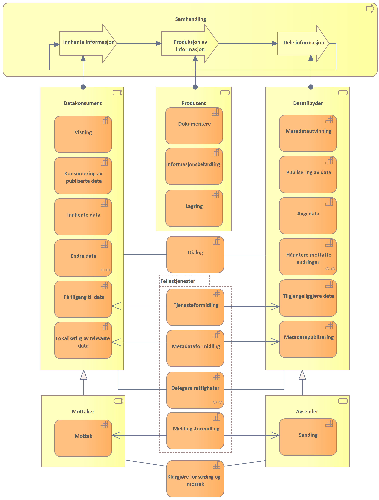
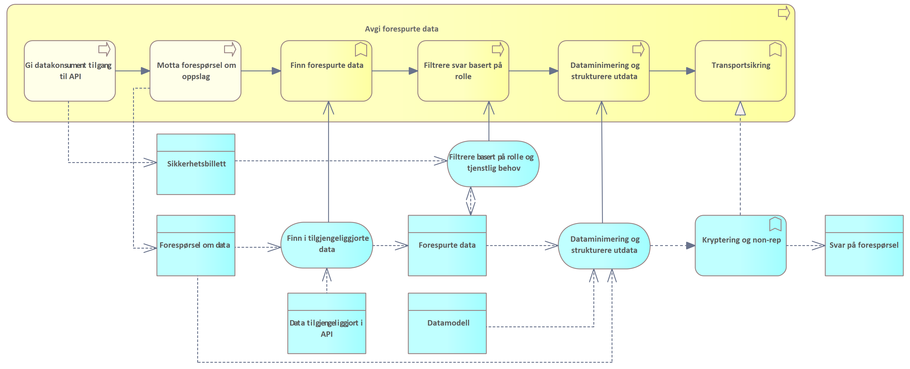

| Status | Version | Maturity | Normative level |
|:-------------|:------------------|:------|:-------|
| Work in progress | v0.8 | review  | ikke normert |

## Samhandling mellom helsepersonell på tvers av virksomheter

Direktoratet for e-helse publiserte i mars 2021 [Målarkitektur for datadeling i helse og omsorgssektoren](https://www.ehelse.no/standardisering/standarder/malarkitektur-for-datadeling-i-helse-og-omsorgssektoren) som tar frem fire ulike bruksområder for datadeling der "samhandling mellom helsepersonell på tvers av virksomheter" var et brukstilfelle. Dette brukstilfellet ble ikke behandlet i første versjon av målarkitekturen for datadeling, siden modenheten den gang var for lav og erfaringsgrunnlaget med denne bruken av datadelingsløsninger var begrenset.

Målarkitektur samhandling DHO har fokusert på brukstilfellet (samhandling mellom helsepersonell på tvers av virksomheter), og dette vil bli en del av den overordnede målarkitekturen for datadeling for helse- og omsorgssektoren. Brukstilfellet for deling på tvers av virksomheter uttrykkes slik i målarkitektur for datadeling:

!!! quote "Samhandling mellom helsepersonell på tvers av virksomheter"

    Dette bruksområdet dekker brukstilfeller som i hovedsak dekker behovet for at helsepersonell i ulike virksomheter må samhandle for å yte best mulig helsehjelp.

    Virksomheter som yter helsehjelp har en plikt til å samarbeide om behandling og forebygging av sykdom hos innbyggere. Det ligger som en forutsetning for godt samarbeid at aktørene må samarbeide om behandlingsplaner og andre helseopplysninger. Samarbeidet kan inkludere deling av dokumentasjon ved hjelp av datadeling fra den ene virksomheten til den andre, og kan også inkludere digitalisert samarbeid om pasientforløp på tvers av virksomheter. For mer avanserte samarbeidsformer rundt en pasient vil ikke meldings- og dokumentutveksling være tilstrekkelig for å kunne lage fleksible og gode samarbeidsløsninger. Her vil samarbeidsprosesser og arenaer kreve datadeling der aktørene kan samarbeide om både strukturerte dokumenter og mindre informasjonselementer.

    Dette bruksområdet <!--peker bruksområde tilbake på målarkitetkuren) Spør fordi bruksområde og brukstilfelle ikke er begrep jeg vansligvis benytter-->må sees i sammenheng med de nasjonale tiltakene som for eksempel dokumentdeling via Kjernejournal, Akson journal og Helseplattformen som skal løse hoveddelen av behovet for samhandling ved å ha en felles journal. Disse tiltakene vil redusere antall løsninger som det må lages samhandlingsfunksjoner som benytter datadeling på tvers.
  
    Det er ulik tidshorisont på når disse løsningene er realisert og tatt i bruk. Det vil derfor være behov for å ta i bruk datadeling også frem til disse løsningene er realisert og tatt i bruk.  
    Behovsanalysen til konseptvalgutredningen for nasjonal journalløsning for kommunal helse og omsorgstjeneste beskriver [behovene for samhandling i detalj \[7\]](https://ehelse.no/strategi/akson/_/attachment/download/991f83c3-be61-4556-9df6-44e8430ecf8c:c10adb76b95e679fb5857fec60e5c57650ead80b/Vedlegg%20A%20Behovsanalyse%20Nasjonal%20l%C3%B8sning%20for%20kommunal%20helse-%20og%20omsorgstjeneste.pdf).
  
    Dette bruksområdet dekker samhandling gjennom datadeling mellom aktører i ulike helseregioner og mellom aktører i helseregioner og den kommunale helse- og omsorgstjenesten inkludert fastleger. Målarkitekturen for dette bruksområdet trenger mer arbeid og vi har valgt å ikke beskrive arkitekturen nærmere i denne versjonen av dokumentet." 

!!! info

    Innholdet i denne delen bygger direkte på eksisterende rammeverk beskrevet i [Målarkitektur for datadeling i helse og omsorgssektoren](https://www.ehelse.no/standardisering/standarder/malarkitektur-for-datadeling-i-helse-og-omsorgssektoren) og [Referansearkitektur for datadeling](https://www.ehelse.no/standardisering/standarder/referansearkitektur-for-datadeling). Kapitelet forutsetter kjennskap til de tekniske delene av disse arbeidene. Kapitelet egner seg hovedsaklig for arkitekter og tekniske personer som ønsker å forstå bakgrunnen for arkitekturvalgene som gjøres i målarkitekturen.

## Kapabilitetskart

I denne delen av målarkitekturen viser vi hvilke kapabilteter eller evner som må realiseres for å understøtte samhandling mellom virksomheter og omsorgsnivå. Kapabilitetene som beskrives er en videreutvikling av kapabilitetene som beskrives i [Målarkitektur for datadeling i helse og omsorgssektoren](https://www.ehelse.no/standardisering/standarder/malarkitektur-for-datadeling-i-helse-og-omsorgssektoren), men modellene videreutvikles med hovedfokus på samhandling mellom virksomheter.

!!! note "Bruk av kapabiliteter i planleggingen"

    I denne delen av målarkitekturen tar vi utgangspunkt i en overordnet oversikt over kapabiliteter for å beskrive behovene for samhandlingstjenester. Motivasjonen bak denne metoden er beskrevet i [vedlegget](Kapabiliteter.md).

### Samhandlingsprosessen

Modellen *Kapabilitetskart koblet til samhandlingsprosess* viser overordnede roller og kapabiliteter rollene innehar. Rollene er igjen tilordnet delprosessene for samhandling: *Innhente informasjon*, *Produksjon av informasjon* og *Dele informasjon*. Rollene *Datakonsument*, *(Data)produsent* og *Datatilbyder* er knyttet til prosessene. Hvordan samhandlingsprosessen understøtter helsetjenesten og tjenesteforløpet er beskrevet i kapittelet [Tjenesteforløp og samhandling](Behovsbilde.md#tjenesteforløp-og-samhandling).

Samhandling mellom virksomheter og omsorgsnivå kan foregå på flere måter, kapabilitetskartet viser kapabiliteter som er relevante for både datadeling, dokumentdeling, hendelsesstrømmer og meldingsutveksling. I forbindelse med tjenesteforløp i DHO er det mest relevante samhandlingsformen datadeling som understøttes av kapabilitetene "innhente data" og "avgi data". I tillegg er det behov for en rekke støttekapabilteter for å sette opp datadeling (få tilgang til data, tilgjengeliggjøre data, lokalisere relevante data og metadatapublisering)og noen kapabiliteter som bør realiseres som fellestjenester (tjenesteformidling, metadataformidling, delegere rettigheter og meldingsformidling).

*Kapabilitetskart koblet til samhandlingsprosess*

<!-- Tillitsskapende tjenester som avtalehåndtering og identitetsforvaltning kan legges in i kapabilitetsmodellen slik at det blir synliggjort at avtalehåndtering mangler (samordningsalternativet for tillitstjenester og tillitsanker) -->

### Kapabiliteter knyttet produksjon av dokumentasjon

*Samhandling* inneholder også en delprosess for produksjon av informasjon. *Produksjon av informasjon* innebærer både selve dokumentasjonen av hva som gjennomføres og målinger og andre resultater. Det er også tatt med nødvendige kapabiliteter som handler om *informasjonsbehandling* og *lagring* av informasjon. Rollen som (data)produsent er tilordnet denne delprosessen og denne rollen må minst inneholde kapabilitetene i tabellen under:

| Kapabilitet | Definisjon |
|---|---|
| Dokumentere | Dokumentere gjennomførte tiltak og begrunnelsen for tiltaket |
| Informasjonsbehandling | Sammenstille og tolke informasjon fra interne og eksterne systemer |
| Lagring | Lagre informasjon (dokumentasjon og metadata) |

### Tverrgående kapabiliteter

Evnene i denne tabellen er ikke knyttet opp mot noen spesielle deler av prosessen, siden flere deler av prosessen eller roller har behov for disse.

| Kapabilitet | Definisjon |
|---|---|
| Dialog | Understøtte løpende dialog mellom aktører |
| Delegere rettigheter | Evnen til å delegere rettigheter til databehandler som utfører oppgaver på vegne av dataansvarlig. |
| Klargjøre for sending og mottak | Klargjøre for utveksling av informasjon ved hjelp av meldinger (sende og motta fra/til spesifikk mottaker) |
| Meldingsformidling | Fellestjeneste for å formidle meldinger mellom avsender og mottaker som utveksler meldinger. Dagens løsning baserer seg på felles infrastruktur for meldingsformidling som en del av samhandlingsplattformen |
| Metadataformidling | Evnen til å formidle hvilken informasjon som er tilgjengelig fra en datakilde, det kan være nødvnendig å understøtte denne evnen me den fellestjeneste|
| Tjenesteformidling | Evnen til å formidle informasjon om hvilke samhandlingstjenester som er tilgjengelig fra en datatilbyder, det kan være nødvendig å understøtte evnen med en fellestjeneste |

Vi ser i denne modellen på kapabiliteten dialog som en selvstendig evne til samhandling hvor aktørene alltid inntar rollen som datakonsument og datatilbyder i samhandlingsprosessen og inngår i en jevnbyrdig dialog med en eller flere andre aktører. Dialog kan understøttes av en eller flere av kapabilitetene for samhandling. Dagens dialogmeldinger benytter for eksempel meldingsutveksling (sende, motta og meldingsformidling) for å opprette asynkron dialog mellom partene.

### Kapabiliteter knyttet til samhandling

Evnene er knyttet til bruk av organisatoriske samhandlingsformer for å utveksle informasjon mellom aktører. Aktørene kan innta rolle som *datakonsument* eller *datatilbyder*, i de aller fleste tilfeller vil aktørene inneha flere roller i samhandlignsprosessen og realisere kapabiliter knyttet til både konsument og tilbyder rollen.

| Kapabilitet | Definisjon |
|---|---|
| Avgi data | Utlevere data basert på søk og oppslag |
| Endre data | Evnen til å gjøre dataendringer hos en annen aktør ved hjelp av datadeling |
| Få tilgang til data | Evnen til å skaffe seg tilgang til tilbudte data fra annen aktør. |
| Håndtere mottatte endringer | Evnen til å behandle endringer (opprettelse, oppdatering, sletting) av helseopplysninger mottatt fra en annen aktør ved hjelp av datadeling |
| Innhente data | Søke og slå opp informasjon gjennom en datadelingstjeneste |
| Konsumering av publiserte data | Evnen til å konsumere hendelser fra en hendelsesstrøm |
| Lokalisering av relevant data | Evnen til å finne kilder for informasjon om spesifikke kategorier eller personer. |
| Metadatautvinning | Evnen til å produsere og utvinne metadata basert på prosessene som produserer informasjon og innholdet i informasjonsressursene |
| Mottak | Motta informasjon fra en avsender |
| Publisering av data | Evnen til å publisere hendelser til en hendelsesstrøm |
| Metadatapublisering | Evnen til å publisere metadata slik at konsumenter kan lokalisere relevant informasjon |
| Sending | Sende informasjon til en spesifikk mottaker |
| Tilgjengeliggjøre data | Evnen til å gjøre data tilgjengelig for aktører utenfor egen virksomhet med eller uten krav til innlogget bruker ved hjelp av datadeling. Tilgangsstyring inngår her. Avgjøre hvilken informasjon som skal deles med andre gjennom en datadelingstjeneste. |
| Visning | Evnen til å vise data til bruker |

## Nødvendige informasjonstjenester

I arbeidet med målarkitektur analyserer vi hvordan kapabiliteter kan realiseres av prosesser og hvordan disse prosessene bør understøttes av [informasjonstjenester](Informasjonstjeneste-meta.md). Vi ser også på sammenhenger mellom informasjonstjenestene som realiseres av virksomhetene som skal samhandle og tjenester som realiseres i felles infrastruktur.

### Informasjonstjenester

Modellen *Sentrale informasjonstjenester knyttet til samhandling* viser hvordan informasjonstjenester, prosesser og funksjoner realiserer samhandlingsevnene vi pekte på i forrige kapittel. Hovedfokuset i den videre analysen blir de informasjonstjenestene som må realiseres for å understøtte de mest sentrale kapabilitetene knyttet til [datadeling](Organisatorisk-sla-opp.md).  

*Overordnet bilde av prosesser og informasjonstjenester som understøtter samhandling mellom virksomheter*

### Samhandlingsformer

Behovet for samhandling i DHO løses best ved å benytte flere [samhandlingsformer](https://confluence.ehelse.no/display/DH/Organisatoriske+samhandlingsformer) om hverandre der ulike samhandlingsformer svarer ut ulike informasjonsbehov og har ulike roller i forhold til behandlingsforløpet. Det eksisterer i dag utstrakt bruk samhandlingsformen sende og motta spesielt knyttet til rekvisisjon, henvisning, svar og epikrise. Dette er ikke hovedfokuset i forbindelse med å utvikle samhandlingen knyttet til DHO da dette er samhandlingsformer og prosesser som er veletablert i tjenesten i dag men som ikke i tilstrekkelig grad understøtter behovene knyttet til DHO og sammensatte behandlingsforløp, hvor ulike virksomheter og omsorgsnivå følger opp pasienten.

### Informasjonstjenester og prosesser

I denne delen av Målarkitekturen beskrives de mest sentrale prosessene for å klargjøre for datadeling og gjennomføre samhandling i form av datadeling. Dette omfatter nødvendige prosesser og informasjonstjenester for kapabilitetene *Få tilgang til data*, *Tilgjengeliggjøre data*, *Lokalisering av relevante data* og *Metadatapublisering*. For selve samhandlingen (utveksling av informasjon ved hjelp av datadeling) må vi beskrive kapabilitene for *Innhente data* og *avgi data*. Også kapabilitene for *Endre data* og *Håndtere motatte endringer* er viktige knyttet til sentrale metadata.

[Målarkitektur for datadeling i helse og omsorgssektoren](https://www.ehelse.no/standardisering/standarder/malarkitektur-for-datadeling-i-helse-og-omsorgssektoren) (HITR 1231:2021) beskriver prosessene på dette området frem til faktisk datautveksling. Beskrivelsene som er tatt frem i HITR 1231:2021 handler hovedsaklig om sikring av datadelingstjenester, autentisering av brukere og dokumentasjon av tjenstlig behov, disse beskrivelsene blir ikke gjentatt her.  

Det er flere problemstillinger knyttet til å faktisk understøtte utvekslingen av, bruken av og produksjonen av informasjon i forretningsprosessene hos datakonsumenter, dataprodusenter og datatilbydere som ikke er behandlet i detalj i HITR 1231:2021 som er fokus for målarkitekturen for datadeling innen DHO.

### Tillitstjenester og tjenstlig behov

Juridiske avklaringer i forbindelse datadeling sier at ved oppslag mot datatilbyder så må konsumentens (sluttbruker) sitt tjenstlige behov dokumenteres overfor datatilbyder før data utleveres. Det eksisterer ikke mekanismer for å håndtere dette i infrastrukturen i dag, verken i sikkerhetsbilletten (må utvides) eller andre tillitsskapende tjenester. Direktoratet for e-helse publiserte i 2019 en anbefaling som beskriver [Anbefaling av tillitsmodell for data- og dokumentdeling](https://www.ehelse.no/standardisering/standarder/anbefaling-av-tillitsmodell-for-data-og-dokumentdeling).

## Datadeling for datatilbyder

Tre sentrale prosesser står sentralt for datatilbydere som skal dele data ved hjelp av datadeling: *Tilgjengeliggjøre*, *produksjon av informasjon* og *avgi forespurte data*. Produksjon av informasjon tas med her siden det mest relevante brukstilfelle for deling av informasjon mellom virksomheter handler om å dele informasjon som virksomheten har produsert i sine andre forretningsprosesser med andre virksomheter som kommer i kontakt med pasienten.

På et overordnet nivå kan sammenhengen mellom disse prosessene beskrives som i modellen nedenfor:

*Sammenhengen mellom prosessene for å tilgjengeliggjøre, produsere informasjon og avgi forespurte data*

Prosessen for å **Tilgjengeliggjøre** etablerer datadelingstjenesten og beskriver grensesnittet datadelingstjenesten tilbyr (vanligvis i from av API dokumentasjon). 
Prosesen for **produksjon av data** benytter seg av beskrivelsen av intern dataflyt for å tilgjengeliggjøre relevant informasjon i API'et, i tillegg bør det utvinnes og publiseres metadata om hvilken informasjon datadelingstjenesten inneholder for å gjøre det enklere for konsumenter å slå opp mot de datadelingstjenestene som inneholder relevante data.
Når en konsumerende virksomhet forespør data fra datadelingstjenesten starter en prosess for å **avgi forespurte data fra datatilbyder**. Forespørselen om data vil bli sendt til datatilbyder sammen med en sikkerhetsbillett som dokumenterer autentiseringen, rolle og tjenstlig behov til den som spør. Hvis konsumenten er autorisert for å bruke datadelingstjenesten vil datatilbyder finne forespurte data. Det kan også forekomme dataminimering av informasjonen som sendes som svar på forespørsel avhengig av rolle og tjenstlig behov som dokumenteres i sikkerhetsbilletten.

### Prosesser for Tilgjengeliggjøre

Tilgjengeliggjøring av API og hvilke programvarekomponenter det er behov for i den delen av prosessen som omhandler registrering, avtaler og tildele tilganger er godt behandlet i [Målarkitektur for datadeling i helse og omsorgssektoren](https://www.ehelse.no/standardisering/standarder/malarkitektur-for-datadeling-i-helse-og-omsorgssektoren), vi vil ikke diskutere denne delen av prosessen ytterligere her. Derimot er prosessen knyttet til å etablere og dokumentere et API ikke beskrevet som en del av HITR 1231:2021. Dette er en viktig prosess for å forstå hvordan man får forretningsprosessene i virksomheten til å henge sammen med samhandling gjennom datadeling. En overordnet beskrivelse av prosessen for *Etablere API* er gjengitt nedenfor:

*Etablere API* dekker den delen av prosessen som foregår før informasjon faktisk kan tilgjengeliggjøres fra en virksomhet til en annen og handler om prosessen knyttet til å vurder hvilken informasjon som skal tilgjengeliggjøres, tilrettelegge for at denne informasjonen kan tilgjengeliggjøres for andre virksomheter (unntatt sikkerhet og tilgangstyring) og etableringen av funksjonalitet for å avgi informasjonen på en effektiv måte gjennom eksternt tilgjengelige funksjonskall, samt å dokumentere de tilgjengelige grensesnittene.

Vanligvis vil reglene for ekstern tilgang etableres som automatiserte uttrekk fra eksisterende datakilder eller prosesser med fastsatte rammer for hvilken informasjon og metadata som skal være tilgjengelig for eksterne virksomheter. Selve tilgangen etableres ofte ved å etablere en egen løsning for å lagre *Data tilgjengeliggjort i API*. *Datadelingstjenesten* representerer den eksternt tilgjengelige funksjonen for *Datadeling med eksterne*. Datadelingstjenesten utvikles basert på hvilken informasjon som tilgjengeliggjøres og hvilke søkemuligheter som er hensiktsmessig for å gjøre oppslag i denne informasjonsmengden. Det vil ofte være en balansegang mellom god tilgang til komplett informasjon for konsumentene og samtidig som krav til personvern og dataminimering ivaretas. Mulighetene for søk og hva slags informasjon som er tilgjengleiggjort dokumenteres vanligvis i form av *API dokumentasjon* som publiseres sammen med datadelingstjenesten.

### Prosesser for produksjon av informasjon

*Prosesser forbundet med produksjon av informasjon og utvinning av metadata*

### Prosesser for å avgi forespurte data

*Prosesser forbundet med å avgi forespurte data*

## Datadeling for datakonsumenter

### Få tilgang til data

Evnen til å skaffe seg tilgang til tilbudte data fra annen aktør. Omfatter evnen til å oppdage datakilder og sette opp funksjon (klient) for å ta i bruk datakilden. Videre må virksomheten beskrive hvordan den ønsker å integrere eksterne informasjon i intern dataflyt, inkludert hvordan interne fagsystem og mellomvare skal bruke, vise og lagre data fra eksterne. Det må etableres en klientfunksjon som tar i bruk api'et fra den eksterne datatilbyderen og denne må integreres med interne systemer.

### Finne relevante data

Evnen til å finne kilder for informasjon om en gitt pasient ~personer~ ~eller informasjonskategorier~.

## Eksempel: Realisere slå opp og dele målinger

Behov knyttet til dele egne målinger og slå opp andres målinger kan realiseres med å implementere prosesser for å avgi egne data gjennom en Datadelingstjeneste og en prosess for å fastsette hvilke målinger og på hvilken måte disse skal struktureres, samt hvilke målinger som skal tilgjengeliggjøres gjennom datadelingstjenesten. Datadelingstjenesten må dokumenteres i form av API-dokumentasjon som kan benyttes av konsumenter som ønsker å få tilgang til data som er tilgjengelig for oppslag gjennom datadelingstjenesten.

