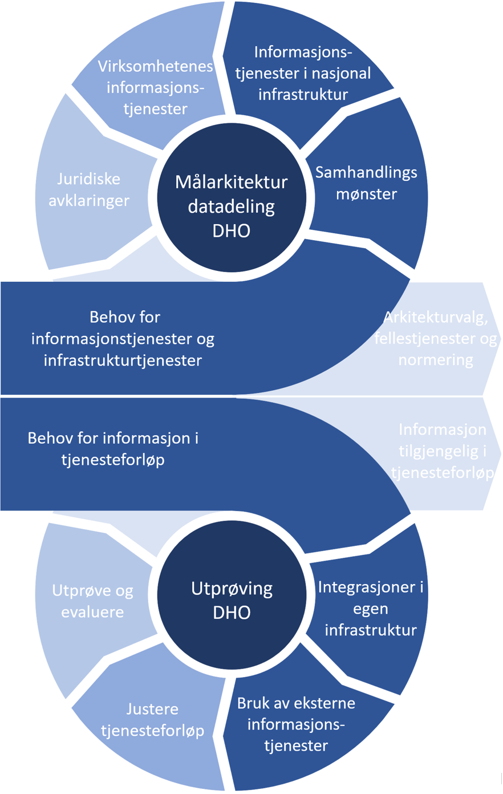

| Status | Version | Maturity | Normative level |
|:-------------|:------------------|:------|:-------|
| Work in progress | v0.4 | draft  | ikke normert |

## Metode for utvikling av målarkitekturen

Det er lagt til grunn smidig metodikk i utviklingen av målarkitekturen der utprøving av datadeling i konkrete utprøvings- og sprednings-aktiviteter knyttet til Nasjonalt velferdsteknologiprogramm og utforming av målarkitektur gjennomføres i parallell. Se figur under.

{ width="500" }<!-- Figuren er ikke selvforklarende, og trenger å bli forklart, eller forenklet -->

### Utprøving og spredningsaktiviteter i NVP

I arbeidet med Nasjonalt velferdsteknologiprogram (NVP) er det identifisert utprøvingskandidater, som i sin tur har identifisert samhandlingsbehov på tvers av aktører og omsorgsnivå. <!-- Hvem har gjenomført disse utprøvingsprosjektene? -->Gjennom utvalgte utprøvingsprosjekter er velferdsteknologisk knutepunkt (VKP) benyttet for å håndtere dataflyt mellom DHO-systemer og andre fagsystem som elektroniske journalsystemer. Behovet for samhandling rundt Målinger (data fra pasient) har vært fokus for utprøving med bruk av kodeverk og terminologi/ spesifikasjoner som kan danne grunnlag for videreutvikling av normerende produkter og nasjonale samhandlingsløsninger. Målet for utprøvingsaktivitetene har vært å jobbe smidig og behovsdrevet med hyppige leveranser for å få testet ut ny funksjonalitet så langt det er mulig. Det er jobbet med utprøving ut fra en tre trinns rakett der første steg har vært journalføring, neste steg overføring av målinger fra utstyr til journal og siste steg deling av målinger. Erfaringer fra utprøvingene gir grunnlag for videreutvikling av målarkitekturen og målarkitetkuren gir rammer for utprøvingene.  

### Koblingen mellom utprøving og målarkitektur

Gjennom dialog med helsepersonell i helsetjenesten som har etablert tjenesteforløp er behov for samhandling og informasjonsdeling identifisert og verifisert. Behovsforståelsen bygger på allerede gjennomførte kartlegginger og oppdateres løpende basert på praktiske erfaringer med å realisere nye tjenester som understøttes av nye informasjonstjenester som tas i bruk i helsetjenesten. Behovsarbeidet som gjennomføres i utprøvings- og sprednings-aktivitetene har vært viktige innspill til behovsarbeidet knyttet til målarkitekturen for datadeling DHO. Forskjellen er at konkret informasjonsbehov i tjenesteforløpene er "oversatt" til behov for og prioritering av informasjonstjenester i målarkitekturen.

I det videre arbeidet har behovene som er sammenstilt blitt analysert og ligger til grunn for valg av samhandlingsmønster og behov for informasjonstjenester som må implementeres som fellestjenester eller informasjonstjenester i virksomhetenes infrastruktur. Dette arbeidet har ført til konkrete konsepter som er vurdert i forhold til gjeldende rett. Til slutt peker målarkitekturen på nødvendige normerende produkter for å understøtte enhetlig semantisk samhandling.  

I utprøving og spredningsaktivitetene prøver virksomhetene å etablere faktisk samhandling mellom virksomhetene basert på konseptene som er tatt frem i målarkitekturen. Erfaringer med realisering og bruk av informasjonstjenestene føres tilbake i arbeidet med revisjon av målarkitekturen. Målarkitekturen vil også hjelpe utprøvings og spredningsprosjekter til å velge løsningskonsepter som kan realiseres innenfor gjeldende rett, eller føre til at prosjektene spiller inn nødvendige endringer i lovverket for å understøtte mer effektive samhandlingsløsninger på sikt.

### Samarbeid og forankring

Det har vært etablert en arbeidsgruppe med representanter fra de fire regionale helseforetakene, KS, NHN, Helseforetak og utvalgte kommuner som har bidratt med innspill til arbeidet med målarkitekturen. Arbeidet blir fortløpende presentert i relevante fora i nasjonal styringsmodell og andre relevante arenaer spesielt knyttet til KS og RHF-enes arkitekturarbeid.

## Forvaltning og videreutvikling av målarkitekturen

Målarkitektur datadeling DHO har fokusert på brukstilfellet "samhandling mellom helsepersonell på tvers av virksomheter" og dette er en utvidelse av den eksisterende målarkitetkuren for datadeling i helse- og omsorgssektoren som beskriver brukstilfellene for helsepersonell sin bruk av fellestjenester og innbygger sin bruk av fellestjenester.

Målarkitekturen vil følge [forvaltningsmodellen for normerende produkter](https://www.ehelse.no/standardisering/standarder/forvaltningsmodell-for-normerende-produkter-fra-direktoratet-for-e-helse) fra Direktoratet for e-helse slik at målarkitekturen oppdateres jevnlig. Ved å høste erfaringer fra utprøvingsprosjekter og aktiviteter i helse- og omsorgssektoren vil Direktoratet for e-helse jobbe videre med å utvikle felles rammer for datadeling i helsesektoren.
