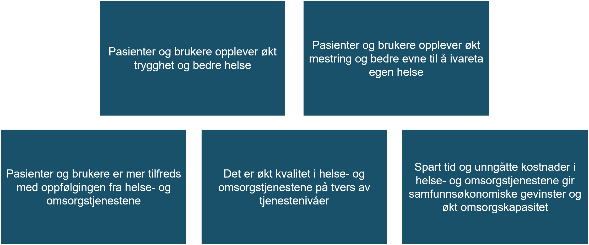

| Status | Version | Maturity | Normative level |
|:-------------|:------------------|:------|:-------|
|Work in progress | v0.8 | review  | ikke normert |

Dette kapitlet beskriver de overordnede strategiske målene for arbeidet med digital hjemmeoppfølging i Nasjonalt velferdsteknologiprogram (NVP). Målbildet på strategisk nivå for DHO er beskrevet i [Mål og tiltak i nasjonalt velferdsteknologiprogram](https://www.helsedirektoratet.no/tema/velferdsteknologi/velferdsteknologi). Figuren under viser samfunnsmålene for Nasjonalt velferdsteknologiprogram. 

Utviklingen av målarkitektur for samhandling innen DHO er en hovedleveranse fra Tiltak 5 Arkitektur og infrastruktur i NVP. Formålet med dette tiltaket er å sørge for at normerende produkter og nasjonale samhandlingsløsninger videreutvikles slik at de ivaretar behov relatert til velferdsteknologi og digital hjemmeoppfølging.

Det er også identifisert to hovedbarrierer for utbredelsen av velferdsteknologi og effektiv utnyttelse av DHO i helse og omsorgssektoren.  

* Det er mangelfull tilrettelegging for digital informasjonsdeling mellom velferdsteknologi/digital hjemmeoppfølgingssystemer og journalsystemer/fagsystemer som helse- og omsorgstjenesten benytter i behandling- og oppfølging av pasienter
* Det er mangelfull tilrettelegging for et bærekraftig leverandørmarked som bidrar til at innovasjonskraften i helse- og omsorgssektoren og i leverandørmarkedet spiller på lag

## Tiltak 5: Arkitektur og infrastruktur

Tiltak 5 skal i hovedsak adressere effektmålet som handler om **Økt, bedre og sikker digital samhandling på tvers av tjenestenivåer og sektorer.**
For å nå dette målet er det foreslått 5 konkrete tiltak under tiltak 5.

1. Definere en overordnet arkitektur for datadeling - Målarkitektur for samhandling innen Digital hjemmeoppfølging (dette tiltaket)
2. Koordinere arbeid med FHIR-profilering innen digital hjemmeoppfølging i sektor
3. Utvide dagens utprøving av datadeling som også omfatter samhandling mellom primær- og spesialisthelsetjenesten
4. Råd og veiledning som dekker behov hos både spesialist- og primærhelsetjenesten.
5. Videreutvikle velferdsteknologisk knutepunkt