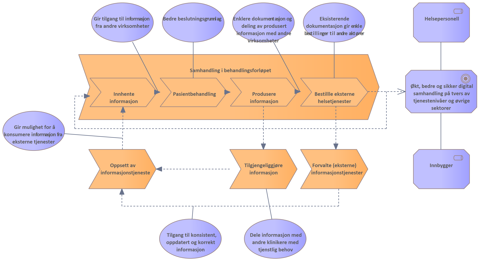

| Status | Version | Maturity | Normative level |
|:-------------|:------------------|:------|:-------|
|Work in progress | v0.8 | review  | ikke normert |

Kapittelet beskriver de overordnede strategiske målene for DHO arbeidet. Utviklingen av målarkitektur for samhandling innen DHO er en hovedleveranse fra Tiltak 5 i DHO arbeidet i Nasjonalt velferdsteknologiprogram.

Målbildet på strategisk nivå for DHO er beskrevet i [Mål og tiltak i nasjonalt velferdsteknologiprogram](https://www.helsedirektoratet.no/tema/velferdsteknologi/velferdsteknologi). Figuren under viser samfunnsmålene for Nasjonalt velferdsteknologiprogram. 

Det er også identifisert to hovedbarrierer for utbredelsen av velferdsteknologi og effektiv utnyttelse av DHO i helse og omsorgssektoren. 

* Mangelfull tilrettelegging for digital informasjondeling 
* og mangelfull tilrettelegging for et bærekraftig leverandørmarked. <!-- Egen utskrivning av barrierer og effektmål (kan ikke referer til Digi hjem rapporten), figur over sammfunnsmål hentes fra presentasjon/hdir sine sider-->

## Tiltak 5: Arkitektur og infrastruktur

Digitaliseringstiltakene innenfor tiltak 5 er definert til å være:

1. Definere en overordnet arkitektur for datadeling - Målarkitektur for samhandling innen Digital hjemmeoppfølging (dette tiltaket)
2. Koordinere arbeid med FHIR-profilering innen digital hjemmeoppfølging i sektor
3. Utvide dagens utprøving av datadeling som også omfatter samhandling mellom primær- og spesialisthelsetjenesten
4. Råd og veiledning som dekker behov hos både spesialist- og primærhelsetjenesten.
5. Videreutvikle velferdsteknologisk knutepunkt

## Verdistrøm for samhandling i behandlingsforløpet <!-- Fjernes, erstattes av oversikt over målarkitekturens formål og oppsummering av noen gevinster -->

Formålet med effektmålet "økt, bedre og sikker digital samhandling på tvers av tjenestenivåer og øvrige sektorer" er å gi verdi for sluttbrukere som helsepersonell og innbygger.

Modellen viser en overordnet verdistrøm med fokus på verdi som effektmålet kan gi for helsepersonell og innbygger involvert i et behandlingsforløp.

