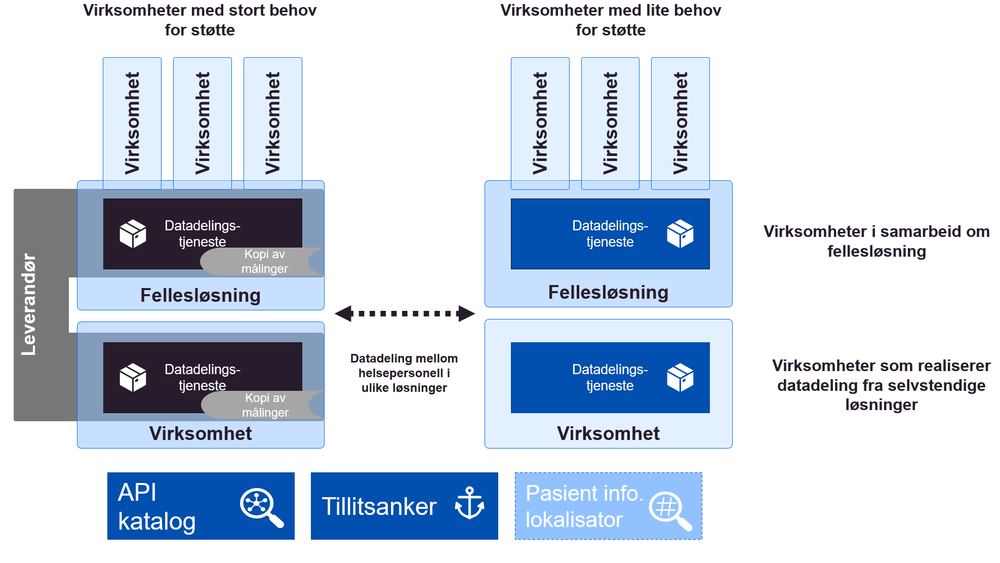

| Status | Version | Maturity | Normative level |
|:-------------|:------------------|:------|:-------|
| Work in progress | v0.1 | draft | ikke normert |

Direktoratet for e-helse har et [strategisk mål](https://www.ehelse.no/strategi/nasjonal-e-helsestrategi-for-helse-og-omsorgssektoren/mal-4-tilgjengelig-informasjon-og-styrket-samhandling) om å øke digital samhandling mellom aktørene i helse- og omsorgssektoren. Dette målet sammenfaller med de strategiske føringen for Digital hjemmeoppfølging som har identifisert et effektmål knyttet til samhandling:

!!! quote "Effektmål samhandling"

    Økt, bedre og sikker digital samhandling på tvers av tjenestenivåer og øvrige sektorer

Som et ledd i arbeidet med målarkitekturen for datadeling innen DHO er behovene for samhandling analysert. Virksomhetene som er involvert i å etablere tjenesteforløp som inneholder DHO tjenester peker spesielt på behovet for samhandling om felles planer, legemiddellister og målinger. Alle disse informasjonstjenestene vil dra nytte av økt digital samhandling i form av datadeling av strukturert informasjon mellom virksomheter og omsorgsnivå. Den foreløpige analysen peker også på at en rekke andre informasjonsbehov som er etterspurt i forbindelse med DHO understøttes best i form av samhandling i form av datadeling.

Siden effektiv digital samhandling krever at organisatoriske og tekniske løsninger etableres i mange virksomheter er det målarkitekturens overordnede mål å koordinere innsatsen i helsesektoren slik at etableringen av datadeling blir så effektiv som mulig. Målarkitekturen skal bidra til koordineringen ved å dokumentere felles arkitekturvalg, felles behov og beskrive konsepter som kan benyttes til datadeling. Det er også viktig å beskrive det juridiske handlingsrommet som løsningene må fungere innenfor på kort sikt og peke på behov knyttet til regelverksutvikling hvis samhandlingsbehovene ikke kan dekkes innenfor gjeldende lover å regler.

Anbefalingene av konsepter for å etablere datadeling mellom virksomhetene går igjennom fordeler og ulemper med forskjellige konsepter og anbefaler en fleksibel tilnærming som kombinerer elementer fra flere konsepter for den videre utviklingen. Vi anbefaler at virksomhetene tar hensyn til lokale og regionale samhandlingsbehov når de etablerer datadelingsløsninger for DHO, samtidig som aktørene tar hensyn til kompleksiteten i tjenesteforløpene som ofte involverer mange separate virksomheter som må samarbeide. En skisse av anbefalt konsept er gjengitt i figuren.

<figure markdown>
  { width="500" }
  <figcaption>Anbefalt konsept for datadeling, med kombinasjon av distribuerte datadelingsløsninger og regionale fellesløsninger</figcaption>
</figure>
