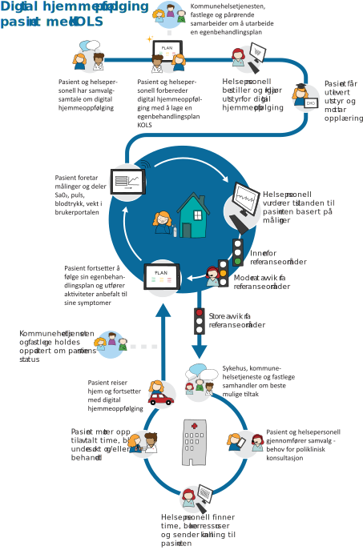
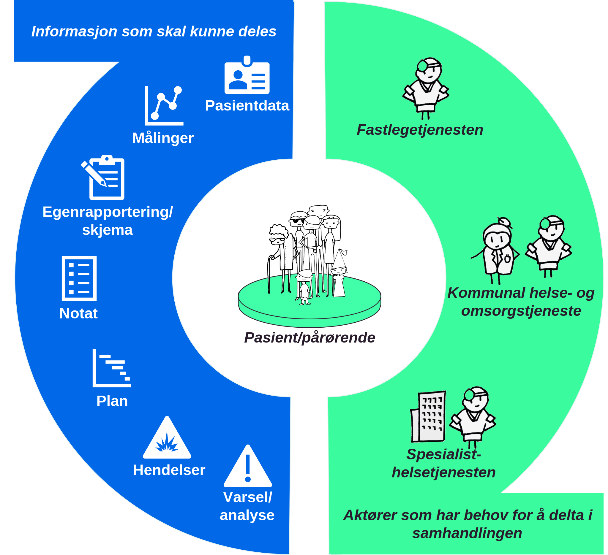
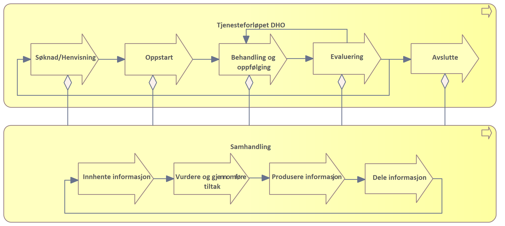
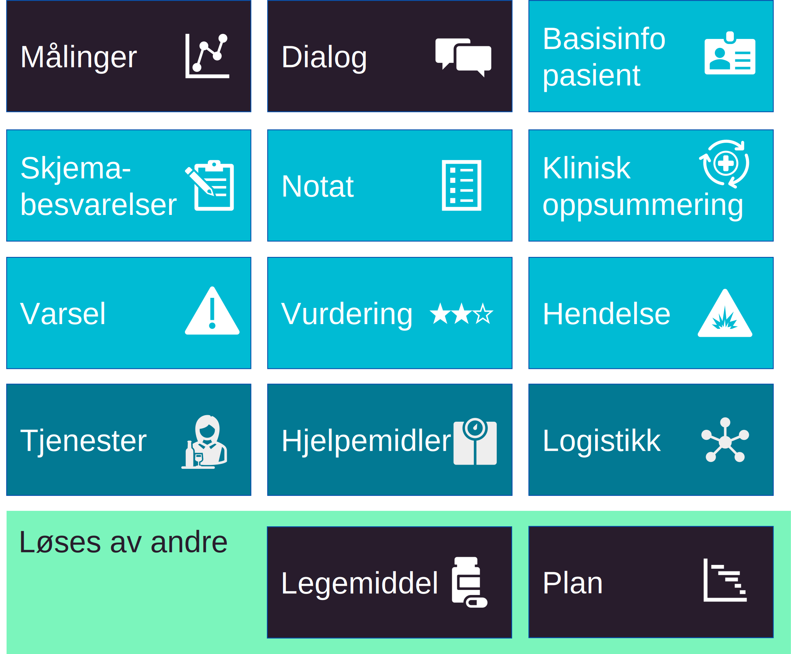

| Status | Version | Maturity | Normative level |
|:-------------|:------------------|:------|:-------|
| Release | v0.9.5 | mature | veileder (TOBE) |

Dette kapittelet gir en oversikt over de prioriterte behovene knyttet til tjenesteforløp der DHO benyttes. Det er ikke gjort et forsøk på å gi et komplett bilde av de funksjonelle behovene som må ivaretas for helsepersonell og pasient, det er isteden fokusert på behovet for informasjon, med formål å avdekke informasjonsbehov som må understøttes med samhandling mellom helsepersonell i ulike virksomheter. For en bredere og mer detaljert oversikt over brukerbehov, roller som er involvert og beskrivelse av de ulike informasjonstjenestene se vedlegget [Detaljert behovsbilde](../vedlegg/Detaljert-behovsbilde.md)

## Bakgrunn for behovsbildet

### Behovskartlegging basert på pågående utprøvingsprosjekter

Arbeidet med målarikteturen baserer seg i stor grad på innhenting av erfaringer fra pågående intitativer. Behovskartleggingen har tatt utgangspunkt i tidligere [dokumenterte samhandlingbehov](https://www.ehelse.no/aktuelt/ny-rapport-om-helhetlig-samhandling-for-digital-hjemmeoppfolging)<!--kunne vi her også få med lenke til rapporten fra 2021-2022 [erfaring med samhandling og informasjonsdeling](https://www.helsedirektoratet.no/tema/teknologi-i-v%C3%A5r-felles-helsetjeneste/digital-hjemmeoppfolging/Digital%20hjemmeoppf%C3%B8lging%20%20erfaring%20med%20samhandling%20og%20informasjonsdeling.%20Notat%202021.pdf/_/attachment/inline/3976eaa1-6879-4146-af89-e25cc8021390:99e208e7d1b189b13265579455085be21a18c17b/Digital%20hjemmeoppf%C3%B8lging%20%20erfaring%20med%20samhandling%20og%20informasjonsdeling.%20Notat%202021.pdf)--> og erfaringer fra utprøvingsprosjekter som benytter velferdsteknologisk knutepunkt (VKP) hvor det er identifisert et stort behov for datadeling mellom virksomheter og omsorgsnivå. Vi har videre studert behov som er viktige for utprøvingsprosjektet mellom Larvik kommune, inkludert fastlegetjenesten, og Sykehuset i Vestfold. I tillegg har prosjektet fulgt behovskartleggingen i Oslo kommune der datadeling skal etableres mellom Lovisenberg sykehus, kommunen og fastleger.  

!!! quote "Pasientens målinger er nyttige, Lege medisinsk klinikk, ([sluttrapport 2018-2021](https://www.helsedirektoratet.no/rapporter/digital-hjemmeoppfolging-sluttrapport-fra-nasjonal-utproving-2018-2021))"

    Jeg synes faktisk at mye av helsedataene som dokumenteres, med fordel også kan brukes ved polikliniske kontroller eller innleggelser... Å få denne dokumentasjonen inn i våre journaler høres veldig nyttig ut. 

Vi har ikke tatt inn detaljerte beskrivelser fra utprøving- og spredningsprosjektene, siden målarkitekturen skal være et generisk verktøy. For nye prosjekter som er i oppstart kan det være interessant å se til andre intitativer for å blant annet få erfaringer om organisatoriske utfordringer og få ideer til mulige løsninger. Informasjon om spredningsprosjektet:  

* Her er oversikt over de pågående spredningsprosjektene som er del av [Nasjonalt velferdsteknologiprogram](https://www.helsedirektoratet.no/nyheter/oppstart-av-spredning-av-digital-hjemmeoppfolging).  
* Spredningsprosjektet i Helsedirektoratet har publisert en animasjonsfilm om digital hjemmeoppfølging på Helsedirektoratet sin hjemmeside som hjelp til å informere om hva DHO kan innebære. [Film - digital hjemmeoppfølging](https://www.helsedirektoratet.no/tema/digital-hjemmeoppfolging-hjemmesykehus-og-velferdsteknologi/digital-hjemmeoppfolging#digitalhjemmeoppfolgingfilm)

### Prosessbeskrivelser og tjenesteforløp

En fellesnevner ved behovsarbeidet vi har fått tilgang til er at alle utprøving- og spredningsprosjektene tar utgangspunkt i detaljerte beskrivelser av tjenesteforløp eller prosessbeskrivelser for å beskrive nå-situasjonen og for å avdekke behov knyttet til tjenesteforløpene som analyseres. Beskrivelsene av tjenesteforløpene er til dels svært detaljerte og beskriver ønsket eller eksisterende tjenesteforløp for en eller noen få pasientgrupper hvor DHO benyttes. Figuren under er et eksempel på hvordan Sykehuset i Vestfold illustrerer ønsket tjenesteforløp med utgangspunkt i oppfølging av pasient med KOLS og samarbeid mellom helsepersonell på Sykehuset Vestfold, Larvik kommune og fastlege.

[{ width="500" }](../img/tjenesteforlop-KOLS.svg)  
*Eksempel på tjenesteforløp for pasienter med KOLS diagnose, figuren er gjengitt med tillatelse fra Helse Sør-Øst HF.*

### Overordnet om samhandlingsbehov

Helse- og omsorgssektoren har behov for mer effektiv samhandling for å øke tilgjengeligheten til relevante helseopplysninger. Digital samhandling handler om å kunne utveksle informasjon digitalt, kommunisere, dokumentere, gjenbruke og dele data på tvers. Målbildet for helhetlig samhandling er å tilby informasjonstjenester på en samhandlingsinfrastruktur som representerer et sett av informasjonsbehov som ikke er tilstrekkelig dekket i dagens nasjonale e-helseløsninger for samhandling. Hver informasjonstjeneste gir mulighet for å utveksle eller dele helseinformasjon mellom ulike aktører. Særskilte behov løses nasjonalt når det gir vesentlig gevinst/ nytte. Høy semantisk samhandlingsevne (hva dataene betyr og hvordan de er definert) er nødvendig for å lykkes med dette. Arbeidet med behov for informasjonsdeling i behandlingsforløp der DHO tilbys sees i sammenheng med målbildet for helhetlig samhandling. Kartlegging av behov for deling av informasjon, fra innbygger til helsepersonells løsninger, er utført med ulike perspektiv.  

I dagens helse- og omsorgstjeneste mangler helsepersonell ofte helhetsbilde. Rask tilgang til informasjon når helsepersonell trenger det vil gi stor verdi i arbeidshverdagen. Behovene i helsetjenesten ligger til grunn for etablering av samhandlingsløsningene i sektoren og legger premissene for hvilke samhandlingsløsninger som skal etableres og videreutvikles. Behovene knyttet til tjenesteforløp der helsehjelp ytes til pasienter som mottar digital hjemmeoppfølging (DHO) er i stor grad overlappende med andre tjenesteforløp. Vi kan derfor lære mye om nødvendige samhandlingsløsninger i sektoren ved å se spesielt på sammensatte tjenesteforløp innen DHO. Behovene hentes fra utprøvingsprosjekter og tjenesteeiere i helse- og omsorgssektoren. Erfaring fra utprøvingsprosjektene skal over tid føre til mer spesifikk behovskartlegging knyttet til erfaring med utveksling av informasjon mellom virksomheter og behandlingsnivå (primær- og spesialisthelsetjenesten) knyttet til DHO. Vi skiller i det videre arbeidet mellom informasjonsbehov og funksjonelle krav.

!!! note

    Målarkitekturen tar høyde for å gi et overordnet behovsbilde for hele DHO-området beskrevet over.  

## Overordnede roller og brukerhistorier

**Med fokus på informasjonsbehov**

Målbilde for samhandling begrenser seg til å understøtte ytelse av helse- og omsorgshjelp. Dette inkluderer å sikre kontinuitet i direkte helsehjelp, for eksempel når pasienter skrives ut fra sykehus og beveger seg mellom omsorgsnivå og det er behov for oppfølging i kommunen der tjenesten DHO kan benyttes. Samhandling bidrar til økt pasientsikkerhet og kvalitet gjennom å legge til rette for deling av korrekt informasjon for helsepersonell med tjenstlig behov. Det er beskrevet noen overordnede brukerhistorier for funksjonelle behov. Disse gir en kortfattet beskrivelse av hvem som har behov, hva slags funksjonalitet det er behov for og hvorfor funksjonaliteten gir verdi.

!!! quote "Økt trygghet og mestring, pasient Ullensaker ([sluttrapport 2018-2021](https://www.helsedirektoratet.no/rapporter/digital-hjemmeoppfolging-sluttrapport-fra-nasjonal-utproving-2018-2021))"

    I dag er det jeg som har kontrollen over egen sykdom og ikke sykdommen som har kontroll over meg! Antall legetimer og re-innleggelser har for meg vært langt færre etter jeg fikk ta i bruk den medisinske avstandsoppfølgingen.

Samhandlingstjenester i behandlingsforløp der digital hjemmeoppfølging benyttes skal tilrettelegge for følgende funksjonelle behov:

1. Som helsepersonell har jeg behov for tilgang til oppdatert informasjon som er nødvendig for å yte helsehjelp til pasient på en effektiv måte
2. Som helsepersonell har jeg behov for å endre og dele utvalgt informasjon, slik at jeg kan samarbeide med pasient og helsepersonell om oppdatering av felles autoritativ kilde. Eksempel på slik informasjon er behandlings- og egenbehandlingsplan, legemiddelliste og kritisk informasjon. 
3. Som pasient har jeg behov for tilgang til oppdatert og relevant informasjon for å mestre og ivareta egen helse
4. Som pasient har jeg behov for at helsepersonell med tjenstlig behov har tilgang til relevant informasjon uavhengig av hvem som har registrert informasjonen, slik at jeg slipper å gjenfortelle historien min

### Eksempel på aktører og samhandlingsbehov

[{ width="500" }](../img/veikart-DHO.svg)  
*Figuren viser eksempler på hvilke aktører som kan være involvert i tjenesteforløp som inkluderer DHO og eksempel på informasjon som er relevant å dele mellom aktørene.*

Eksempler på aktører som har behov for å delta i samhandlingen:

* fastlegetjenesten
* kommunal helse og omsorgstjeneste
* spesialisthelsetjenesten
* pasient og pårørende

Informasjon som skal kunne deles:  

* pasientdata
* målinger
* egenrapportering/skjema
* notat
* plan
* hendelser
* varsel/analyse

## Tjenesteforløp og samhandling

Som en ramme for behovskartlegging beskrives generelle prosesstrinn som de fleste tjenesteforløp gjennomgår. Et tjenesteforløp beskriver organisering og oppgaver knyttet til å yte helsetjenester til pasienter som følges med digital hjemmeoppfølging. Prosesstrinnene er angitt på overordnet nivå og har som formål å knytte samhandlingsbehovene til et <!--Er det her ment å knytte til et behandlingsforløp eller tjenesteforløp? Hele denne innledende teksten må endres når vi er enige om begrepsbruk og innholdet-->generelt tjenesteforløp/pasientforløp. De overordnede prosesstrinnene kan spesifiseres ved behov for å synliggjøre hvordan samhandlingen understøtter mer spesifikke tjenesteforløp. Ved analyse av samhandlingsbehovene konsentrerer vi oss om hvordan tjenesteforløpet kan understøttes med nye eller endrede samhandlingsløsninger og det meste av arbeidet vil derfor handle om prosessene for **samhandling**. Vi tar utgangspunkt i en generell prosess for tjenesteforløpet i helsetjenesten (for eksempel knyttet til DHO) i figuren under.

  
*Sammenhenger mellom prosess for tjenesteforløpet DHO og samhandling med delprosesser*  

I tillegg til behovskartlegging knyttet til [utprøving- og spredningsprosjekter](#behovskartlegging-basert-pa-pagaende-utprvingsprosjekter) er den generelle beskrivelsen av  tjenesteforløpet basert på Helsedirektoratets anbefalinger knyttet til [Utvikling av helhetlige tjenesteforløp](https://www.helsedirektoratet.no/rapporter/digital-hjemmeoppfolging-sluttrapport-fra-nasjonal-utproving-2018-2021/utvikling-av-helhetlige-tjenesteforlop).

* **Søknad/Henvisning** er prosesser knyttet til å motta søknad eller henvisning fra andre deler av helsetjenesten eller innbygger/pårørende. Eksempler kan være at en pasient er tildelt en tjeneste basert på søknad som omfatter hjemmetjenester kombinert med utplassering av DHO-utstyr/ medisinsk utstyr i pasientens hjem.
* **Oppstart** er oppstart av ny helsehjelp basert på søknad/henvisning med bakgrunn i behov og/eller diagnose, pasientens symptomer med utredning av pasientens tilstand. Oppstart inkluderer planlegging av behandling/oppfølging og tiltak som skal gjennomføres, og opplæring av involvert helsepersonell og pasienter/pårørende, for eksempel knyttet til bruk av medisindispenser eller annet DHO-utstyr/ medisinsk utstyr og utarbeidelse av plan.
* **Behandling og oppfølging** av pasient er det mest sentrale prosessteget i tjenesteforløpet og vil omfatte alle former for vurdering, rapportering, oppfølging og behandling som gjennomføres. Det kan være oppfølging ved hjelp av teknologi, hjemmebesøk, konsultasjon eller behandling som krever besøk/innleggelse på helseinstitusjon.
* **Evaluering** innebærer å gjennomgå hvordan oppfølgingen fungerer, vurdere nye tiltak og eventuelt justere eksisterende tiltak.
* **Avslutte** tjeneste innebærer at tjenesteforløpet avsluttes etter evaluering.

Prosessen for **Samhandling** er brutt ned til generelle steg som kjennetegner en samhandlingsprosess. Prosessen for samhandling kan som figuren viser understøtte alle deler av et tjenesteforløp der informasjon innhentes, produseres eller deles. Delprosessene for samhandling kan også detaljeres videre og vil vanligvis understøttes på ulike måter av automatiserte eller manuelle prosesser og funksjoner.

* **Innhente informasjon** er enhver prossess hvor en aktør leser, finner eller henter informasjon fra andre interne eller eksterne kilder.
* **Produsere informasjon** er enhver prosess knyttet til å dokumentere tiltakene som er gjennomført og vurderingene som ligger til grunn for tiltakene.
* **Dele informasjon** er enhver prosess knyttet til å dele eller tilgjengeliggjøre produsert informasjon, slik at andre aktører kan konsumere og nyttiggjøre seg av informasjonen.

## Identifiserte informasjonsbehov

### Informasjonstjenester som beskrives i DHO arbeidet

Målarkitekturen skal beskrive behov for samhandling og informasjonstjenester som kan sikre at samhandlingen understøtter helsetjenesten på en hensiktsmessig måte. I arbeidet med å kartlegge informasjonsbehov skiller vi mellom informasjonsressurser og informasjonstjenester som må etableres for å understøtte informasjonsbehovet. I den grad det er nødvendig vil arbeidet også beskrive andre initiativer som etablerer informasjonstjenester det er behov for i forbindelse med DHO og hvordan disse tjenestene bør tilgjengeliggjøres for å svare ut behov som er identifisert i forbindelse med DHO.  

!!! quote "Behov for tilgang til målinger, MILA2 ([Indremedisineren fagartikkel 2022](https://indremedisineren.no/indremedisineren/pdf/2022-03-indremedisineren.pdf))"

    Det gir en rik tilgang på longitudinelle data om symptomer og målinger ved kronisk sykdom, som kan styrke spesialistens grunnlag for beslutninger om diagnostikk og behandling, eller komme til nytte i forskning. Regelmessighet for målinger og digitale løsninger for egenbehandlingsplaner kan forsterke pasientenes sykdomsforståelse og mestring ved kronisk sykdom, med bedre behandlingseffekt og færre innleggelser. Kommunikasjonsløsninger mellom pasient, fastlege, oppfølgingstjenesten i kommunen og spesialist kan bidra til å skreddersy behov og tidspunkt for kontroller og oppfølgning ved sykehuset, for eksempel utsette planlagte konsultasjoner når tilstanden er stabil.

Figuren viser en oversikt over identifiserte informasjonsbehov i forbindelse med DHO:

*Identifiserte informasjonsbehov i forbindelse med DHO. Alle de identifiserte behovene er forklart i [vedlegget](../vedlegg/Detaljert-behovsbilde.md#analyse-av-informasjonsbehovene)*

### Samhandling innenfor geografiske regioner

Ved inngangen til behovsarbeidet formulerte vi en hypotese om at [samhandlingsbehovet var størst regionalt](../vedlegg/Detaljert-behovsbilde#hypotese-knyttet-til-brukerbehov). Hypotesen foreslår at det er innen den regionen de aktuelle pasientene bor at det er størst behov for samhandling mellom ulike virksomheter som er involvert i tjenesteforløpene som omfatter DHO. Det vil si at de fastlegene, sykehusene og kommunene som er involvert i liten grad har behov for å samhandle med virksomheter som ligger geografisk langt borte. Dette gjelder spesielt den daglige oppfølgingen av pasienten. Det vil alltid eksistere unntak, hvor pasienten trenger oppfølging fra nasjonal ekspertise eller i tilfeller der pasienten flytter, men det ligger i hypotesen at dette ikke er hovedmønsteret for samhandling. Gjennom arbeidet med behovskartleggingen er denne hypotesen bekreftet av alle virksomhetene vi har hatt kontakt med.

!!! note "Prioritering 1: Understøtte samhandling mellom virksomheter regionalt og lokalt"

    Hovedmålet med arbeidet er å vise hvordan regional og lokal samhandlingen bør etableres mellom virksomhetene. Hypotesen om at det meste av samhandlingen foregår regionalt og lokalt er bekreftet av alle aktører som har deltatt i arbeidet med målarkitekturen.

Vi har derfor valgt å la hypotesen ligge til grunn for å prioritere tilrettelegging for samhandling innenfor regioner og lokal, foran eventuelle behov for samhandling mellom alle helsevirksomheter nasjonalt. Det blir derfor riktig å starte etablering av samhandling regionalt og eventuelt skalere og tilpasse løsninger for sømløs nasjonal samhandling på et senere tidspunkt, hvis det viser seg å være stort behov for dette. En nasjonal skalering kan få konsekvenser for behovet for nasjonale felleskomponenter, nasjonal sammenstilling av informasjon og behov for systemstøtte som vi ikke har identifisert i forhold til den regionale samhandlingen.

### Data fra pasient og informasjonstjenester

Hovedmålet for målarkitekturen DHO er å vise hvordan samhandlingen knyttet til data fra pasient skal gjennomføres, samtidig som den må vise hvilke andre informasjonstjenester som må være tilstede for å understøtte tjenesteforløp. Informasjonstjenestene som omfattes er i denne sammenhengen (en komplett oversikt over analyserte informasjonstjenster ligger i [vedlegget](../vedlegg/Detaljert-behovsbilde#analyse-av-informasjonsbehovene)):

* Undersøkelser, målinger og funn (IT17 og IT07)
* Skjemabesvarelser og NEWS scoringer (IT17)
* Vurderinger og varsel basert på målinger (IT17)

!!! note "Prioritering 2: Pasientrapporterte data"
    Arbeidet har spesielt fokus på hvordan data fra pasient (pasientregistrerte eller fra sensorer og utstyr) kan brukes på tvers av virksomheter og omsorgsnivå i helsetjenesten. Pasientene er aktive deltakere og bidragsytere i helsehjelpen de mottar og kan følges opp i hjemmet ved at pasientens egenmålinger, pasientrapporterte opplysninger om egen helsetilstand eller automatiske målinger, sendes digitalt til helsetjenesten og kan utveksles sømløst mellom virksomhetene.

### Informasjonstjenester i andre kategorier

Det er identifisert behov for samhandling om ytterligere informasjon og informasjonstjenester for å understøtte et  sammenhengende tjenesteforløp som inkluderer DHO. Dette inkluderer følgende behov:

* Plan (IT08)
* Hendelser (IT03 og IT19)
* Tjenester, inkludert hjelpemidler og logistikk (IT23)
* Legemiddelliste (IT03)
* Journalnotat (IT09)
* Klinisk oppsummering (IT01)
* Basisinformasjon pasient (IT12)
* Dialogtjenester (IT10 og IT11)

## Prioritering av informasjonstjenester

Her vises i prioritert rekkefølge de informasjonstjenestene som er mest etterspurt av helsepersonell tilknyttet DHO:

1. Egenbehandlingsplan (IT08)
2. Legemiddelliste (IT03)
3. Målinger, vurderinger og varsel (IT17 og IT07)
4. Dialogtjenester (IT10 og IT11)
5. Hjelpemidler og utstyrslogistikk (IT23)

I tillegg er det en rekke andre informasjonstjenester som er høyt prioritert av tjenesten. Det er noen viktige sammenhenger mellom informasjonstjenestene som vises i figuren:

*Figuren viser viktige sammenhenger mellom informasjonsbehov og ulike informasjonstjenester. Alle de identifiserte behovene er forklart i [vedlegget](../vedlegg/Detaljert-behovsbilde.md#analyse-av-informasjonsbehovene)*

Det utvikles samhandlingsløsninger knyttet til behov for [digitale behandlings- og egenbehandlingsplaner](https://www.helsedirektoratet.no/om-oss/forsoksordninger-og-prosjekter/digital-behandlings-og-egenbehandlingsplan) og [legemiddelliste](https://www.ehelse.no/prosjekt/program-pasientens-legemiddelliste) gjennom egne initiativ. Disse behovene behandles derfor ikke videre i målarkitekturen, men intitaivene bør ses i sammenheng siden samhandlingsløsningene vil innvirke på den totale brukeropplevelsen for innbygger og helsepersonell.  

!!! note "Prioritering 3: Målinger, vurderinger og varsel"

    Basert på behovsarbeidet er det besluttet at første steg i å videreutvikle samhandlingstjenestene knyttet til DHO prioriterer utveksling av Målinger, vurderinger og Varsel. Dette er informasjonstjenester som etterspørres fra mange virksomheter og alle omsorgsnivå i flere geografiske regioner.

### Samhandlingsform datadeling

Behovet for samhandling i DHO løses best ved å benytte flere samhandlingsformer i kombinasjon fordi ulike samhandlingsformer svarer ut ulike informasjonsbehov og støtter ulike behov i forhold til prosess. Det eksisterer i dag utstrakt bruk av samhandlingsformen sende og motta, spesielt knyttet til rekvisisjon, henvisning, svar og epikrise. Dette er ikke hovedfokuset i forbindelse med å utvikle samhandlingen knyttet til DHO da dette er samhandlingsformer og prosesser som er veletablert i tjenesten i dag men som ikke i tilstrekkelig grad understøtter behovene knyttet til DHO og sammensatte behandlingsforløp, hvor ulike virksomheter og omsorgsnivå følger opp pasienten. Det er flere funksjonelle behov som gjennomgås i kapittelet om [detaljert behovsbilde](../vedlegg/Detaljert-behovsbilde.md#kartlagte-brukerbehov-og-funksjonelle-krav) som understøttes bedre med datadeling enn med dokumentdeling, meldingsutveksling eller dokumentutveksling.

* Meldingsutveksling og dokumentutveksling forutsetter at avsender vet hvem som har behov for informasjon før behovet inntreffer, noe som ikke er tilfellet ved uplanlagt forverring i et sammensatt behandlingsforløp.
* Dokumentdeling kan understøtte mange av de samme kravene som datadeling i form av nær sanntids tilgang til informasjon og søk etter spesifikke informasjonskategorier. For å oppnå en hensiktsmessig avgrensning av informasjonsmengden som skal utveksles må det imidlertid bygges infrastruktur for utveksling av documents on demand, noe som ikke er iverksatt i den norske helsetjenesten ennå. Fastleger og kommuner mangler også infrastruktur for dokumentdeling så det er ikke en løsning man fort kan ta i bruk.
* Det er en fordel for dataminimering om konsumenten kan tilpasse hvilken informasjon den skal hente basert på behovet i behandlingsøyeblikket og ikke være knyttet til oppbygning av dokumenter som vanligvis vil måtte inneholde både relevant og ikke relevante data og metadata.  

!!! note "Arkitekturvalg 1: Datadeling som samhandlingsform"

    Basert på samhandlingsbehovene som er kartlagt i forbindelse med DHO og målinger er det datadeling som understøtter flest brukerbehov mest effektivt.

### Detaljert behovsbeskrivelse

For en bredere og mer detaljert oversikt over sluttbrukerbehov, roller som er involvert og beskrivelse av de ulike informasjonstjenestene se vedlegget [detaljert behovsbilde](../vedlegg/Detaljert-behovsbilde.md)
