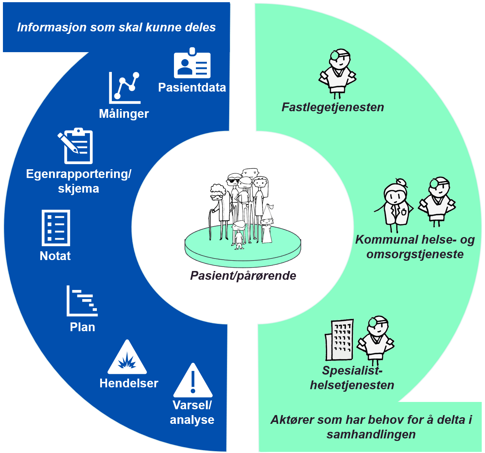

| Status | Version | Maturity | Normative level |
|:-------------|:------------------|:------|:-------|
| Work in progress | v0.7 | draft  | ikke normert |

Direktoratet for e-helse har et overordnet mål om å øke digital samhandling mellom aktørene i helse- og omsorgssektoren. Det er startet en rekke tiltak innenfor området data- og dokumentdeling. Dette arbeidet er prioritert fordi data- og dokumentdeling er samhandlingsformer som tas i bruk på ulike måter innen stadig nye områder i helse- og omsorgstjenesten for å støtte opp under identifiserte behov.  

Innen digital hjemmeoppfølging (DHO) er behovet for datadeling spesielt stort. Pasientene som behandles trenger ofte fortløpende oppfølging fra flere virksomheter og på tvers av primær- og spesialisthelsetjenesten i et behandlingsforløp. Mange tjenestetilbydere ser at eksisterende samhandlingsløsninger ikke understøtter samhandlingsbehovet der hyppige oppdateringer, dialog og ansvarsoverganger forekommer, slik som for pasienter som benytter DHO.  Hensikten med målarkitekturen er å sikre en koordinert utvikling av og bidra til økt bruk av datadeling i sektoren.  

## Hva er Digital hjemmeoppfølging

Digital hjemmeoppfølging handler om å følge opp, behandle og kommunisere med pasienter på nyte måter ved hjelp av ulike former for teknologistøtte.

!!! quote "Nasjonalt velferdsteknologiprogram, er det tatt utgangspunkt i følgende definisjon"

    Avstandsoppfølging omfatter de aktiviteter/handlinger som muliggjør at pasienten, utenfor de tradisjonelle arenaer hvor pasienter møter helsepersonell, kan tilegne seg, registrere og dele klinisk relevant informasjon om sin helsetilstand elektronisk, med formål om å gi informasjon eller veiledning til pasientens egenmestring, og/eller gi beslutningsstøtte til diagnostisering, behandling eller oppfølging for helsepersonell.

Det er vesentlig at oppfølgingen ikke begrenses til der pasienten bor, men at digital hjemmeoppfølging også skal kunne benyttes andre steder, for eksempel på jobb, skole, institusjon, på reise og hos ulike helseaktører. Pasienten kan i prinsippet oppholde seg hvor som helst fysisk, men likevel kunne nå et avstandsbasert helsetilbud når det er forsvarlig. Figuren under viser de viktigste aktørene og noen av de relevant informasjon som kan benyttes i forbindelse med DHO. 

<figure markdown>
  { width="500" }
  <figcaption>Figuren illustrerer overordnet hvilke aktører som kan være involvert i tjenesteforløp som inkluderer DHO og eksempel på informasjon som er relevant å dele.</figcaption>
</figure>

I 2021 ble det i rapport fra de regionale helseforetakene foreslått følgende definisjon

**Digital hjemmeoppfølging innebærer at hele eller deler av et behandlingstilbud foregår uten fysisk kontakt, der dialog og deling av data mellom pasient/bruker og behandler(e) skjer digitalt.** Arbeidet med målarkitekturen har fokus på oppfølging av pasienten basert på data fra pasienten, som vist i figuren under.  

<figure markdown>
  [{ width="700" }](img/hva-er-DHO.png)
  <figcaption>Hovedfokus for målarkitekturen er den delen av DHO som handler om oppfølging basert på data fra pasienten</figcaption>
</figure>

Figuren visualiserer hva ulike kategorier av oppfølging og behandlingstjenester som digital hjemmeoppfølging kan inneholde. Forslaget til definisjon har til hensikt å romme en bredde av ulike former for digital oppfølging og samhandling mellom pasienten og helsetjenesten. Figuren bør oppdateres etter hvert som denne typen tjenester utvikles videre, og det skal jobbes videre med definisjonsbeskrivelsen gjennom Nasjonalt velferdsteknologiprogram.

## Formålet med målarkitekturen

Målarkitekturen skal være et verktøy for å koordinere og samle innsatsen i sektoren slik at alle aktørene arbeider i samme retning for å realisere datadeling innen behovsområdet for digital hjemmeoppfølging.

Målarkitekturen skal bidra til:

* Gjøre det enklere å gjennomføre arkitekturstyring regionalt, nasjonalt og for andre grupperinger av dataansvarlige gjennom å etablere felles prinsipper, arkitekturmål og beskrive arkitekturmønstre. Dette inkluderer å:  
  * Dokumentere felles arkitekturvalg og anbefalte samhandlingsmønster for datadeling innen DHO
  * Beskrive informasjonstjenester og felleskomponenter som må etableres for å realisere digital samhandling i form av datadeling
* Gi oversikt over behovsbildet for samhandling innen DHO, ved å:
  * Beskrive behov for informasjon og samhandling på tvers av virksomheter og omsorgsnivå med spesielt fokus på behov knyttet til helsetjenester der DHO benyttes
  * Beskrive behov for normerende produkter som trengs for å understøtte semantisk samhandling
* Skal fungere som verktøy for kommunikasjon med helse- og omsorgstjenesten, leverandører og NHN
  * Benyttes i drøfting og forankring av felles retning for utvikling av datadelingsløsninger
* Beskrive juridisk mulighetsrom for realisering av samhandling ved hjelp av datadeling

## Målgruppe og leserveiledning

Målgruppen for målarkitekturen er primært arkitekter og tekniske prosjektledere, men er også relevant for beslutningstagere, prosjektledere, helsepersonell og utviklere innen helse- og omsorgssektoren.

### Leserveiledning
<!-- GK: Kan vi gjøre det lettere for leseren, ved å strukturere innholdet i målarkitekturen slik at det er tydelig for leseren hvordan den bør leses, også uten å få med seg dette avsnittet? -->

!!! info inline end "NB!"

    NB! Deler av behovsbeskrivelsen er teknisk anlagt og vil være vanskelig tilgjengelig for lesere som ikke har inngående kjennskap til metoder for informasjonsarkitektur.

Kapitlene som sorterer under *Prinsipper og metode* og *Kontekst for målarkitekturen* er å anse som bakgrunn, men er svært viktig for å forstå grunnlaget, innholdet og anbefalingene som beskrives i hoveddelen av målarkitekturen. Hoveddelen sorterer under *Behov* og *Anbefalinger datadeling*, denne delen beskriver fem sider knyttet til bruk av datadeling for samhandling mellom virksomheter og omsorgsnivå innenfor bruksområdet DHO.  

* [Overordnet behovsbilde](Behovsbilde.md) beskriver overordnede brukerhistorier, behov og informasjonstjenester som kan understøtte behovene
* [Konsepter realisering](Konsepter-realisering.md) beskriver konseptene som er vurdert for å etablere datadeling
* [Juridiske rammebetingelser](Juridiske-rammebetingelser.md) beskriver det juridiske handlingsrommet for å etablere datadeling ved å oppsummere de relevante juridiske rammene som dagens lover og regler oppstiller for de vurderte konseptene for datadeling
* [Målarkitektur samhandling DHO](Malarkitektur-samhandling.md) beskriver det arkitekturtekniske underlaget for hvilke kapabiliteter og informasjonstjenester som bør realiseres, samt de grunnleggende prosessene og funksjonene virksomhetene må etablere for å realisere og forvalte effektive datadelingstjenester.
* [Anbefalte tiltak](Anbefalte-tiltak.md) foreslå tiltak som kan gjennomføres for å understøtte etableringen av datadeling mellom virksomheter innen for behovsområdet DHO

### Målgruppe for målarkitekturen

Alle delene frem til og med [konsepter](Konsepter-realisering.md) for realisering anbefales for alle som er interessert i målarkitektur for datadeling innen DHO. Her beskrives målbilde, prinsipper, behov og overordnede løsningskonsepter som kan benyttes for å etablere datadeling for helsetjenester og tjenesteforløp som benytter DHO.

[Juridiske rammebetingelser](Juridiske-rammebetingelser.md) egner seg for jurister og arkitekter som må forholde seg til de juridiske rammene for datadeling ved utvikling og innføring av konkrete løsninger for datadeling.

[Målarkitektur samhandling DHO](Malarkitektur-samhandling.md) egner seg hovedsaklig for virksomhetsarkiteter og løsningsarkitekter som må kjenne til grunnlaget for de arkitekturtekniske vurderingene som ligger til grunn for anbefalingene.

[Anbefalte tiltak](Anbefalte-tiltak.md) egner seg for ledere og arkitekter som trenger å forstå hvilke tiltak som må gjennomføres i sentral infrastruktur for å understøtte bruk av datadeling til samhandling mellom virksomheter og omsorgsnivå.

## Omfang og avgrensninger

!!! note "Om eksisterende [målarkitektur for datadeling i helsesektoren](https://www.ehelse.no/standardisering/standarder/malarkitektur-for-datadeling-i-helse-og-omsorgssektoren)"

    Målarkitekturen er en beskrivelse av en fremtidig ønsket situasjon, hvor helsesektoren kan dele strukturerte helseopplysninger på tvers av virksomheter og omsorgsnivå. Det er tatt utgangspunkt i behovene og de lovmessige rettigheter og plikter til innbyggere og helsepersonell. Ut ifra dette er det beskrevet ulike bruksområder for datadeling. Målarkitekturen har fokus på samhandling mellom helsepersonell på tvers av virksomheter og samhandling med innbygger.

Målarkitekturen for datadeling innen DHO bygger på eksisterende målarkitektur for datadeling i helsesektoren og utforsker brukertilfeller som ikke er behandlet i den generelle målarkitekturen for datadeling. Omfanget for målarkitekturen for datadeling innen DHO er avgrenset til å understøtte helsetjenester hvor DHO benyttes aktivt i behandlingsforløpet. Målarkitekturen skal derfor beskrive juridiske, behovsmessige og tekniske rammer for hvordan datadeling innen DHO bør realiseres. Målarkitekturen vil videre peke på nødvendige tiltak for infrastruktur, semantiske spesifikasjoner og foreslåtte realiseringskonsepter for å realisere samhandling i form av datadeling.

* Det er fokus på tilrettelegging for samhandling mellom virksomheter og omsorgsnivå og samhandling med innbygger
  * Noen av de samme mekanismene kan også benyttes for samhandling internt i en virksomhet, men det er ikke hovedfokuset i dette arbeidet
* Det er fokus på utveksling av strukturert informasjon mellom virksomheter og omsorgsnivå. Høy semantisk samhandlingsevne (hva dataene betyr og hvordan de er definert) er nødvendig
* Det er fokus på primærbruk av data. Sekundærbruk av data er ikke et sentralt tema for dette arbeidet
  * Det antas at utveksling av strukturert informasjon kan være nyttig også knyttet til sekundærbruk innen forskning og kvalitetssikring av helsehjelp
* Velferdsteknologi (tradisjonell trygghets og mestringsteknologi) er ikke en del av omfanget for målarkitekturen for DHO.
  * Behovene knyttet til trygghet og mestring er relativt godt analysert i tidligere arbeid og det er bare små overlapp mellom DHO og trygghet og mestringsområdet
  * Noen teknologiske løsninger og utfordringer er imidlertid sammenfallende med trygghet og mestringsområdet og vil også være en naturlig del av behovsbildet og løsningene som benyttes innen DHO området
* Der viktige felleskomponenter eller semantiske spesifikasjoner ikke eksisterer vil målarkitekturen peke på nødvendige tiltak for å realisere disse
  * Plan for realisering av tiltakene ligger utenfor mandatet til målarkitekturen

### Problemstillinger som **ikke** behandles

Problemstillinger knyttet til avtalemessige og merkantile forhold er ikke behandlet i målarkitekturen. Dette inkluderer:

* Finansiering av løsninger og fellesløsninger
* Avtalemessige forhold mellom virksomhetene beskrives ikke i detalj
* Problemstillinger knyttet til sourcing konseptene som stilles opp setter krav til sourcing strategier for de involverte partene men målarkitekturen behandler ikke hvordan avtalene rundt dette skal utformes

### Modenhet

Bruk av datadeling for digital samhandling mellom virksomheter, omsorgsnivå og pårørende/pasient er relativt umodent. Til tross for mange utprøvingsprosjekter i Nasjonalt velferdsteknologiprogram har arbeidet med samhandling i form av datadeling kommet relativt kort og det er få tjenester som er realisert og tatt i bruk av helsetjenesten. Erfaringsgrunnlaget er derfor lite og anbefalingene knyttet til datadeling er derfor beheftet med stor usikkerhet. Det vil være behov for revisjon av anbefalingene etterhvert som flere tjenester blir realisert.

Modenheten er også relativt lav når det gjelder å ta i bruk Digital Hjemmeoppfølging i helsetjenesten. Men her er erfaringsunderlaget bedre etter at flere utprøvingsprosjekter er gjennomført i perioden 2018-2021. En erfaringsoppsummering er publisert av Helsedirektoratet.

* [Digital hjemmeoppfølging - sluttrapport fra nasjonal utprøving 2018-2021](https://www.helsedirektoratet.no/rapporter/digital-hjemmeoppfolging-sluttrapport-fra-nasjonal-utproving-2018-2021)
