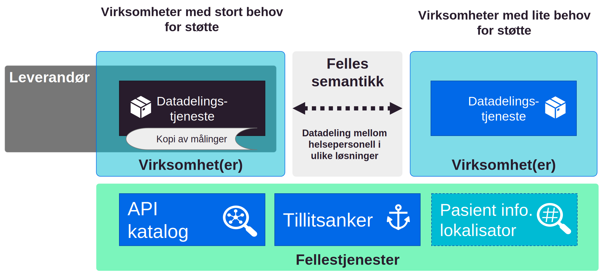

| Status | Version | Maturity | Normative level |
|:-------------|:------------------|:------|:-------|
| Prerelease | v0.9.4 | review | ikke normert |

Helse- og omsorgssektoren har samlet seg om en nasjonal e-helsestrategi. Et av målene i strategien er tilgjengelig informasjon og [styrket digital samhandling](https://www.ehelse.no/strategi/nasjonal-e-helsestrategi-for-helse-og-omsorgssektoren/mal-4-tilgjengelig-informasjon-og-styrket-samhandling). Digital samhandling, styrket informasjonsforvaltning og økt standardisering skal sørge for at oppdaterte helseopplysninger er sikre, av god kvalitet og lett tilgjengelig ved behov. Dette vil legge til rette for en mer aktiv innbygger, bedre og mer effektiv helsehjelp samt bedre datanalyser til kvalitetsforbedring, helseovervåkning og styring.  

Innen digital hjemmeoppfølging (DHO) er behovet for bedre informasjonsflyt spesielt stort. Pasientene som behandles trenger ofte fortløpende oppfølging fra flere virksomheter og på tvers av primær- og spesialisthelsetjenesten i et behandlingsforløp. Mange tjenestetilbydere ser at eksisterende samhandlingsløsninger ikke understøtter samhandlingsbehovet der hyppige oppdateringer, dialog og ansvarsoverganger forekommer, slik som for pasienter som benytter DHO. Deling av strukturerte helseopplysninger mellom helsepersonell og med innbygger ved hjelp av datadeling er en ny samhandlingsform som gir helt nye muligheter for å digitalisere helse- og omsorgstjenestene og ta i bruk innovative løsning.  

## Hvorfor målarkitektur?

[Hensikten med målarkitekturen](innledning/index.md#formalet-med-malarkitekturen) er å sikre en koordinert utvikling og bidra til økt bruk av datadeling i sektoren. Målarkitekturen skal bidra til koordineringen ved å dokumentere felles arkitekturvalg, felles behov og beskrive konsepter som kan benyttes til datadeling. I tillegg beskrives de juridiske rammene som løsningene må fungere innenfor på kort sikt og hva dette betyr i forhold til ulike løsningskonsepter.

## Kartlagte behov

Som et ledd i arbeidet med målarkitekturen for datadeling innen DHO er [behovene for samhandling analysert](behov/index.md). Virksomhetene som er involvert i å etablere tjenesteforløp som inneholder DHO-tjenester peker spesielt på behovet for samhandling om felles planer, legemiddellister og målinger. Alle disse informasjonstjenestene vil dra nytte av styrket digital samhandling i form av datadeling av strukturert informasjon mellom virksomheter og omsorgsnivå. Den foreløpige analysen peker på at også andre informasjonstjenester som er etterspurt i forbindelse med DHO, kan understøttes med datadeling. Detaljene i figuren beskrives nærmere i [behovskapittelet](behov/index.md#eksempel-pa-aktrer-og-samhandlingsbehov)

<figure markdown>
  [{ width="500" }](img/veikart-DHO.svg)
  <figcaption>Figuren illustrerer hvilke aktører som kan være involvert i tjenesteforløp som inkluderer DHO og eksempel på informasjon som er relevant å dele mellom aktørene.</figcaption>
</figure>

## Målarkitektur for datadeling

Datadeling mellom virksomheter kan etableres på mange måter og målarkitekturen går igjennom flere mulige [konsepter for å realisere samhandling](vedlegg/Konsepter-realisering.md) i form av datadeling. Etter å ha vurdert fordeler og ulemper ved de ulike konseptene anbefales en fleksibel tilnærming som kombinerer elementer fra flere konsepter for den videre utviklingen. Virksomhetene bør tar hensyn til lokale og regionale samhandlingsbehov når datadelingstjenester for DHO skal etableres. Aktørene må også ta hensyn til kompleksiteten i tjenesteforløpene som skal understøttes, noe som ofte krever samarbeid mellom klinikere fra flere virksomheter innenfor en region eller et helsefellesskap.  

<figure markdown>
  [{ width="700" }](img/malarkitektur.svg)
  <figcaption>Målarkitektur for datadeling, med kombinasjon av distribuerte datadelingstjenester, bruk av leverandør som databehandler og samarbeid mellom virksomheter. Datadelingen mellom virksomheter må baseres på felles semantiske spesifikasjoner for utveksling av informasjon mellom ulike datadelingsløsninger. Nødvendige fellestjenester må etableres for å understøtte datadelingen i form av API katalog, tillitsanker og pasientinformasjonslokalisator.</figcaption>
</figure>

### Arkitekturvalg

Målarkitekturen for datadeling innen DHO peker på fem arkitekturvalg:

1. Basert på samhandlingsbehovene som er kartlagt i forbindelse med DHO og målinger er det datadeling som understøtter flest brukerbehov mest effektivt.
2. Målarkitekturen anbefaler en fleksibel modell for etablering av datadeling mellom virksomheter og omsorgsnivå.
3. Målarkitekturen anbefaler løsningsalternativer som kan realiseres innenfor gjeldende rett.
4. Etableringen av datadelingsløsninger må bruke felles semantiske spesifikasjoner basert på internasjonale standarder.
5. Målarkitekturen forutsetter bruk av eksisterende og planlagte felleskomponenter og fellestjenester, som er beskrevet i målarkitektur for datadeling.

## Juridiske vurderinger

Det juridiske handlingsrommet for etablering av datadelingsløsninger er delvis beskrevet i [Målarkitektur for datadeling i helse og omsorgssektoren](https://www.ehelse.no/standardisering/standarder/malarkitektur-for-datadeling-i-helse-og-omsorgssektoren) fra 2021. I arbeidet med målarkitektur for datadeling mellom virksomheter, og spesielt knyttet til datadeling innen DHO-området, er noen flere [juridiske problemstillinger](juridisk/index.md) vurdert. Spesielt gjelder dette den dataansvarlige virksomhet sitt handlingsrom knyttet til å etablere datadelingstjenester i egen eller ekstern infrastruktur for samhandling med andre virksomheter. Dette er et sentralt spørsmål når dataansvarlig virksomhet skal vurdere hvordan datadeling skal etableres og hvordan eksterne leverandører kan bidra i dette arbeidet. Konklusjonen er at dataansvarlig virksomhet kan etablere datadelingstjeneste og lagringsløsning for den informasjonen som skal deles ved at en ekstern databehandler etablerer disse løsningene for den dataansvarlige virksomheten.  
