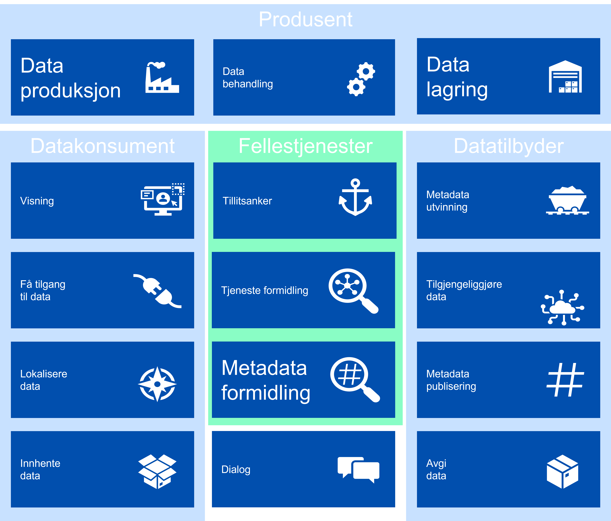

| Status | Version | Maturity | Normative level |
|:-------------|:------------------|:------|:-------|
| Work in progress | v0.6 | draft | ikke normert |

Direktoratet for e-helse har sammen med helse- og omsorgssektoren et [strategisk mål](https://www.ehelse.no/strategi/nasjonal-e-helsestrategi-for-helse-og-omsorgssektoren/mal-4-tilgjengelig-informasjon-og-styrket-samhandling) om å styrke digital samhandling mellom aktørene i helse- og omsorgssektoren. Dette målet sammenfaller med de strategiske føringen for Digital hjemmeoppfølging som har identifisert et effektmål knyttet til samhandling:  

!!! quote "Effektmål samhandling"

    Økt, bedre og sikker digital samhandling på tvers av tjenestenivåer og øvrige sektorer

## Hvorfor målarkitektur?

Effektiv digital samhandling krever endrede prosesser og etablering av tekniske løsninger i mange virksomheter, derfor er det [målarkitekturens overordnede mål](Innledning.md#formalet-med-malarkitekturen) å koordinere innsatsen i helsesektoren slik at etableringen av datadeling blir så effektiv som mulig. Målarkitekturen skal bidra til koordineringen ved å dokumentere felles arkitekturvalg, felles behov og beskrive konsepter som kan benyttes til datadeling. Det er også viktig å beskrive det juridiske handlingsrommet som løsningene må fungere innenfor på kort sikt og peke på behov knyttet til regelverksutvikling hvis samhandlingsbehovene ikke kan dekkes innenfor gjeldende lover å regler.

## Kartlagte behov

Som et ledd i arbeidet med målarkitekturen for datadeling innen DHO er [behovene for samhandling analysert](Behovsbilde.md). Virksomhetene som er involvert i å etablere tjenesteforløp som inneholder DHO tjenester peker spesielt på behovet for samhandling om felles planer, legemiddellister og målinger. Alle disse informasjonstjenestene vil dra nytte av økt digital samhandling i form av datadeling av strukturert informasjon mellom virksomheter og omsorgsnivå. Den foreløpige analysen peker også på at en rekke andre informasjonsbehov som er etterspurt i forbindelse med DHO understøttes best i form av samhandling i form av datadeling.

Figuren under viser de viktigste aktørene og identifiserte informasjonsbehov.

<figure markdown>
  { width="500" }
  <figcaption>Figuren illustrerer overordnet hvilke aktører som kan være involvert i tjenesteforløp som inkluderer DHO og eksempel på informasjon som er relevant å dele mellom aktørene.</figcaption>
</figure>

## Bruk av datadeling

Datadeling mellom virksomheter kan etableres på mange måter og målarkitekturen går igjennom flere mulige [konsepter for å realisere samhandling](Konsepter-realisering.md) i form av datadeling. Etter å ha vurdert fordeler og ulemper ved konseptene anbefales en fleksibel tilnærming som kombinerer elementer fra flere konsepter for den videre utviklingen. Vi anbefaler at virksomhetene tar hensyn til lokale og regionale samhandlingsbehov når datadelingsløsninger for DHO skal etableres. Aktørene må også ta hensyn til kompleksiteten i tjenesteforløpene som skal understøttes, som ofte krever samarbeid mellom klinikere fra flere separate virksomheter. En skisse av anbefalt konsept er gjengitt i figuren.

<figure markdown>
  [{ width="500" }](img/malarkitektur.png)
  <figcaption>Anbefalt konsept for datadeling, med kombinasjon av distribuerte datadelingsløsninger og samarbeid om fellesløsninger</figcaption>
</figure>

## Juridisk handlingsrom

Det juridiske handlingsrommet er delvis beskrevet i [Målarkitektur for datadeling i helse og omsorgssektoren](https://www.ehelse.no/standardisering/standarder/malarkitektur-for-datadeling-i-helse-og-omsorgssektoren) fra 2021. I arbeidet med målarkitektur for datadeling mellom virksomheter, og spesielt knyttet til datadeling innen DHO området, er noen flere [juridiske problemstillinger](Juridiske-rammebetingelser.md) diskutert. Spesielt gjelder dette den dataansvarlige virksomhet sitt handlingsrom knyttet til å etablere datadelingsløsninger i egen eller ekstern infrastruktur. Dette er et sentralt spørsmål når dataansvarlig virksomhet skal vurdere hvordan datadeling skal løses og hvordan eksterne leverandører kan bidra i dette arbeidet. Vurderingen slår fast at dataansvarlig virksomhet kan etablere datadelingsløsning og lagrinsløsning for den informasjonen som skal deles ved hjelp av en ekstern databehandler.

## Forutsetninger for datadeling

Etablering av datadeling mellom virksomheter forutsetter endel underliggende tjenester, prosesser og funksjoner som virksomhetene må etablere selv eller som krever støtte fra fellestjenester. Den [arkitekturtekniske delen](Malarkitektur-samhandling.md) av målarkitekturen for datadeling innen DHO bygger videre på  eksisterende [Målarkitektur for datadeling i helse og omsorgssektoren](https://www.ehelse.no/standardisering/standarder/malarkitektur-for-datadeling-i-helse-og-omsorgssektoren) men har spesielt fokus på hvordan virksomhetene kan understøtte kliniske og administrative prosesser i helsetjenesten ved hjelp av datadeling. Det arkitekturtekniske rammeverket legger grunnlaget for betraktningene som er knyttet til løsningskonseptene for etableringen av de faktiske datadelingsløsningene. Behovet for felleskomponenter i samhandlingsinfrastrukturen bekreftes av dette arbeidet og behovet for nødvendige tiltak knyttet til felleskomponenter og felles semantiske spesifikasjoner blir også tydelig.

<figure markdown>
  [{ width="500" }](img/kapabiliteter-enkel.png)
  <figcaption>Oversikt over nødvendige evner for å realisere datadeling</figcaption>
</figure>

## Anbefalte tiltak

Arbeidet med målarkitekturen konkluderer med at det er behov for en rekke [tiltak](Anbefalte-tiltak.md) for å etablere effektiv, sikker og hensiktsmessig datadeling mellom virksomheter som understøtter virksomhetenes samhandlingsbehov innen DHO. De fleste av tiltakene er knyttet til etablering av felleskomponenter i sentral infrastruktur som er nødvendig for å understøtte etablering og bruken av datadeling i helsetjenesten. I tillegg er det stort behov for økt omfang og kvalitet på felles semantiske spesifikasjoner sammen med enhetlig bruk av kodeverk og terminologi slik at virksomhetene kan forholde seg til enhetlige grensesnitt for datadeling. I tillegg er det viktig å beskrive hvordan behov kan understøttes med bruk av andre former for samhandling som ikke er utbredt i helsesektoren idag. Spesielt bør det arbeides med å etablere hendelsesbaserte løsninger for å understøtte behov for sanntidsoppdateringer mellom virksomhetene, uavhengig av hvem som tildeler utstyr eller kontrollerer infrastruktur for innsamling av data.
