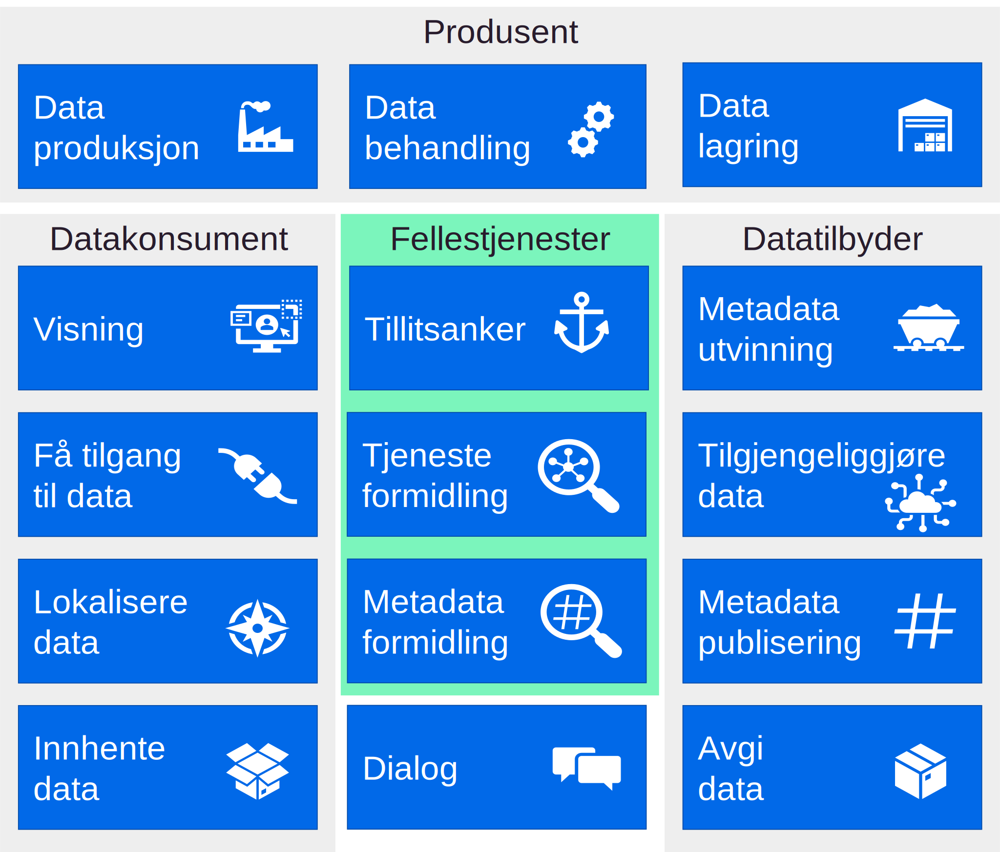
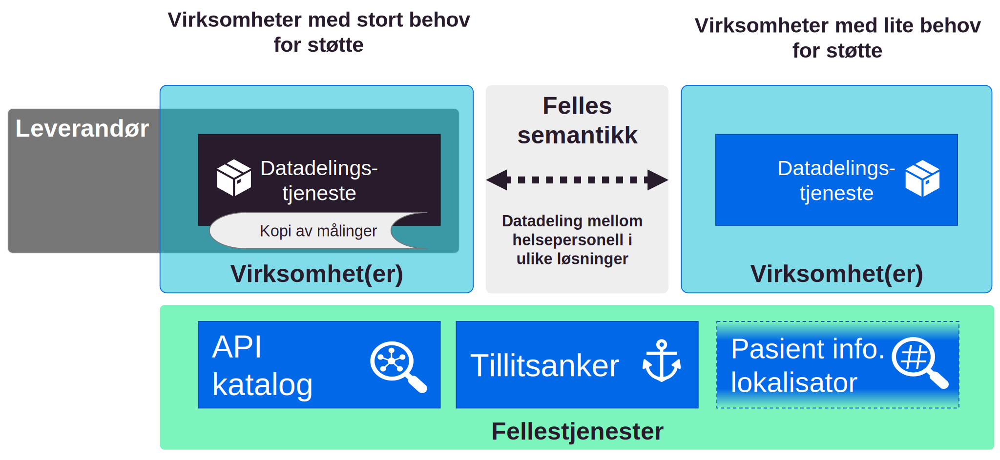

| Status | Version | Maturity | Normative level |
|:-------------|:------------------|:------|:-------|
| Prerelease | v0.9.3 | review | ikke normert |

Direktoratet for e-helse har sammen med helse- og omsorgssektoren et [strategisk mål](https://www.ehelse.no/strategi/nasjonal-e-helsestrategi-for-helse-og-omsorgssektoren/mal-4-tilgjengelig-informasjon-og-styrket-samhandling) om å styrke digital samhandling mellom aktørene i sektoren. Dette målet sammenfaller med de strategiske føringene for Digital hjemmeoppfølging, som har identifisert et effektmål knyttet til samhandling:  

!!! quote "Effektmål samhandling"

    Økt, bedre og sikker digital samhandling på tvers av tjenestenivåer og øvrige sektorer

Digital hjemmeoppfølging har følgende definisjon:

!!! note "Digital Hjemmeoppfølging"

    Digital hjemmeoppfølging innebærer at hele eller deler av et behandlingstilbud foregår uten fysisk kontakt, der dialog og deling av data mellom pasient/bruker og behandler(e) skjer digitalt. Forslaget til definisjon har til hensikt å romme en bredde av ulike typer oppfølging og samhandling mellom pasienten og helsetjenesten. I arbeidet med målarkitektur og konsepter er hovedfokus på "Oppfølging basert på data fra pasient; data fra sensorer og medisinsk utstyr, samt pasientrapporterte data som symptomer, funksjon og målinger"

## Hvorfor målarkitektur?

Effektiv digital samhandling krever endrede prosesser og etablering av tekniske løsninger i mange virksomheter. Derfor er [målarkitekturens overordnede mål](innledning/index.md#formalet-med-malarkitekturen) å koordinere innsatsen i helsesektoren slik at etableringen av datadeling blir så effektiv som mulig. Målarkitekturen skal bidra til koordineringen ved å dokumentere felles arkitekturvalg, felles behov og beskrive konsepter som kan benyttes til datadeling. Det er også viktig å beskrive det juridiske handlingsrommet som løsningene må fungere innenfor på kort sikt og peke på behov knyttet til regelverksutvikling hvis samhandlingsbehovene ikke kan dekkes innenfor gjeldende lover og regler.

## Kartlagte behov

Som et ledd i arbeidet med målarkitekturen for datadeling innen DHO er [behovene for samhandling analysert](behov/index.md). Virksomhetene som er involvert i å etablere tjenesteforløp som inneholder DHO-tjenester peker spesielt på behovet for samhandling om felles planer, legemiddellister og målinger. Alle disse informasjonstjenestene vil dra nytte av styrket digital samhandling i form av datadeling av strukturert informasjon mellom virksomheter og omsorgsnivå. Den foreløpige analysen peker på at også andre informasjonstjenester som er etterspurt i forbindelse med DHO, kan understøttes med datadeling. Detaljene i figuren beskrives nærmere i [behovskapittelet](behov/index.md#eksempel-pa-aktrer-og-samhandlingsbehov)

<figure markdown>
  [{ width="500" }](img/veikart-DHO.svg)
  <figcaption>Figuren illustrerer hvilke aktører som kan være involvert i tjenesteforløp som inkluderer DHO og eksempel på informasjon som er relevant å dele mellom aktørene.</figcaption>
</figure>

## Krav til etablering av datadeling

Utveksling av informasjon ved hjelp av datadeling mellom virksomheter forutsetter at virksomhetene realiserer nødvendige evner ([kapabiliteter](vedlegg/Kapabiliteter.md)) for å understøtte datadeling. Det er hensikstmessig at noen av evnene realiseres som fellestjenester i nasjonal infrastruktur. Den [arkitekturtekniske delen](kravoganbefalinger/index.md) av målarkitekturen beskriver [nødvendige evner](kravoganbefalinger/index.md#ndvendige-kapabiliteter-for-datadeling) for å realisere datadeling, samt overordnede prosesser og funksjoner som kan realisere disse evnene. Denne delen av målarkitekturen legger grunnlaget for betraktningene som er knyttet til løsningskonseptene for etableringen av datadelingsløsningene. Behovet for fellestjenester i samhandlingsinfrastrukturen, som beskrives i [Målarkitektur for datadeling i helse og omsorgssektoren](https://www.ehelse.no/standardisering/standarder/malarkitektur-for-datadeling-i-helse-og-omsorgssektoren), bekreftes gjennom arbeidet med DHO. Noen viktige fellestjenester mangler i infrastrukturen for digital samhandling, og det anbefales tiltak for å etablere fellestjenester og felles semantiske spesifikasjoner i vedlegget [anbefalte tiltak](vedlegg/Anbefalte-tiltak.md).

<figure markdown>
  [{ width="500" }](img/kapabiliteter-enkel.svg)
  <figcaption>Oversikt over nødvendige evner for å realisere datadeling for dataprodusenter, datakonsumenter, datatilbydere og som fellestjenester</figcaption>
</figure>

## Målarkitektur for datadeling

Datadeling mellom virksomheter kan etableres på mange måter og målarkitekturen går igjennom flere mulige [konsepter for å realisere samhandling](vedlegg/Konsepter-realisering.md) i form av datadeling. Etter å ha vurdert fordeler og ulemper ved de ulike konseptene anbefales en fleksibel tilnærming som kombinerer elementer fra flere konsepter for den videre utviklingen. Virksomhetene bør tar hensyn til lokale og regionale samhandlingsbehov når datadelingstjenester for DHO skal etableres. Aktørene må også ta hensyn til kompleksiteten i tjenesteforløpene som skal understøttes, noe som ofte krever samarbeid mellom klinikere fra flere virksomheter innenfor en region eller et helsefellesskap.  

<figure markdown>
  [{ width="700" }](img/malarkitektur.svg)
  <figcaption>Målarkitektur for datadeling, med kombinasjon av distribuerte datadelingstjenester, bruk av leverandør som databehandler og samarbeid mellom virksomheter, samt fellestjenester for å ivareta API katalog, tillitsanker og pasientinformasjonslokalisator. Selve datadelingen mellom virksomheter må baseres på felles semantiske spesifikasjoner for utvksling av informasjon mellom ulike løsninger.</figcaption>
</figure>

### Arkitekturvalg

Målarkitekturen for datadeling innen DHO peker på fem arkitekturvalg:

1. Basert på samhandlingsbehovene som er kartlagt i forbindelse med DHO og målinger er det datadeling som understøtter flest brukerbehov mest effektivt.
2. Målarkitekturen anbefaler en fleksibel modell for etablering av datadeling mellom virksomheter og omsorgsnivå.
3. Målarkitekturen anbefaler løsningsalternativer som kan realiseres innenfor gjeldende rett.
4. Etableringen av datadelingsløsninger må bruke felles semantiske spesifikasjoner basert på internasjonale standarder.
5. Målarkitekturen forutsetter bruk av eksisterende og planlagte felleskomponenter og fellestjenester, som er beskrevet i målarkitektur for datadeling.

## Juridiske vurderinger

Det juridiske handlingsrommet er delvis beskrevet i [Målarkitektur for datadeling i helse og omsorgssektoren](https://www.ehelse.no/standardisering/standarder/malarkitektur-for-datadeling-i-helse-og-omsorgssektoren) fra 2021. I arbeidet med målarkitektur for datadeling mellom virksomheter, og spesielt knyttet til datadeling innen DHO-området, er noen flere [juridiske problemstillinger](juridisk/index.md) vurdert. Spesielt gjelder dette den dataansvarlige virksomhet sitt handlingsrom knyttet til å etablere datadelingstjenester i egen eller ekstern infrastruktur, for samhandling med andre virksomheter. Dette er et sentralt spørsmål når dataansvarlig virksomhet skal vurdere hvordan datadeling skal etableres og hvordan eksterne leverandører kan bidra i dette arbeidet. Konklusjonen er at dataansvarlig virksomhet kan etablere datadelingstjeneste og lagringsløsning for den informasjonen som skal deles ved at en ekstern databehandler etablerer disse løsningene for den dataansvarlige virksomheten.  
