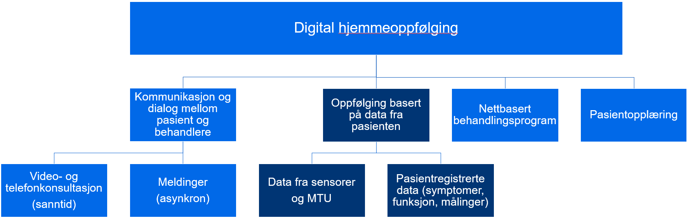
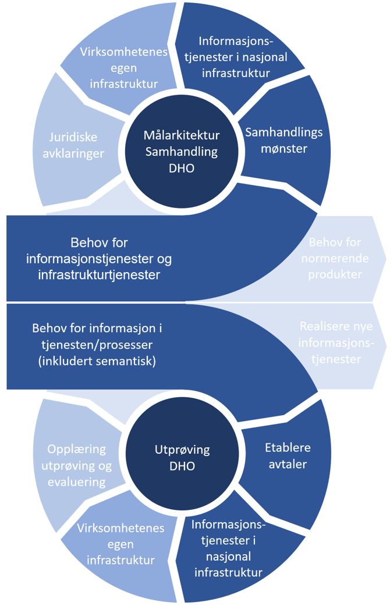

| Status | Version | Maturity | Normative level |
|:-------------|:------------------|:------|:-------|
| Prerelease | v0.8.1 | review  | ikke normert |

Helsesektoren har som overordnet mål å [styrke digital samhandling](https://www.ehelse.no/strategi/nasjonal-e-helsestrategi-for-helse-og-omsorgssektoren/mal-4-tilgjengelig-informasjon-og-styrket-samhandling) mellom aktørene i helse- og omsorgssektoren. Det er derfor startet en rekke tiltak innenfor området data- og dokumentdeling. Dette arbeidet er prioritert fordi data- og dokumentdeling er samhandlingsformer som tas i bruk på ulike måter innen stadig nye områder i helse- og omsorgstjenesten for å støtte opp under identifiserte behov.  

Innen digital hjemmeoppfølging (DHO) er behovet for datadeling spesielt stort. Pasientene som behandles trenger ofte fortløpende oppfølging fra flere virksomheter og på tvers av primær- og spesialisthelsetjenesten i et behandlingsforløp. Mange tjenestetilbydere ser at eksisterende samhandlingsløsninger ikke understøtter samhandlingsbehovet der hyppige oppdateringer, dialog og ansvarsoverganger forekommer, slik som for pasienter som benytter DHO.  Hensikten med målarkitekturen er å sikre en koordinert utvikling og bidra til økt bruk av datadeling i sektoren.  

## Hva er Digital hjemmeoppfølging

Digital hjemmeoppfølging handler om å følge opp, behandle og kommunisere med pasienter på nye måter ved hjelp av ulike former for teknologistøtte.

!!! quote "Definisjon av Digital hjemmeoppfølging"

    Digital hjemmeoppfølging innebærer at hele eller deler av et behandlingstilbud foregår uten fysisk kontakt, der dialog og deling av data mellom pasient/bruker og behandler(e) skjer digitalt.

Det er vesentlig at oppfølgingen ikke begrenses til der pasienten bor, men at DHO også kan benyttes andre steder, for eksempel på jobb, skole, institusjon, på reise og hos ulike helseaktører. Pasienten kan i prinsippet oppholde seg hvor som helst fysisk, men likevel kunne motta oppfølging fra helsetjenesten når det er forsvarlig. Arbeidet med målarkitekturen har fokus på oppfølging av pasienten basert på data fra pasienten, som vist i figuren under. Se forøvrig oppsummering av målbildet for DHO.  

<figure markdown>
  [{ width="700" }](../img/hva-er-DHO.png)
  <figcaption>Hovedfokus for målarkitekturen er den delen av DHO som handler om oppfølging basert på data fra pasienten</figcaption>
</figure>

Figuren visualiserer hva ulike kategorier av oppfølging og behandlingstjenester som digital hjemmeoppfølging kan inneholde. Forslaget til definisjon har til hensikt å romme ulike former for digital oppfølging og samhandling mellom pasienten og helsetjenesten. Figuren bør oppdateres etter hvert som denne typen tjenester utvikles videre, og det skal jobbes videre med definisjonsbeskrivelsen gjennom Nasjonalt velferdsteknologiprogram.

## Formålet med målarkitekturen

Målarkitekturen skal være et verktøy for å koordinere og samle innsatsen i sektoren slik at alle aktørene arbeider i samme retning for å realisere datadeling innen behovsområdet for digital hjemmeoppfølging.

Målarkitekturen skal bidra til å:

* Gjøre det enklere å gjennomføre arkitekturstyring regionalt, nasjonalt og for andre grupperinger av dataansvarlige gjennom å etablere felles prinsipper, arkitekturmål og beskrive arkitekturmønstre. Dette inkluderer å:  
  * Dokumentere felles arkitekturvalg og anbefalte samhandlingsmønster for datadeling innen DHO
  * Beskrive informasjonstjenester og fellestjenester som må etableres for å realisere digital samhandling i form av datadeling
* Gi oversikt over behovsbildet for samhandling innen DHO, ved å:
  * Beskrive behov for informasjon og samhandling på tvers av virksomheter og omsorgsnivå med spesielt fokus på behov knyttet til helsetjenester der DHO benyttes
  * Beskrive behov for normerende produkter som trengs for å understøtte semantisk samhandling
* Legge til rette for kommunikasjon med helse- og omsorgstjenesten, leverandører og NHN
  * Benyttes i drøfting og forankring av felles retning for utvikling av datadelingsløsninger
* Beskrive juridisk mulighetsrom for realisering av samhandling ved hjelp av datadeling

## Målgruppe og leserveiledning

Målgruppen for målarkitekturen er primært arkitekter og tekniske prosjektledere, men den er også relevant for beslutningstagere, prosjektledere, helsepersonell og utviklere innen helse- og omsorgssektoren.

### Leserveiledning

!!! info inline end "Behov"

    Deler av behovsbeskrivelsen er teknisk anlagt og vil være vanskelig tilgjengelig for lesere som ikke har inngående kjennskap til metoder for informasjonsarkitektur.

* [Behov](../behov/index.md) beskriver overordnede brukerhistorier, informasjonsbehov og prioriteringer av informasjonsbehovene. Denne delen understøttes av en mer [detaljert behovsbeskrivelse](../vedlegg/Detaljert-behovsbilde.md) som ligger i vedlegg.
* [Juridiske vurderinger](../juridisk/index.md) beskriver det juridiske handlingsrommet som eksisterer for å etablere datadeling ved å vurdere [konsepter for realisering](../vedlegg/Konsepter-realisering.md) i forhold til relevante lover og regler.
* [Krav og anbefalinger](../kravoganbefalinger/index.md) beskriver det arkitekturmålbildet og det arkitekturtekniske underlaget for hvilke kapabiliteter og informasjonstjenester som bør realiseres for å nå målbildet. Kapittelet beskriver også de grunnleggende prosessene og funksjonene virksomhetene må etablere for å realisere og forvalte effektive datadelingstjenester.  

#### Vedlegg

* [Konsepter realisering](../vedlegg/Konsepter-realisering.md) beskriver konseptene som er vurdert for å etablere datadeling og understøtter krav og anbefalinger.
* [Anbefalte tiltak](../vedlegg/Anbefalte-tiltak.md) foreslår tiltak som kan gjennomføres for å understøtte etableringen av datadeling mellom virksomheter innen behovsområdet DHO

## Omfang og avgrensninger

!!! note "Om eksisterende [målarkitektur for datadeling i helsesektoren](https://www.ehelse.no/standardisering/standarder/malarkitektur-for-datadeling-i-helse-og-omsorgssektoren)"

    Målarkitekturen er en beskrivelse av en fremtidig ønsket situasjon, hvor helsesektoren kan dele strukturerte helseopplysninger på tvers av virksomheter og omsorgsnivå. Det er tatt utgangspunkt i behovene og de lovmessige rettigheter og plikter til innbyggere og helsepersonell. Ut ifra dette er det beskrevet ulike bruksområder for datadeling. Målarkitekturen har fokus på samhandling mellom helsepersonell på tvers av virksomheter og samhandling med innbygger.

Målarkitekturen for datadeling innen DHO bygger på eksisterende målarkitektur for datadeling i helsesektoren og utforsker brukertilfeller som ikke er behandlet i den generelle målarkitekturen for datadeling. Omfanget for målarkitekturen for datadeling innen DHO er avgrenset til å understøtte helsetjenester hvor DHO benyttes aktivt i behandlingsforløpet. Målarkitekturen skal derfor beskrive juridiske, behovsmessige og tekniske rammer for hvordan datadeling innen DHO bør realiseres. Målarkitekturen vil videre peke på nødvendige tiltak for infrastruktur, semantiske spesifikasjoner og foreslåtte realiseringskonsepter for å realisere samhandling i form av datadeling. Målarkitekturen fokuserer på:

* Tilrettelegging for samhandling mellom virksomheter og omsorgsnivå og samhandling med innbygger
  * Noen av de samme mekanismene kan også benyttes for samhandling internt i en virksomhet, men det er ikke hovedfokuset i dette arbeidet
* Utveksling av strukturert informasjon mellom virksomheter og omsorgsnivå. Høy semantisk samhandlingsevne (hva dataene betyr og hvordan de er definert) er nødvendig
* Primærbruk av data. Sekundærbruk av data er ikke et sentralt tema for dette arbeidet
  * Det antas at utveksling av strukturert informasjon kan være nyttig også knyttet til sekundærbruk innen forskning og kvalitetssikring av helsehjelp
* Velferdsteknologi (tradisjonell trygghets- og mestringsteknologi) er ikke en del av omfanget for målarkitekturen for DHO
  * Behovene knyttet til trygghet og mestring er relativt godt analysert i tidligere arbeid og det er bare små overlapp mellom DHO og trygghet og mestringsområdet
  * Noen teknologiske løsninger og utfordringer er imidlertid sammenfallende med trygghet og mestringsområdet og vil også være en naturlig del av behovsbildet og løsningene som benyttes innen DHO-området
* Der viktige fellestjenester eller semantiske spesifikasjoner ikke eksisterer vil målarkitekturen peke på nødvendige tiltak for å realisere disse
  * Plan for realisering av tiltakene ligger utenfor mandatet til målarkitekturen

### Problemstillinger som **ikke** behandles

Problemstillinger knyttet til avtalemessige og merkantile forhold er ikke behandlet i målarkitekturen. Dette inkluderer:

* Løsningsarkitektur som beskriver hvordan konseptene realiseres behandles ikke, for eksempel bruk og utvidelse av funksjonaliteten i Velferdsteknologisk knutepunkt (VKP)
* Finansiering av løsninger og fellesløsninger
* Avtalemessige forhold mellom virksomhetene beskrives ikke i detalj
* Problemstillinger knyttet til sourcing konseptene som stilles opp setter krav til sourcing-strategier for de involverte partene, men målarkitekturen behandler ikke hvordan avtalene rundt dette skal utformes

### Modenhet

Bruk av datadeling for digital samhandling mellom virksomheter, omsorgsnivå og pårørende/pasient er relativt umodent. Til tross for mange utprøvingsprosjekter i Nasjonalt velferdsteknologiprogram har arbeidet med samhandling i form av datadeling kommet relativt kort og det er få tjenester som er realisert og tatt i bruk av helsetjenesten. Erfaringsgrunnlaget er derfor lite og anbefalingene knyttet til datadeling er beheftet med stor usikkerhet. Det vil være behov for revisjon av anbefalingene etterhvert som flere tjenester blir realisert.

Modenheten er også relativt lav når det gjelder å ta i bruk DHO i helsetjenesten. Men her er erfaringsunderlaget bedre etter at flere utprøvingsprosjekter er gjennomført i perioden 2018-2021. En erfaringsoppsummering er publisert av Helsedirektoratet.

* [Digital hjemmeoppfølging - sluttrapport fra nasjonal utprøving 2018-2021](https://www.helsedirektoratet.no/rapporter/digital-hjemmeoppfolging-sluttrapport-fra-nasjonal-utproving-2018-2021)

## Metode for utvikling av målarkitekturen

Det er lagt til grunn smidig metodikk i utviklingen av målarkitekturen der utprøving av datadeling i konkrete - og spredningsaktiviteter knyttet til Nasjonalt velferdsteknologiprogram (Utprøving DHO) og utforming av målarkitektur datadeling DHO gjennomføres i parallell. Se figur under.  

{ width="500" }  
*Metode for utvikling av målarkitektur koblet til utprøving og spredningsaktiviteter*

Metoden baserer seg på at behov dokumenteres i tilknytning til utprøving- og spredningsaktivitetene og ligger til grunn for utviklingen av nye integrasjoner og informasjonstjenester i tjenesteforløpene. Både behovsarbeidet og erfaringene fra utprøvingen benyttes i arbeidet med å begrunne arkitekturvalg, bruk av fellestjenester og hvilke standardiserings- og normeringsaktiviteter det er behov for. Dette dokumenteres som en del av målarkitekturen og skal danne grunnlag for nye utprøving- og spredningsaktiviteter.

### Samarbeid og forankring

Det har vært etablert en arbeidsgruppe med representanter fra de fire regionale helseforetakene, KS, NHN, helseforetak og utvalgte kommuner som har bidratt med innspill til arbeidet med målarkitekturen. Arbeidet blir fortløpende presentert i relevante fora i nasjonal rådsmodell og andre relevante arenaer spesielt knyttet til KS og RHF-enes arkitekturarbeid.

### Utprøving og spredningsaktiviteter i NVP

I arbeidet med Nasjonalt velferdsteknologiprogram (NVP) er det identifisert utprøvingskandidater, som i sin tur har identifisert samhandlingsbehov på tvers av aktører og omsorgsnivå. Gjennom utvalgte utprøvingsprosjekter er velferdsteknologisk knutepunkt (VKP) benyttet for å håndtere dataflyt mellom DHO-systemer og andre fagsystem som elektroniske journalsystemer. Behovet for utveksling av målinger (data fra pasient) har vært fokus for utprøvingen, inkludert bruk av terminologi og felles informasjonsmodeller. Arbeidet kan danne grunnlag for videreutvikling av normerende produkter og nasjonale samhandlingsløsninger. Målet for utprøvingsaktivitetene har vært å jobbe smidig og behovsdrevet med hyppige leveranser for å få testet ut ny funksjonalitet så langt det er mulig. Det er jobbet med utprøving ut fra en tre trinns rakett der første steg har vært journalføring, neste steg overføring av målinger fra utstyr til journal og siste steg deling av målinger. Erfaringer fra utprøvingene gir grunnlag for videreutvikling av målarkitekturen og målarkitekturen gir rammer for utprøvingene.  

### Koblingen mellom utprøving og målarkitektur

Gjennom dialogen med helsepersonell i helsetjenesten, som har etablert tjenesteforløp, har vi identifisert og verifisert behov for samhandling og informasjonsdeling. Behovsforståelsen bygger på allerede gjennomførte kartlegginger og oppdateres løpende basert på praktiske erfaringer med å realisere nye tjenester som understøttes av nye informasjonstjenester som tas i bruk i helsetjenesten. Behovsarbeidet som gjennomføres i utprøving- og spredningsaktivitetene har vært viktige innspill til behovsarbeidet knyttet til målarkitekturen for datadeling DHO.  

Informasjonsbehovene er analysert og vurdert i forhold til hensiktsmessig bruk av samhandlingsform og behov for informasjonstjenester for å understøtte informasjonsbehovet. Det er også vurdert hvilke informasjonstjenester som bør realiseres som fellestjenester og hvilke som må realiseres i virksomhetenes infrastruktur. Resultatene er beskrevet som konkrete konsepter som er vurdert i forhold til gjeldende rett og hvor hensiktsmessig de ulike konseptene er for spredning, risiko og kompleksitet. Til slutt, peker målarkitekturen på nødvendige normerende produkter for å understøtte enhetlig semantisk samhandling.  

I utprøving- og spredningsaktivitetene prøver virksomhetene å etablere faktisk samhandling mellom virksomhetene basert på konseptene som er tatt frem i målarkitekturen. Erfaringer med realisering og bruk av informasjonstjenestene benyttes i arbeidet med revisjon av målarkitekturen. Målarkitekturen vil også hjelpe utprøving- og spredningsprosjekter til å velge løsningskonsepter som kan realiseres innenfor gjeldende rett, eller føre til at prosjektene spiller inn nødvendige endringer i lovverket for å understøtte mer effektive samhandlingsløsninger på sikt.

## Forvaltning og videreutvikling av målarkitekturen

Målarkitektur datadeling DHO er fokusert på brukstilfellet "samhandling mellom helsepersonell på tvers av virksomheter". Dette er en utvidelse av den eksisterende målarkitetkuren for datadeling i helse- og omsorgssektoren som beskriver brukstilfellene for helsepersonell og innbygger sin bruk av fellestjenester.

Målarkitekturen vil følge [forvaltningsmodellen for normerende produkter](https://www.ehelse.no/standardisering/standarder/forvaltningsmodell-for-normerende-produkter-fra-direktoratet-for-e-helse) fra Direktoratet for e-helse, for å sikre at målarkitekturen oppdateres jevnlig. Ved å høste erfaringer fra utprøvingsprosjekter og aktiviteter i helse- og omsorgssektoren vil Direktoratet for e-helse jobbe videre med å utvikle felles rammer for datadeling i helsesektoren.  

## Sammenheng med annet arkitekturarbeid

Utover behovsarbeidet som er gjennomført i forbindelse med spredning og utprøving av DHO-prosjekter baserer målarkitekturen seg spesielt på eksisterende arkitekturarbeid fra Direktoratet for e-helse samt behovsarbeidet som er gjennomført i forbindelse med helhetlig samhandling. Referanser til dette arbeidet finnes i [referansekapitelet](../referanser/index.md)

* Målarkitekturen for datadeling DHO bygger på relevante referansearkitektur og målarkitektur, spesielt relevant er:
  * [Referansearkitektur for datadeling](https://www.ehelse.no/standardisering/standarder/referansearkitektur-for-datadeling)
  * [Målarkitektur for datadeling i helse og omsorgssektoren](https://www.ehelse.no/standardisering/standarder/malarkitektur-for-datadeling-i-helse-og-omsorgssektoren)  
    * Målarkitektur for datadeling innen DHO videreutvikler og konkretiserer målarkitekturen for datadeling, slik at den kan anvendes innen DHO-området

Når det gjelder løsningsarkitektur så beskriver målarkitekturen rammebetingelser for hvordan løsninger innen DHO, som benytter datadeling som samhandlingsform, kan utvikles for å løse samhandlingsutfordringer innenfor gjeldende rett. Dette begrenser seg til beskrivelse av evner som må etableres og prosesser som kan realisere disse evnene. Målarkitekturen beskriver ikke hvordan løsningene skal realiseres i form av konkrete applikasjons- eller tekniske-komponenter.
