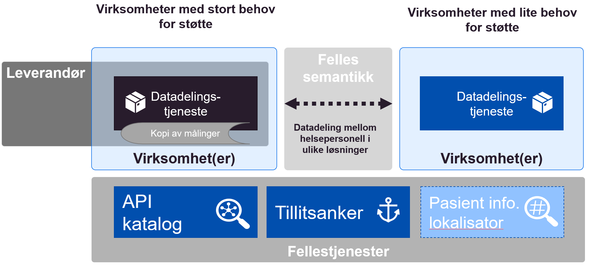
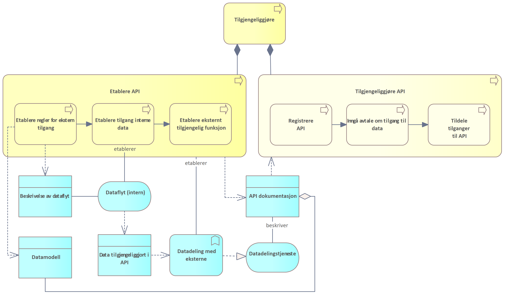
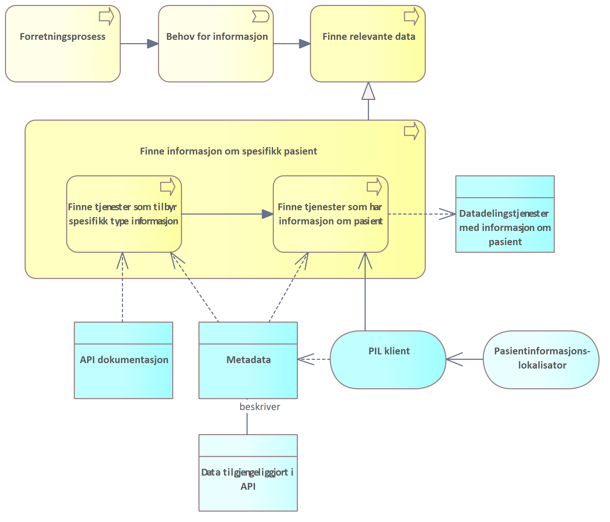

| Status | Version | Maturity | Normative level |
|:-------------|:------------------|:------|:-------|
| Prerelease | v0.8.2 | review  | ikke normert |

## Samhandling mellom helsepersonell på tvers av virksomheter

Direktoratet for e-helse publiserte i mars 2021 [Målarkitektur for datadeling i helse og omsorgssektoren](https://www.ehelse.no/standardisering/standarder/malarkitektur-for-datadeling-i-helse-og-omsorgssektoren) som tar frem fire ulike bruksområder for datadeling der "samhandling mellom helsepersonell på tvers av virksomheter" var et brukstilfelle. Dette brukstilfellet ble ikke behandlet i første versjon av målarkitekturen for datadeling, siden modenheten den gang var for lav og erfaringsgrunnlaget med denne bruken av datadelingsløsninger var begrenset.

Målarkitektur samhandling DHO har fokusert på brukstilfellet (samhandling mellom helsepersonell på tvers av virksomheter), og dette vil bli en del av den overordnede målarkitekturen for datadeling for helse- og omsorgssektoren. Brukstilfellet for deling på tvers av virksomheter uttrykkes slik i målarkitektur for datadeling:

!!! quote "Samhandling mellom helsepersonell på tvers av virksomheter"

    Dette bruksområdet dekker brukstilfeller som i hovedsak dekker behovet for at helsepersonell i ulike virksomheter må samhandle for å yte best mulig helsehjelp.

    Virksomheter som yter helsehjelp har en plikt til å samarbeide om behandling og forebygging av sykdom hos innbyggere. Det ligger som en forutsetning for godt samarbeid at aktørene må samarbeide om behandlingsplaner og andre helseopplysninger. Samarbeidet kan inkludere deling av dokumentasjon ved hjelp av datadeling fra den ene virksomheten til den andre, og kan også inkludere digitalisert samarbeid om pasientforløp på tvers av virksomheter. For mer avanserte samarbeidsformer rundt en pasient vil ikke meldings- og dokumentutveksling være tilstrekkelig for å kunne lage fleksible og gode samarbeidsløsninger. Her vil samarbeidsprosesser og arenaer kreve datadeling der aktørene kan samarbeide om både strukturerte dokumenter og mindre informasjonselementer.

    Dette bruksområdet <!--peker bruksområde tilbake på målarkitetkuren) Spør fordi bruksområde og brukstilfelle ikke er begrep jeg vansligvis benytter-->må sees i sammenheng med de nasjonale tiltakene som for eksempel dokumentdeling via Kjernejournal, Akson journal og Helseplattformen som skal løse hoveddelen av behovet for samhandling ved å ha en felles journal. Disse tiltakene vil redusere antall løsninger som det må lages samhandlingsfunksjoner som benytter datadeling på tvers.
  
    Det er ulik tidshorisont på når disse løsningene er realisert og tatt i bruk. Det vil derfor være behov for å ta i bruk datadeling også frem til disse løsningene er realisert og tatt i bruk.  
    Behovsanalysen til konseptvalgutredningen for nasjonal journalløsning for kommunal helse og omsorgstjeneste beskriver [behovene for samhandling i detalj \[7\]](https://ehelse.no/strategi/akson/_/attachment/download/991f83c3-be61-4556-9df6-44e8430ecf8c:c10adb76b95e679fb5857fec60e5c57650ead80b/Vedlegg%20A%20Behovsanalyse%20Nasjonal%20l%C3%B8sning%20for%20kommunal%20helse-%20og%20omsorgstjeneste.pdf).
  
    Dette bruksområdet dekker samhandling gjennom datadeling mellom aktører i ulike helseregioner og mellom aktører i helseregioner og den kommunale helse- og omsorgstjenesten inkludert fastleger. Målarkitekturen for dette bruksområdet trenger mer arbeid og vi har valgt å ikke beskrive arkitekturen nærmere i denne versjonen av dokumentet." 

## Målarkitektur for datadeling

Basert på  arkitekturvurderingene i dette kapittelet kombinert med identifiserte [behov](../behov/index.md), [juridiske vurderinger](../juridisk/index.md) og [vurderte konsepter for realisering](../vedlegg/Konsepter-realisering.md) anbefaler vi en fleksibel modell for å realisere datadeling mellom virksomhetene i helsesektoren.

**Behovene** peker tydelig på at datadeling er nødvendig for å realisere effektiv samhandling på DHO-området, samtidig er det tydelig at hoveddelen av samhandlingen foregår regionalt. Behovene understøtter derfor ikke behov for sentrale nasjonale løsninger for å løse samhandlingsbehovet innen DHO. De **juridiske vurderingene** peker på datadeling kan realiseres i form av distribuerte modeller og modeller basert på regionalt samarbeid innen for gjeldende rett.

Datadeling mellom virksomhetene realiseres ved at virksomhetene etablerer grensesnitt for å avgi data til andre virksomheter enten som distribuerte løsninger (i egen eller sentral infrastruktur) eller gjennom regionale fellesløsninger innenfor et §9-samarbeid.

  
*Målarkitektur for datadeling basert på distribuerte eller regionale løsninger og nødvendige fellestjenester*

Målarkitekturen forutsetter at det foreligger felles semantiske spesifikasjoner for informasjonen som skal utveksles. Det er viktig at spesifikasjonene beskriver minimumskrav til struktur, innhold og bruk av terminologi og kodeverk, i tillegg til felles krav knyttet til selve datadelingsgrensesnittet.

Tre fellestjenester bør etableres for å gjennomføre innføring og spredning av datadeling på en effektiv måte. Det anbefales tiltak knyttet til å etablere felles API-katalog, Pasientinformasjonslokalisator og Tillitsanker. Fellestjenester for Personvern, Grunndata og HelseID er allerede i utstrakt bruk.

Dataansvaret vil i forslaget til målarkitektur ligge hos den enkelte virksomheten. Unntaket er ved samarbeid om fellesløsning hvor datansvaret reguleres i avtalen mellom de samarbeidende virksomhetene.

### Arkitekturvalg

Vi gjør fire grunnleggende arkitekturvalg for etablering av datadeling mellom virksomheter og omsorgsnivå som oppsummeres her. I tillegg har vi valgt å bruke datadeling som samhandlingsform basert på behovene som er identifisert i [behovskapittelet](../behov/index.md#samhandlingsform-datadeling).

#### Fleksibilitet

Det er viktig å integrere fleksibilitet i målarkitekturen for å ivareta lokale og regionale behov og ikke binde seg til et bestemt løsningsmønster før vi har tilstrekkelig erfaring med datadeling mellom virksomhetene. Fleksibilitet er også viktig for å ikke stoppe eller forsinke pågående aktiviteter for å etablere datadeling i helsefellesskapene, utprøvings- og spredningsaktiviteter.

!!! note "Arkitekturvalg 2: Fleksibilitet"

    Vi anbefaler en fleksibel modell for etablering av datadeling mellom virksomheter og omsorgsnivå.

#### Juridiske rammer

!!! note "Arkitekturvalg 3: Løsningsalternativer innenfor gjeldende rett"

    Vi anbefaler løsningsalternativer som kan realiseres innenfor gjeldende rett.

#### Felles semantiske spesifikasjoner

!!! note "Arkitekturvalg 4: Felles semantiske spesifikasjoner"

    Etableringen av datadelingsløsninger må basere seg på felles semantiske spesifikasjoner basert på internasjonale standarder.

#### Felleskomponenter og fellestjenester

!!! note "Arkitekturvalg 5: Felleskomponenter"

    Målarkitekturen forutsetter bruk av eksisterende og planlagte felleskomponenter, som er beskrevet i [målarkitektur for datadeling](https://www.ehelse.no/standardisering/standarder/malarkitektur-for-datadeling-i-helse-og-omsorgssektoren).

### Vurdering av konsept

Vi anbefaler at virksomhetene vurderer hvilke konsept for datadeling som egner seg best ut fra samhandlingsbehovene som identifiseres i tjenesteforløpene som skal etableres eller understøttes. Videre anbefales at det konkrete samhandlingsbehovet gjennomføres i samarbeid med andre virksomheter innen for regionen eller Helsefellesskapet. Virksomhetene bør velge ett eller flere konsept som er innenfor gjeldende rett for å komme i gang med datadeling mellom virksomhetene i Helsefellesskapet eller regionen. Det kan vurderes kombinasjoner av alle konseptene som faller innenfor gjeldende rett innenfor en region. Hvilke konsept som passer best er blant annet avhengig av virksomhetenes størrelse, tilgang til eksisterende infrastruktur og behov for fleksibilitet, skalerbarhet og kompleksiteten i løsningen. Det anbefales å gjenbruke semantiske spesifikasjoner der disse eksisterer eller samarbeide med andre virksomheter om å etablere felles spesifikasjoner basert på [HL7 FHIR](https://www.ehelse.no/standardisering/standarder/anbefaling-om-bruk-av-hl7-fhir-for-datadeling).

## Kapabilitetskart

!!! info

    Innholdet i denne delen bygger på eksisterende retningslinjer beskrevet i [Målarkitektur for datadeling i helse og omsorgssektoren](https://www.ehelse.no/standardisering/standarder/malarkitektur-for-datadeling-i-helse-og-omsorgssektoren) og [Referansearkitektur for datadeling](https://www.ehelse.no/standardisering/standarder/referansearkitektur-for-datadeling). Kapittelet forutsetter kjennskap til de tekniske delene av disse arbeidene. Kapittelet egner seg hovedsaklig for arkitekter og tekniske personer som ønsker å forstå bakgrunnen for arkitekturvalgene som gjøres i målarkitekturen.

I denne delen av målarkitekturen viser vi hvilke kapabiliteter eller evner som må realiseres for å understøtte samhandling mellom virksomheter og omsorgsnivå. Kapabilitetene som beskrives er en videreutvikling av kapabilitetene som beskrives i [Målarkitektur for datadeling i helse og omsorgssektoren](https://www.ehelse.no/standardisering/standarder/malarkitektur-for-datadeling-i-helse-og-omsorgssektoren), men modellene videreutvikles med hovedfokus på samhandling mellom virksomheter.

!!! note "Bruk av kapabiliteter i planleggingen"

    I denne delen av målarkitekturen tar vi utgangspunkt i en overordnet oversikt over kapabiliteter for å beskrive behovene for samhandlingstjenester. Motivasjonen bak denne metoden er beskrevet i [vedlegget](../vedlegg/Kapabiliteter.md).

### Nødvendige kapabiliteter for datadeling

De viktigste kapabilitetene for å realisere datadeling mellom virksomheter og omsorgsnivå vises i figuren under. Figurene er knyttet til rollene som Produsent, Datakonsument og Datatilbyder i tillegg til kapabiliteter som er fornuftig tilbys som fellestjenester.

[{ width="500" }](../img/kapabiliteter-enkel.png)  
*Oversikt over nødvendige evner for å realisere datadeling*

### Samhandlingsprosessen

Modellen *Kapabilitetskart koblet til samhandlingsprosess* viser overordnede roller og kapabiliteter rollene innehar. Rollene er igjen tilordnet delprosessene for samhandling: *Innhente informasjon*, *Produksjon av informasjon* og *Dele informasjon*. Rollene *Datakonsument*, *(Data)produsent* og *Datatilbyder* er knyttet til prosessene. Hvordan samhandlingsprosessen understøtter helsetjenesten og tjenesteforløpet er beskrevet i kapittelet [Tjenesteforløp og samhandling](../behov/index.md#tjenesteforlp-og-samhandling).

Samhandling mellom virksomheter og omsorgsnivå kan foregå på flere måter, kapabilitetskartet viser kapabiliteter som er relevante for både datadeling, dokumentdeling, hendelsesstrømmer og meldingsutveksling. I forbindelse med tjenesteforløp i DHO er det mest relevante samhandlingsformen datadeling som understøttes av kapabilitetene "innhente data" og "avgi data". I tillegg er det behov for en rekke forberedende kapabiliteter for å sette opp datadeling (få tilgang til data, tilgjengeliggjøre data, lokalisere relevante data og metadatapublisering)og noen kapabiliteter som bør realiseres som fellestjenester (tjenesteformidling, metadataformidling, delegere rettigheter og meldingsformidling).

*Kapabilitetskart koblet til samhandlingsprosess*

<!-- Tillitsskapende tjenester som avtalehåndtering og identitetsforvaltning kan legges in i kapabilitetsmodellen slik at det blir synliggjort at avtalehåndtering mangler (samordningsalternativet for tillitstjenester og tillitsanker) -->

### Kapabiliteter knyttet til produksjon av dokumentasjon

En av delprosessene for *Samhandling* er produksjon av informasjon. *Produksjon av informasjon* innebærer dokumentasjonen av hva som gjennomføres, målinger og andre resultater. Det er også tatt med nødvendige kapabiliteter som handler om *informasjonsbehandling* og *lagring* av informasjon. Rollen som (data)produsent er tilordnet denne delprosessen og denne rollen må minst inneholde kapabilitetene i tabellen under:

| Kapabilitet | Definisjon |
|---|---|
| Dokumentere | Dokumentere gjennomførte tiltak og begrunnelsen for tiltak |
| Informasjonsbehandling | Sammenstille og tolke informasjon fra interne og eksterne systemer |
| Lagring | Lagre informasjon (dokumentasjon og metadata) |

### Tverrgående kapabiliteter

Evnene i denne tabellen er ikke knyttet opp mot noen spesielle roller i samhandlingsprosessen, siden flere deler av prosesser eller roller har behov for disse.

| Kapabilitet | Definisjon |
|---|---|
| Dialog | Understøtte løpende dialog mellom aktører |
| Delegere rettigheter | Evnen til å delegere rettigheter til databehandler som utfører oppgaver på vegne av dataansvarlig. |
| Klargjøre for sending og mottak | Klargjøre for utveksling av informasjon ved hjelp av meldinger (sende og motta fra/til spesifikk mottaker) |
| Meldingsformidling | Fellestjeneste for å formidle meldinger mellom avsender og mottaker som utveksler meldinger. Dagens løsning baserer seg på felles infrastruktur for meldingsformidling som en del av samhandlingsplattformen |
| Metadataformidling | Evnen til å formidle hvilken informasjon som er tilgjengelig fra en datakilde, det kan være nødvnendig å understøtte denne evnen med en fellestjeneste|
| Tjenesteformidling | Evnen til å formidle informasjon om hvilke samhandlingstjenester som er tilgjengelig fra en datatilbyder, det kan være nødvendig å understøtte evnen med en fellestjeneste |

Vi ser i denne modellen på kapabiliteten *dialog* som en selvstendig evne til samhandling hvor aktørene vanligvis inntar rollen som datakonsument og datatilbyder i samhandlingsprosessen og gjennomfører en tidsbegrenset dialog med en eller flere andre aktører. Dialog kan understøttes av en eller flere av kapabilitetene for samhandling. Dagens dialogmeldinger benytter for eksempel meldingsutveksling (sende, motta og meldingsformidling) for å gjennomføre asynkron dialog mellom aktørene.

### Kapabiliteter knyttet til samhandling

Evnene er knyttet til bruk av organisatoriske samhandlingsformer for å utveksle informasjon mellom aktører. Aktørene kan innta rolle som *datakonsument* eller *datatilbyder*, i de aller fleste tilfeller vil aktørene inneha flere roller i samhandlignsprosessen og realisere kapabiliter knyttet til både konsument og tilbyder rollen.

| Kapabilitet | Definisjon |
|---|---|
| Avgi data | Utlevere data basert på søk og oppslag |
| Endre data | Evnen til å gjøre dataendringer hos en annen aktør ved hjelp av datadeling |
| Få tilgang til data | Evnen til å skaffe seg tilgang til tilbudte data fra annen aktør. |
| Håndtere mottatte endringer | Evnen til å behandle endringer (opprettelse, oppdatering, sletting) av helseopplysninger mottatt fra en annen aktør ved hjelp av datadeling |
| Innhente data | Søke og slå opp informasjon gjennom en datadelingstjeneste |
| Konsumering av publiserte data | Evnen til å konsumere hendelser fra en hendelsesstrøm |
| Lokalisering av relevant data | Evnen til å finne kilder for informasjon om spesifikke kategorier eller personer. |
| Metadatautvinning | Evnen til å produsere og utvinne metadata basert på prosessene som produserer informasjon og innholdet i informasjonsressursene |
| Mottak | Motta informasjon fra en avsender |
| Publisering av data | Evnen til å publisere hendelser til en hendelsesstrøm |
| Metadatapublisering | Evnen til å publisere metadata slik at konsumenter kan lokalisere relevant informasjon |
| Sending | Sende informasjon til en spesifikk mottaker |
| Tilgjengeliggjøre data | Evnen til å gjøre data tilgjengelig for aktører utenfor egen virksomhet med eller uten krav til innlogget bruker ved hjelp av datadeling. Tilgangsstyring inngår her. Avgjøre hvilken informasjon som skal deles med andre gjennom en datadelingstjeneste. |
| Visning | Evnen til å vise data til bruker |

## Realisering av kapabilitetene

I behovsbildet har vi beskrevet og prioritert hvilke [informasjonstjenester](../vedlegg/Informasjonstjeneste-meta.md) vi trenger for å understøtte relevante tjenesteforløp knyttet til DHO. I arbeidet med målarkitektur for samhandling DHO analyserer vi hvordan kapabiliteter kan realiseres av prosesser og ser hvilke applikasjonstjenester som må understøtte realiseringen. Vi ser også på sammenhengen mellom applikasjonstjenestene som realiseres av virksomhetene som skal samhandle og tjenester som realiseres i felles infrastruktur (fellestjenester).

### Informasjonstjenester

Modellen *Sentrale prosesser knyttet til samhandling* viser hvordan prosesser, funksjoner og applikasjonstjenester sammen realiserer samhandlingsevnene vi pekte på i forrige kapittel. Hovedfokuset i den videre analysen er å beskrive prosessene som må realiseres for å understøtte de mest sentrale kapabilitetene knyttet til [datadeling](../vedlegg/Organisatorisk-sla-opp.md).  

*Overordnet bilde av prosesser og applikasjonstjenester som understøtter samhandling mellom virksomheter*

### Informasjonstjenester og prosesser

I denne delen av Målarkitekturen beskrives de mest sentrale prosessene for å klargjøre for datadeling og gjennomføre samhandling i form av datadeling. Dette omfatter nødvendige prosesser og informasjonstjenester for kapabilitetene *Få tilgang til data*, *Tilgjengeliggjøre data*, *Lokalisering av relevante data* og *Metadatapublisering*. For selve samhandlingen (utveksling av informasjon ved hjelp av datadeling) må vi beskrive kapabilitene for *Innhente data* og *avgi data*. Også kapabilitene for *Endre data* og *Håndtere motatte endringer* er viktige knyttet til sentrale metadata.

[Målarkitektur for datadeling i helse og omsorgssektoren](https://www.ehelse.no/standardisering/standarder/malarkitektur-for-datadeling-i-helse-og-omsorgssektoren) (HITR 1231:2021) beskriver prosessene på dette området frem til faktisk datautveksling. Beskrivelsene som er tatt frem i HITR 1231:2021 handler hovedsaklig om sikring av datadelingstjenester, autentisering av brukere og dokumentasjon av tjenstlig behov, disse beskrivelsene blir ikke gjentatt her.  

Det er flere problemstillinger knyttet til å faktisk understøtte utvekslingen av, bruken av og produksjonen av informasjon i forretningsprosessene hos datakonsumenter, dataprodusenter og datatilbydere som ikke er behandlet i detalj i HITR 1231:2021. Beskrivelsen av hvordan samhandlingen henger sammen med faktiske forretningsprosesser og automatiserte tjenester i virksomheten er hovedfokus for målarkitekturen for datadeling innen DHO.

  
*Overordnet bilde av fellestjenester beskrevet i målarkitektur for datadeling*

### Tillitstjenester og tjenstlig behov

Ved datadeling mellom virksomheter når konsumenten (sluttbruker) gjør oppslag mot datatilbyder, må konsumentens tjenstlige behov dokumenteres overfor datatilbyder før data utleveres. Det eksisterer ikke mekanismer for å håndtere dette i infrastrukturen i dag, verken i sikkerhetsbilletten (må utvides) eller andre tillitsskapende tjenester. Direktoratet for e-helse publiserte i 2019 en anbefaling som beskriver [Anbefaling av tillitsmodell for data- og dokumentdeling](https://www.ehelse.no/standardisering/standarder/anbefaling-av-tillitsmodell-for-data-og-dokumentdeling), og er videre konkretisert gjennom arbeidet med dokumentdeling.

## Datadeling for datatilbyder

Tre prosesser står sentralt for datatilbydere som skal dele data ved hjelp av datadeling: *Tilgjengeliggjøre*, *produksjon av informasjon* og *avgi forespurte data*. Produksjon av informasjon tas med her siden det mest relevante brukstilfelle for deling av informasjon mellom virksomheter handler om å dele informasjon som virksomheten har produsert i sine andre forretningsprosesser med andre virksomheter som kommer i kontakt med pasienten.

På et overordnet nivå kan sammenhengen mellom disse prosessene beskrives som i modellen nedenfor. (Prosessene i lys-lys-gul farge er behandlet i HITR 1231:2021 og underprosesser er beskrevet der)

*Sammenhengen mellom prosessene for å tilgjengeliggjøre, produsere informasjon og avgi forespurte data*

Prosessen for å **Tilgjengeliggjøre** etablerer datadelingstjenesten og beskriver grensesnittet datadelingstjenesten tilbyr (vanligvis i from av API dokumentasjon).  
Prosessen for **produksjon av data** benytter seg av beskrivelsen av intern dataflyt for å tilgjengeliggjøre relevant informasjon i API'et, i tillegg bør det utvinnes og publiseres metadata om hvilken informasjon datadelingstjenesten inneholder for å gjøre det enklere for konsumenter å slå opp mot de datadelingstjenestene som inneholder relevante data.  
Når en konsumerende virksomhet forespør data fra datadelingstjenesten starter en prosess for å **avgi forespurte data fra datatilbyder**. Forespørselen om data vil bli sendt til datatilbyder sammen med en sikkerhetsbillett som dokumenterer autentiseringen, rolle og tjenstlig behov til den som spør. Hvis konsumenten er autorisert for å bruke datadelingstjenesten vil datatilbyder finne forespurte data. Det kan også forekomme dataminimering av informasjonen som sendes som svar på forespørsel avhengig av rolle og tjenstlig behov som dokumenteres i sikkerhetsbilletten.  

### Prosesser for Tilgjengeliggjøre

Tilgjengeliggjøring av API og hvilke programvarekomponenter det er behov for i den delen av prosessen som omhandler registrering, avtaler og tildele tilganger er godt behandlet i [Målarkitektur for datadeling i helse og omsorgssektoren](https://www.ehelse.no/standardisering/standarder/malarkitektur-for-datadeling-i-helse-og-omsorgssektoren), vi vil ikke diskutere denne delen av prosessen ytterligere her. Derimot er prosessen knyttet til å etablere og dokumentere et API ikke beskrevet som en del av HITR 1231:2021. Dette er en viktig prosess for å forstå hvordan man får forretningsprosessene i virksomheten til å henge sammen med samhandling gjennom datadeling. En overordnet beskrivelse av prosessen for *Etablere API* er gjengitt nedenfor (Prosessene i ekstra lysegul farge er behandlet i HITR 1231:2021):

  
*Tilgjengeliggjøre data gjennom API (datadelingstjeneste)*  

*Etablere API* dekker den delen av prosessen som foregår før informasjon faktisk kan tilgjengeliggjøres fra en virksomhet til en annen og handler om prosessen knyttet til å vurder hvilken informasjon som skal tilgjengeliggjøres, tilrettelegge for at denne informasjonen kan tilgjengeliggjøres for andre virksomheter (unntatt sikkerhet og tilgangstyring) og etableringen av funksjonalitet for å avgi informasjonen på en effektiv måte gjennom eksternt tilgjengelige funksjonskall, samt å dokumentere de tilgjengelige grensesnittene.

Vanligvis vil reglene for ekstern tilgang etableres som automatiserte uttrekk fra eksisterende datakilder eller prosesser med fastsatte rammer for hvilken informasjon og metadata som skal være tilgjengelig for eksterne virksomheter. Selve tilgangen etableres ofte ved å etablere en egen løsning for å lagre *Data tilgjengeliggjort i API*. *Datadelingstjenesten* representerer den eksternt tilgjengelige funksjonen for *Datadeling med eksterne*. Datadelingstjenesten utvikles basert på hvilken informasjon som tilgjengeliggjøres og hvilke søkemuligheter som er hensiktsmessig for å gjøre oppslag i denne informasjonsmengden. Det vil ofte være en balansegang mellom god tilgang til komplett informasjon for konsumentene og samtidig som krav til personvern og dataminimering ivaretas. Mulighetene for søk og hva slags informasjon som er tilgjengleiggjort dokumenteres vanligvis i form av *API dokumentasjon* som publiseres sammen med datadelingstjenesten.

### Prosesser for produksjon av informasjon

Det vil vanligvis være et stort antall *forretningsprosesser* og løsninger knyttet til *produksjon av informasjon* i en virksomhet. Denne delen av prosessbeskrivelsen behandler ikke selve produksjonen av informasjon i *forretningsprosessen* men fokuserer på de prosessene som må etableres i virksomheten for å gjøre informasjon som produseres i virksomhetens forretningsprosesser tilgjengelig for eksterne brukere i form av datadeling i et API. En overordnet modell av prosessen er gjengitt nedenfor:

*Prosesser forbundet med å tilgjengeliggjøre produsert informasjon i et API og metadatahåndtering*

Prosessene for å *tilgjengeliggjøre data i API* utløses når en *forretningsprosess* produserer informasjon og de på forhånd er bestemt at informasjonen skal tilgjengeliggjøres for datadeling (se [Tilgjengeliggjøre](#prosesser-for-tilgjengeliggjre)). Vanligvis vil da den interne sørge for at informasjonen som skal tilgjengeliggjøres i datadelingstjenesten kan håndteres av prosessen for å *tilgjengeliggjøre data i API*. Ofte vil det være slik at bare noe av informasjonen er interessant eller relevant å dele med eksterne virksomheter, derfor vil de fleste *tilpasse data mengde* i forhold til hva eksterne brukere har tjenstlig behov for å se. Det vil også i mange tilfeller gjøres endringer i hvordan data struktureres og indekseres for å understøtte søk og utveksling av informasjon i prosesser knyttet til *tilpasse data format og søk*. Når disse delene av prosessen er gjennomført eksisterer det *Data tilgjengeliggjort i API* som eksterne virksomheter kan få tak i gjennom en *datadelingstjeneste*.  

Det er også viktig (men ikke absolutt nødvendig) å *utvinne metadata* om informasjonen som datadelingstjenesten tilbyr. Relevante metadata er nødvendig for å understøtte prosessen [finne relevante data](#finne-relevante-data) som realiseres av datakonsumenter. Eksempel på relevante *metadata* kan være hvilke pasienter som informasjonen handler om. *Metadata* publiseres i *Pasientinformasjonslokalisator* slik at datakonsumenter kan finne datadelingstjenester som inneholder informasjon om en gitt pasient.

### Prosesser for å avgi forespurte data

Datatilbydere som ønsker å dele data ved hjelp av datadeling må realisere en prossess for å *avgi forespurte data*. Denne prosessen gjør det mulig å avgi data i form av et *svar på forespørsel* som inneholder data som er forespurt av datakonsumenten. En overordnet modell av prosessen er gjengitt nedenfor (Prosessene i ekstra lysegul farge er behandlet i HITR 1231:2021 og beskrives ikke i detalj her):

*Prosesser forbundet med å avgi forespurte data*

Vi antar her at datakonsument har tilgang til API og er autentisert og autorisert for bruk av API'et. En validert *sikkerhetsbillett* og en *forespørsel om data* foreligger for datatilbyder. Datatilbyder må bruke informasjonen i forespørselen for å *Finne forespurte data* i *data tilgjengeliggjort i API*. Resultatet av denne prosessen er at alle *forespurte data* trekkes ut for videre behandling. I noen tilfeller vil scopet i sikkerhetsbilletten ikke gi brukeren tilgang til all informasjonen som tilbys gjennom datadelingstjenesten, da må *forespurte data* "filtreres basert på rolle og tjenstlig behov". *Forespørsel om data* kan også inneholde andre filtre der datakonsumenten har gjort en vurdering av hvilke data konsumenten trenger. Da må datatilbyder gjennomføre dataminimering basert på angitte filtre fra konsument. Data må også struktureres i henhold til datamodellen som er beskrevet for API'et før svaret til slutt kan sikres for transport i form av funksjoner for *kryptering og non repudiation*. *Svaret på forespørsel* foreligger nå og kan avgis til datakonsumenten.  

## Datadeling for datakonsumenter

Tre prosesser står sentralt for datakonsumenter som skal innhente informasjon ved hjelp av datadeling: *Få tilgang til data*, *Finne relevante data* og *Slå opp*. På overordnet nivå kan sammenhengen og mellom disse prosessene og informasjonen som flyter mellom disse beskrives som beskrevet i modellen under. (Prosessene i lys-lys-gul farge er behandlet i HITR 1231:2021 og underprosesser er beskrevet der).

*Prosesser forbundet med rollen som datakonsument, inkludert de viktigste tjenestene som må etableres og integreres mot*

**Få tilgang til data** finner relevante API'er som virksomheten har behov for å integrere med, etablerer *Datadelingstjeneste (konsument)* (klientfunksjonalitet) som skal kommunisere med datatilbyderens datadelingstjeneste. Intern dataflyt etableres også her, noe som gjør det mulig å benytte data i interne fagsystemer.  
**Finne relevante data** utløses av *behov for informasjon* i eksisterende *forretningsprosesser* i virksomheten. Prosessen beskriver hvordan det er mulig å *finne tjenester som tilbyr spesifikk type informasjon* og *finne tjenester som har informasjon om pasient*. I det siste tilfellet trengs det tilgang til en fellestjeneste for *pasieninformasjonslokalisator* for å identifisere hvilke datadelingstjenster som inneholder informasjon om pasienten.  
**Slå opp** handler om å gjennomføre oppslag mot en eller flere datadelingstjenester som inneholder relevante data og *motta svar på forespørsel*. *Datadelingstjeneste (konsument)* som ble etablert i *få tilgang til data* og *intern dataflyte og databehandling* understøtter disse prosessene som skal gjøre data tilgjengelig i fagsystemene.

### Få tilgang til data

Å *få tilgang til data* gjennom et API innebærer både å *Etablere API klient* og *få tilgang til API* som innebærer avtalehåndtering og registrering av klienten for tilgang. Prosessen for *få tilgang til API* er nærmere beskrevet i [Målarkitektur for datadeling i helse og omsorgssektoren](https://www.ehelse.no/standardisering/standarder/malarkitektur-for-datadeling-i-helse-og-omsorgssektoren) og beskrives ikke her.

*Prosesser forbundet med å få tilgang til data for en datakonsument*

Når en virksomhet skal *få tilgang til data* må virksomheten *etablere API klient* først med mindre det er etablert en klient for denne integrasjonen tidligere. Resultatet av prosessen er at det etableres klientfunksjonalitet i form av *datadelingstjeneste (konsument)* som håndterer forespørsel og svar fra server (Datadelingstjeneste (tilbyder)) og *Dataflyt (intern)* som sørger for at informasjonen som hentes fra datatilbyder kan integreres i relevante fagsystemer hos datakonsumenten.

Den viktigste informasjonen som produseres er *behov for informasjon* som dokumenterer virksomhetens behov for informasjon fra eksterne kilder. De viktigste inndata for prosessene for å etablere API klient er *API dokumentasjonen* for *Datadelingstjenesten (tilbyder)* som gjør det mulig å etablere *Datadelingstjeneste (konsument)* og etablere integrasjoner for å understøtte *Dataflyt (intern)*.

### Finne relevante data

Ofte vil aktørenes *behov for informasjon* være begrenset til informasjon av en spesiell type og om en bestemt pasient. Prosessen for å *finne relevante data* handler derfor om å *finne tjenester som tilbyr spesifikk type informasjon* og å *finne tjenester som har informasjon om (en bestemt) pasient*. Prosessene kan løses med større eller mindre grad av støtte fra applikasjoner, men det anbefales at prosessen er mest mulig automatisert basert på inndata som allerede foreligger knyttet til forretningsprosessen.

*Prosessene knyttet til å finne informasjon om spesifikk pasient*  

Prosessen for å *finne tjenester som har informasjon om pasient* skal identifisere de datadelingstjenestene som inneholder informasjon om en bestemt pasient. Prosessen understøttes av en fellestjeneste kalt *Pasientinformasjonslokalisator* (PIL) og forutsetter at datatilbydere har *publisert metadata* som en del av [informasjonsproduksjonen](#prosesser-for-produksjon-av-informasjon). Ved hjelp av oppslag mot PIL, med en *PIL klient*, får man tilgang til *metadata* som beskriver *Data som er tilgjengeliggjort i API* og hvilke pasienter de ulike tjenesten har informasjon om. Basert på denne informasjonen kan man lage en oversikt over *Datadelingstjenester med informasjon om pasient* som bestemmer hvor man skal *slå opp* for å finne relevant informasjon.

### Slå opp (og motta svar)

Å *slå opp* mot datatilbyderes datadelingstjenester omfatter både å utføre tjenestekall med dokumentert autentisering og autorisering i en sikkerhetsbillett og å *motta svar på forespørsel* slik at informasjonen fra datatilbyder sin datadelingstjeneste kan understøtte forretningsprosesser i virksomheten som slår opp. Prosessene knyttet til *Slå opp eller endre data gjennom et API* er beskrevet i [Målarkitektur for datadeling i helse og omsorgssektoren](https://www.ehelse.no/standardisering/standarder/malarkitektur-for-datadeling-i-helse-og-omsorgssektoren) og beskrives ikke her.

  
*Prosessene knyttet til å slå opp i API og motta svar på forespørsel*  

Etter at *forespørsel om data* er formidlet av klienten (Datadelingstjeneste konsument) vil det etter kort tid foreligge et *svar på forespørsel* som må behandles av datakonsumenten. Datadelingstjenesten håndterer at informasjon som er sikret for transport fra datatilbyder kan leses av de interne prosessene hos datakonsumenten. *Svaret på forespørsel* kan deretter *integreres med fagsystemer* i virksomheten, slik at informasjonen foreligger som *data i fagsystem* og på den måten kan lagres og vises i forbindelse med relevante forretningsprosesser i virksomheten. Et fagsystem vil vanligvis ha oppgaven med å *sammenstille og behandle* data fra interne og eksterne kilder, slik at *forretningsprosessene* understøttes på best mulig måte.
