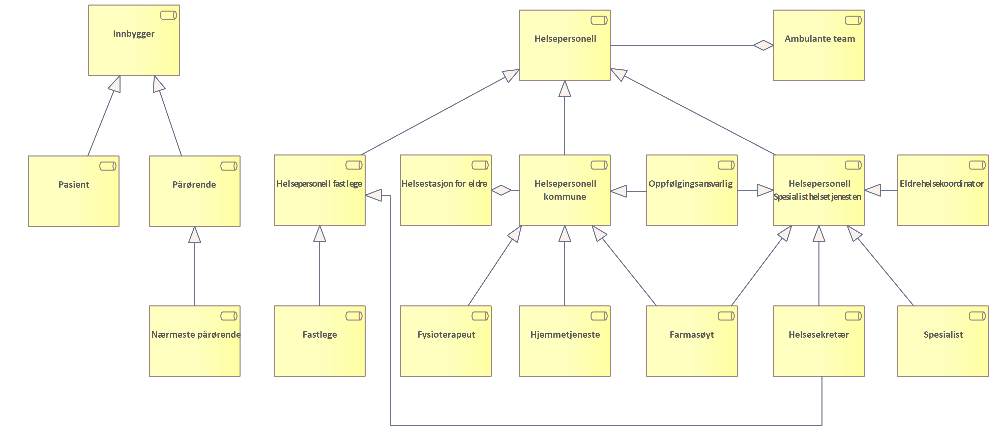
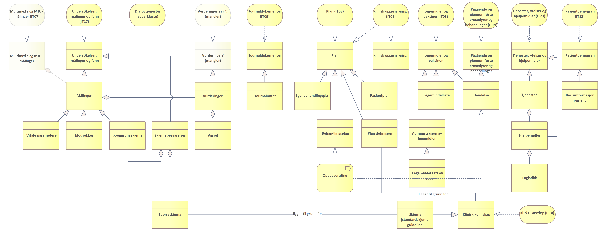
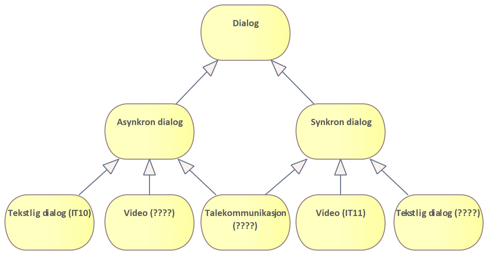

| Status | Version | Maturity | Normative level |
|:-------------|:------------------|:------|:-------|
| Prerelease | v0.9.1 | review  | ikke normert |

## Kartlagte brukerbehov og funksjonelle krav

For å understøtte tjenesteforløp der pasienter følges med DHO på en effektiv måte er det identifisert en rekke brukerbehov som kan understøttes med bedre samhandlingsløsninger. Dette kapitelet oppsummerer de mest sentrale behovene og funksjonelle krav som kan utledes fra disse.

### Hypotese knyttet til brukerbehov

Hypotesen beskriver en antagelse som er fremkommet gjennom behovskartleggingen knyttet til DHO. Det ligger i hypotesens natur at den bør testes før målarkitekturen ferdigstilles. Det er foreløpig et åpent spørsmål hvordan disse hypotesen testes og om den kan testes som en del av utprøvingsprosjektene innen DHO.

* Samhandlingsbehovet knyttet til tjenesteforløp med DHO integrert er størst regionalt
  * Arbeidet med målarkitektur for DHO fokuserer derfor på å tilrettelegge for samhandling på regionalt nivå
<!-- Hvordan unngår vi å ta arkitekturvalg som hindrer oss fleksibilitet senere -->

### Identifiserte brukerbehov

Tabellen under viser en oversikt over:  

* Hvilken sluttbruker rolle som har behovet ([oversikt over relevante roller](#roller-i-tjenesteforlp-med-digital-hjemmeoppflging))
* Hvilken prioritet og tidsperspektiv behovet har
  * Prioritet scores i kategoriene høy/middels/lav/ekstern ut fra antagelse om forventet nytte/effekt
    * Høy nytteverdi betyr at tilfredstillels av behovet vil gi stor nytte og det er mange brukere
    * Middels nytteverdi betyr at tilfredstillelse av behovet vil kunne føre til spart tid og bedre kvalitet men er ikke kritisk for å ta i bruk tjenesten <!--Her mener vi vel tjenesteforløpet? Tilby DHO uten at informasjonsdeling er på plass?-->
    * Lav nytteverdi angir brukerbehov hvor nytten for brukeren er liten eller at behovet innehas av få brukere
    * Ekstern betegner brukerbehov som må spilles inn til andre prosjekter og behovet må tilfredstilles (i hovedsak) av løsninger som ligger utenfor omfanget av målarkitekturen
  * Tidsperspektiv kategoriene angis med: Kort (0-1 år), mellom(lang) (1-3 år) og lang (3-5 år)
* Beskrivelse av behovet
* Viktige funksjonelle krav som må oppfylles for å tilfredstille behovet på en god måte

|Rolle| Prioritet / tidsperspektiv|brukerbehov|Funksjonelle krav|
|-----|-----------|-----------------|--------------------|
|Helsepersonell (kommune, spesialist og fastlege)|høy / lang|Bedre støtte for eksplisitte ansvarsoverganger mellom virksomheter||
|Helsepersonell (kommune, spesialist og fastlege)|høy / mellom|Finne hvilken informasjon andre virksomheter og behandlingsnivåer har om pasienten|Søkefunksjonalitet for å finne hvilke virksomhetene som har informasjon om pasienten||
|Helsepersonell (kommune, spesialist og fastlege)|høy / kort|Understøtte sammensatte behandlingsforløp med planlagte og uplanlagte kontakter med helsetjenesten, tilpasset informasjonsmengde til problemet|Mulighet for å tilpasse hvilken informasjon som hentes fra kildene|
|Helsepersonell (kommune, spesialist og fastlege)|høy / kort|Understøtte sammensatte behandlingsforløp med planlagte og uplanlagte kontakter med helsetjenesten, umiddelbar tilgang til informasjon ved behov|Når informasjonen kan hentes fra kilden umiddelbart ved behov er det ikke nødvendig å vedlikeholde en oppdatert kopi lokalt eller sentralt.   
Understøtte umiddelbar tilgang til informasjon når behovet oppstår og med mulighet for å til|
|Helsepersonell (kommune, spesialist og fastlege)|høy / kort|Vise informasjon som andre virksomheter og behandlingsnivåer har samlet inn om pasienten|Felles informasjonsstruktur og innhold er viktig både for:   - Å vise informasjon fra flere eksterne virksomheter   - Tilby enhetlig søkegrensesnitt på tvers av flere virksomheter   - Sammenstilling av informasjon fra flere kilder i felles visning|
|Helsepersonell (kommune, spesialist og fastlege) | høy / mellom | Vise trender og sammenhenger mellom informasjon samlet inn i egen og andre virksomheter|Felles informasjonsstruktur og innhold er viktig både for:   - Å vise informasjon fra flere eksterne virksomheter   - Tilby enhetlig søkegrensesnitt på tvers av flere virksomheter   - Sammenstilling av informasjon fra flere kilder i felles visning|
|Helsepersonell (kommune, spesialist og fastlege)|høy / kort|Samhandlingen og arbeidsflyten skal ikke medføre dobbeltarbeid|Det skal ikke være nødvendig å registrere samme informasjon flere ganger (i ulike systemer) eller logge seg på i ulike systemer for å gjennomføre arbeidsoppgaver knyttet til samme pasient og tiltak (SSO) /Er det noe krav til innlogging med tanke på HPR, må alle være registrert der? Trenger også personell som sekretærer tilgang?|
|Helsepersonell (kommune, spesialist og fastlege)|middels / mellom|Arbeidsflyt og samhandling må støttes i en enhetlig utformet brukerflate|Unngå særegne systemer for oppslag i DHO resultater   Unngå mange ulike utformede arbeidsflater som ikke er integrert|
|Helsepersonell (kommune, spesialist og fastlege)|middels / mellom|Det må være mulig å kvalitetssikre relevant informasjon ved å se hvor informasjonen kommer fra og hvordan den er samlet inn|Proveniens og metadata med riktig detaljnivå må følge informasjonen når den utveksles|
|Helsepersonell (kommune, spesialist og fastlege)|middels / mellom|Tilgang til ulike typer informasjon for å understøtte tjenesteforløpet knyttet til flere pasientgrupper.|Aktuelle pasientgrupper kan være KOLS syke, multisyke og andre pasientgrupper med behov for digital hjemmeoppfølging|
|Helsepersonell (kommune, spesialist og fastlege)|ekstern (høy) / mellom|Samarbeide om utarbeidelsen av behandlingsplan og egenbehandlingsplan med pasienten og klinikere fra andre virksomheter|Det må eksistere felles kilde til planer og felles verktøy for samarbeid om planer|
|Helsepersonell (kommune, spesialist og fastlege)|ekstern (høy) / lang|Det må være tydelig og avklart sammenheng mellom tiltak i egenbehandlingsplanen og DHO utstyr/verktøy benyttes i egenbehandlingsplanens tiltak|Det må være lett å se informasjon fra plan og DHO-utstyr i sammenheng|
|Helsepersonell (kommune, spesialist og fastlege)|høy / mellom|Behov for individuell tilpasset tjeneste ut fra type pasient og behov knyttet til daglig oppfølging||
|Helsepersonell (kommune, spesialist og fastlege)|høy / lang|Å være oppdatert|Når data i kilden endrer seg, skal løsningen oppdatere seg uten opphold. Dette skal også skje når dataene endrer seg hyppig.|
|Helsepersonell (kommune, spesialist og fastlege)|middels / lang|Tilgang til sanntidsinformasjon der det er relevant (målinger for eksempel)|Dette er ikke påpekt av tjenestene som er en del av utprøvingene, men er en del av HSØ sitt målbilde for utveksling av målinger|
|Helsepersonell (kommune, spesialist og fastlege)|middels / lang|Behov for å ivareta at utstyret følger pasienten uavhengig hvem som er behandlingsansvarlig|Løsninger knyttet til delt sanking av data og oppfølging av utplassert utstyr hos pasient stiller store krav til hvordan utstyrslogistikken samordnes mellom partene. Dette inkluderer utveksling av informasjon om utstyrstype, fastvareversjoner, strømstatus, feilmeldinger og direkte tilgang til automatisert og manuell teknisk inngripen med utstyret via internett eller på stedet. I og med at det ikke eksisterer gode standardiserte løsninger knyttet til utstyrslogistikk av heterogent utstyr anskaffet fra mange virksomheter har vi valgt å ikke inkludere utstyrslogistikk i det kortsiktige målbildet. Dette kan også påvirke muligheten til å ivareta denne delen av behovet på kort sikt.|
|Fastlege||Fastlegen har de samme behov som helsepersonell for øvrig, men har ikke daglig oppfølging av pasienten i en DHO tjeneste. De har behov for informasjon om pasient på forespørsel når pasienten tar kontakt, eller ved henvendelse fra annet helsepersonell.|Likt behov som for øvrig helsepersonell? Systemer: EPJ og noen bruker KJ og Helsenorge.|
|Pasient / pårørende|høy / kort|Som innbygger ønsker jeg tilgang til informasjon som gjør det mulig å forstå og mestre egen helse. Finne informasjon om pasienten   Vise informasjon som gjelder pasienten   Vise trender og sammenhenger mellom informasjon samlet inn av flere virksomheter. Det er behov for å ha dialog med helsepersonell og gi tilbakemelding til tjenesten på en enkel måte.|Det må være lett for pasient å få tilgang til egen helseinformasjon.   Pårørende må ha mulighet til å få innsyn og være deltakende ut fra behov og ønske fra pasient.|
|Pasient / pårørende|middels / kort|Avlevere data basert på mål og tiltak i oppsatt plan.|Det må være lett for pasient å oppdatere data om egen helse og behandling i en sammenhengende arbeidsflate|
|Pasient / pårørende|middels / kort|Det må være mulig for meg som pasient å se hvem som har tilgang til mine data for å ivareta mitt personvern.|Det må være lett for pasient å se hvem som har tilgang til mine data.|
|Pasient / pårørende|høy / mellom|Jeg må være sikker på at relevant helsepersonell får tilgang til tilstrekkelig informasjon slik at jeg kan motta best mulig helsetilbud og at helsetjenesten iverksetter de beste tiltakene for å ivareta min helse.|Pasient skal ikke trenge å videreformidle informasjon mellom helsepersonell, det skal skje ved hjelp av datadeling på tvers.|

## Roller i tjenesteforløp med digital hjemmeoppfølging

Figuren viser en overordnet oversikt over roller som kan være involvert i DHO baserte tjenesteforløp. Denne rolleoversikten er basert på dialog med aktører fra kommune-, fastlege- og spesialisthelsetjenesten i to utprøvingsprosjekt, og vil derfor ikke være uttømmende.

*Roller knyttet til DHO baserte tjenesteforløp*  

| **Rolle** | **Definisjon** |
|---|---|
| Innbygger | Samlebetegnelse på alle roller en person kan ha som tjenestemotaker i helse- og omsorgssektoren enten som pasient, bruker eller pårørende |
| Pasient | Begrepet pasient brukes om personer som gis eller tilbys hjelp fra helsetjenesten eller som henvender seg til helsetjenesten med anmodning om helsehjelp (kilde Hdir) |
| Pårørende | Pårørende er en person som står en annen person særlig nær, for eksempel partner/ektefelle eller nærmeste familie. (Store Norske leksikon) |
| Nærmeste pårørende | Det er nærmeste pårørende som i enkelte tilfeller har en selvstendig rett til å motta informasjon, klage på vedtak mv. Det er altså ikke pårørende generelt, men den som oppgis som nærmeste pårørende, som har rettigheter og oppgaver etter helselovgivningen, og som helsepersonell har rettslige plikter overfor. (kilde Hdir) |
| Helsepersonell | En person som er nevnt i helsepersonelloven § 3 defineres som helsepersonell. For det første omfattes de som har autorisasjon eller lisens etter&nbsp;helsepersonelloven §§ 48&nbsp;og&nbsp;49.&nbsp;Dernest omfattes personell i helse- og omsorgstjenesten eller i apotek som yter helsehjelp, og studenter og elever som yter helsehjelp i forbindelse med helsefaglig opplæring. Medhjelpere til helsepersonell er helsepersonell når de får tildelt oppgaver fra helsepersonell. (kilde Hdir) |
| Helsepersonell fastlege | Samlebetegnelse for helsepersonell tilknyttet fastlegetjenesten. |
| Fastlege | Lege som inngår avtale med en kommune om deltakelse i fastlegeordningen, uavhengig av om legen er ansatt i kommunen eller er selvstendig næringsdrivende. (kilde: Lovdata) |
| Primærhelseteam | Ivaretar daglig oppfølging av en pasient med DHO tjeneste på vegne av fastlegen (bare relevant i noen kommuner) |
| Helsestasjon for eldre |Drive forebyggende og helsefremmende arbeid, samt være et lavterskeltilbud med ansatte som har ulik helsefaglig bakgrunn og som jobber både i spesialist og primærhelsetjenesten|
| Helsepersonell kommune | Samlebetegnelse for helsepersonell tilknyttet kommunal helse- og omsorgstjeneste |
| Fysioterapeut | En fysioterapeut behandler og forebygger skader og sykdommer som gir smerte eller nedsatt funksjon i muskel- og skjelettsystemet (kilde utdanning.no) |
|Ergoterapeut |Arbeider helsefremmende og forebyggende for å fremme helse og aktivitet. Fokus på hva som hindrer eller muliggjør hverdagsaktiviteter og fokuserer på hva som er viktig i livet til den enkelte som skal hjelpes|
| Hjemmetjeneste |Helsetjenester som ytes hjemme hos pasient/bruker  |
| Farmasøyt |Arbeider med rådgivning knyttet til kunnskap om legemidler, hvordan de brukes og virker i kroppen. Sykehusfarmasøyt som bidrar med samstemming av legemidler/legemiddelliste |
| Oppfølgingsansvarlig | Den som har ansvar for den daglige oppfølging av pasient som mottar digital hjemmeoppfølging. Rollen ivaretas oftes av sykepleier som kan være ansatt henholdsvis i spesialist- eller kommunehelsetjenesten |
| Ambulant team |Et tverrfaglig team som følger opp multisyke eldre i overgangen mellom sykehus og hjem i et samarbeid mellom sykehus og kommune. Teamet gjennomfører kartleggingsarbeid for å se hvilke tilbud som kan være til hjelp for pasienten |
| Helsepersonell HF | Samlebetegnelse for helsepersonell tilknyttet spesialisthelsetjenesten. |
| Lege i spesialisthelsetjenesten|Lege ansatt på sykehus innen ulike fagområder|
| Helsesekretær |Tar imot henvendelser fra pasient/bruker og helsepersonell og utfører kontorfaglige oppgaver  |
| Eldrehelsekoordinator |Stilling som er del av tverrfaglig ambulant team  |

Referanser: [sentrale begreper definert i Program Digital Samhandling](https://sh.ehelse.no/akson/Dokumentbibliotek%20Forprosjekt%20Steg%202/20%20Leveranser/09.%20Sentralt%20styringsdokument/05%20Vedlegg%20SSD/Vedlegg%20A%20Sentrale%20begreper.docx?d=w5a50e9a879ab4c1a800b8a88cca9040c), Digdir, [Helsedirektoratet](https://www.helsedirektoratet.no/rundskriv/pasient-og-brukerrettighetsloven-med-kommentarer/alminnelige-bestemmelser/definisjoner#:~:text=pasient%3A%20en%20person%20som%20henvender,som%20p%C3%A5r%C3%B8rende%20og%20n%C3%A6rmeste%20p%C3%A5r%C3%B8rende.)

## Informasjonsbehov og informasjonstjenester

Ulike tjenesteforløp vil ha forskjellige behov for informasjon. Disse behovene beskriver vi i form av ulike typer informasjonsressurser og informasjonstjenester. Modellen viser hvilke overordnede informasjonsressurser og informasjonstjenester (gruppering av informasjonsbehov) det er avdekket behov for i forbindelse med DHO. Det er gjennomført en mapping av informasjonsressursene og hvordan informasjonsressursen henger sammen med informasjonstjenester definert i [Sentralt styringsdokument Akson - Helhetlig samhandling (bilag G2)](https://www.ehelse.no/publikasjoner/sentralt-styringsdokument-akson-helhetlig-samhandling-og-felles-kommunal-journallosning).

*Detaljerte informasjonsbehov identifisert i forbindelse med DHO*  

I tillegg er det identifisert behov for dialogtjenester for kommunikasjon mellom helsepersonell og mellom helsepersonell og innbygger:

*Ulike typer dialogtjenester som kan være relevante å benytte i forbindelse med DHO*

### Analyse av informasjonsbehovene

Tabellen under oppsummerer: <!--Tatt ut setning her da det sier det samme i kulepunkt to-->

* Informasjonsbehov
* Er informasjonsbehovet beskrevet i en informasjonstjeneste - informasjonsbehovene er mappet til informasjonstjenester definert for Helhetlig samhandling og felles kommunal journalløsning ([Bilag G2 definerer informasjonstjenestene](https://www.ehelse.no/publikasjoner/sentralt-styringsdokument-akson-helhetlig-samhandling-og-felles-kommunal-journallosning/Bilag%20G2%20Helhetlig%20samhandling.pdf))
* Hva betyr informasjonsbehovet
* Hvorfor er det behov for informasjonen
* Hvor kommer informasjonen fra (kilde)
* Hvordan blir informasjonen til
* Hvordan kan man samhandle om informasjonen for å dekke informasjonsbehovet
* Når er det behov for informasjonen og hvor lenge vil informasjon være relevant
* Er det sammenhenger/ avhengigheter med andre informasjonstjenester

| Informasjonsbehov | Informasjons-tjeneste | Hva | Hvorfor | Hvor (kilde) | Hvordan | Samhandlingsform | Når og hvor lenge | Sammenheng med andre informasjonstjenester |
|---|---|---|---|---|---|---|---|---|
| Målinger | Undersøkelser, målinger og funn (IT17) (Multimedia og MTU-målinger (IT07)) | Inneholder resultater fra målinger og registreringer av informasjon som beskriver pasientens tilstand.blodsukker, Pulsox, temperatur, vekt, blodtrykk og kroppsvekt. | Målinger av pasientens tilstand i øyeblikket, trender | pasienten, måleutstyr (Medisinsk Utstyr/DHO-system)DHO-system vil være hovedprodusent | Automatiske og manuelle registreringer | Slå opp og tilgjengeliggjøre   Sende og motta (internt i virksomheten) | Ved innleggelse og kontinuerlig oppfølging.Det kan være relevant ved behandlingsbeslutninger å ha tilgang til gamle målinger (flere år gamle) (Tilbakemelding fra lege spesialisthelsetjenesten) | IT08 Plan, IT23 Tjeneste, ytelser og hjelpemidler, IT09 Journaldokumenter og IT?? Vurderinger |
| Skjemabesvarelser | Undersøkelser, målinger og funn (IT17) | Innrapporterte data, eventuelt med poengsum,&nbsp; som beskriver pasientens tilstand.For eksempel skjemabesvarelser fra KOLS pasienter | Observasjon av pasientens tilstand i øyeblikket, trender | pasienten, Medisinsk Utstyr/DHO-system | Manuelle observasjoner | Slå opp og tilgjengeliggjøre |  |  |
| Journalnotat | Journaldokumenter (IT09) | Oppfølgingsnotater og sammenstillinger fra oppfølgingsansvarlig basert på innrapporterte data (målinger, varsel, skjemabesvarelser).Tidligere epikriser og sykepleiesammenfatninger, journalnotater, vurderinger, utredninger | Dokumentere hva som har skjedd, sammenstille informasjon for journalføringInnhente tilleggsinformasjon&nbsp; fra kommune/spesialist/fastlege? | Journalsystem/ DHO system som brukes i oppfølgingen/dokumentasjonsarbeidet | Manuelle føringer | Slå opp og tilgjengeliggjøre |  |  |
| Varsel | Undersøkelser, målinger og funn (IT17) | Basert på analyser/vurderinger av målinger eller skjemabesvarelserGrønne, gule, røde målinger – alvorlighetsgrad med referanseområde for normalverdi, Poengsum fra skjemabesvarelser, Ikke utførte oppgaver, inaktiv pasient | Varsle om målinger/poengsum utenfor referanseverdi eller manglende data, for å beslutte tiltak, eller som en del av journalnotatet.Eksisterer det samhandlingsbehov mellom virksomheter/internt i virksomheten rundt selve varslene til andre aktører?Det uttrykkes som et behov at dette kan deles til andre aktører (røde til spesialist etc). Men det er ikke konkretisert og løst p.t. kanskje et mer sentralt behov på sikt. | DHO-system, Medisinsk utstyr, analyseplattform | Manuelle eller automatiske vurderinger/analyser? | Ikke identifisert samhandlingsbehov utenfor virksomheten |  |  |
| Hendelse | Pågående og gjennomførte prosedyrer og behandlinger (IT19), Legemidler og vaksiner (IT03) | Noe som skjer med pasientenPåbegynt medisinkur, sykehusinnleggelse, undersøkelseVi har problemer med å definere "Hendelse" entydig, spesielt å skille det fra "Varsel". | Oversikt over behandlingsforløpet og statusEr det behov for å opprette nye hendelser og varsle andre aktører om dette? | Journalsystem/ DHO system både fastlege, spesialist og kommunehelsetjeneste. | Hovedsaklig manuell opprettelse av hendelser | Slå opp og tilgjengeliggjøre, hendelsesstrøm? endre og dele? |  |  |
| Legemiddelliste | Legemidler og vaksiner (IT03) | Oversikt over legemidler pasienten bruker |  |  |  |  |  |  |
| Pasientdemografi | Pasientdemografi (IT12) | Demografisk informasjon om pasientKontaktinformasjon, familierelasjoner, pårørendeinformasjon, vergeinformasjon eksisterer i FREG.Digitale kontaktpunkter, samtykkekompetanse, hjemmesituasjon, kontaktpersoner som ikke er familie eller verge (eksisterer ikke i folkeregisteret), (Kliniske bakgrunnsopplysninger (IT16)) | Oppslag i folkeregisterinformasjonEndre og dele utfyllende informasjon om pasienten demografiske opplysninger som ellers ikke finnes i personregisteret (hjemmesituasjon, utfyllende kontaktinformasjon etc.) | Journalsystem/ DHO system både fastlege, spesialist og kommunehelsetjeneste. | Automatiske oppslag og oppdateringer mot folkeregisteret.Manuelle tilleggsinformasjon og endring av disse. | Slå opp og tilgjengeliggjøre, hendelsesstrøm? endre og dele? |  |  |
| Tjenester, ytelser og hjelpemidler | Tjenester, ytelser og hjelpemidler (IT23) | Nåværende og tidligere kommunale og statlige tjenester og ytelser og hjelpemidler i bruk hos/av innbygger.Trygghetsalarm, medisindispenser, rullestol, hjemmehjelp, MTU-utstyr | Kjenne til tjenester, ytelser og hjelpemidler og hvilke aktører som har tildelt disse.  Kjenne til om relevant utstyr er tildelt fra andre aktører.  Unngå dobbelt sett av utstyr med overlappende funksjonalitet. | Journalsystem/ DHO system både fastlege, spesialist og kommunehelsetjeneste. | ? | Slå opp og tilgjengeliggjøre   Hendelsesstrøm for "egne" pasienter? |  |  |
| Skjemadefinisjon | Klinisk kunnskap (IT14) | Skjema (mal) for å registrere informasjon fra pasient?Forslag til betingede tiltaksplaner eller strukturerte regler til bruk i prosess- og beslutningsstøtte | Benyttes som grunnlag for pasientens egne registreringer, kunnskapsbaserte standardiserte spørsmål og målemetoder. (Denne kategorien var i en tidligere vurdering markert som irrelevant i forhold til Velferdsteknologi men gjennomgangen av behov basert på dialog med tjenesten tyder på at det er behov for denne typen klinisk kunnskap i forbindelse med DHO) | Standardiserte prosedyrer for behandling | ? | Slå opp og tilgjengeliggjøre |  |  |
| Plan definisjon |  | Retningslinje for behandling av en tilstand/diagnose/problem | Benyttes for å beskrive best-practice/guideline for behandling |  |  |  |  |  |
| Pasientplan | Plan (IT08) | Sykepleieplan og veiledende plan |  |  |  |  |  |  |
| Behandlingsplan (DBEP) | Plan (IT08) | Beskrivelser av forventet eller planlagt helsehjelp og andre tjenester for innbyggerBehandlingsplaner / tiltaksplaner inneholder blant annet planer og mål for utredning og behandling i regi av helsetjenesten, men også innbyggers bruk av egne ressurser | En behandlingsplan beskriver behandling for én eller flere problemstillinger. Dersom pasienten har flere problemstillinger/diagnoser, kan pasienten ha flere behandlingsplaner, eller det kan samordnes i en felles behandlingsplan. | Journalsystem/ DHO system både fastlege, spesialist og kommunehelsetjeneste. | En behandlingsplan kan opprettes i et pasientjournalsystem av den som til enhver tid er ansvarlig for en pasients behandling, eller annet helsepersonell som har et behandlende/terapeutisk forhold til pasienten | Endre og dele |  |  |
| Egenbehandlingsplan | Plan (IT08) | En plan med beskrivelse av tiltak som pasienten selv har&nbsp;ansvaret for å gjennomføreEgenmestringsplan – ta med rehabiliteringsplan, øvelser, tiltaksplan – alt pasienten skal gjøre selv samlet | Formålet med egenbehandlingsplanen er å oppdage forverringer&nbsp;tidlig, forebygge og å redusere utvikling av en forverring, hindre sykehusinnleggelse og gi økt&nbsp;trygghet og mestringsopplevelse. Egenbehandlingsplanen er en del av behandlingsplanen, og skal&nbsp;lagres i et pasientjournalsystem | Pasientens DHO system, Journalsystem/ DHO system både fastlege, spesialist og kommunehelsetjeneste. | En egnebehandlingsplan kan opprettes som en selvstendig egenbehandlingsplan eller i tilknytning til en&nbsp;eller flere behandlingsplaner. En pasient har kun én egenbehandlingsplan. | Endre og dele |  |  |
| Oppgaveruting |  | Hvem har ansvar for pasienten | Avklare hvem som tar ansvar for oppgaver |  | Henger sammen med hendelser og planer |  |  |  |
|  | Klinisk oppsummering (IT01) | Klinisk oppsummering er en informasjonstjeneste som vil tilby oppsummert og utvalgt informasjon som beskriver innbyggers behov for helsehjelp her og nå, og hvilken helsehjelp som mottas |  |  |  | Slå opp og tilgjengeliggjøre |  |  |
| Dialog | Tekstlig dialog (IT10) og Video (IT11) |  | Raske avklaringer mellom behandlingsnivåene |  |  | Slå opp og tilgjengeliggjøre   Sende og motta   I tillegg er det behov for synkrone samhandlingsformer med både tale, tekst og video |  |  |
| Vurderinger |  | Henger sammen med varsel og målinger, undersøkelser og funn |  |  |  |  |  |  |

## Målinger, vurderinger og varsel

Målinger består av flere typer måleparametere som beskriver pasientens helsetilstand og som kan bidra til å støtte oppfølging av behandling og synliggjøre endring i tilstand. Figuren viser omfanget for deling av målinger i første fase av utprøving av datadeling ved bruk av velferdsteknologisk knutepunkt (VKP):

*Målinger som prøves ut i utprøvingsprosjekter i forbindelse med DHO*

Brukerne har identifisert noen av de målingene de ser på som mest relevante for oppfølging av DHO pasienter i ulike tjenesteforløp. Disse målingene handler i stor grad om enkle vitale parametere i tillegg til blodsukkermålinger og skjemabesvarelser. De vitale parameterene som testes ut i fase 1 er: hjertefrekvens, blodtrykk, oksygenmetning, kroppsvekt og temperatur.

### Bruk av målinger 

Målinger kan lagres, vises enkeltvis og som trender, eller fungere som grunnlag for andre arbeidsprosesser, for eksempel journalføring:

*Målinger i sammenheng med andre informasjonstjenester*

* Målinger kan legges til i journaldokumenter og journalføres (strukturert eller ustrukturert).
* Hvilke målinger som skal gjennomføres kan styres gjennom egenbehandlingsplanen for pasienten.
* Målingen kan inneholde vurdering av målingen, for eksempel i forhold til om en gitt måling er innenfor referanseverdiene for denne målingen for denne pasienten.
* Målinger kan inneholde eller være knyttet til varsel om at målingen ligger utenfor referanseverdien.

## Detaljer om egenbehandlingsplan og behandlingsplan

Helsepersonell har uttrykt behov for samarbeid om utarbeidelse og oppfølging av behandlingsplaner og egenbehandlingsplaner. Et slikt samarbeid må fungere med pasient og mellom virksomheter og omsorgsnivå og forutsetter en felles kilde til planen. I tjenesteforløp som inkluderer DHO er det stort behov for koordinering. Dette handler om at pasientene ofte er i kontakt med ulike deler av helsetjenesten og trenger tett oppfølging knyttet til egen sykdom, diagnoser, funksjon og oppfølging av symptomer.  

## Detaljer om Pasientens legemiddelliste

Helsepersonell som følger opp pasienter i tjenesteforløp der DHO inkluderes etterspør tilgang til en felles legemiddelliste. Tilgang til en felles liste for helsepersonell som følger opp og veileder pasienten kan bidra til å sikre god kvalitet ved behandling med legemidler. Program pasientens legemiddelliste vil etablere en felles digital oversikt over pasientens legemidler, pasientens legemiddelliste (PLL) og PLL vil bli realisert gradvis.  