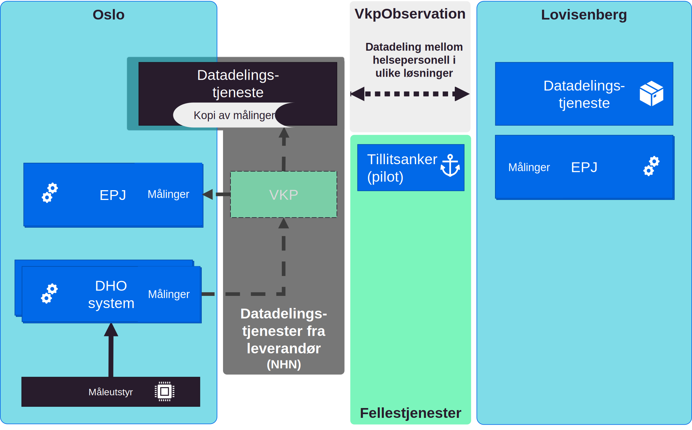

| Status           | Version | Maturity | Normative level |
| :--------------- | :------ | :------- | :-------------- |
| Prerelease  | v0.9.1 | review | ikke normert |

Denne delen inneholder eksempler på implementasjoner av datadeling, i forbindelse med utprøving og spredingsprosjekter i [nasjonalt velferdsteknologiprogram](https://www.helsedirektoratet.no/tema/velferdsteknologi/velferdsteknologi). Eksemplene er her vist med samme notasjon som målarkitekturen, for å vise hvordan implementasjonen kan sees i sammenheng med målarkitekturen.  

## Oslo og Lovisenberg

Oslo prøver ut datadeling til eksterne virksomheter kommunen samarbeider med i forbindelse med DHO. I første fase er det aktuelt å dele data både med spesialisthelsetjenesten og fastleger. Arbeidet med å prøve ut datadeling er foreløpig kommet lengst i samarbeidet mellom Oslo kommune og Lovisenberg sykehus. Oslo kommune bruker NHN som leverandør for å etablere en datadelingstjeneste hvor klinikere på Lovisenberg sykehus kan slå opp data om pasienter de får inn på sykehuset. En kopi av målingene som skal deles gjennom datadelingstjenesten lagres i NHN sin infrastruktur. NHN opptrer i denne sammenhengen som databehandler for målingene som skal deles på vegne av dataansvarlig virksomhet, som er Oslo kommune.  

*Eksempel på utprøving av datadeling mellom Oslo og Lovisenberg sykehus med bruk av VKP og datadelingstjeneste utviklet av Norsk Helsenett*

Oslo kommune samler måledata som benyttes i oppfølging av pasienter som har DHO. Den daglige oppfølgingen gjennomføres i et dedikert DHO-system. Oslo har sammen med VKP (Velferdsteknologisk knutepunkt) utviklet en integrasjon mellom DHO-systemet og EPJ systemet via Velferdsteknologisk knutepunkt. Denne integrasjonen brukes blant annet til journalføring av hendelser som må dokumenteres i pasientens løpende journal i EPJ.  

Målinger som ligger til grunn for oppfølging skal også dokumenteres i kommunens EPJ og disse journalføres på samme måte som journalnotater via integrasjon med VKP. NHN har i tillegg utviklet en datadelingstjeneste som kalles *Pasientens måledata* som kan høste alle måledata som sendes via VKP til EPJ og tilby oppslag mot disse fra eksterne virksomheter (hvis klinikere har tjenstlig behov for informasjonen). Det må etableres avtale mellom Oslo kommune og de virksomhetene som er interessert i å slå opp i informasjon lagret i *pasientens måledata* om bruk av løsningen og tilgang til informasjonen. I eksempelet i figuren er dette illustrert med en avtale mellom Lovisenberg sykehus og Oslo kommune. Avtalen mellom Oslo og Lovisenberg er i skrivende stund ikke ferdigstilt.  

Avlevering av måledata til VKP og ut fra *Pasientens måledata* følger en bestemt struktur og har definert innhold. Det er utviklet FHIR profiler som beskriver det detaljerte innholdet i detalj, disse profilene kalles VkpObservation i figuren og tar utgangspunkt i HL7 FHIR Observation.  
