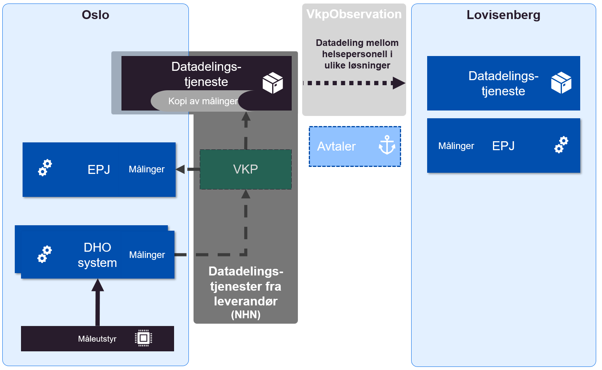

| Status           | Version | Maturity | Normative level |
| :--------------- | :------ | :------- | :-------------- |
| Work in progress | v0.1.0 | draft | ikke normert |

Denne delen inneholder eksempler på hvordan notasjonen som brukes for å vise målarkitekturen kan illustrere konseptene som realiseres for datadeling i forbindelse med utprøving og spredningsprosjekter i [nasjonalt velferdsteknologiprogram](https://www.helsedirektoratet.no/tema/velferdsteknologi/velferdsteknologi).

## Oslo og Lovisenberg

Oslo prøver ut datadeling til eksterne virksomheter kommunen samarbeider med i forbindelse med DHO. I første fase er det aktuelt å dele data både med spesialisthelsetjenesten og fastleger. Arbeidet er foreløpig kommet lengst knyttet til arbeidet med å prøve ut datadeling mellom Oslo kommune og Lovisenberg sykehus. Oslo kommune bruker støttetjenester i NHN for å etablere datadelingsgrensesnitt hvor klinikere på Lovisenberg sykehus kan slå opp data om pasienter de får inn på sykehuset.  

*Eksempel på utprøving av datadeling i Oslo med bruk av VKP og pasientens måledata, utviklet av Norsk Helsenett*

Oslo kommune samler måledata som benyttes i oppfølging av pasienter som har DHO. Den daglige oppfølgingen gjennomføres i et dedikert DHO-system. Oslo har sammen med VKP (Velferdsteknologisk knutepunkt) utviklet en integrasjon mellom DHO-systemet og EPJ systemet via Velferdsteknologisk knutepunkt. Denne integrasjonen brukes blant annet til journalføring av hendelser som må dokumenteres i pasientens løpende journal i EPJ.  

Målinger som ligger til grunn for oppfølging skal også dokumenteres i kommunens EPJ og disse journalføres på samme måte som journalnotater via integrasjon med VKP. NHN har i tillegg utviklet en løsning som kalles *Pasientens måledata* som kan høste alle måledata som sendes via VKP til EPJ og tilby oppslag mot disse fra eksterne virksomheter der klinikere har tjenstlig behov for informasjonen. Foreløpig er etablert avtale mellom Oslo kommune og Lovisenberg sykehus om oppslag mot dette grensesnittet. Innhold og struktur både for avlevering av måledata til VKP og ut fra Pasientens måledata gjennomføres ved hjelp av HL7 FHIR Observation ressurser. Det er utviklet FHIR profiler som beskriver struktur og innhold i detalj, disse profilene kalles VkpObservation i figuren.  