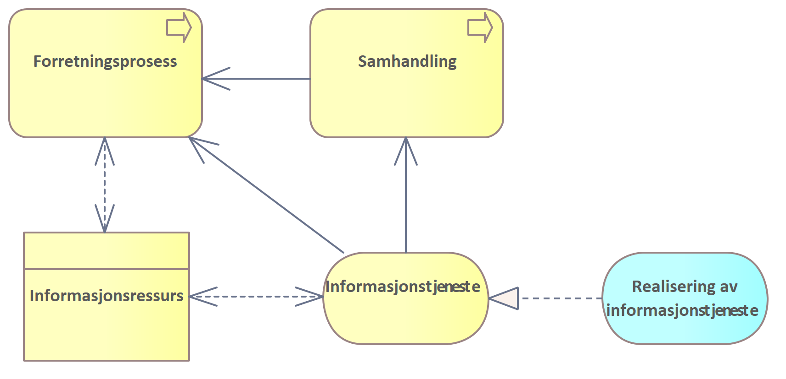
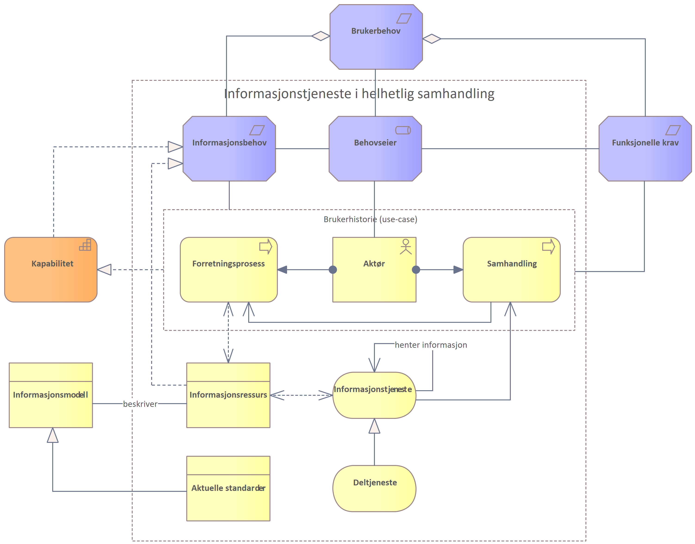

| Status | Version | Maturity | Normative level |
|:-------------|:------------------|:------|:-------|
| Work in progress | v0.5 | draft  | ikke normert |

Et sentralt begrep i forbindelse med helhetlig samhandling og målarkitekturen for datadeling innen DHO er informasjonstjeneste. I sin grunnleggende form er en informasjonstjeneste definert:

!!! note "Informasjonstjeneste"
    
    Informasjonstjenester, er en samlebetegnelse for alle typer tjenester som tilbyr eller manipulerer informasjonsressurser i form av en definert tjeneste.

Dette kan modelleres på denne måten:  

{width=500}

En informasjonstjeneste kan skrive og lese informasjon i form av informasjonsressurser. Informasjonstjeneste kan understøtte Forretningsprosesser direkte eller indirekte som en del av en Samhandlingsprosess. Informasjonstjenester realiseres vanligvis som mer spesifikke applikasjonstjenester (tjenester for datadeling, meldingsutveksling eller dokumentdeling).

## Helhetlig samhandling

I forbindelse med arbeidet for å tilrettelegge for helhetlig samhandling er det kartlagt en rekke informasjonstjenester det er behov for. På øverste nivå defineres informasjonstjeneste på denne måten med fokus på samhandling.

!!! note "Informasjonstjeneste i helhetlig samhandling"
    
    En informasjonstjeneste er en gruppering av informasjon som kan deles mellom helsepersonell.

I sin beskrivelse av de ulike informasjonstjenestene blir fler egenskaper listet opp: 

* Aktører som har behov
* Informasjonsbehov som understøttes
* Sammenheng med andre informasjonstjenester
* Deltjenester
* Brukerhistorier som benytter informasjonstjenesten
* Relevante standarder for realisering

Dette fører til en mer kompleks metamodell for informasjonstjenester i forbindelse med helhetlig samhandling.

{widt=500}

I arbeidet med målarkitektur for datadeling innen DHO er det den komplekse modellen vi forholder oss til. Det vil si at vi legger beskrivelsene av de ulike informasjonstjenesten til grunn når vi analyserer informasjonsbehovet i tilknytning til DHO.
