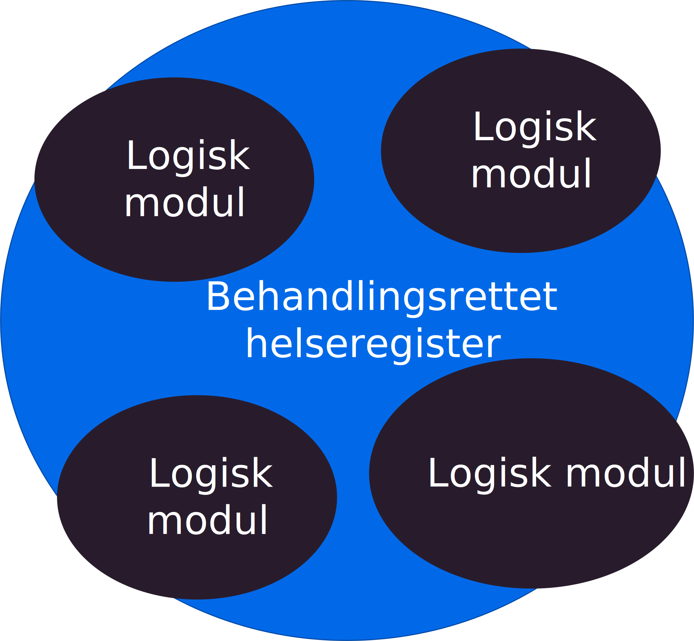
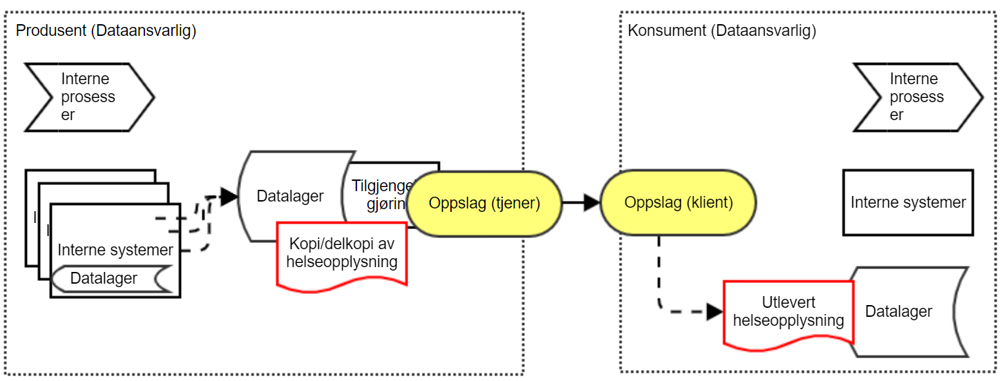
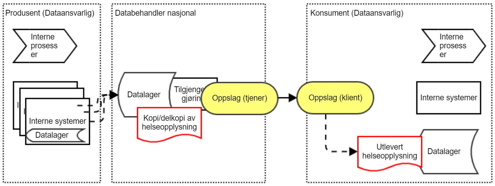

| Status           | Version | Maturity | Normative level |
| :--------------- | :------ | :------- | :-------------- |
| Release | v0.9.5 | mature | ikke normert |

!!! note

    Dette kapittelet er en kopi av en juridisk vurdering som er gjort av Direktoratet for e-helse med innspill fra Helsedirektoratet. Vurderingen er forelagt Helse- og omsorgsdepartementet som støtter vurderingen.

## Innledning

Direktoratet for e-helse og Helsedirektoratet ber om Helse- og omsorgsdepartementets vurdering av om samme helseopplysninger kan behandles flere steder i virksomhetens behandlingsrettede helseregister med den hensikt å tilgjengeliggjøre disse til helsepersonell ansatt i andre virksomheter ved ytelse av helsehjelp. Vi mener at saken er av prinsipiell betydning og at det er behov for at departementet avklarer rettstilstanden.  

Problemstillingen har oppstått i arbeidet med digital hjemmeoppfølging (DHO) som skal vurdere løsning for å dele måledata (helseopplysninger) mellom helsepersonell ansatt i ulike virksomheter med teknisk løsning for datadeling. Det er aktuelt når pasienten får helsehjelp i ulike virksomheter og på ulike behandlingsnivåer (kommuner, fastlege og sykehus).  

Under følger vår vurdering som vi ber om at departementet tar stilling til. Vurderingen er i all hovedsak skrevet av Direktoratet for e-helse. Helsedirektoratets synspunkter og merknader er innarbeidet i dette notatet. Helsedirektoratet er prinsipielt enige i at loven ikke er til hinder for at opplysninger dupliseres, forutsatt at lovens krav oppfylles.  

## Sammendrag og konklusjon

Det er behov for å dele helseopplysninger (her måledata) mellom helsepersonell ansatt i ulike virksomheter og på ulike behandlingsnivåer (kommuner, fastlege og sykehus). For å tilrettelegge for deling av disse helseopplysningene på en praktisk og sikker måte og slik at de er tilgjengelig for helsepersonell som yter helsehjelp, er det behov for å etablere kopier av opplysninger i virksomhetens pasientjournalsystem. Spørsmålet er om det er tillatt å etablere en slik kopi internt i virksomheten, og i forlengelsen av dette, hos en databehandler.  

Vi vurderer det slik at pasientjournalloven § 7 oppstiller funksjonelle krav og ikke legger tekniske føringer for hvordan virksomheter innretter og forvalter sine behandlingsrettede helseregistre etter pasientjournalloven § 8 for å oppfylle rettslige krav. Dette åpner også for, innenfor de lovpålagte krav til pasientjournalsystemer å duplisere opplysninger for å best mulig kunne oppfylle de krav loven oppstiller bl.a. til tilgjengeliggjøring av helseopplysninger og informasjonssikkerhet. En slik tilrettelegging av journalen for å ivareta lovens funksjonskrav og sikring av opplysningene innebærer ingen endring av formålet med behandlingen, formålet er fortsatt å dokumentere helsehjelpen. Selve oppgaven med å tilgjengeliggjøre helseopplysningene kan dermed også settes ut til en databehandler. Det er en forutsetning at duplisering ikke er til hinder for at øvrige lovkrav kan oppfylles.  

Dataminimeringsprinsippet vil sette en yttergrense for dupliseringsadgangen.  

Dersom det skal etableres en nasjonal løsning med sentral sammenstilling av journalopplysninger fra ulike virksomheter, vil dette kreve nytt selvstendig rettslig grunnlag (regelverksendring). Dersom dette blir aktuelt, kreves en særskilt vurdering av dette.  

## Nærmere om problemstillingen

I notatet drøfter vi hvorvidt virksomheten i sin forvaltning av et behandlingsrettede helseregister etter pasientjournalloven § 8 kan lagre kopier i ulike databaser for å ivareta krav til funksjon, rettigheter og informasjonssikkerhet, jf. pasientjournalloven § 7.  

Problemstillingen er aktuell i forbindelse med å kunne legge til rette for å tilgjengeliggjøre helseopplysninger (her måledata) på en hensiktsmessig måte mellom virksomheter ved ytelse av helsehjelp, men har også betydning for blant annet ivaretakelse av informasjonssikkerhet og krav til ytelse, se eksempler i vedlegg.  

Selv om den konkrete problemstillingen er knyttet til deling av «måledata» mellom helsepersonell ansatt i ulike virksomheter (digital hjemmeoppfølging), har spørsmålet betydning for datadeling generelt, gitt dagens tekniske forutsetninger. Vurderingen kan legge føringer for hvilket handlingsrom virksomheten (dataansvarlig) har til å etablere teknisk infrastruktur for datadeling, og dermed også for hvordan hensiktsmessige løsninger for datadeling kan etableres på kort sikt: Dersom dette vurderes slik at en virksomhet ikke kan etablere en intern kopi, vil konsekvensen være at det heller ikke kan benyttes en datadelingsløsning fra tredjepart, basert på databehandleravtale (dette forutsetter pr. i dag langt på vei at opplysninger kan kopieres). Større virksomheter vil kunne håndtere nødvendige funksjoner knyttet til datadeling innenfor egen infrastruktur, men for mindre virksomheter uten samme ressurstilgang vil dette innebære begrensede muligheter for reell og effektiv datadeling.

## Forutsetninger og avgrensninger

Forutsetningen for vurderingen er følgende:  
Vurderingen gjelder helseopplysninger som inngår i pasientjournalen. **Det rettslige grunnlaget** for dette er dokumentasjonsplikten, jf. helsepersonelloven §§ 39 og 40 jf. pasientjournalloven § 8. **Formålet** med behandlingen er å dokumentere helsehjelpen som ytes.  

Disse bestemmelsene angir dermed også rammene for hvilke helseopplysninger som kan dokumenteres/samles inn og på annen måte behandles i et pasientjournalsystem. Senere behandling til nye formål krever selvstendig rettslig grunnlag. Det behandlingsrettede helseregisteret skal være utformet og organisert slik at behandlingsansvarlig virksomhet blir i stand til å oppfylle en rekke krav, jf. pasientjournalloven § 7. Eksempelvis skal det legges til rette for at opplysningene skal kunne tilgjengeliggjøres/deles for helsehjelpsformål og andre formål, jf. pasientjournalloven § 7 bokstav f.  

Det er kun denne tilrettelegging av journalen som er temaet for vurderingen her. Her vurderes altså ikke vilkårene for en eventuelt senere deling, som hvordan løsningen kan oppfylle vilkårene i unntak fra lovbestemt taushetsplikt etter pasientjournalloven §§ 19 og 20. Dette problematiseres ikke videre her, men må løses som del av arbeidet med tillitsmodellen (identitets- og tilgangsstyring og logg).  

Her tas heller ikke stilling til om det er hensiktsmessig å etablere datadelingsløsninger som benytter duplisering som ledd i tilgjengeliggjøring av opplysninger, kun hvorvidt det er rettslig adgang til dette. Hvorvidt datadeling på noe lenger sikt teknisk vil baseres på at opplysninger dupliseres til en datadelingsløsning er uavklart og høyst usikkert, men dette er uansett ikke relevant for problemstillingen her. I denne sammenheng er det dermed heller ikke relevant hvorvidt det finnes alternative løsninger for deling av opplysninger, som f.eks. meldingsutveksling, dokumentdeling eller direkteintegrasjoner.  

En nasjonal løsning med sentral sammenstilling av opplysninger vil kreve nytt selvstendig rettslig grunnlag (regelverksendring). Dette faller utenfor vurderingen her og må vurderes separat dersom det blir aktuelt.

## Vurdering

Etablering av lokale (interne) kopier har i liten grad blitt problematisert tidligere. Det fremgår ikke av regelverket hvordan dataene teknisk skal lagres, se nedenfor om funksjonskrav. I forarbeidene og lovkommentarene til pasientjournalloven uttales at «dobbeltregistreringer bør unngås», men dette synes hovedsakelig begrunnet dels i å hindre dobbelt registreringsarbeid for helsepersonell, og dels i å unngå tvil om hvilket dokument som er oppdatert og det originale (masterdokumentet). Samtidig tas det i forarbeidene høyde for at opplysningene i et behandlingsrettet helseregister kan være nedtegnet og lagret adskilt i ett eller flere systemer, slik at samme opplysninger om en pasient er registrert flere steder. Dokumentasjon av helseopplysninger i pasientjournalen skal bidra til å sikre pasienten forsvarlig helsehjelp. En duplisering vil kunne være til fare for pasientsikkerheten ved at opplysninger er registrert flere steder og ikke er oppdatert i sanntid.  

Registrene som brukes for å gjennomføre dokumentasjonsplikten etter pasientjournalloven § 8 skal tilfredsstille kravene i pasientjournalloven § 7. Av § 7 første ledd fremgår at behandlingsrettede helseregistre skal understøtte pasientforløp i klinisk praksis og være lett å bruke og å finne frem i. Bestemmelsens andre ledd fastslår at behandlingsrettede helseregistre skal være utformet og organisert slik at krav fastsatt i eller i medhold av lov kan oppfylles, herunder de krav som listes i andre ledd bokstav a-g. Bestemmelsen oppstiller her funksjonskrav som angir hva som skal oppnås, ikke hvordan.  

Det fremgår også av forarbeidene at tekniske og organisatoriske løsninger skal være egnet til å etterleve krav fastsatt i eller i medhold av lov. Bestemmelsen angir konkrete funksjonskrav til behandlingsrettede helseregistre ved å henvise til bestemte plikter og rettigheter som følger av pasientjournalloven og andre lover.  

Se lovkommentarer for nærmere omtale, bl.a:  
> «Det er virksomhetens ansvar at registrene som brukes, tilfredsstiller disse kravene. Loven setter ikke krav til hvordan de ulike systemene skal bygges opp, så lenge systemet som helhet sikrer at oppdaterte og korrekte opplysninger er tilgjengelige for helsepersonellet. Heller ikke personvernforordningen artikkel 25 om innebygget personvern og personvern som standardinnstilling bestemmer hvordan kravet skal oppfylles. Denne formen for funksjonelle krav i lovgivningen – hvor det stilles krav til hva som skal oppnås, men ikke hvordan – skaper fleksibilitet i hvordan systemenes ulike komponenter settes sammen.»
Sverre Engelschiøn og Elisabeth Vigerust, Pasient¬journal¬loven og helse¬register¬loven. Lov-kommentar, 2. utgave, Universitetsforlaget, 2019 s. 92,

Etter vår vurdering tilsier dette at det behandlingsrettede helseregisteret må betraktes som én helhet, selv om registeret består av fragmenterte og eventuelt dupliserte opplysninger. Så fremt dette ikke er til hinder for å oppfylle krav som stilles til pasientjournalsystemer og til behandling av helseopplysninger, kan vi ikke se at regelverket oppstiller prinsipielle skranker for kopiering av data i egne interne behandlingsrettede helseregistre. Virksomheten må selv vurdere løsningsvalg etter de prinsipper og krav som stilles i § 7. En eventuell kopiering må være i henhold til virksomhetens risikoaksept.  

Virksomheten skal innrette og forvalte sin journal slik at kravene i § 7 best mulig kan etterleves. Dette kan, som det fremgår av illustrasjonen under, bety at virksomheten velger å registrere opplysninger i ulike moduler (duplisering), der dette er egnet. Dette kan være av tekniske grunner, f.eks. ytelse, av hensyn til informasjonssikkerheten eller av andre grunner. Slik vi ser det, er det opp til virksomheten selv å vurdere løsningsvalg etter pasientjournalloven § 7 og dermed også hvorvidt det i de konkrete tilfellene er hensiktsmessig å separere og/eller duplisere opplysninger som ledd i den interne tekniske journalforvaltningen.  

{ width="500" }  
*Behandlingsrettet helseregister bygd opp av flere logiske moduler*

Løsningen som etableres må herunder være egnet til å kunne tilfredsstille sikkerhetskravene som følger av pasientjournalloven § 22, jf. personvernforordningen artikkel 32. Duplisering må ikke være til hinder for at opplysningene som behandles er korrekte og oppdaterte. Eksempelvis vil ikke en kopiløsning kunne benyttes der det er behov for tilgjengeliggjøring av opplysninger i (tilnærmet) sanntid dersom duplisering forsinker informasjonsflyten utover det akseptable. En forsinket informasjonsflyt vil kunne være til fare for pasientsikkerheten og dermed ikke være akseptabelt / oppfylle lovkrav.  

Videre vil dataminimeringsprinsippet, jf. personvernforordningen artikkel 5, sette en yttergrense for dupliseringsadgangen. Hvor denne grensen går kan imidlertid vanskelig forhåndsdefineres, dette må virksomheten(e) selv vurdere etter prinsippene i § 7.  

Selv om virksomheten slik legger til rette for at en rekke krav skal kunne oppfylles, innebærer altså ikke dette at det samtidig skjer nye behandlinger av opplysninger til nye formål. Det er fortsatt én behandling (registrering) til ett formål (dokumentere helsehjelp) i ett og samme behandlingsrettede helseregister, men samtidig slik at det legges til rette for at øvrige regelverkskrav kan etterleves og informasjonssikkerheten ivaretas. Dette er også i samsvar med lovens formålsbestemmelse som forutsetter at registeret som helhet innrettes slik at de funksjonelle kravene regelverket oppstiller ivaretas, og slik at relevante og nødvendige opplysninger er tilgjengelige for de som yter helsehjelp når de trenger det.  

Dette betyr med andre ord at selv om deler av journalen er innrettet slik at det muliggjør sikker og effektiv tilgjengeliggjøring/deling av opplysninger, jf. det funksjonelle kravet i pasientjournalloven § 7 f), skjer det ikke noen ny behandling før tilgjengeliggjøring faktisk skjer. Hvorvidt slik senere tilgjengeliggjøring faktisk kan skje, forutsetter en selvstendig vurdering i det konkrete tilfellet etter pasientjournalloven § 19 på vanlig måte.  

For å gjøre det mulig med datadeling på en hensiktsmessig måte, er det sentrale her at det behandlingsrettede helseregisteret kan innrettes med ulike logiske deler for å oppfylle ulike funksjoner. Ved en slik innretning kan tilgjengeliggjøring av opplysninger optimaliseres på en langt bedre måte enn ved å hente opplysningene direkte fra kildebasen. En direkte spørring fra eksterne parter mot kildebasen er verken ønskelig eller forsvarlig, både av sikkerhetsgrunner og av ytelsesgrunner. Sagt på en annen måte: Den dataansvarlige vil ønske å eksponere eksternt bare det som er relevant å dele - her: de relevante måledataene, og ikke hele serien med data eller full journal. Da må man ha et (del-)system som en ekstern part kan spørre mot.  Et slikt delsystem vil kun være en av flere mulige logiske instanser under samme "paraply" (altså del av journal).  

Vi legger derfor til grunn at virksomheten kan velge å teknisk lagre helseopplysninger i EPJ-systemer flere steder dersom virksomheten anser dette mest hensiktsmessig for å ivareta funksjonskravene, inkludert kravene til informasjonssikkerhet (herunder integritet), og at regelverket ikke legger tekniske føringer eller prinsipielle begrensninger for dette. Ettersom dette vil gjelde tekniske løsningskonsepter som skjer «under panseret» i den tekniske infrastrukturen, vil det for det enkelte helsepersonell ikke fremstå som at opplysningene er duplisert. Løsningene skal dermed heller ikke medføre risiko for dårligere oversikt over opplysningene for helsepersonellet.  

I praksis skjer lokal kopiering i stort omfang. Ofte vil det være nødvendig med en rekke tekniske konsepter for å oppfylle lovens krav. For tilgjengeliggjøring er dette beskrevet i kulepunktene nedenfor, se også vedlegg for utdypende beskrivelse og ytterligere eksempler. Som det fremgår her, kan det i mange tilfeller være behov for å duplisere opplysninger for å best mulig legge til rette for å kunne ivareta lovens funksjonskrav. Dette gjelder særlig krav knyttet til informasjonssikkerhet. Etter vår oppfatning er dette også i samsvar med hvordan de fleste journalsystemer/behandlingsrettede helseregistre innrettes og forvaltes i dag.  

### Særlig om tilgjengeliggjøring: Optimalisert kopi

{ width="500" }  
*Løsningsmønster med optimalisert kopi for datadeling*

Et vanlig løsningsmønster for å tilgjengeliggjøre informasjon til eksterne tjenester er å lage en kopi av informasjonen man ønsker å eksponere eksternt. Tjenesten for tilgjengeliggjøring inneholder da en kopi av informasjon som er relevant for eksterne brukere. Tjenesten kan optimaliseres for de søk som etterspørres av eksterne brukere og vil ikke inneholde informasjon man ikke ønsker å eksponere eksternt. Informasjonen kan hentes på forespørsel fra eksterne konsumenter.  

### Optimalisert kopi - bruk av databehandler

{ width="500" }  
*Løsningsmønster med optimalisert kopi for datadeling med bruk av ekstern databehandler*

Virksomheten kan, i forlengelsen av dette, også velge å sette bort deler av sin journalforvaltning til en ekstern part (databehandler). I eksempelet over kan virksomheten velge å benytte en databehandler som tilbyr delingsfunksjonalitet i stedet for selv å etablere en slik intern tilgjengeliggjøringstjeneste. Her vil også flere virksomheter kunne benytte den samme tjenesten fra den samme databehandleren. Dette forutsetter imidlertid at databehandleren behandler opplysningene fra virksomhetene logisk adskilt. En sammenstilling av opplysningene hos databehandleren ville derimot føre til samme problemstilling som for Pasientens prøvesvar, jf. over. Dette ville være et nytt behandlingsrettet helseregister som vil kreve eget selvstendig rettslig grunnlag. 
