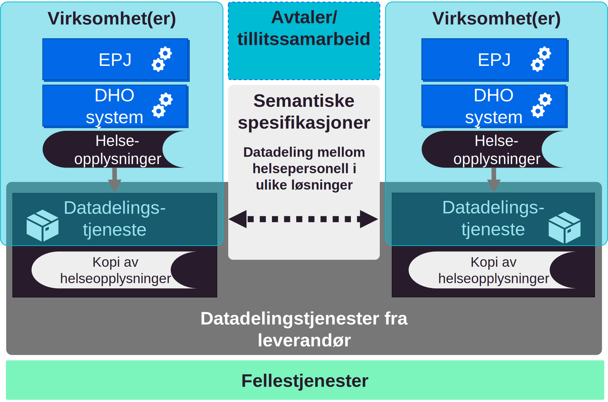
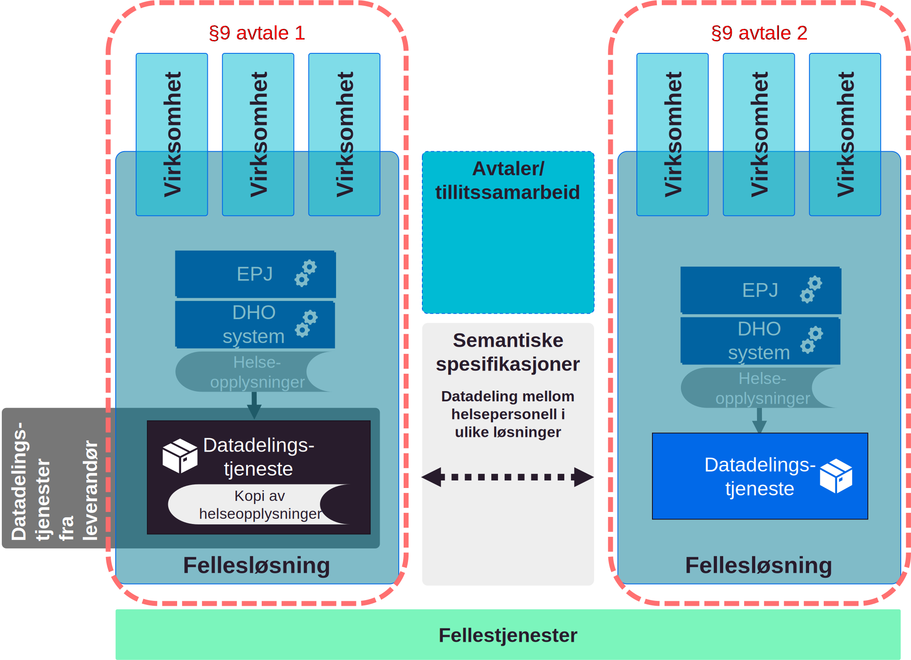
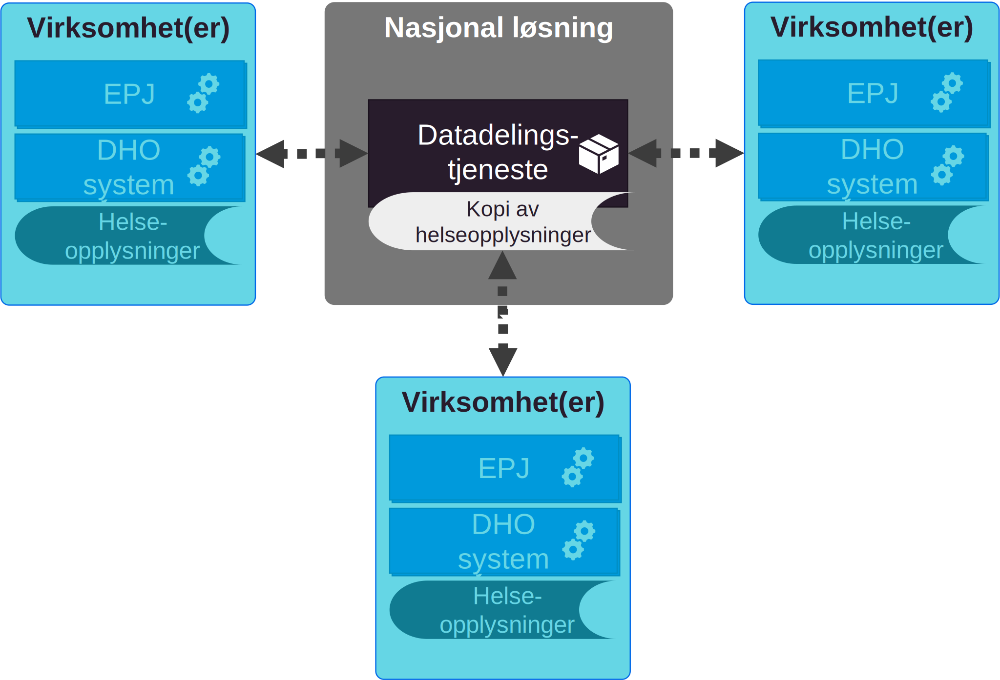

| Status | Version | Maturity | Normative level |
|:-------------|:------------------|:------|:-------|
| Prerelease | v0.9.1 | review  | ikke normert |

Formålet med denne delen av målarkitekturen er å vise ulike konsepter for hvordan datadeling mellom virksomheter kan realiseres, og vurdere disse konseptene i forhold til hverandre. Det er hovedfokus på etablering av funksjonalitet for å avgi og tilgjengeliggjøre informasjon siden denne delen av datadelingsløsningen regnes som mer kompleks å etablere og vedlikeholde enn funksjonalitet for oppslag. Siden konseptene vurderes ut fra kjente premisser og erfaringer som eksisterer i dag vil dette være et øyeblikksbilde av situasjonen og konseptene må derfor utvikles i takt med at sektoren vinner erfaringer med konkret løsningsutvikling og eventuell utvikling i systemlandskap, organisering av helsetjenesten og juridiske rammebetingelser.

!!! note

    Ved etablering av løsninger for datadeling skilles det mellom funksjonalitet for å avgi data (datatilbyder/produsent) og funksjonalitet for å slå opp i data (datakonsument). Funksjonaliteten for å avgi data regnes som mer komplisert å etablere og vedlikeholde enn oppslagsfunksjonaliteten siden det er høye krav til ytelse og tilgjengelighet knyttet til å avgi data ved datadeling. Datadelingsløsninger omtales som synkrone og det forventes at svaret på ett oppslag skjer umiddelbart (iløpet av noen millsekunder). Etableringen av funksjonalitet for oppslag er ikke like komplisert, selv om integrasjon mot eksisterende tekniske løsninger i egen virksomhet kan være utfordrende.  

    Mer om samhandlingsformen [slå opp](Organisatorisk-sla-opp.md)

## Vurderingskriterier

Konseptene for etablering av funksjonalitet for datatilbyder (avgi og tilgjengeliggjøre) vurderes etter følgende kriterier:

* Behovsoppnåelse, i forhold til identifiserte [behov for samhandling innen digital hjemmeoppfølging](../behov/index.md#overordnede-roller-og-brukerhistorier)
* Skalerbarhet, her skiller vi på skalering for utprøvingen og skalering nasjonalt/regionalt
  * Det er spesielt fokus på muligheter for gjenbruk av eksisterende fellestjenester, felleskomponenter eller kode/spesifikasjoner på tvers av virksomheter
* Fleksibilitet og innovasjonskraft, løsninger med stor fleksibilitet i forhold til å dekke lokale behov kan understøtte lokal innovasjon
* Juridisk risiko, kan hele eller deler av konseptet realiseres innenfor gjeldende rett eller krever det lov/forskriftsarbeid for å realisere eller skalere løsninger basert på konseptet
* Kompleksitet i etablering og vedlikehold av løsningen
  * Etableres det løse eller sterke koblinger mellom aktører og løsningskomponenter for å realisere løsningen
  * Etableres det mange kompliserte spesialløsninger for å oppnå samhandling pådrar sektoren seg stor teknisk gjeld
* Bruk av standarder og hyllevare, er det mulig å basere seg på standardiserte grensesnitt og tilgjengelig hyllevare i stor eller liten grad

## Anbefalt konsept for datadeling

Vi anbefaler at virksomhetene vurderer hvilke konsept for datadeling som egner seg best ut fra samhandlingsbehovene som identifiseres i tjenesteforløpene som skal etableres regionalt eller lokalt. Virksomhetene bør velge ett eller flere konsept som er innenfor gjeldende rett for å komme i gang med datadeling mellom virksomhetene i Helsefellesskapet eller regionen. Det kan vurderes kombinasjoner av alle konseptene som faller innenfor gjeldende rett også innenfor en region. Hvilke konsept som passer best er blant annet avhengig av virksomhetenes størrelse, eksisterende infrastruktur og behov for fleksibilitet.

Anbefalt konsept baserer seg på at virksomhetene etablerer grensesnitt for å avgi data til andre virksomheter enten som distribuerte løsninger eller gjennom regionale fellesløsninger, innenfor et §9 samarbeid. Virksomheter med stort behov for støtte for å realisere datadeling kan benytte en leverandør for å realisere datadelingstjenesten mens virksomheter som evner å realisere og vedlikeholde datadelingstjenester kan gjøre dette uten å benytte tredjepart til dette.

*Fleksibelt konsept for etablering av datadeling hvor valg av løsning er avhengig av behov for støtte og om virksomheten tar utgangspunkt i selvstendige løsninger eller fellesløsninger etablert i samarbeid med andre virksomheter*

### Vurdering

Gitt virksomhetenes ulike størrelser og forutsetninger for å etablere datadelingsløsninger mener vi det er hensiktsmessig at virksomhetene vurderer løsningskonsepter basert på lokale og regionale behov. Virksomhetene kan basert på behov etablere datadelingsløsninger på egenhånd, benytte felles infrastruktur for å etablere datadelingsløsninger eller inngå regionale samarbeid for å understøtte samhandlingen.

### Forutsetninger

* For at konseptet skal skalere nasjonalt/regionalt må det etableres Pasientinformasjonslokalisator (PIL) i nasjonal eller regional infrastruktur
* Konseptet forutsetter etablering av tillitsankerfunksjonalitet i nasjonal eller regional infrastruktur
* Konseptet forutsetter at det etableres felles semantiske spesifikasjoner for informasjonen som skal utveksles

### Fordeler

* Konseptet gir stor fleksibilitet i forhold til hvilken funksjonalitet virksomhetene realiserer
  * Virksomhetene realiserer funksjonalitet som gir mest nytte lokalt/regionalt
  * Konseptet kan gjøre det enklere å få til lokal tjenesteinnovasjon
* Det etableres felles semantiske spesifikasjoner som alle virksomheter forholder seg til
* Datadeling kan etableres innenfor gjeldende rett

### Ulemper

* Mangler én tydelig retning for hvordan virksomhetene skal utvikle datadeling
* Det er ikke hjemmel for å etablere en sentralisert modell for PIL innenfor dagens regelverk
* Det kan være utfordrende å utarbeide felles semantiske spesifikasjoner som gir nytte for virksomhetene
  * Virksomheter som ikke opplever nytte kan velge å ikke tilgjengeliggjøre informasjon fra egne løsninger
* Det kan være komplisert å etablere felles tillitsanker og felles krav knyttet til felles tillitsmodell

### Muligheter

* Kan gjennomføres med begrensede investeringer (for et lite antall virksomheter)

### Trusler

* Skalering krever utvikling av felleskomponenter og fellestjenester
* Konseptet er avhengig av etablering av fellestjenester for  PIL og felles tillitsmodell for videre spredning nasjonalt
* Det eksisterer ikke avklart finansieringsmodell for nye fellestjenester i felles infrastruktur

## Vurdering av konsepter for datadeling

Anbefalingen av konsepter for datadeling baserer seg på vurderinger knyttet til hvert enkelt konsept i forhold til vurderingskriteriene. Vurderingen er oppsummert med fordeler og ulemper knyttet til hvert enkelt konsept. Konseptene som er vurdert for etablering av datadeling er:

* [Distribuerte datadelingsløsninger (i virksomhetenes infrastruktur)](#distribuerte-datadelingslsninger-i-virksomhetenes-infrastruktur)
* [Distribuerte datadelingsløsninger (i leverandør infrastruktur)](#distribuerte-datadelingslsninger-i-leverandr-infrastruktur)
* [Regionale fellesløsninger](#regionale-felleslsninger)
* [Regionale datadelingsløsninger med lagring](#regionale-datadelingslsninger-med-lagring)
* [Nasjonal sentral datadelingsløsning med lagring](#nasjonal-sentral-datadelingslsning-med-lagring)

### Distribuerte datadelingsløsninger (i virksomhetenes infrastruktur)  

Distribuerte datadelingsløsninger i virksomhetenes infrastruktur baserer seg på at hver enkelt virksomhet etablerer sin egen løsning for å avgi informasjon fra sine systemer. Grensesnitt og datalager for datadeling etableres i virksomhetens egen infrastruktur. Datadeling mellom virksomhetene gjennomføres ved at hver virksomhet gjør oppslag mot datadelingstjenester etablert av andre virksomheter.

*Distribuerte datadelingsløsninger etablert i virksomhetenes infrastruktur*

#### Vurdering

Hovedfordelen med konseptet distribuerte datadelingsløsninger er stor fleksibilitet. Virksomehtene kan etablere funksjonalitet som gir stor opplevd nytte regionalt eller lokalt. Den største ulempen er knyttet til stor kompleksitet ved etableringen og vedlikehold av funksjonaliteten for å avgi og tilgjengeliggjøre informasjon fra separate løsninger i hver enkelt virksomhet. Dette gjør en distribuert modell komplisert å bredde og vedlikeholde.  

En distribuert modell stiller store krav til samhandlingsinfrastrukturen og samarbeid på tvers av leverandører og virksomheter. Konseptet stiller for eksempel krav om at virksomhetene må vite hvor de skal søke etter informasjon om en bestemt pasient gjennom en pasientinformasjonslokalisator (PIL), siden det er lite effektivt å gjøre oppslag mot alle virksomheter uavhengig av om disse har informasjon om pasienten eller ikke. Det må etableres en sentralisert tillitsmodell for å støtte dette konseptet, ellers blir man avhengig av bilaterale avtaler mellom alle aktørene som ønsker å samhandle med hverandre.  Alle løsninger for å avgi informasjon må ta utgangspunkt i felles semantiske spesifikasjoner tilpasset ulike bruksområder, slik at det blir enkelt å søke i informasjon på tvers av mange ulike virksomheter og løsninger som er levert av forskjellige leverandører.  

#### Forutsetninger

* Alle produsenter av informasjon må etablere funksjonalitet for å avgi informasjon, funksjonaliteten må etableres i egne systemer i virksomhetens infrastruktur
* Alle konsumenter av informasjon må etablere funksjonalitet for å gjøre oppslag, og funksjonaliteten må etableres i egne systemer i virksomhetens infrastruktur
* For at konseptet skal skalere nasjonalt/regionalt må det etableres Pasientinformasjonslokalisator (PIL) i nasjonal eller regional infrastruktur
* Konseptet forutsetter etablering av tillitsanker funksjonalitet i nasjonal eller regional infrastruktur
* Konseptet forutsetter at det etableres felles semantiske spesifikasjoner for informasjonen som skal utveksles
<!--Kunne vurdering og forutsetninger beskrivelsene slås sammen og bygge på den punktvises tilnærminmgen. Vurderingene kommer vel med beskrivelse av fordeler og ulemper?-->
<!-- SVAR: Vurderingen er en oppsummering av punktlistene -->

#### Fordeler

* Distribuert datadeling kan etableres innenfor gjeldende rett (med forbehold om realisering av PIL)
* Det er stor fleksibilitet i forhold til hvilken funksjonalitet virksomhetene realiserer
  * Virksomhetene realiserer funksjonalitet som gir mest nytte lokalt/regionalt
  * Kan gjøre det enklere å få til lokal tjenesteinnovasjon
* Det etableres felles semantiske spesifikasjoner som alle virksomheter forholder seg til

#### Ulemper

* Det er komplisert å etablere og vedlikeholde infrastruktur og løsninger for å avgi data i alle virksomheter i helsesektoren
  * Konseptet kan derfor være vanskelig å skalere fort
* Det etableres mange sterke koblinger mellom virksomhetenes løsninger
  * Oppslag mot mange kilder (produsenter) kan gi dårlig brukeropplevelse
* Det er ikke hjemmel for å etablere en sentralisert modell for PIL innenfor dagens regelverk
* Det kan være utfordrende å utarbeide felles semantiske spesifikasjoner som gir nytte for virksomhetene
  * Virksomheter som ikke opplever nytte kan velge å ikke tilgjengeliggjøre informasjon fra egne løsninger
* Det kan være komplisert å etablere felles tillitsanker og felles krav knyttet til felles tillitsmodell
* Siden det er stor fleksibilitet til å prioritere lokale/regionale behov kan konsekvensen være lite enhetlig funksjonalitet på tvers av virksomhetene og derfor dårlig samhandling regionalt, hvis regionen ikke klarer å samordne utviklingen

### Distribuerte datadelingsløsninger (i leverandør infrastruktur)

Konseptet baserer seg (som ren distribuert modell) på at hver enkelt virksomhet etablerer sin egen løsning for å avgi informasjon fra sine systemer, men istedenfor å etablere dette i egen infrastruktur etableres selve grensesnittet og datalager for datadeling i en felles infrastruktur. Det betyr at grensesnittet driftes og vedlikeholdes av en eller noen få leverandør(er). Datadelingen mellom virksomhetene gjennomføres ved at hver virksomhet gjør distribuerte oppslag mot grensesnittene for å avgi data, som er etablert av de andre virksomhetene. Det er en juridisk forutsetning at informasjonen fra hver virksomhet ikke sammenstilles med informasjon fra andre virksomheter i den sentrale infrastrukturen, men at løsningene for lagring og grensesnittene etableres som logisk adskilte løsninger for hver virksomhet. Behandlingen av helseopplysninger i sentral infrastruktur må reguleres av en databehandleravtale mellom den enkelte virksomheten og leverandøren av infrastrukturen.

*Distribuerte datadelingsløsninger i infrastruktur levert av ekstern leverandør*

#### Vurdering

Hovedfordelen med distribuerte datadelingsløsninger i sentral infrastruktur er at de største ulempene med ren distribuert modell blir adressert. Det blir derfor enklere å etablere et stort antall separate løsninger siden disse kan gjenbrukes på tvers av virksomheter. Konseptet gjør det enklere å etablere PIL og felles tillitsmodell. Konseptet er imidlertid ikke like fleksibelt som en ren distribuert modell og mulighetene for lokal tjenesteinnovasjon blir begrenset siden alle må gjenbruke datadelingsløsninger på tvers av virksomheter.

#### Forutsetninger

* Datalagrene som etableres i felles infrastruktur må være logisk adskilte
* Datatilbydere må etablere funksjonalitet for å avgi data, funksjonaliteten etableres i felles infrastruktur
* Det må etableres databehandleravtale mellom virksomhetene som benytter sentral infrastruktur for å etablere grensesnitt og lagring av helseopplysninger
* For at konseptet skal skalere nasjonalt/regionalt må det etableres Pasientinformasjonslokalisator (PIL) i nasjonal eller regional infrastruktur
* Konseptet forutsetter etablering av tillitsanker funksjonalitet i felles infrastruktur (kan implementeres som en del av databehandleravtalene)
* Alle konsumenter av informasjon må etablere søkefunksjonalitet i egen infrastruktur
* Konseptet forutsetter at det etableres felles semantiske spesifikasjoner for oppslag i informasjonen som skal utveksles

#### Fordeler

* Fordeler som med distribuerte datadelingsløsninger (i virksomhetenes infrastruktur)
  * **Unntatt** Fleksibiliteten knyttet til hvilken funksjonalitet som etableres i hvilke virksomheter forsvinner helt eller delvis siden det er en leverandør som tilbyr grensesnitt for å avgi data
* Konseptet gir mulighet for å gjenbruke funksjonalitet på tvers av virksomheter
  * Det er stort potensiale for gjenbruk av kode på tvers av virksomhetene og løsningen blir derfor enklere å skalere raskt
* Det vil være enklere å realisere PIL
* Det vil være enklere å implementere felles tillitsmodell som en del av databehandleravtalene

#### Ulemper

* Ulemper som for distribuerte datadelingsløsninger (i virksomhetenes infrastruktur)
  * **Unntatt** Det blir ikke like komplisert å etablere og vedlikeholde grensesnittene for å avgi data siden disse etableres i felles infrastruktur av en leverandør
* Alle datatilbydere må implementere synkronisering av egne data mot datalager i sentral infrastruktur
* Med en sentral leverandør av søkefunksjonalitet er det en risiko for at den sentrale leverandøren kan bli en flaskehals og dermed gi dårligere rammer for lokal innovasjon

### Regionale fellesløsninger

Ved etablering av regionale fellesløsninger, for eksempel for DHO, blir informasjonen som skal deles med andre virksomheter lagret i den regionale fellesløsningen. Grensesnitt for å avgi informasjon ved hjelp av datadeling etableres også som en del av den regionale fellesløsningen. Bruk av en fellesløsning vil gi virksomhetene som samarbeider om denne mulighet til å se informasjonen om pasienten på tvers av virksomhetene som er med på samarbeidet. Samhandling mellom virksomhetene innenfor samarbeidsområdet vil derfor løses direkte i fellesløsningen.

Grensesnittet for datadeling som etableres i fellesløsningen benyttes hovedsaklig for samhandlingen med virksomheter som står utenfor samarbeidet og eventuelt andre systemer i de samarbeidende virksomhetene (som ivaretar dokumentasjonsbehov som ikke er dekket av fellesløsningen). En viktig forutsetning for å etablere samarbeidsløsning er at funksjonalitet som etableres i fellesløsningen kommer istedenfor funksjoner i andre systemer i virksomheten og at informasjonen bare journalføres i fellesløsningen.

*Datadeling etableres som en del av en regional fellesløsning og beskrives i en avtale mellom virksomhetene i henhold til pasientjournalloven §9*

#### Vurdering

Virksomhetene som samarbeider om en fellesløsning vil ha mindre behov for bruk av datadeling innenfor sitt samarbeidsområde, siden klinikerne kan vise relevant informasjon direkte i fellesløsningen. Løsning for å avgi data vil derfor i hovedsak benyttes for å ivareta datadeling med virksomheter som står utenfor samarbeidet regionalt eller være knyttet til nasjonal samhandling om pasienten. I tillegg gir et samarbeid om en fellesløsning mulighet for å gjenbruke løsning for å avgi data på tvers av flere virksomheter, samtidig som man oppnår fleksibilitet knyttet til regional innovasjon innenfor fellesløsningen.

#### Forutsetninger

* Funksjonalitet for å avgi data etableres i fellesløsningen, denne delen av løsningen brukes bare mot andre systemer eller virksomheter som ikke er en del av felles løsningen
* Funksjonalitet og datalager i fellesløsningen kommer istedenfor eksisterende datalager og funksjonalitet i virksomhetenes egne systemer
  * Fellesløsningen etableres for å oppfylle dokumentasjonsplikten
* Fellesløsningen ivaretar samhandlingen mellom virksomhetene som er med på samarbeidet innenfor behovsområdet

#### Forutsetninger for kommunikasjon utover fellesløsningen

* For at konseptet skal skalere nasjonalt/regionalt må det etableres Pasientinformasjonslokalisator (PIL) i nasjonal eller regional infrastruktur
* Konseptet forutsetter etablering av tillitsanker funksjonalitet i felles infrastruktur
  * Gjelder bare ved kommunikasjon mot virksomheter som ikke er en del av samarbeidet
* Alle konsumenter av informasjon, utenfor samarbeidet, må etablere søkefunksjonalitet i egen infrastruktur
* Konseptet forutsetter at det etableres felles semantiske spesifikasjoner for oppslag i informasjonen som skal utveksles
  * Med virksomheter utenfor samarbeidet om fellesløsningen
  * Med andre løsninger i virksomhetene som ikke er omfattet av samarbeidet om fellesløsning

#### Fordeler

* Etableringen av en fellesløsning kan i seg selv løse mange behov for digital samhandling mellom virksomhetene innenfor samarbeidet
  * Stort potensiale for regional innovasjon og tjenesteutvikling og tilpasning av løsningen til regionale behov
* Konseptet gir mulighet for å gjenbruke funksjonalitet for å avgi data til virksomheter som står utenfor samarbeidet
* Middels fleksibilitet knyttet til lokal innovasjon og tjenesteutvikling siden fellesløsningen må ta hensyn til behovene til alle virksomhetene i samarbeidet
* Denne bruken av §9 er avklart og fellesløsningen blir å regne som èn aktør knyttet til samhandling med eventuelle eksterne aktører utenfor samarbeidet
* Behovet for bruk av PIL er hovedsaklig knyttet til den nasjonale datadelingen (som er mindre)

#### Ulemper

* Den sentrale leverandøren av fellesløsningen kan bli en flaskehals
* Det er komplisert å etablere en fellesløsning som gir stor verdi for alle virksomhetene i samarbeidet
  * Det er komplisert å etablere gode fellesløsninger for mange virksomheter
  * Utfordringer knyttet til etablering av avtaler, felles prosesser og felles infrastruktur

### Regionale datadelingsløsninger med lagring

Ved etablering av sentral regional datadelingsløsning blir informasjonen som skal tilgjengeliggjøres mellom virksomhetene lagret i sentral infrastruktur hos NHN (eller annen leverandør) samtidig som den eksisterer i relevante fagsystem hos den enkelte virksomheten for å ivareta dokumentasjonsplikten. Grensesnitt for å avgi data fra felles datadelingsløsning etableres også i sentral infrastruktur. Virksomhetene som deltar i det regionale samarbeidet kan søke i den felles regionale tjenesten som tilbys og driftes av NHN. Det kan også opprettes søk mot den regionale løsningen for virksomheter som ikke er en del av det regionale samarbeidet.

*Regional datadelingsløsning etablert med kopilagring i sentral infrastruktur*

#### Vurdering

Konseptet løser behovet virksomhetene i samarbeider har for datadeling gjennom en felles regional løsning for dette, noe som vil gi middels fleksibilitet knyttet til regional tjenesteutvikling og høy effektivitet knyttet til utvikling og forvaltning av en felles datadelingsløsning. Dette løser behovet for regional datadeling (som er identifisert som [det største behovet innen DHO](Detaljert-behovsbilde.md#hypotese-knyttet-til-brukerbehov)). Den største ulempen med konseptet er at det ikke lar ser realisere innenfor gjeldende rett.

#### Forutsetninger

* Funksjonalitet for å avgi data etableres i fellesløsningen (likt som regional fellesløsning)
* Funksjonalitet og datalager i fellesløsningen kommer i tillegg til eksisterende datalager og funksjonalitet i virksomhetenes egne systemer
  * Fellesløsningen etableres ikke for å oppfylle dokumentasjonsplikten, men for å tilgjengeliggjøre informasjon på tvers av virksomheter
  * Dette skiller konseptet fra regional fellesløsning
* For at konseptet skal skalere nasjonalt må det etableres Pasientinformasjonslokalisator (PIL) i nasjonal infrastruktur
  * Den regionale samhandlingen forutsettes løst i regionen
* Alle konsumenter av informasjon må etablere søkefunksjonalitet i egen infrastruktur
* Konseptet forutsetter at det etableres felles semantiske spesifikasjoner for søk og oppslag av informasjonen som skal utveksles
  * De semantiske spesifikasjonene kan være regionale eller bygge på nasjonale spesifikasjoner

#### Fordeler

* Konseptet understøtter behovet for regional datadeling på en god måte
* Konseptet gir mulighet for å gjenbruke funksjonalitet for å avgi data på tvers av  virksomhetene som deltar i samarbeidet og løser derfor behovet for samhandling innen regionen
* Stort potensiale for regional innovasjon og tjenesteutvikling
* Middels fleksibilitet knyttet til lokal innovasjon og tjenesteutvikling siden fellesløsningen må ta hensyn til behovene til alle virksomhetene i samarbeidet
* Innenfor regionen er det liten risiko for dårlig brukeropplevelse knyttet til søk, siden tilgjengeliggjøringen er sentralisert i regionen
* Behovet for bruk av PIL er hovedsaklig knyttet til den nasjonale datadelingen (som er mindre)
* Tillitsanker funksjonalitet kan etableres som en del av den regionale datadelingsløsningen

#### Ulemper

* [Juridisk vurdering av konseptet](../juridisk/index.md#regional-datadelingslsning-med-lagring) viser at §9 ikke kan benyttes til å etablere felles regionale løsninger hvor hovedformålet er datadeling
* Alle virksomhetene må implementere synkronisering av egne data mot datalager i sentral infrastruktur

### Nasjonal sentral datadelingsløsning med lagring

Ved etablering av sentral nasjonal datadelingsløsning baserer vi oss på at informasjonen som skal tilgjengeliggjøres mellom virksomhetene lagres i sentral infrastruktur hos NHN (eller annen leverandør) samtidig som den eksisterer i relevante fagsystem hos den enkelte virksomheten for å ivareta dokumentasjonsplikten. Virksomhetene kan da gjennomføre søk mot en felles nasjonal tjeneste som tilbys og driftes av NHN.

*Nasjonal sentral datadelingsløsning med kopilagring av helseopplysninger fra virksomhetene*

#### Vurdering

Hovedfordelen med en nasjonal sentral datadelingsløsning for DHO er at løsningen for datadeling utvikles og forvaltes et sted, dette gir best mulighet for gjenbruk og effektiv drift av datadelingsløsningen av alle de vurderte løsningene. Konseptet elminierer også behovet for PIL. Den største ulempen med løsningen er at det etableres en større løsning enn det egentlig er behov for siden samhandlingsbehovet hovedsaklig er regionalt, løsningen gir også klart mindre fleksibilitet knyttet til lokal og regional tjenesteutvikling av de vurderte løsningene, siden all funksjonalitet knyttet til datadeling er sentralisert hos en leverandør.

!!! note "Nasjonal kopilagring eller nasjonal original"

    Vurderingen baserer seg på en variant av nasjonal datadelingsløsning hvor en kopi av helseopplysninger lagres i den nasjonale løsningen. Alternativet er å vurdere nasjonal original men siden behovet for nasjonal original ikke er identifisert for noen av de [mest etterspurte informasjonstjenestene for DHO](../behov/index.md#prioritering-av-informasjonstjenester) vurderes ikke denne varianten her. Unntaket er informasjonstjenesten Plan (IT08) som løses med lagring av felles original i tilknytning til kjernejournal.

#### Forutsetninger

* Funksjonalitet for å avgi data etableres i nasjonal datadelingsløsning
* Funksjonalitet og datalager i sentral datadelingsløsning kommer i tillegg til eksisterende datalager og funksjonalitet i virksomhetenes egne systemer
  * Nasjonal datadelingsløsning etableres ikke for å oppfylle dokumentasjonsplikten, men for å utveksle data på tvers av virksomheter
* Alle konsumenter av informasjon må etablere søkefunksjonalitet i egen infrastruktur
* Felles semantiske spesifikasjoner for søk og oppslag av informasjonen etableres og implementeres i den nasjonale datadelingsløsningen

#### Fordeler

* Konseptet understøtter behovet for nasjonal datadeling på en god måte
* Det er stort potensiale for gjenbruk av kode og løsninger på tvers av virksomhetene i helsesektoren
* Konseptet kan skaleres raskt nasjonalt og har stort potensiale for effektiv sentral forvaltning
* Konseptet eliminerer behovet for PIL for informasjonen som lagres i den nasjonale løsningen
* Tillitsanker funksjonalitet kan etableres som en del av den nasjonale datadelingsløsningen

#### Ulemper

* Siden behovet for datadeling i hovedsak er regionalt er denne løsningen større og mer kompleks enn nødvendig
* Det er ikke mulig å hjemle opprettelsen av nasjonal datadelingsløsning i gjeldende lover og regler
* Kan gi mindre fleksibilitet og mulighet for lokal og regional jenesteinnovasjon siden den nasjonale datadelingen håndteres av en løsning og en leverandør
* Alle virksomhetene må implementere synkronisering av egne data mot sentalt datalager
