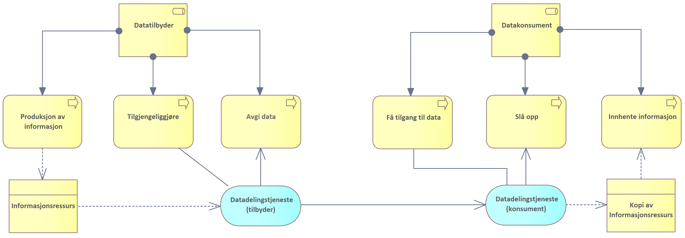

| Status | Version | Maturity | Normative level |
|:-------------|:------------------|:------|:-------|
| Prerelease  | v0.9.1 | review  | ikke normert |

**Samhandlingsformen innebærer at en datatilbyder deler informasjon med en datakonsument på forespørsel.**  

Samhandlingsformen baserer seg på at det eksisterer to virksomheter, en som har rollen som datatilbyder og en som har rollen som datakonsument. Datatilbyder tilgjengeliggjør informasjonsressurs(er) for deling gjennom en datadelingstjeneste. Datadelingstjenesten (tilbyder) viktigste funksjon er å avgi data på forespørsel. Når datakonsumenten vil innhente data gjennomføres innhentingen gjennom å slå opp mot delte informasjonsressurser gjennom en konsumerende datadelingstjeneste (ofte kalt klient).  

*Figuren viser overordnede prosesser for rollene datatilbyder og datakonsument i forbindelse med etablering av datadelingstjenester*

Før datakonsumenten kan slå opp må datakonsumenten få tilgang til datatilbyders datadelingstjeneste gjennom en prosess vi har kalt "få tilgang til data"<!--Må datakonsument gå gjennom egen datadelingstjeneste til datatilbyders datadelingstjeneste for å slå opp? Det er derfor det ikke er pil direkte fra boksen "få tilgang til data! til datadelingstjeneste(tilbyder)?-->. Få tilgang til data omfatter å finne datatilbyders datadelingstjenester, inngå nødvendige avtaler og få tilganger for å slå opp.

En datatilbyder deler informasjon med en datakonsument på forespørsel gjennom en datadelingstjeneste. Før informasjon kan avgis til datakonsument må datatilbyder tilgjengeliggjøre informasjonsressurs(er) for deling gjennom en datadelingstjeneste. Hovedoppgaven til datadelingstjenesten er å avgi data på forespørsel, dette er beskrevet i modellen ved at datadelingstjenesten (tilbyder) tjener datadelingstjenesten (konsument). En annen måte å forklare det på er at datakonsumenten slår opp mot delte dataressurser gjennom en konsumerende datadelingstjeneste (ofte kalt klient). En kopi av tilgjengelige informasjonsressurser leses av datadelingstjenesten (konsument) og kan behandles av interne systemer hos datakonsument for visning eller lagring.

## Referansearkitektur og målarkitektur for datadeling

I helsesektoren har vi en referansearkitektur og en målarkitektur for datadeling som detaljerer hvordan datadeling i sektoren kan ivareta deling av helseinformasjon på forespørsel på en sikker måte. [Referansearkitekturen](https://www.ehelse.no/standardisering/standarder/referansearkitektur-for-datadeling) beskriver relevante brukertilfeller hvor datadeling kan anvendes og etablerer generelle modeller for tilgangsstyring, API-management og personvern. [Målarkitekturen](https://www.ehelse.no/standardisering/standarder/malarkitektur-for-datadeling-i-helse-og-omsorgssektoren) for datadeling beskriver to av brukstilfellene i mer detalj, sektorens samhandling med grunnmur og nasjonale e-helseløsninger og innbyggers samhandling med helse- og omsorgstjenesten.
