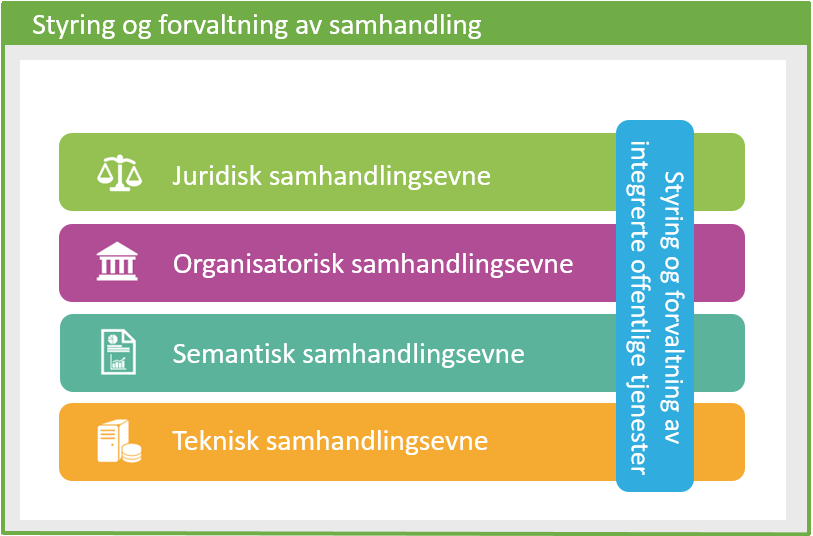

| Status | Version | Maturity | Normative level |
|:-------------|:------------------|:------|:-------|
| Prerelease  | v0.9.0 | review | ikke normert |

## Hva er semantisk samhandlingsevne

Semantisk samhandlingsevne har å gjøre med meningen med innholdet i dataelementer, relasjonen mellom dem og formatet informasjonen utveksles på. Det skilles mellom semantikk og syntaks:

* Semantikk handler om dataenes betydningsinnhold og interne relasjon mellom data, dette innebærer også begrepsavklaringer og definisjoner som sikrer at alle parter oppfatter betydningen av data likt
* Syntaks handler om format og struktur på data som utveksles

Samhandling må vanligvis etableres på mange nivåer for å understøtte samhandling mellom personer i ulike virksomheter. I European Interoperability framework (EIF) skilles det på juridisk, organisatorisk, semantisk og teknisk samhandling. I praksis peker denne modellen på at man må oppnå samhandling på alle fire nivå for å oppnå reell semantisk samhandling mellom personer i ulik kontekst, for eksempel i ulike organisasjoner.

*European Interoperability Framework, juridisk, organisatorisk, semantisk og teknisk samhandlingsevne*

## Når er dette viktig?

Det er viktig å jobbe med semantisk samhandling så tidlig som mulig i prosessen med å oppnå samhandling mellom virksomheter i helsesektoren. Målet med den semantiske samhandlingen er alltid å understøtte den organisatoriske og juridiske samhandlingsevnen. På organisatorisk nivå må det arbeides med å identifisere og prioritere behov for informasjon, noen av disse må behovene trenger løsninger i form av produkter som understøtter semantisk samhandling. I helsesektoren betyr dette å jobbe med semantisk samhandling knyttet til identifiserte behov for informasjon i tjenesteforløpet.  

## Hvordan?

En strategi for informasjonsforvaltning og samhandling må utarbeides av virksomhetene og forankres slik at virksomhetene sammen kan løse utfordringer knyttet til semangisk samhandling. <!--Ha med en setning om at arbeid med semantisk samhandlingevne må løses i nært samarbeid med sektor, men det er kanskje det som er ment i første setning? eller internt ii virksoheten?--> Eksempelvis må virksomhetene være enige om bruk av referansedata (taksonomier, vokabularer, kodelister etc), felles informasjonsmodeller, datastrukturer og datamodeller for utveksling er helt nødvendige for å oppnå semantisk samhandling. Virksomhetene må være enige om når det er hensiktsmessig å ta i bruk standarder og referansedatasett der. I tillegg må det knyttes informasjon om hvordan data er skapt og brukt for å forstå og bruke data riktig.

## Hva er fordelene med semantisk samhandling?

### Gjenbruk

«Kun én gang»-prinsippet styrker informasjonsforvaltningen.
Brukere slipper å oppgi samme opplysninger flere ganger. Ulike virksomheter som deltar i tjenesteforløpet deler data fremfor å vedlikeholde egne kopier av data. «Data lagres én gang og tilgjengeliggjøres fra én kilde».  

### Økt datakvalitet

Brukere opplever tjenester med kontekst som er korrekt og oppdatert. Tjenesteprodusenter og dataprodusenter kan gjenbruke data fra andre kilder direkte, uten å kjenne intern struktur på data i kildesystemene. <!--Bør det stå noe her eller under Hvordan om felles inforamasjonsmodeller (innhold og kontekst for informasjonen det samhandle som? eller felles kodeverk og terminologi eks Snomed CT  og Loinc? felles format? Passe på at det ikke overlapper med det som er skrevet i andre kapittel-->

### Økt effektivitet

Brukere har tilgang til data med høy kvalitet. Tilgang til nødvendig informasjon av høy kvalitet gir potensiale for automatisering, redusert ressursbruk og er dermed grunnlag for mer effektive tjenester.

### Økt samhandlingsevne

Brukere i tjenesteforløpet opplever at de har tilgang til de riktig informasjon uavhengig av hvilken arbeidsprosess de er involvert i. Brukere har tilgang til informasjon på tvers av tjenestenivå og virksomheter.

### Økt endringsevne og tjenesteinnovasjon

Brukere får raskt støtte for nye arbeidsmåter gjennom automatiserte støttetjenester som bygger på oppdatert datagrunnlag av høy kvalitet. Tjenesteprodusentene får evne til å handle raskt basert på oppdaterte og korrekte data.

### Økt tilgang til data

Brukere opplever at informasjonstjenestene de har tilgang til gir enkel tilgang til oppdaterte informasjon. Tjenesteprodusenter har enkel tilgang til data koblet til relevante metadata.
